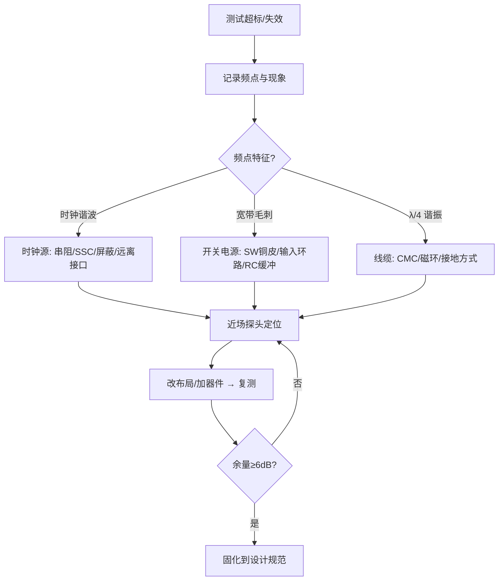

---
title: 时钟复位与启动知识条目 4
type: pcb-module
status: reviewed
updated: 2026-08-10
sources: [硬件/PCB/时钟复位与启动模块.md]
tags: [嵌入式硬件, Wiki子主题]
---

# 时钟复位与启动知识条目 4

上级主题： [[wiki/PCB/时钟复位与启动模块/08-评审与测试清单|评审与测试清单]]

🔬 **深入原理：一张总表**

| 实验 | 频段/波形 | 主因 | 首选整改 | 备选 |
|---|---|---|---|---|
| CE 传导 | 150k～30MHz | 低频段差模、高频段共模 | X/Y 电容、CMC、减小 $dv/dt$ | 变压器屏蔽层、磁环、RC 缓冲 |
| RE 辐射 | 30M～1/6GHz | 线缆共模、缝隙泄漏、平面边缘 | 缩小环路、串阻、CMC/磁环 | 屏蔽罩、SSC、改叠层 |
| ESD | <1ns, 30A | 高频路径电感、接地不良 | TVS 靠连接器、地路径最短 | 结构泄放、导电泡棉、软件容错 |
| EFT | 5/50ns 突发 | 共模、地环路 | Y 电容、CMC、机壳多点搭接 | TVS、缩短复位/晶振路径 |
| Surge | 8/20μs, 数百A | 能量泄放不足 | GDT+MOV+TVS 三级 | 退耦电感/PTC、隔离变压器 |
| CS | 150k～80MHz | 电路不平衡、结检波 | 平衡设计、RC 低通、射频旁路 | CMC、屏蔽层 360° 接地 |
| RS | 80M～6GHz | 同 CS + 直接场耦合 | 屏蔽、滤波、缩小敏感环路 | 器件重选、软件滤波 |
| DIP | 电压跌落 | 储能不足 | 加大输入电容、掉电检测 | 宽输入范围电源 |

**通用排查流程：**

🛠 **设计实例/操作**

*例1：把 EMC 前移到设计阶段的 Checklist（板级）。*

1. 叠层：至少一个完整 GND 平面，高速层紧邻 GND，PWR/GND 相邻薄介质。
2. 分区：接口区 / 数字区 / 模拟区 / 电源区物理分开，接口区靠板边集中。
3. 回流：不跨分割，换层伴地孔，排针按 1:3 配地。
4. 时钟：最短、包地、串阻、远离板边与接口 ≥ 300mil。
5. 接口：TVS 靠连接器、CMC 在其后、走线不回穿数字区。
6. 电源：去耦贴引脚、DC-DC 输入环路最小、SW 铜皮最小。
7. 板边：缝合地过孔间距 ≤200mil，20H 规则。
8. 结构：屏蔽罩多点接地、缝隙 <λ/20、螺柱接地。

*例2：整改的"经济学"。* 同样 10dB 的改善：
- 改布线：0 元/台，但需要重新打样（一次性成本）
- 串阻 + 磁环：约 0.2 元/台 × 10 万台 = 2 万元
- 屏蔽罩：约 3 元/台 × 10 万台 = 30 万元

所以**设计阶段多花两天做 EMC 评审，可能省下几十万**。

⚠️ **常见误区**

1. "试错法"整改：随机加电容磁环，改好了也不知道为什么，量产一致性差。
2. 不做近场定位就动手。定位是整改效率的关键。
3. 只解决超标频点，不看整体余量趋势。
4. 整改方案不固化。同一个坑在下一个项目再踩一遍。
5. 忽视测试布置差异。同一台机器在不同实验室差 3～5dB 很正常。

📌 **要点速记**

- 每个实验都有典型主因与首选手段，先按表定位再动手。
- 排查顺序：记录频点 → 判断特征 → 近场定位 → 整改 → 复测。
- 板级 8 条 Checklist 能挡掉大部分问题。
- 整改成本随阶段推后指数上升，前移设计最划算。
- 留 6dB 余量，把有效方案固化为公司设计规范。

---

## 相关页面

- [[wiki/PCB/时钟复位与启动模块/08-评审与测试清单|评审与测试清单]]
- [[wiki/概览|Wiki 概览]]

