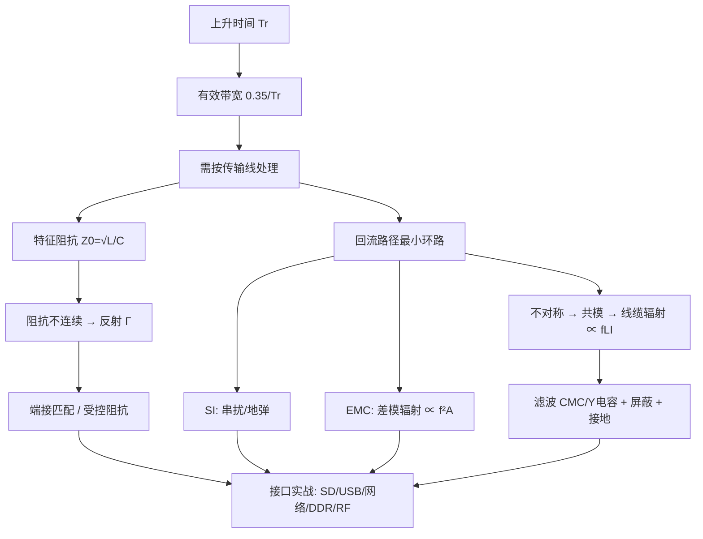

---
title: PI进阶知识条目 5
type: principle
status: reviewed
updated: 2026-08-10
sources: [硬件/原理/PI.md]
tags: [嵌入式硬件, Wiki子主题]
---

# PI进阶知识条目 5

上级主题： [[wiki/原理/PI/08-常见误区|常见误区]]

1. **信号怎么走**（阻抗、反射、匹配）——传输线理论；
2. **电流怎么回**（回流路径、地设计、共模/差模）——回路思维；
3. **能量怎么跑掉/进来**（EMC 发射与抗扰）——耦合与屏蔽。

而这三件事本质上都指向同一句话：**高速设计的核心不是"画线"，而是"管理电磁场与电流回路"**。

🔬 **深入原理：知识地图**

**贯穿全课的 5 个数字**：

| 数字 | 含义 |
|---|---|
| **6 mil/ps** | FR-4 内层传播速度（微带约 7） |
| **0.35 / Tr** | 有效带宽（拐点频率） |
| **±3H** | 80% 回流集中范围 |
| **1 nH/mm** | 普通走线/引线电感估算 |
| **λ/20** | 缝隙、缝合孔、地线过孔的间距上限 |

🛠 **设计实例/操作：完整设计流程与自检清单**

**阶段一：原理图/选型**
- [ ] 确认各接口速率、上升时间、阻抗规范（USB 90Ω、以太网/LVDS 100Ω、单端 50Ω、DDR 40/50Ω）
- [ ] 时钟源选型（是否需要 SSC）、串阻位置预留
- [ ] ESD/TVS 选型（结电容匹配速率）、CMC、滤波元件预留
- [ ] 电源架构：噪声敏感模块（GNSS/RF/ADC/PHY-AVDD）用 LDO 或加滤波
- [ ] 预留 π 型匹配、测试点（低速）、调试接口

**阶段二：叠层与阻抗**
- [ ] 每个信号层紧邻完整参考平面
- [ ] PWR 与 GND 平面相邻，介质尽量薄
- [ ] 找板厂确认叠层与 Dk/Df，算准线宽线距
- [ ] 高速差分优先内层带状线（FEXT≈0）

**阶段三：布局**
- [ ] 分区：接口区/数字区/模拟区/电源区/RF 区
- [ ] 接口靠板边集中，走线不回穿数字区
- [ ] 高速链路"一"字排开，不折返
- [ ] 去耦电容贴引脚，DC-DC 输入环路最小
- [ ] 晶振靠芯片、下方铺地
- [ ] 天线净空区、变压器隔离沟先划出

**阶段四：布线**
- [ ] 不跨分割；换层伴地孔（<100～200mil）
- [ ] 3W/4W/5W 间距规则按等级执行
- [ ] 差分：等长、等距、对称，就近补偿
- [ ] DDR：按组等长（时延模式），VTT 在最远端
- [ ] RF：短直无过孔、两侧缝合地孔
- [ ] 时钟包地且地线两端+中间打孔

**阶段五：EMC 加固**
- [ ] 板边缝合地过孔 ≤200mil，20H 规则
- [ ] 排针/连接器按 1:3 配地
- [ ] 屏蔽罩多点接地，缝隙 <λ/20
- [ ] 机壳地与信号地 1nF/2kV + 1MΩ 连接
- [ ] 长线 I/O 预留磁环/CMC 位置

**阶段六：验证**
- [ ] SI 仿真（眼图、串扰、过冲）
- [ ] PDN 阻抗仿真（$Z<Z_{target}$）
- [ ] 功能 + 压力 + 高低温测试
- [ ] EMC 预测试（近场探头 + 简易暗室）
- [ ] 留 6dB 余量再送正式认证

⚠️ **常见误区（全课总结）**

1. **用频率而非上升时间判断高速**——第一原则性错误。
2. **只画线不想回流**——所有 SI/EMC 问题的共同根源。
3. **等长绝对化**——该松的地方过度绕线，反而增加串扰。
4. **EMC 后置**——测试超标才整改，成本高十倍。
5. **迷信单一手段**——屏蔽罩/磁环/展频都不是万能药。
6. **不留余量**——刚好合格 = 量产必炸。
7. **不做定位就整改**——盲目试错，改好了也复现不了。

📌 **要点速记**

- 高速设计三主线：信号路径、回流路径、耦合路径。
- 五个关键数字：6mil/ps、0.35/Tr、±3H、1nH/mm、λ/20。
- 流程六阶段：选型 → 叠层 → 布局 → 布线 → EMC 加固 → 验证。
- 80% 的结果在布局阶段就已决定。
- 一切规则的目的都是：**让电流走最小的环路**。

---

## 相关页面

- [[wiki/原理/PI/08-常见误区|常见误区]]
- [[wiki/概览|Wiki 概览]]

