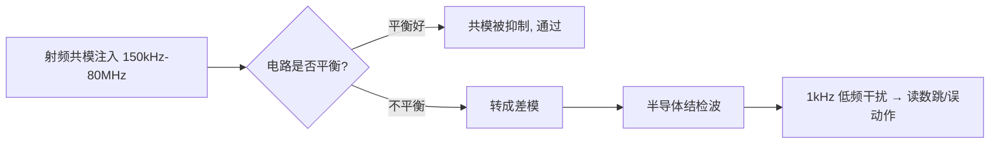

---
title: 模电知识条目 5
type: principle
status: reviewed
updated: 2026-08-10
sources: [硬件/原理/模电.md]
tags: [嵌入式硬件, Wiki子主题]
---

# 模电知识条目 5

上级主题： [[wiki/原理/模电/09-工程检查|工程检查]]

CS（Conducted Susceptibility，传导抗扰度，IEC 61000-4-6）模拟的场景是：**在 150kHz～80MHz 频段，外界电磁场在线缆上感应出共模电压，顺着线缆灌进设备**。

为什么是这个频段？因为 80MHz 以下，波长（>3.75m）远大于普通设备尺寸，机壳不能有效接收电磁波，但**线缆长度接近 $\lambda/4$，成了高效接收天线**。80MHz 以上则改用辐射抗扰（RS，IEC 61000-4-3）直接照射。

测试等级：Level 1 = 1V、Level 2 = 3V、Level 3 = 10V（rms，未调制载波），实测时用 **1kHz 正弦、80% AM 调幅**，扫频步进 1%，每点驻留 ≥0.5s。

🔬 **深入原理**

注入方式三种：

| 方式 | 器件 | 特点 |
|---|---|---|
| CDN（耦合去耦网络） | CDN-M2/M3、AF、T2 等 | 首选，阻抗标准 150Ω |
| EM-Clamp（电磁钳） | 钳夹线缆 | 无法用 CDN 时（如屏蔽线） |
| 直接注入（BCI/直接耦合） | 100Ω 电阻注入 | 同轴/单线场合 |

**150Ω 共模阻抗**是这个标准的核心参数——它代表人体/线缆对地的典型共模阻抗。CDN 保证注入点看到 150Ω。

设备内部为什么会误动作？共模电压 $V_{CM}$ 通过**不平衡**转成差模干扰：

$$V_{DM}=V_{CM}\cdot\frac{\Delta Z}{Z}$$

$\Delta Z/Z$ 就是电路的不平衡度。差分接收电路（RS-485、以太网）平衡好，抗扰强；单端信号（UART、GPIO、模拟采样）平衡差，容易被击穿。

此外 80MHz 以下的干扰还会被半导体结**检波（rectification）**——PN 结的非线性把射频包络解调出来，变成 1kHz 的低频干扰，直接叠加到运放/ADC 输入，表现为读数跳动。这就是为什么调制是 80% AM 1kHz：**它专门检验解调敏感度**。

🛠 **设计实例/操作**

*例1：模拟采样口被干扰。* 4-20mA 输入在 20MHz 附近读数跳 ±5%。整改：
- 输入端加 **RC 低通**（如 100Ω + 1nF，$f_c=1.6\text{MHz}$）；
- 运放输入引脚就近加 10～100pF 到地（射频旁路）；
- 差分走线，增加共模抑制；
- 线缆入口加 CMC 或磁环。

*例2：I/O 口复位。* 长线 GPIO 在 5MHz 处触发复位。整改：GPIO 加 TVS + 串 100Ω + 1nF 对地；软件加去抖与看门狗；PCB 上把该信号的地回流路径缩短。

⚠️ **常见误区**

1. 只在软件上打补丁（滤波算法）。射频检波产生的是真实模拟量，软件无法完全消除。
2. 在信号线上加大电容却忽略上升沿要求，导致通信速率不达标。要按 $f_c$ 与信号带宽折中。
3. 认为屏蔽线一定好。屏蔽层若**只单端接地或接地阻抗高**，反而成为共模注入通道。高频应 360° 环接。
4. 忘记电源端口也要做 CS。DC 电源输入端同样需要 CMC + Y 电容。
5. 把 CS 与 EFT/Surge 混淆。CS 是持续射频，EFT 是脉冲群，Surge 是大能量单脉冲，防护器件完全不同。

📌 **要点速记**

- CS = IEC 61000-4-6，150kHz～80MHz，共模注入，150Ω 标准阻抗。
- 用 1kHz/80% AM 调制，专门考核半导体结的检波敏感度。
- 不平衡度决定共模→差模转换，平衡设计是根本。
- 端口整改套路：CMC/磁环 + RC 低通 + 就近射频旁路电容 + TVS。
- 屏蔽层需 360° 低阻接地才有效。

---

## 相关页面

- [[wiki/原理/模电/09-工程检查|工程检查]]
- [[wiki/概览|Wiki 概览]]

