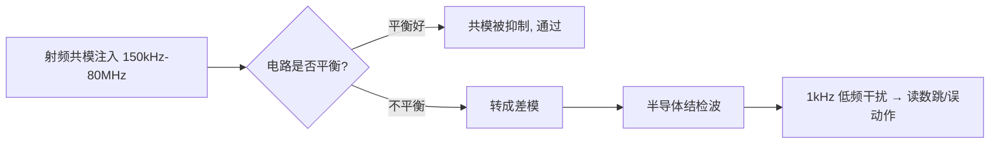
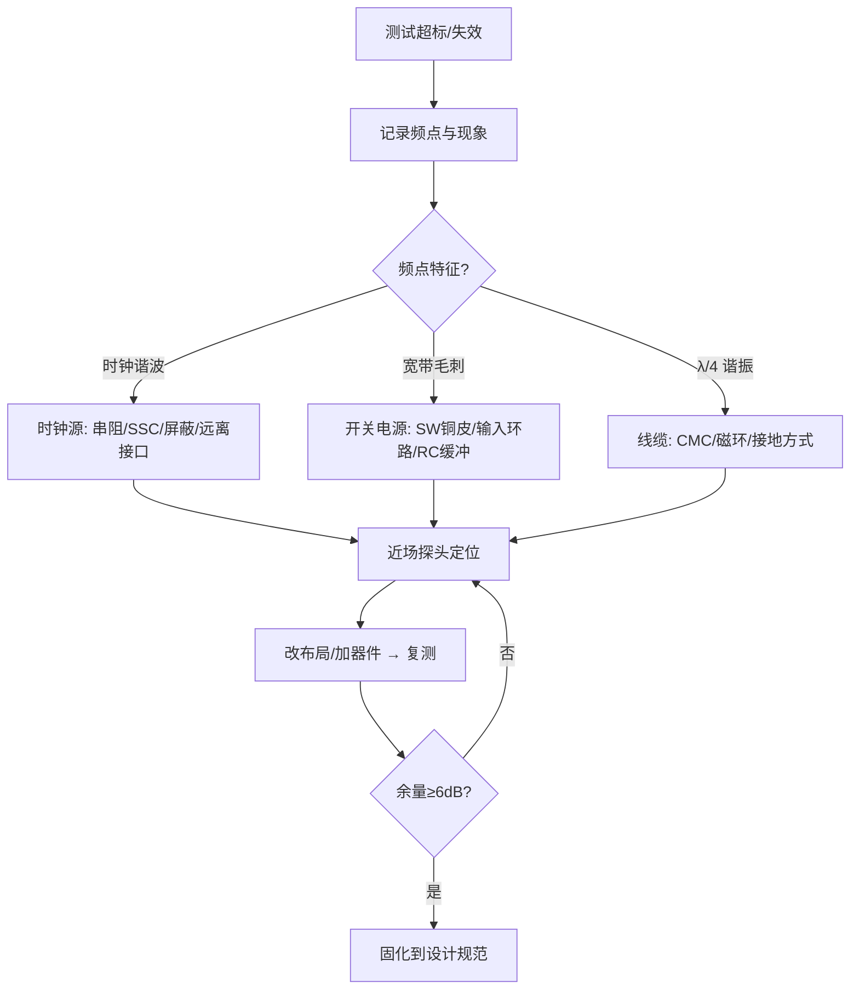

# PCB 时钟、复位与启动模块

## 模块目标
- 时钟网络要在所有工作电压、温度和负载条件下稳定起振并满足抖动、占空比和时序裕量。
- 复位网络要使器件仅在电源和时钟有效后退出复位，并能在掉电、看门狗和外部按键事件下可靠恢复。
- 启动配置脚必须在采样窗口内处于确定电平，且不与调试器、外设或量产夹具冲突。

## 晶体与振荡器布局
- 晶体、负载电容和 MCU 时钟脚构成最小闭环，元件贴近芯片、走线短且对称；避免过孔、跨参考面和靠近开关节点。
- 晶体下方的铺地、护环和禁布要求必须以芯片手册为准。某些振荡器需要连续地参考，另一些则禁止晶体下方铺铜以降低寄生电容。
- 远离 DC/DC 电感、SW 节点、高电流回路、连接器和高速数据线；这些区域的电场、磁场与地弹会降低起振裕量或引入周期抖动。
- 选择低电容探头或有源探头测量振荡节点。普通 10:1 探头和长地线可能改变负载、导致不起振或测得不存在的振铃。

## 参数计算与选型
- Pierce 振荡器的负载电容近似为 `CL = (C1*C2)/(C1+C2) + Cstray`。`Cstray` 包含芯片脚、焊盘、走线和封装寄生，C1/C2 应与晶体的标称 CL 一起计算。
- C1/C2 取相同值有利于布局对称；如芯片手册要求补偿驱动端与输入端的寄生差异，则按其推荐比值设置。
- 过大的负载电容会增加驱动负担和起振时间，过小会使频偏、杂散和外界干扰敏感性变差。不能只以“能起振”判断参数正确。
- 同时核对频率、ESR、允许驱动功率、频率容差、温漂、老化、封装和可采购性。低功耗 MCU 的内部振荡器驱动能力有限，ESR 裕量尤其重要。
- 有源振荡器还应核对供电范围、输出标准、使能脚默认状态、稳定时间、相位噪声和周期抖动；其电源去耦贴近器件，不能借用长而细的数字地回流。

## 时钟树与端接
- 单负载时钟按高速单端线处理：定义参考面、阻抗和最长线长，避免无意的测试支路和换层。
- 多负载时钟优先使用专用缓冲器或扇出器件；每个分支明确长度、输入电容、端接方式和允许 skew，不随意从长主干做 T 形分叉。
- 源端串联端接靠近驱动端，阻值由驱动器输出阻抗、线阻抗、负载数量和实测波形共同确定。并联端接或 AC 端接必须核对静态功耗与默认状态。
- 经过连接器、层切换或不同区域时，检查参考面连续性、过孔 stub、相邻噪声线和回流通道；换层信号过孔旁布置参考地过孔。
- 验证时观察负载端的过冲、下冲、振铃、上升/下降沿、占空比和周期抖动。频率计读数正常不等于接收端阈值裕量充足。

## 复位网络
- 复位源可能包括上电复位、监控器、看门狗、调试器、外部按键和外部模块。逐一确认极性、输出类型、默认态、线与关系和电平兼容性。
- 复位释放必须晚于所有相关电源达到阈值、时钟稳定和关键外设初始化。多电源芯片需要核对上升顺序、单调性、最低斜率与掉电顺序。
- RC 复位的延时受输入阈值、漏电、R/C 容差、温度、按键并联路径和调试器驱动影响；复杂电源树优先使用带阈值和延时保证的复位监控器。
- 开漏输出可以线与，但应核对上拉电压及每个接收端的绝对最大额定值；推挽输出不得直接并联，需要通过开漏缓冲、逻辑门或隔离网络合成。
- 长外部复位线配置 ESD、限流和去抖，并远离时钟与高阻模拟节点。复位 RC 的慢边沿如未经过施密特输入，可能在阈值附近反复触发。

## 启动脚与调试接口
- 启动脚使用明确上拉或下拉，核对内部电阻、采样时刻、默认模式及与 JTAG/SWD/下载接口的复用关系。
- 外部模块不得在启动采样窗口内与配置电阻冲突。LED、电平转换器、传感器、连接器和调试夹具均可能通过 ESD 二极管或上电时序反向驱动启动脚。
- 配置电阻尽量靠近芯片；测试焊盘可便于测量，但不能形成长 stub。量产模式与正常模式应有明确、可控且可追溯的切换方法。
- 对 Boot、复位、时钟和调试信号预留低侵入测试位置，标明默认装配状态与可选电阻位，避免调试时临时飞线破坏高速或敏感网络。

## 上板排障顺序
1. 测量输入、电源轨和静态电流，确认器件已满足最低工作电压。
2. 测量复位脚，确认其极性、脉宽和释放时刻符合手册。
3. 使用合适探头检查晶体或外部时钟是否稳定；必要时切换已知正常外部时钟。
4. 读取启动脚和调试接口电平，暂时断开可疑外设，排除外部冲突。
5. 在掉电再上电、缓慢上电、看门狗复位和调试器连接状态下重复验证，记录波形与板号。

## 评审与测试清单
- [ ] 晶体封装、频率、CL、ESR、驱动功率及 C1/C2 的计算值和实装值已记录。
- [ ] 时钟拓扑、端接、参考面、换层和每路 skew 预算已复核。
- [ ] 各电源斜率、复位时序和时钟/PLL 稳定时间已用示波器验证。
- [ ] 启动脚默认电平、外部冲突和量产模式已检查。
- [ ] 空板、外设全接、调试器连接、掉电再上电四种状态均可稳定启动。

+### 时钟复位与启动知识条目 1
CS（Conducted Susceptibility，传导抗扰度，IEC 61000-4-6）模拟的场景是：**在 150kHz～80MHz 频段，外界电磁场在线缆上感应出共模电压，顺着线缆灌进设备**。

为什么是这个频段？因为 80MHz 以下，波长（>3.75m）远大于普通设备尺寸，机壳不能有效接收电磁波，但**线缆长度接近 $\lambda/4$，成了高效接收天线**。80MHz 以上则改用辐射抗扰（RS，IEC 61000-4-3）直接照射。

测试等级：Level 1 = 1V、Level 2 = 3V、Level 3 = 10V（rms，未调制载波），实测时用 **1kHz 正弦、80% AM 调幅**，扫频步进 1%，每点驻留 ≥0.5s。

🔬 **深入原理**

注入方式三种：

| 方式 | 器件 | 特点 |
|---|---|---|
| CDN（耦合去耦网络） | CDN-M2/M3、AF、T2 等 | 首选，阻抗标准 150Ω |
| EM-Clamp（电磁钳） | 钳夹线缆 | 无法用 CDN 时（如屏蔽线） |
| 直接注入（BCI/直接耦合） | 100Ω 电阻注入 | 同轴/单线场合 |

**150Ω 共模阻抗**是这个标准的核心参数——它代表人体/线缆对地的典型共模阻抗。CDN 保证注入点看到 150Ω。

设备内部为什么会误动作？共模电压 $V_{CM}$ 通过**不平衡**转成差模干扰：

$$V_{DM}=V_{CM}\cdot\frac{\Delta Z}{Z}$$

$\Delta Z/Z$ 就是电路的不平衡度。差分接收电路（RS-485、以太网）平衡好，抗扰强；单端信号（UART、GPIO、模拟采样）平衡差，容易被击穿。

此外 80MHz 以下的干扰还会被半导体结**检波（rectification）**——PN 结的非线性把射频包络解调出来，变成 1kHz 的低频干扰，直接叠加到运放/ADC 输入，表现为读数跳动。这就是为什么调制是 80% AM 1kHz：**它专门检验解调敏感度**。

🛠 **设计实例/操作**

*例1：模拟采样口被干扰。* 4-20mA 输入在 20MHz 附近读数跳 ±5%。整改：
- 输入端加 **RC 低通**（如 100Ω + 1nF，$f_c=1.6\text{MHz}$）；
- 运放输入引脚就近加 10～100pF 到地（射频旁路）；
- 差分走线，增加共模抑制；
- 线缆入口加 CMC 或磁环。

*例2：I/O 口复位。* 长线 GPIO 在 5MHz 处触发复位。整改：GPIO 加 TVS + 串 100Ω + 1nF 对地；软件加去抖与看门狗；PCB 上把该信号的地回流路径缩短。



⚠️ **常见误区**

1. 只在软件上打补丁（滤波算法）。射频检波产生的是真实模拟量，软件无法完全消除。
2. 在信号线上加大电容却忽略上升沿要求，导致通信速率不达标。要按 $f_c$ 与信号带宽折中。
3. 认为屏蔽线一定好。屏蔽层若**只单端接地或接地阻抗高**，反而成为共模注入通道。高频应 360° 环接。
4. 忘记电源端口也要做 CS。DC 电源输入端同样需要 CMC + Y 电容。
5. 把 CS 与 EFT/Surge 混淆。CS 是持续射频，EFT 是脉冲群，Surge 是大能量单脉冲，防护器件完全不同。

📌 **要点速记**

- CS = IEC 61000-4-6，150kHz～80MHz，共模注入，150Ω 标准阻抗。
- 用 1kHz/80% AM 调制，专门考核半导体结的检波敏感度。
- 不平衡度决定共模→差模转换，平衡设计是根本。
- 端口整改套路：CMC/磁环 + RC 低通 + 就近射频旁路电容 + TVS。
- 屏蔽层需 360° 低阻接地才有效。


---
### 时钟复位与启动知识条目 2
核心对照表（记住波形与能量量级，选型就不会错）：

| 实验 | 标准 | 波形 | 重复率 | 能量 | 典型防护 |
|---|---|---|---|---|---|
| EFT 脉冲群 | 61000-4-4 | 5/50 ns | 5 或 100 kHz 突发 | 小（能量低、频谱宽到几百 MHz） | Y 电容、CMC、TVS、缩短地路径 |
| Surge 浪涌 | 61000-4-5 | 1.2/50 μs 电压，8/20 μs 电流 | 单次，正负各 5 次 | **大**（可达数百 A） | GDT + 压敏 + TVS 三级配合 |
| RS 辐射抗扰 | 61000-4-3 | 80MHz～1/6GHz，3～10 V/m | 扫频 | — | 屏蔽、滤波、平衡设计 |
| DIP 电压跌落 | 61000-4-11 | 0%/40%/70% 跌落 | — | — | 大容量输入电容、掉电检测 |
| PFMF 工频磁场 | 61000-4-8 | 50Hz，30～100 A/m | 持续 | — | 远离、屏蔽（高导磁材料）、减小环路 |

🔬 **深入原理**

**EFT 的本质**：5ns 上升沿意味着频谱延伸到 $0.35/5\text{ns}=70\text{MHz}$ 甚至更高，且是**共模**注入（通过容性耦合夹或耦合网络）。它能量不大，但频率高，专挑寄生电容与地环路的漏洞。**EFT 整改的关键是"给共模电流一条尽量短的返回路径"**——所以 Y 电容、机壳搭接、屏蔽层接地至关重要。

**Surge 的本质**：1.2/50μs 波形，开路电压 $U_{oc}$、短路电流 $I_{sc}$，源阻抗 2Ω（线对线）或 12Ω（线对地）。2kV/2Ω = 1000A 峰值。这么大的能量，**必须靠能量泄放器件而不是滤波**。

三级防护配合的关键是**能量配合**（用阻抗梯度）：

```
 线路 ──[GDT 气体放电管]──/\/\/── [MOV 压敏]──/\/\/── [TVS]── 内部电路
        （kA 级, 响应 μs）  退耦   （几百A, 响应 ns）  退耦   （几十A, 响应 ps）
                        电感/PTC/电阻          小电阻
```

没有中间退耦阻抗，后级 TVS 会先动作被烧毁。TVS 选型三要素：
- $V_{RWM}$（反向工作电压）> 电路最高工作电压；
- $V_{BR}$（击穿电压）留 10% 余量；
- $V_{C}$（钳位电压）< 被保护器件耐压；
- $P_{PP}$ 峰值功率满足波形要求（10/1000μs 与 8/20μs 的额定不同，别混用）。

**电压跌落**：设计要点是输入储能电容能撑过跌落时间：

$$C\ge\frac{2P\cdot t_{hold}}{V_{nom}^2-V_{min}^2}$$

🛠 **设计实例/操作**

*例1：以太网口浪涌 ±2kV 共模。* 变压器（隔离）+ Bob Smith 电路（4×75Ω 汇到 1000pF/2kV 电容到机壳）+ 中心抽头对机壳的高压电容。若是 PoE，还要加 GDT。切忌把 Bob Smith 的地直接连数字地。

*例2：EFT ±2kV 电源口导致 MCU 复位。* 排查顺序：
1. 复位引脚是否有 0.1μF 电容和上拉；
2. 晶振布线是否远离电源入口；
3. 输入端 Y 电容到机壳的路径是否够短；
4. 机壳与 PCB 地的搭接是否多点低阻；
5. 长线 I/O 是否加了共模磁环。

*例3：工频磁场。* 霍尔传感器/互感器附近别放变压器；敏感回路面积最小化；必要时用**坡莫合金/硅钢**做磁屏蔽（铝铜屏蔽对 50Hz 磁场几乎无效）。

⚠️ **常见误区**

1. 用 TVS 直接扛 Surge。单个小封装 TVS（SMAJ）在 2kV/2Ω 下会炸；必须前级泄放。
2. 把 8/20μs 与 10/1000μs 的额定功率混用，选型偏小。
3. 认为 ESD 器件能兼做浪涌。ESD 器件电容小但能量小；浪涌器件能量大但电容大，高速口要权衡。
4. EFT 整改只想着加电容，忽略机壳搭接与地设计。
5. 抗扰测试时把 EUT 悬空放置。测试布置（10cm 绝缘垫、参考接地板、线缆长度）严重影响结果。

📌 **要点速记**

- EFT 频谱宽、能量小 → 治共模路径；Surge 能量大 → 三级泄放 + 阻抗退耦。
- TVS 选型看 $V_{RWM}/V_{BR}/V_C/P_{PP}$，注意波形定义。
- 保护器件动作顺序靠退耦阻抗保证。
- 工频磁场只能用高导磁材料屏蔽，铝/铜无效。
- 抗扰失败先查"地"与"搭接"，再查器件。


---
### 时钟复位与启动知识条目 3
辐射发射（RE）测的是设备向空间辐射的电磁场强度，频段 30MHz～1GHz（有高频时钟的要测到 6GHz）。3m 法或 10m 法半电波暗室，天线在 1～4m 高度扫描，EUT 转台 360° 旋转，水平/垂直双极化，取最大值。

**最关键的认知**：在 30MHz～1GHz 频段，PCB 本身尺寸（10cm 量级）对应 $\lambda/4$ 约在 750MHz 才谐振，所以**1GHz 以下的辐射，主要天线是线缆和机壳缝隙，而不是 PCB 走线本身**。PCB 的作用是"驱动源"——它把共模电压加到了线缆上。

$$\text{PCB 共模噪声} \xrightarrow{\text{驱动}} \text{线缆(天线)} \xrightarrow{} \text{辐射超标}$$

🔬 **深入原理**

**两种辐射模型**：

差模（环路天线）：
$$E_{DM}=1.32\times10^{-14}\frac{f^2 A I_{DM}}{r}\ \text{V/m}$$

共模（单极子天线）：
$$E_{CM}=1.26\times10^{-6}\frac{f L I_{CM}}{r}\ \text{V/m}$$

**谐振长度**：线缆长度 $L=\lambda/4$ 时辐射效率最高。

$$f_{res}=\frac{c}{4L}\Rightarrow L=1\text{m}\to 75\text{MHz};\ L=0.5\text{m}\to150\text{MHz}$$

看到 75MHz、150MHz、300MHz 附近的宽峰，先怀疑线缆。

**缝隙泄漏**：屏蔽罩缝隙长度 $\ell$ 的屏蔽效能

$$SE(\text{dB})\approx 20\log_{10}\frac{\lambda}{2\ell}$$

$\ell=\lambda/2$ 时 SE=0，完全不屏蔽。所以设计规则：**最长缝隙 < $\lambda_{min}/20$**。1GHz（λ=300mm）→ 缝隙 <15mm；缝合过孔间距同理。

**PCB 边缘辐射（Fringing）**：电源/地平面边缘的边缘场会辐射，解决办法是 **20H 规则**（电源平面比地平面内缩 20 倍介质厚度）与**板边缝合地过孔**（间距 ≤ $\lambda_{min}/20$，工程常取 100～200mil）。

🛠 **设计实例/操作**

*例1：定位超标源。* 用近场探头（H 场环 + E 场棒）在板上扫，配合频谱仪：
- 时钟晶振周围强 → 晶振布局/屏蔽/串阻；
- DC-DC 开关节点强 → 缩小 SW 铜皮、加输入环路电容、加 RC 缓冲；
- 连接器处强 → 共模问题，加 CMC/磁环；
- 用手捏/拔线缆后读数大变 → 确认线缆是天线。

*例2：整改优先级（成本从低到高）。*
1. 改布局布线（缩小环路、完整参考面、换层伴地孔）——免费
2. 时钟串阻 22～33Ω、展频 SSC（±1% 可降 6～10dB）——几分钱
3. 接口加共模磁环/CMC——几毛钱
4. 加屏蔽罩/导电泡棉/铜箔——几元
5. 改叠层/改板——重新打样

*例3：SSC 展频。* 把 100MHz 时钟以 30kHz 三角波调制 ±0.5%，能量被摊到更宽频带，QP 读数可降 6～12dB。注意：**USB/以太网/DDR 有各自对 SSC 的容忍规范，不能乱开**（如 USB3 支持 −0.5% 下展）。

⚠️ **常见误区**

1. 只盯着 PCB 走线，忘了线缆才是主天线。
2. 屏蔽罩接地只焊四个角。应沿边多点焊接，间距 < $\lambda/20$。
3. 开孔散热用大方孔。应改成**多个小圆孔阵列**（同样开孔率，屏蔽效能高很多）。
4. 用展频掩盖问题。SSC 降的是"测量读数"，实际峰值能量还在，对邻近敏感电路照样干扰。
5. 忽略 1GHz 以上。有 DDR4/USB3/HDMI 的产品必须测到 3～6GHz，此时 PCB 走线本身就能辐射。

📌 **要点速记**

- 1GHz 以下辐射的主天线是线缆与缝隙，PCB 提供共模驱动源。
- 共模辐射 $\propto f L I_{CM}$，差模辐射 $\propto f^2 A I_{DM}$。
- $\lambda/4$ 谐振：1m 线 → 75MHz，重点排查。
- 缝隙/缝合孔间距 < $\lambda_{min}/20$；散热孔用小圆孔阵列。
- 整改按"布局→串阻/展频→磁环→屏蔽"的成本顺序推进。


---
### 时钟复位与启动知识条目 4
🔬 **深入原理：一张总表**

| 实验 | 频段/波形 | 主因 | 首选整改 | 备选 |
|---|---|---|---|---|
| CE 传导 | 150k～30MHz | 低频段差模、高频段共模 | X/Y 电容、CMC、减小 $dv/dt$ | 变压器屏蔽层、磁环、RC 缓冲 |
| RE 辐射 | 30M～1/6GHz | 线缆共模、缝隙泄漏、平面边缘 | 缩小环路、串阻、CMC/磁环 | 屏蔽罩、SSC、改叠层 |
| ESD | <1ns, 30A | 高频路径电感、接地不良 | TVS 靠连接器、地路径最短 | 结构泄放、导电泡棉、软件容错 |
| EFT | 5/50ns 突发 | 共模、地环路 | Y 电容、CMC、机壳多点搭接 | TVS、缩短复位/晶振路径 |
| Surge | 8/20μs, 数百A | 能量泄放不足 | GDT+MOV+TVS 三级 | 退耦电感/PTC、隔离变压器 |
| CS | 150k～80MHz | 电路不平衡、结检波 | 平衡设计、RC 低通、射频旁路 | CMC、屏蔽层 360° 接地 |
| RS | 80M～6GHz | 同 CS + 直接场耦合 | 屏蔽、滤波、缩小敏感环路 | 器件重选、软件滤波 |
| DIP | 电压跌落 | 储能不足 | 加大输入电容、掉电检测 | 宽输入范围电源 |

**通用排查流程：**



🛠 **设计实例/操作**

*例1：把 EMC 前移到设计阶段的 Checklist（板级）。*

1. 叠层：至少一个完整 GND 平面，高速层紧邻 GND，PWR/GND 相邻薄介质。
2. 分区：接口区 / 数字区 / 模拟区 / 电源区物理分开，接口区靠板边集中。
3. 回流：不跨分割，换层伴地孔，排针按 1:3 配地。
4. 时钟：最短、包地、串阻、远离板边与接口 ≥ 300mil。
5. 接口：TVS 靠连接器、CMC 在其后、走线不回穿数字区。
6. 电源：去耦贴引脚、DC-DC 输入环路最小、SW 铜皮最小。
7. 板边：缝合地过孔间距 ≤200mil，20H 规则。
8. 结构：屏蔽罩多点接地、缝隙 <λ/20、螺柱接地。

*例2：整改的"经济学"。* 同样 10dB 的改善：
- 改布线：0 元/台，但需要重新打样（一次性成本）
- 串阻 + 磁环：约 0.2 元/台 × 10 万台 = 2 万元
- 屏蔽罩：约 3 元/台 × 10 万台 = 30 万元

所以**设计阶段多花两天做 EMC 评审，可能省下几十万**。

⚠️ **常见误区**

1. "试错法"整改：随机加电容磁环，改好了也不知道为什么，量产一致性差。
2. 不做近场定位就动手。定位是整改效率的关键。
3. 只解决超标频点，不看整体余量趋势。
4. 整改方案不固化。同一个坑在下一个项目再踩一遍。
5. 忽视测试布置差异。同一台机器在不同实验室差 3～5dB 很正常。

📌 **要点速记**

- 每个实验都有典型主因与首选手段，先按表定位再动手。
- 排查顺序：记录频点 → 判断特征 → 近场定位 → 整改 → 复测。
- 板级 8 条 Checklist 能挡掉大部分问题。
- 整改成本随阶段推后指数上升，前移设计最划算。
- 留 6dB 余量，把有效方案固化为公司设计规范。


---
### 时钟复位与启动知识条目 5
以太网第二部分，聚焦**电源/时钟/EMC/调试**这些"配套但决定成败"的内容。

🔬 **深入原理**

**1）PHY 的电源与时钟**

PHY 通常有多组电源：AVDD（模拟，供 MDI 驱动器）、DVDD（数字核）、VDDIO（接口）。噪声敏感度：AVDD ≫ DVDD。

- AVDD 用 **LDO 单独供电**优于直接从 DC-DC 取；若必须用 DC-DC，则加 **π 型 LC 滤波（磁珠 + 10μF + 100nF）**，并注意磁珠谐振要加阻尼。
- 每个电源引脚就近 100nF，整体加 10μF。
- **参考电阻（RBIAS/RSET，如 12.4kΩ 1%）** 必须紧靠 PHY，走线短，下方地完整——它决定 MDI 输出电流幅度，走线长会导致幅度漂移、链路距离缩短。

**2）时钟（25MHz 晶振）**

- 晶振紧靠 PHY（<10mm），负载电容按 $C_L=\frac{C_1C_2}{C_1+C_2}+C_{stray}$ 计算，$C_{stray}$ 取 3～5pF；
- 晶振下方**铺地并打过孔**，禁止走任何信号；
- 25MHz 的谐波（75/125/175/225MHz）正好落在 RE 敏感频段，晶振是辐射主源之一；
- 若用外部时钟输入，串 22～33Ω。

**3）指示灯（LED）**

LED 走线从 PHY 一路走到面板，**长度往往是全板最长的线**，且直连外部——它是典型的"辐射天线 + ESD 入口"：
- 每根 LED 线串 **100Ω～1kΩ 电阻 + 对地 10～100pF 电容**（RC 滤波）；
- LED 线不得跨越隔离沟（若 LED 在 RJ45 内置，需按变压器隔离侧处理）；
- 走线远离 MDI 与晶振。

**4）PoE（若支持）**

- 中间抽头取电，需 GDT/TVS 做浪涌防护（PoE 端口浪涌等级更高）；
- 隔离电源（Flyback）的 Y 电容与变压器屏蔽层要处理好，否则 CE/RE 双超标。

**5）EMC 常见超标点与对策**

| 现象 | 可能原因 | 对策 |
|---|---|---|
| 100/125MHz 峰 | 晶振谐波、RGMII 时钟 | 串阻、包地、屏蔽、缩短走线 |
| 网线插上就超标 | 共模经网线辐射 | Bob Smith、变压器共模抑制、加 CMC |
| ESD 打网口死机 | 隔离不足、地跳变 | 增大爬电距离、TVS、软件复位恢复 |
| 浪涌击穿 PHY | 无防护或防护不足 | GDT + TVS，加大隔离间距 |

🛠 **设计实例/操作**

*例1：隔离沟设计。* 隔离沟宽度按安规爬电距离取，一般 **≥2mm（PoE 建议 ≥3.2mm）**，且**所有层都要挖空**（包括电源层、内层），不能只挖表层。变压器本体尽量骑在隔离沟上。

*例2：链路调试三板斧。*
1. **读 PHY 寄存器**：BMSR（链路状态、自协商）、PHY ID、错误计数器（CRC error、symbol error）。
2. **回环测试**：PHY 近端/远端回环，区分是 MAC-PHY 问题还是 MDI 问题。
3. **换短网线 / 换千兆为百兆**：若百兆稳定千兆不稳，90% 是 RGMII 延时或等长问题。

*例3：布局顺序。* RJ45 靠板边 → 变压器紧邻 → PHY 紧邻变压器 → 晶振紧邻 PHY → 电源滤波在 PHY 另一侧。整条链路成"一"字形，不要 U 形折返（折返会让输入输出靠近，造成耦合）。

⚠️ **常见误区**

1. RBIAS 电阻放远或走线细长，导致链路距离缩短、误码率高。
2. LED 线不加滤波，成为辐射天线。
3. 隔离沟只挖表层，内层电源/地依然连通。
4. AVDD 与数字电源共用且无滤波，MDI 眼图恶化。
5. 变压器选型忽略共模抑制比（CMRR）与隔离耐压等级。
6. 认为"通了就没问题"。必须看错误计数器与长距离（100m）实测。

📌 **要点速记**

- AVDD 单独 LDO 或 π 型滤波；RBIAS 精密电阻必须紧靠 PHY。
- 25MHz 晶振靠 PHY、下方铺地、禁止走线，是 RE 主源。
- LED 线必须 RC 滤波，否则变天线兼 ESD 入口。
- 隔离沟 ≥2mm 且全层挖空，PoE 需更宽。
- 调试三板斧：读寄存器、回环、降速对比。


---
### 时钟复位与启动知识条目 6
DDR 设计的第一集：**信号分类与总体架构**。想做好 DDR，第一步不是画线，而是把上百根信号分成几类，因为**不同类的规则完全不同**。

DDR 信号三大类：

| 类别 | 信号 | 特点 | 参考时钟 |
|---|---|---|---|
| **数据组（Byte Lane）** | DQ[7:0]、DQS±、DQM/DM | 双向，**源同步**，按字节分组 | DQS（该组自己的选通） |
| **地址/命令/控制** | A[]、BA[]、RAS#、CAS#、WE#、CS#、CKE、ODT | 单向（控制器→颗粒） | CK± |
| **时钟** | CK±、CK#（差分） | 差分，最关键 | — |

**核心规则**：**等长是"组内相对"的，不是"全部一样长"。**

- DQ0～DQ7、DM0 相对 **DQS0±** 等长（组内 ±10～25mil）
- DQ8～DQ15、DM1 相对 **DQS1±** 等长
- 所有地址/命令/控制相对 **CK±** 等长（±25～50mil）
- **DQS 组之间不需要互相等长**（DDR3 支持 write leveling / read leveling 自动校准）
- CK 通常做成"最长"，地址组略短于 CK（Flight time 匹配）

🔬 **深入原理**

**为什么源同步能跑这么快？** 传统共同时钟（Common Clock）架构下，时序裕量要扣掉时钟树偏斜、板级延时等一大堆；源同步把**选通信号 DQS 与数据一起发送**，接收端用 DQS 采数据，两者共同经历同样的板级延时，**延时被抵消**，只剩下 skew。

写时序（Write）中 DQS 与 DQ 是**边沿对齐（DDR3 为中心对齐由控制器移相 90°）**；读时序（Read）中颗粒输出 DQS 与 DQ 边沿对齐，控制器内部延时 90° 再采样。

时序裕量：

$$t_{margin}=\frac{UI}{2}-t_{setup}-t_{hold}-t_{skew}-t_{jitter}-t_{ISI}-t_{xtalk}$$

DDR3-1600：数据率 1600MT/s，$UI=625\text{ps}$，半个 UI 只有 312ps。扣掉颗粒 setup/hold（各约 50～100ps）、时钟抖动、串扰，留给 PCB skew 的往往只有 **50～100ps**。按 6mil/ps 算，就是 **300～600mil** 的总预算——听起来宽，但要扣掉封装内部走线（package skew）与过孔差异，实际给布线的通常按 ±25mil 控制。

**关键概念：Flight Time 与过孔延时。** 现代做法不是"物理等长"而是"**时延等长（tuned by delay）**"：
- 表层微带线速度 ≈ 7 mil/ps（$\varepsilon_{eff}$ 较小）
- 内层带状线速度 ≈ 6 mil/ps
- **两者速度不同！** 同样 1000mil，微带比带状快约 20ps。所以**同一组信号应尽量走同一层**，或用 EDA 的"时延等长"模式而非"长度等长"。
- 过孔也有延时，1.6mm 板厚过孔约 10～15ps，等长时应计入。

🛠 **设计实例/操作**

*例1：分组示例（DDR3 x16 单颗粒）。*

```
 组1: DQ0-7   + DM0 + DQS0± → 相对 DQS0 等长 ±25mil
 组2: DQ8-15  + DM1 + DQS1± → 相对 DQS1 等长 ±25mil
 组3: A0-14, BA0-2, RAS,CAS,WE,CS,CKE,ODT → 相对 CK± 等长 ±50mil
 组4: CK± 差分, 对内 ±5mil, 100Ω 差分
 组间: 组1 与 组2 无需等长；地址组通常比 CK 短 0~200mil
```

*例2：叠层与阻抗。* DDR 推荐 **6 层以上**：
```
 L1 SIG (DQ组1)      ← 参考 L2
 L2 GND ★完整
 L3 SIG (地址/命令)   ← 参考 L2/L4
 L4 PWR (VDD/VDDQ)
 L5 GND ★
 L6 SIG (DQ组2)      ← 参考 L5
```
单端 40～50Ω（DDR3 常用 40Ω 或 50Ω，按控制器要求），差分 80～100Ω。

⚠️ **常见误区**

1. **把所有 DDR 信号等长到同一个值**。这不但没必要，还会让绕线爆炸、串扰增加。
2. 用"长度等长"跨层混走。微带与带状速度不同，必须用时延等长或统一走线层。
3. 忘记算过孔延时和封装内 skew（高端 SoC 的 package skew 表必须查）。
4. DQ 与地址线混在一起走，互相串扰。
5. 认为 DDR3 有校准就可以随便画。校准能补偿的是**固定偏移**，补不了串扰、反射和抖动。

📌 **要点速记**

- DDR 信号分三类：数据组（参考 DQS）、地址命令（参考 CK）、时钟（差分）。
- 等长是"组内相对参考信号"，组间不必等长。
- 源同步架构靠 DQS 抵消板级延时。
- 微带 7mil/ps、带状 6mil/ps，速度不同 → 用时延等长。
- 过孔延时与封装 skew 必须计入预算。


---
### 时钟复位与启动知识条目 7
DDR 第四集：**电源完整性（PDN）、VREF/VTT 与验证方法**。很多"布线看起来完美但跑不稳"的板子，问题都在电源上。

DDR3 典型电源：

| 电源 | 电压 | 用途 | 要求 |
|---|---|---|---|
| VDD/VDDQ | 1.5V (DDR3) / 1.35V (DDR3L) / 1.2V (DDR4) | 核心与 IO | 纹波 <±3%，大电流 |
| VTT | VDDQ/2 = 0.75V | 地址线端接 | 可 source/sink，±3% |
| VREF (VREFDQ/VREFCA) | VDDQ/2 | 接收比较基准 | **纹波 <±1%**，极静 |
| VPP (DDR4) | 2.5V | 字线升压 | 小电流 |

🔬 **深入原理**

**为什么 VREF 要求这么严？** VREF 是接收器判决门限。DDR3 的输入摆幅可能只有 ±100mV，若 VREF 漂移 25mV，就吃掉了 25% 的电压裕量。所以：

$$\text{Noise Margin} = \frac{V_{swing}}{2} - V_{REF\_noise} - V_{ISI} - V_{xtalk} - V_{SSN}$$

VREF 设计要点：
- 用 **1% 精度电阻分压**（如 2×1kΩ），或用 VTT 芯片提供的 VREF 输出（更好，能跟踪 VDDQ）；
- **就近去耦**：分压点 100nF + 每个 VREF 引脚 100nF；
- 走线宽度 ≥ 15～20mil（降低阻抗）但不必很宽（电流极小，μA 级）；
- **VREF 走线必须远离 DQ/CK，且下方参考面完整**；
- 多颗粒时 VREF 用**星型分配**，每颗粒单独一段并各自去耦。

**SSN（同步开关噪声）**：16 位数据同时翻转时，瞬态电流巨大。

$$\Delta V=L_{eff}\cdot N\cdot\frac{di}{dt}$$

对策：VDDQ 去耦电容数量要足（经验：**每个 VDDQ 引脚配 1 个 100nF**，另加 2～4 个 10μF），且 VDDQ 与 GND 平面相邻、介质薄。

**PDN 目标阻抗**：DDR3 1.5V、允许 5% 纹波、瞬态电流 2A：

$$Z_{target}=\frac{1.5\times0.05}{2}=37.5\ \text{m}\Omega$$

需要在 DC～数百 MHz 内维持这个阻抗，靠"稳压器（<100kHz）+ 大电容（100k～1MHz）+ 陶瓷电容（1M～100MHz）+ 平面电容（>100MHz）"四级接力。

🛠 **设计实例/操作**

*例1：去耦布局。*
```
 SoC 侧            DDR 颗粒侧
 [10μF]×2         [10μF]×1
 [100nF]×N        [100nF]×N  （N = VDDQ 引脚数）
  ↑贴引脚，双过孔   ↑贴引脚，最好放在颗粒背面正下方
 VDDQ 平面：整块铺，避免细长条；与 GND 平面相邻，介质 ≤0.1mm
```

*例2：验证方法（层层递进）。*

1. **DRC/规则检查**：等长、间距、阻抗、过孔数。
2. **SI 仿真**：HyperLynx / SIwave / ADS，看眼图、过冲、串扰。DDR3-1600 眼高应 >150mV、眼宽 >0.4UI。
3. **硬件调试**：
   - 先降频跑（DDR3-800）确认基本功能；
   - 用 **memtester / stressapptest / Linux memtest** 长时间压测（≥8 小时）；
   - 高低温循环测试（−20℃～70℃），温度会改变时序；
   - 读取控制器的 **训练结果寄存器**（write leveling delay、read gate delay、DQ deskew 值），看各 bit 的窗口是否居中、是否有异常离群值——**离群的那一位往往就是布线有问题的那根线**。
4. **示波器实测**：用高带宽差分探头量 DQS/CK 眼图（注意探头本身会引入负载）。

*例3：常见故障对照。*

| 现象 | 可能原因 |
|---|---|
| 完全跑不起来 | 电源时序、复位、ZQ 电阻（240Ω 1%）、初始化配置 |
| 降频可以，高频不行 | 等长/串扰/阻抗/VREF 噪声 |
| 个别 bit 错误 | 该 bit 走线异常（跨分割、串扰、虚焊） |
| 高温不稳 | 时序裕量不足，温度使延时变化 |
| 偶发死机 | SSN、去耦不足、地弹 |

⚠️ **常见误区**

1. VREF 用普通 5% 电阻分压且不去耦。
2. VREF 与 VTT 共用走线或共用分压点（VTT 有大电流，会污染 VREF）。
3. 忘记 **ZQ 校准电阻 240Ω 1%**，或走线太长（应 <10mm，且接 GND）。
4. VDDQ 平面被走线切成细长条，等效电感大。
5. 去耦电容数量够但过孔共用/距离远。
6. 只做功能测试不做压力与高低温测试，量产后批量返修。

📌 **要点速记**

- VREF 纹波 <±1%，1% 电阻分压或用 VTT 芯片输出，星型分配 + 就近去耦。
- VTT 需可 source/sink，端接在链路最远端。
- 每个 VDDQ 引脚配 100nF，VDDQ 与 GND 平面相邻薄介质。
- ZQ 电阻 240Ω 1%，靠近颗粒接 GND。
- 验证：仿真 → 降频 → 压测 → 高低温 → 读训练寄存器定位坏 bit。


DDR 四集结束。接下来两集转向射频类接口：GNSS 与蓝牙/WiFi/4G，它们的核心矛盾从"时序"变成了"灵敏度与共存"。

+### 时钟启动进阶知识条目 1
无线模块设计的三大议题：**射频链路、共存干扰、天线与认证**。

主要频段：

| 制式 | 频段 | 发射功率 |
|---|---|---|
| BLE / BT | 2.400～2.4835 GHz | 0～+10 dBm |
| WiFi 2.4G | 2.400～2.4835 GHz | +15～+20 dBm |
| WiFi 5G | 5.15～5.85 GHz | +15～+20 dBm |
| 4G LTE B1 | 1920～1980（上行）/2110～2170（下行） | +23 dBm |
| 4G LTE B3 | 1710～1785 / 1805～1880 | +23 dBm |
| 4G LTE B39/B41 | 1880～1920 / 2496～2690 | +23 dBm |

🔬 **深入原理**

**1）共存干扰（Coexistence）**

最经典的冲突：**LTE B40/B41（2300～2400 / 2496～2690MHz）与 WiFi/BT 2.4G 频谱相邻**。LTE 发射 +23dBm，WiFi 接收灵敏度 −90dBm，隔离度需求：

$$\text{隔离需求}=P_{TX}-P_{RX,max\_tolerable}=23-(-40)=63\ \text{dB(阻塞)}$$

实际靠三招：
- **空间隔离**：天线间距 ≥ λ/4（2.4GHz → 31mm），越远越好；
- **频域隔离**：加带通滤波器 / 双工器；
- **时域隔离**：BT/WiFi/LTE 共存协调信号（**2-wire/3-wire coex 接口**），由芯片协商错开收发时隙。

**2）阻抗匹配与 π 型网络**

天线馈点几乎不可能天生 50Ω，需要匹配网络：

```
 模块RF ──┬── [L/C 串] ──┬── 天线馈点
          │              │
        [C/L]          [C/L]
          │              │
         GND            GND
   预留 π 型（3 元件）位置，调试时用 VNA 实测 S11 后再填元件
```

匹配目标：**$S_{11} < -10\text{dB}$（VSWR < 2）**，优秀设计可做到 −15dB 以下。

回波损耗与反射功率关系：$S_{11}=-10\text{dB}$ 表示 10% 功率被反射。

**3）天线净空区（Keep-out）**

天线区域下方及周围**不能有任何铜（含地平面）**：
- PIFA/FPC 天线：净空 ≥ **5mm**，最好 8～10mm；
- 陶瓷天线：按数据手册，通常需要特定尺寸的净空与地；
- 净空区内不能放器件、螺丝、金属结构件；
- 天线远离电池、屏、金属外壳（金属壳需开缝或做天线一体化）。

🛠 **设计实例/操作**

*例1：模块化设计的布局流程。*
1. 先定天线位置（板边、角落，远离用户手持部位与金属）；
2. 天线净空区拉出，标注禁布；
3. 模块紧邻天线，RF 走线 <20mm；
4. π 型匹配网络放在模块与天线之间，靠近天线；
5. 模块周围打一圈地过孔，间距 <2mm；
6. 电源用 LDO 或加 π 滤波，注意 **4G 模块的 2A 峰值脉冲电流**（每 4.6ms 一次突发），必须配 **≥470μF 低 ESR 电容 + 10μF 陶瓷**，否则电压跌落导致重启。

*例2：多天线协同。*
```
   ┌──────────────────────────────┐
   │ [4G主天线]              [WiFi/BT]│  ← 对角布置
   │      ↑净空                 ↑净空 │
   │                                 │
   │        主板器件区                │
   │                                 │
   │ [GNSS]                [4G分集]  │  ← 距离最大化
   └──────────────────────────────┘
   原则：同频段天线尽量正交极化 + 最大间距
```

*例3：SAR / 认证注意点。*
- 需过 **SRRC（国内）/ FCC / CE-RED** 认证，杂散发射（Spurious）限值严格；
- 谐波是常见超标点：2.4GHz 的二次谐波 4.8GHz、三次 7.2GHz，需在匹配网络中加低通（π 型可兼做低通）；
- 若用已认证模组（含天线），可走简化认证流程，但**改天线就要重测**。

⚠️ **常见误区**

1. 天线净空区被"铺地"覆盖（很多人习惯性全板铺铜，忘了挖空）。
2. RF 走线用普通 EDA 默认线宽，不做 50Ω 阻抗控制。
3. 不预留匹配网络位置。天线在真实结构中的阻抗与仿真差别很大，**必须留 π 型位置**。
4. 4G 电源电容不足，发射瞬间电压跌落 → 模块复位/掉网。这是最常见的量产问题之一。
5. 多个天线挤在一起，隔离度不足，互相拉低灵敏度。
6. 忽略结构件影响。同一块板装进金属壳后天线性能可能下降 10dB 以上，**必须整机 OTA 测试**。
7. 用示波器/频谱仪直接量 RF 走线（探头会破坏阻抗），应通过定向耦合器或用 VNA 测 S11。

📌 **要点速记**

- 三种隔离手段：空间（≥λ/4）、频域（滤波器）、时域（coex 协调）。
- 必须预留 π 型匹配网络，实测 $S_{11}<-10\text{dB}$。
- 天线净空区严格禁铜禁器件，PIFA/FPC ≥5mm。
- 4G 模块需大容量低 ESR 电容应对 2A 突发电流。
- 认证要看杂散与谐波，改天线需重测；整机 OTA 才是真实性能。


至此所有接口讲完。最后一集做总体总结，把高速 SI 与 EMC 的方法论、设计流程与自检清单整合起来。

---
### 时钟启动进阶知识条目 2
**例1：给 DDR3 做信号分组表（后面等长直接用）。**

```
Byte Lane 0 : DQ0-DQ7   + DQS0_P/N + DQM0     -> 与 DQS0 组内等长
Byte Lane 1 : DQ8-DQ15  + DQS1_P/N + DQM1     -> 与 DQS1 组内等长
Address/CMD : A0-A14, BA0-BA2, RAS#, CAS#, WE#, CS#, CKE, ODT -> 与 CK 等长
Clock       : CK_P / CK_N                      -> 差分, 组内 ±5mil
Power/Ref   : VDD/VDDQ(1.5V), VREFCA/VREFDQ(0.75V), VTT(可选)
```

**例2：确认原理图有没有"漏项"。** 逐项打勾：BGA 每个电源球是否都有去耦电容？JTAG 是否有上拉？复位是否有 RC？未使用的 IO 是否处理？晶振负载电容是否给了？这些在原理图阶段花 10 分钟，能省掉 PCB 阶段的一次改板。
### 时钟启动进阶知识条目 3
**网表（Netlist）到底是什么？** 本质上是一张两列表：`网络名 ↔ 器件位号.引脚号`。例如：

```
NET "DDR3_DQ0"   U1.A3   U5.G7
NET "3V3"        U2.5    C12.1   C13.1   R7.2  ...
```

PCB 软件靠它建立"连接关系"，DRC 才知道你有没有漏连、错连。所以**网表的准确性 = 原理图的准确性**，任何原理图里的错连都会 1:1 复制到 PCB。

**封装（Footprint）为什么是命门？** 封装的三个要素必须核对：
1. **焊盘尺寸与间距**：BGA 的 pitch（如 0.8mm）、QFN 的散热焊盘、连接器的定位孔；
2. **引脚编号映射**：BGA 的 A1 位置标识必须与 Datasheet 一致，弄反 180° 是最经典的报废原因；
3. **3D 模型与高度**：影响后续结构校验。

导入完成后必须做一次**"数量对账"**：原理图器件数 = PCB 器件数；原理图网络数 = PCB 网络数。少了就是没导入完，多了就是有重复位号。
### 时钟启动进阶知识条目 4
**例1：逻辑派 FPGA-G1 的接口分边规划（示例思路）**

```
        ┌──────────── 上边缘: 排针 IO / 扩展口 ────────────┐
        │                                                  │
 左边缘 │   [FPGA BGA]        [DDR3]                       │ 右边缘
 电源座 │        ↑              ↑                          │ HDMI
 +DCDC  │     核心区(板中)                                  │ TF卡
        │                                                  │ USB/串口
        └──────────── 下边缘: 按键/LED/复位 ────────────────┘
```

要点：
- **电源输入 + DC-DC 集中在一侧**（本例左侧），噪声源统一隔离；
- **TF 卡**要能插拔，卡槽开口必须超出板边或对齐外壳槽口；
- **按键/LED**放人手可及的边缘，且远离高速区。

**例2：模块抓取实操。** 在原理图 P4（DDR3 页）框选全部器件 → 使用"布局传递/交叉选择"功能 → PCB 中这些器件被高亮并可整体拖动到 DDR3 预定区域。然后把该组临时"锁定"，防止后续误拖。
### 时钟启动进阶知识条目 5
**例1：MCU 去耦布局标准图**

```
        ┌───────────────┐
   C1───┤ VDD        VDD├───C2      C1..C4 = 100nF, 均 <2mm
        │               │           且电容地脚各自打孔到 GND
   [Y1] ┤ OSC_IN        │
   ‖‖   │               │
   [C5] ┤ OSC_OUT       │           Y1 紧贴, 回路面积最小
   [C6] │               │
        │          NRST ├──[R]──VDD
        └───────────────┘   └──[C]──GND   (RC 复位)
```

**例2：下载口布局。** SWD 只需 `SWDIO/SWCLK/GND/VDD/NRST` 五根线，放板边 4~5Pin 排针即可；走线长度尽量 <10cm，SWCLK 上可预留 22Ω 串阻位置抑制过冲。USB 转串口的 D+/D- 是 90Ω 差分，虽然是全速 12Mbps，也建议成对走线、等长、不跨分割。
### 时钟启动进阶知识条目 6
**为什么这样分？** 因为**时序域不同**：

| 组 | 时序基准 | 等长对象 |
|---|---|---|
| Byte Lane 0 | DQS0 | 组内 11 根互相等长 |
| Byte Lane 1 | DQS1 | 组内 11 根互相等长 |
| Addr + CMD/CTRL | CK | 25 根 + CK 互相等长 |

**Lane 0 与 Lane 1 之间不需要等长**，这给布局布线带来极大自由度——两个 lane 可以分别从 FPGA 的不同区域出来，走不同的路径。

**ZQ 校准电阻**：DDR3 需要一个 240Ω ±1% 的精密电阻接在 ZQ 引脚到 GND，用于片上驱动强度与 ODT 校准。它必须**靠近 DDR3 的 ZQ 引脚（<10mm）**，走线短，且这条线不要和高速线并行。

**RESET#**：DDR3 的复位是低速信号，但要求上电时保持低电平足够长时间，走线随意但要加上拉/下拉（按控制器要求）。
### 时钟启动进阶知识条目 7
🔬 深入原理
- 电源/地属于"平面网络"，最优方案是打过孔直接落到大面积铜皮，而非用细线长距离连。
- 复位（RST）、配置（PROG、INIT、DONE）等信号属于"安静信号"，应远离 DDR/HDMI 等噪声源，并加适当上拉（按手册）。
- 为什么重要：杂线残留 = 开路 = 板子不工作；复位走线受干扰会导致 FPGA 反复重启。

🛠 设计实例/操作
1. 用 `Reports → Measure` 或飞线高亮，逐个网络定位；对 GND 网络直接在大铜皮上补过孔阵列。
2. 例：MCU 的 NRST 还差一段没连，把它从 MCU 引脚经 10k 上拉到 3.3V 后，短走线到复位按键，并用地线包夹降低 ESD 风险。

⚠️ 常见误区
- 把杂线一律当成"不重要信号"随便绕，结果复位/配置被高速线串扰。
- 用细信号线代替电源过孔，造成电源瓶颈。

📌 要点速记
- 杂线要分类：电源/地优先打孔入平面。
- 安静信号（复位/配置）远噪声、加上拉。
- 每清一条在原理图/网络表里核对，防错连。
- 优先补过孔而非长走线。
- 清完用飞线显示确认 0 残留（电源地除外）。

杂线清零后进入电源系统连通阶段——第 34、35 讲专门处理电源连通性。

---
### 时钟启动进阶知识条目 8
- **看懂原理图是 PCB 设计的第一生产力**：先厘清电源树、时钟树、信号分组与接口归属，再动手布局，能避免后期大规模返工。
- **布局决定 70% 的设计成败**：接口器件先定位、模块化预布局、去耦电容贴近电源引脚，布局做好后布线会自然顺畅。
- **6 层叠层的核心是"两个完整地平面 + 信号紧邻参考"**：L1/L6 信号、L2/L5 地、L3 信号、L4 电源，保证每层信号都有连续、紧邻的回流参考。
- **阻抗控制是一整条链路**：叠层选定 → 阻抗计算 → 规则设置 → 布线遵守 → 下单勾选阻抗控制 → 索取 TDR 报告，任一环断裂则前功尽弃。
- **规则先行、布线在后**：线宽、间距、差分、过孔、等长规则在布线前配置完毕，让软件在过程中持续护航，而不是事后救火。
- **BGA 扇孔是高速板的基本功**：过孔规格统一、扇出方向一致、去耦电容"贴焊盘 + 成对过孔"，扇孔质量直接决定后续布线能否走得通。
- **DDR3 布线要先分类再动手**：数据线按字节组（Byte Lane）分组，DQS 与本组 DQ 严格配对，地址/控制线按 Fly-by 拓扑处理，分类清楚等长才有意义。
- **等长的本质是时序而非几何**：要把过孔延时、蛇形线自耦合、内外层传播速度差一并折算，单纯凑毫米数会得到错误结果。
- **参考平面连续性优先于走线美观**：跨分割带来的回流绕行会同时恶化串扰、EMI 与时序，这是 DRC 检查不出的隐性杀手。
- **电源完整性靠"平面 + 多级去耦 + 低电感回路"三件套**：大容量电容管低频、小容量电容管高频，$L_{via}$ 与 $L_{trace}$ 决定高频段是否真的有效。
- **差分对的关键是对内等长与紧耦合**：对内长度差要在极小范围内，对间距保持恒定，包地过孔仅在必要时使用且必须缝合。
- **缝合地过孔与板边处理是 EMI 的最后一道闸**：板边缝合、换层伴地、孤铜消灭，三项做好可显著降低辐射发射。
- **DRC 只是及格线**：它验证几何合规，验证不了回流、拓扑与时序合理性，人工分层复查不可省略。
- **丝印是产品可维护性的一部分**：位号避让焊盘、极性标记在器件轮廓外、密集区隐藏位号并输出装配图，是专业与业余的分水岭。
- **生产资料要自检**：导出后用第三方 Gerber 查看器复核层序、缺层、钻孔对齐、板框闭合、阻焊开窗，这一步能拦下绝大多数致命错误。
- **可制造性思维贯穿全程**：孔径与深径比、钢网面积比 $AR \ge 0.66$、拼板工艺边与 Mark 点、表面处理选型，要在设计阶段就考虑，而不是下单时才发现做不出来。
- **建立个人模板库是长期复利**：封装规范、规则模板、叠层模板、下单核对表沉淀下来后，新项目的前期设置时间可以压缩一个数量级。
### 时钟启动进阶知识条目 9
反相端虚地（$u_-=0$），虚断使 $i_R=i_C$：

$$i_R=\frac{u_i}{R},\qquad u_o=-u_C=-\frac{1}{C}\int i_C\,\mathrm{d}t$$

$$\boxed{u_o(t)=-\frac{1}{RC}\int_0^t u_i\,\mathrm{d}t+u_o(0)}$$

$\tau=RC$ 称**积分时间常数**。$u_o(0)$ 是电容初始电压，代表"水池里原来的水"。

**阶跃响应**：$u_i=U_I$（常数）时

$$u_o(t)=-\frac{U_I}{RC}t+u_o(0)$$

是一条**斜直线**，斜率 $-U_I/(RC)$。当 $|u_o|$ 增大到运放饱和电压 $\pm U_{OM}$ 时，直线变平顶——**积分器进入饱和，不再积分**。

**频域视角**：$Z_f=1/(sC)$，$Z_1=R$

$$A_u(j\omega)=-\frac{1/(j\omega C)}{R}=-\frac{1}{j\omega RC}=\frac{j}{\omega RC}$$

幅频 $|A_u|=1/(\omega RC)$，即 $20\lg|A_u|$ 以 **−20 dB/十倍频**下降，在 $f_0=\dfrac{1}{2\pi RC}$ 处增益为 1（0 dB）。相频：反相引入 180°，积分再引入 −90°，合计输出**超前**输入 90°（或写作 +90°）。

**实际积分器的致命伤**：输入失调电压 $U_{IO}$ 和输入偏置电流 $I_{IB}$ 都是"直流水流"，会被无限累积，几十秒后运放必定饱和。工程解决：在 $C$ 两端**并联大电阻 $R_f$**（如 10 M）泄放直流，代价是低频段变成一阶低通，只有当

$$f\gg\frac{1}{2\pi R_fC}$$

时才近似为理想积分。另外可加复位开关（模拟开关短接 $C$）。
### 时钟启动进阶知识条目 10
先讲最基础的 **基本 RS 触发器**:由两个交叉耦合的 NOR 或 NAND 构成,有两个输入端 $S$(置位/置1)、$R$(复位/置0),输出 $Q,\bar Q$。

🔬 深入原理

**用 NAND 构成的基本 RS 触发器**(低有效输入 $\bar S,\bar R$):

| $\bar S$ | $\bar R$ | $Q_{n+1}$ | 说明 |
|---|---|---|---|
| 0 | 1 | 1 | 置位 |
| 1 | 0 | 0 | 复位 |
| 1 | 1 | $Q_n$ | 保持 |
| 0 | 0 | 不定 | 禁用 |

特性:输入全 1 保持原态;$\bar S=0$ 置 1;$\bar R=0$ 置 0;$\bar S=\bar R=0$ 禁用(两输出同时变 1,违反 $Q/\bar Q$ 互补,且撤回后状态不定)。

**用 NOR 构成**则是高有效,约束为 $S=R=1$ 禁用。

基本 RS 触发器缺点:电平直接控制(输入一变输出就变),无统一时钟,且 $S=R$ 同时有效会出问题,故仅作基础概念。

🛠 设计实例

例:用基本 RS 触发器做"消抖电路"雏形:机械按键抖动产生多个窄脉冲,经 RS 触发器可稳定成一个干净跳变(配合后续时钟更好)。

例:初始 $Q=0$,依次输入 $\bar S=0,\bar R=0$:先置 1,再因同时 0 进入不定,撤回后 $Q$ 随机——说明禁用组合。

⚠️ 常见误区

- 弄错 NAND 型是低有效、NOR 型是高有效。
- 忘记 $S=R$ 同时有效为"禁用态",导致不定。
- 把"保持"误解为"输出 0"(保持是维持原 Q 值)。

📌 要点速记

1. 触发器能存 1 位,是时序电路基石。
2. 基本 RS 触发器:置位/复位/保持/禁用四态。
3. NAND 型低有效,NOR 型高有效。
4. $S=R$ 同时有效为禁用,会引发不定。


基本 RS 触发器无时钟、直接控制,不够稳。下集讲**同步(电平触发)触发器**:加一个时钟 EN,只在 EN 有效期间才接收输入,增强可控性。
### 时钟启动进阶知识条目 11
- **D 触发器**:输出跟随输入 D,但在**时钟边沿**(通常上升沿)才更新。$Q_{n+1}=D$。最简单、最常用。
- **JK 触发器**:功能最全。上升(或下降)沿采样 J、K:$Q_{n+1}=J\bar Q_n+\bar K Q_n$。

🔬 深入原理

**边沿触发**:只在 CP 跳变瞬间把输入锁存进输出,CP 其它时间输入变化不影响输出——彻底解决空翻。

**D 触发器特性方程**:

$$ Q_{n+1} = D $$

**JK 触发器特性方程**:

$$ Q_{n+1} = J\bar Q_n + \bar K Q_n $$

验证四种情况:J=K=0 保持;J=0,K=1 复位;J=1,K=0 置位;J=K=1 翻转(计数态)。

**主从触发器**:两级(主+从),CP=1 时主接收、从保持;CP 下降沿主→从传递。避免了电平触发的空翻,但有"一次翻转"问题。现代多用边沿触发代替。

**T 触发器**(Toggle):$Q_{n+1}=T\oplus Q_n$,T=1 时每拍翻转,由 JK 令 J=K=T 得到,或由 D 令 $D=Q_n\oplus T$。

🛠 设计实例

例:用 D 触发器做 2 分频:把 $\bar Q$ 接回 D,每来一个时钟 Q 翻转一次,频率减半。

例:JK 当 T':J=K=1,则每 CP 翻转,可作计数器最低位。

⚠️ 常见误区

- 混淆"电平触发"与"边沿触发":边沿触发只在跳变瞬间采样。
- JK 的 J=K=1 不是"禁用"而是"翻转"(区别于 RS 的禁用)。
- 主从触发器误以为无一次翻转问题,实际有。

📌 要点速记

1. 边沿触发只在 CP 跳变瞬间采样,无空翻。
2. D 触发器:$Q_{n+1}=D$,最常用。
3. JK 触发器:$Q_{n+1}=J\bar Q+\bar K Q$,J=K=1 翻转。
4. T 触发器由 D/JK 转换得到,用于计数分频。


各种触发器特性方程记住了,下集系统讲**触发器的逻辑功能分类、特性表、状态图,以及触发器之间的相互转换**(如 JK→D、D→T)。
### 时钟启动进阶知识条目 12
核心思想只有一句：**大模变小模，靠"提前跳"**。一片模 N 的芯片，天生走 N 个状态；我们只要在它走到第 M 个状态时，强行把它拽回起点，它实际走过的就只有 M 个状态，即模 M。

"拽回起点"有两种手段，对应两种方法：

| 方法 | 用到的引脚 | 起点 | 特点 |
|---|---|---|---|
| **清零法**（复位法） | $\overline{CR}$ / $R_D$ | 一定回到 0 | 简单，但异步清零有过渡态 |
| **置数法**（置位法） | $\overline{LD}$ + $D_3D_2D_1D_0$ | 可回到任意值 | 灵活，可做非零起点计数 |

而清零和置数各自又分**异步**与**同步**两种，判别方式与状态方程写法完全不同，这是最容易失分的地方。
### 时钟启动进阶知识条目 13
**一、自启动检查的标准动作**

1. 把所有**无效状态**（$2^n-M$ 个）逐一代入**已化简后的**驱动方程与状态方程；
2. 算出各自的次态；
3. 若所有无效态经有限拍后都能进入有效环 → **能自启动**；
4. 若存在无效态之间的闭环（死循环）→ **不能自启动**，必须修改设计。

$$
\text{检查必须用化简后的方程，因为无关项被"具体赋值"后行为才确定。}
$$

**修改方法**（三选一）：
- 重新化简时把关键无关项按需取 0 或 1，人为把无效态导向有效态；
- 增加复位电路（上电清零 POR）；
- 增加检测门，检测到无效态时强制置数。

**二、状态图的完整画法**

有效状态用实线箭头连成主环，无效状态用虚线箭头指向它们的次态。考试要求"画出完整状态转换图并说明能否自启动"时，无效态**必须画出**。

**三、用 MSI 实现时序设计**

工程上很少用分立触发器搭电路，更常见的是：

| 目标 | 常用器件 | 思路 |
|---|---|---|
| 计数/分频 | 74LS161/160/163 | 反馈清零或置数 |
| 序列产生 | 移位寄存器 74LS194 + 反馈 | 线性反馈移位寄存器 LFSR |
| 状态机 | 计数器 + 数据选择器/译码器 | 计数器存状态，组合器件做译码 |
| 任意状态机 | ROM/PROM + 触发器 | 把状态表直接写进 ROM，"存储器法" |

**存储器法**特别值得一提：把 $\{Q^n, X\}$ 作为 ROM 地址，把 $\{Q^{n+1}, Z\}$ 作为 ROM 数据，则状态表原样存入 ROM，无需任何化简，改功能只需改内容。这正是现代 FPGA 中 LUT 实现状态机的雏形，也是第七章存储器与本章的连接点。
### 时钟启动进阶知识条目 14
**例1：24 进制小时计数器（数字钟核心难点）**

要求 00→01→…→23→00，两片 74LS160。
- 个位、十位共 CP，十位使能接个位 $RCO$；
- 当计到 **23**（十位 $=0010$，个位 $=0011$）时，下一拍应回 00；
- 用**异步清零**：反馈到 $S_{24}$，即十位 $Q_1=1$ 且个位 $Q_2=1$（$24$ 表现为十位 0010、个位 0100）：
$$
\overline{CR}=\overline{Q_1^{H}\cdot Q_2^{L}}
$$
两片 $\overline{CR}$ 并联。
- 若用 74LS162（同步清零），则反馈到 23：$\overline{CR}=\overline{Q_1^HQ_1^LQ_0^L}$。

**例2：4 人抢答器（组合+时序综合）**

- 4 个按键经**优先编码器 74LS148** 编码；
- 编码结果送 **D 锁存器/触发器**保存首个抢答者；
- 用 $\overline{EO}$ 或"有人按下"信号**封锁时钟**，实现"锁定"；
- 锁存输出经 **74LS48 译码**驱动数码管显示编号；
- 主持人复位键接触发器的 $\overline{R_D}$。

这题把编码器、译码器、锁存、控制门全用上了，是综合题的经典范本。
### 时钟启动进阶知识条目 15
**一、暂稳态的物理本质**

暂稳态之所以"不能长久"，是因为它依靠**电容的充放电**维持。电容电压一旦达到电路的翻转阈值，电路就自动跳回稳态。所以脉宽公式永远来自 RC 一阶电路的三要素法：

$$
v_C(t)=v_C(\infty)+\left[v_C(0^+)-v_C(\infty)\right]e^{-t/\tau},\qquad \tau=RC
$$

令 $v_C(t_W)=V_{TH}$（阈值），解出

$$
\boxed{t_W=\tau\ln\frac{v_C(\infty)-v_C(0^+)}{v_C(\infty)-V_{TH}}}
$$

**这个公式是整个第十章的"母公式"**，单稳态、多谐振荡器、555 应用的所有脉宽/周期公式都由它推出。

**二、用 555 构成单稳态**

接法：$\overline{TR}$（2 脚）接触发输入（**低电平有效**，需负脉冲），$TH$（6 脚）与放电端 $DIS$（7 脚）并接到 $RC$ 的中点。

- 稳态：$v_C$ 被内部放电管钳位在 0，输出低；
- 触发（2 脚电压 $<\frac13V_{CC}$）：置位，输出高，放电管截止，$V_{CC}$ 经 $R$ 给 $C$ 充电；
- 当 $v_C$ 充到 $\frac23V_{CC}$ 时，比较器翻转，复位，输出低，$C$ 经放电管迅速放电。

代入母公式：$v_C(0^+)=0$，$v_C(\infty)=V_{CC}$，$V_{TH}=\frac23V_{CC}$：

$$
t_W=RC\ln\frac{V_{CC}-0}{V_{CC}-\frac23V_{CC}}=RC\ln 3\approx 1.1RC
$$

**$t_W=1.1RC$ 必须默记**。

**三、可重触发 vs 不可重触发**

| 类型 | 暂稳态期间再来触发 | 结果 |
|---|---|---|
| **不可重触发**（如 74121、555） | 忽略 | $t_W$ 从第一个触发算起 |
| **可重触发**（如 74123） | 重新计时 | $t_W$ 从最后一个触发算起 |

可重触发型可用于"**丢失脉冲检测**"：只要脉冲不断，输出一直保持高；一旦脉冲中断超过 $t_W$，输出就掉下来报警。

## 来源定位
- `原始备份/03_无痛入门！6层高速PCB设计！.md`：MCU/FPGA 时钟、复位、布局布线与调试接口。
- `原始备份/06_【数电】数电知识点复习与习题讲解.md`：时序、触发、复位和亚稳态基础。
- `原始备份/硬件工程师入门教程_电子工程师_零基础_全免费_2024全新课程_中文字幕_B站 点赞 收藏NO.1｜全集总结 2026-08-06.md`：晶振、复位、启动和调试接口实现。
