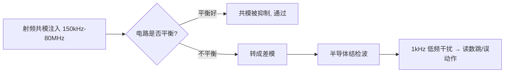

# PCB 模拟与采集模块

## 信号链与误差预算
- 按“输入/传感器、保护、滤波、增益或偏置、ADC/比较器、数字处理”分级，并为每级记录范围、源阻抗、共模、增益、带宽、噪声、过载和失效状态。
- 总误差不只由 ADC 位数决定，还包含传感器、分压比、放大器失调与偏置、基准、量化、温漂、布局泄漏和校准残差。先给误差分配，再选择器件精度与 PCB 隔离级别。
- 动态范围检查正常信号、故障峰值、共模摆幅和输入保护后的残余电压。保证放大器、ADC 和基准均不越过绝对最大值或线性工作范围。

## 输入保护与滤波
- 串联电阻限制故障和采样瞬态电流；TVS、钳位二极管或保护阵列按钳位电压、漏电、结电容、功耗和正常带宽联合选择。
- 抗混叠滤波的截止频率、阶数、通带误差和阻带衰减按采样率与目标频段确定。仅放一个 RC 不能自动解决所有混叠问题。
- SAR ADC 的采样电容会在采样瞬间拉取电荷；驱动器的输出阻抗、串联电阻和 RC 时间常数必须满足采样窗口内的建立时间，必要时使用缓冲运放。
- 高阻输入特别关注阻焊污染、潮湿、助焊剂残留、保护器件漏电和输入偏置电流。可采用守护环、清洁工艺、低漏电器件和更低阻抗的前级拓扑。

## 布局分区与回流
- 传感器/接口入口、模拟前端、ADC 与数字处理按信号流排列，小信号和高阻节点紧贴相关引脚，远离晶振、DDR、SW 节点、电感和高电流回路。
- 模拟与数字地的核心是控制回流。优先完整连续地平面，通过器件布局和高噪声电流回路限制耦合；随意切割地平面常使 ADC 回流绕行并增加辐射。
- 差分输入的走线、串联元件、过孔和邻近铜环境保持对称，避免一侧临近噪声源或跨越平面边界造成共模转差模。
- 低电平节点避免长距离平行于时钟或开关电源线。不可避免相交时优先垂直跨层并保持完整参考面。

## 电源、基准与去耦
- 模拟电源、数字电源和基准按芯片手册配置去耦与滤波，避免模拟前端和高 di/dt 数字负载共享狭窄供电颈部。
- 基准源输出电容的容量、ESR、稳定性、负载和回流必须满足数据手册；基准走线短、远离开关节点，且不承载其他大电流回流。
- ADC 的 AVDD、DVDD、REF 和 AGND/DGND 引脚按器件推荐拓扑连接。不要仅凭名称将地分成孤岛，而要从采样瞬态和数字回流路径判断。
- 对模拟电源纹波，应测量频谱及其与采样时钟、DC/DC 开关频率和工频的关系；一个标称低噪声 LDO 不能替代实际布局和去耦验证。

## 调试与故障定位
1. 用短接、精密源或替代负载隔离传感器、输入网络、放大器和 ADC，确认噪声与误差来自哪一级。
2. 以时域统计和频谱区分工频、开关纹波、固定时钟干扰、随机噪声和数据处理伪影；记录带宽、探头、接地和采样设置。
3. 检查零点、满量程、温漂、输入开短路、过压和 ESD 后恢复，避免仅在室温单一点做校准。
4. 改变探头地线、屏蔽或电源路径后必须重复对照测试，先排除测量回路耦合再判断电路性能。

## 评审与测试清单
- [ ] 输入范围、共模、电源范围、增益、带宽与 ADC 满量程匹配。
- [ ] 滤波、驱动阻抗和采样建立时间已计算并含器件容差。
- [ ] 保护器件的钳位、漏电、电容、故障功耗和正常精度均已核对。
- [ ] 模拟电源、基准、地与采样瞬态回流按信号链审查。
- [ ] 输入、基准、输出和安静地均有不破坏性能的测试位置。

+### 模拟与采集知识条目 1
CS（Conducted Susceptibility，传导抗扰度，IEC 61000-4-6）模拟的场景是：**在 150kHz～80MHz 频段，外界电磁场在线缆上感应出共模电压，顺着线缆灌进设备**。

为什么是这个频段？因为 80MHz 以下，波长（>3.75m）远大于普通设备尺寸，机壳不能有效接收电磁波，但**线缆长度接近 $\lambda/4$，成了高效接收天线**。80MHz 以上则改用辐射抗扰（RS，IEC 61000-4-3）直接照射。

测试等级：Level 1 = 1V、Level 2 = 3V、Level 3 = 10V（rms，未调制载波），实测时用 **1kHz 正弦、80% AM 调幅**，扫频步进 1%，每点驻留 ≥0.5s。

🔬 **深入原理**

注入方式三种：

| 方式 | 器件 | 特点 |
|---|---|---|
| CDN（耦合去耦网络） | CDN-M2/M3、AF、T2 等 | 首选，阻抗标准 150Ω |
| EM-Clamp（电磁钳） | 钳夹线缆 | 无法用 CDN 时（如屏蔽线） |
| 直接注入（BCI/直接耦合） | 100Ω 电阻注入 | 同轴/单线场合 |

**150Ω 共模阻抗**是这个标准的核心参数——它代表人体/线缆对地的典型共模阻抗。CDN 保证注入点看到 150Ω。

设备内部为什么会误动作？共模电压 $V_{CM}$ 通过**不平衡**转成差模干扰：

$$V_{DM}=V_{CM}\cdot\frac{\Delta Z}{Z}$$

$\Delta Z/Z$ 就是电路的不平衡度。差分接收电路（RS-485、以太网）平衡好，抗扰强；单端信号（UART、GPIO、模拟采样）平衡差，容易被击穿。

此外 80MHz 以下的干扰还会被半导体结**检波（rectification）**——PN 结的非线性把射频包络解调出来，变成 1kHz 的低频干扰，直接叠加到运放/ADC 输入，表现为读数跳动。这就是为什么调制是 80% AM 1kHz：**它专门检验解调敏感度**。

🛠 **设计实例/操作**

*例1：模拟采样口被干扰。* 4-20mA 输入在 20MHz 附近读数跳 ±5%。整改：
- 输入端加 **RC 低通**（如 100Ω + 1nF，$f_c=1.6\text{MHz}$）；
- 运放输入引脚就近加 10～100pF 到地（射频旁路）；
- 差分走线，增加共模抑制；
- 线缆入口加 CMC 或磁环。

*例2：I/O 口复位。* 长线 GPIO 在 5MHz 处触发复位。整改：GPIO 加 TVS + 串 100Ω + 1nF 对地；软件加去抖与看门狗；PCB 上把该信号的地回流路径缩短。



⚠️ **常见误区**

1. 只在软件上打补丁（滤波算法）。射频检波产生的是真实模拟量，软件无法完全消除。
2. 在信号线上加大电容却忽略上升沿要求，导致通信速率不达标。要按 $f_c$ 与信号带宽折中。
3. 认为屏蔽线一定好。屏蔽层若**只单端接地或接地阻抗高**，反而成为共模注入通道。高频应 360° 环接。
4. 忘记电源端口也要做 CS。DC 电源输入端同样需要 CMC + Y 电容。
5. 把 CS 与 EFT/Surge 混淆。CS 是持续射频，EFT 是脉冲群，Surge 是大能量单脉冲，防护器件完全不同。

📌 **要点速记**

- CS = IEC 61000-4-6，150kHz～80MHz，共模注入，150Ω 标准阻抗。
- 用 1kHz/80% AM 调制，专门考核半导体结的检波敏感度。
- 不平衡度决定共模→差模转换，平衡设计是根本。
- 端口整改套路：CMC/磁环 + RC 低通 + 就近射频旁路电容 + TVS。
- 屏蔽层需 360° 低阻接地才有效。


---
### 模拟与采集知识条目 2
以太网接口的第一部分：**架构与信号链路**。

一个典型的百兆/千兆以太网口链路：

```
 MAC(SoC/MCU) ──MII/RMII/RGMII/SGMII── PHY ──MDI(差分)── 变压器 ── RJ45 ── 网线
                （数字并行/串行接口）        （模拟差分）  （隔离）
```

两大部分要分开理解：
- **MAC↔PHY 侧**：数字接口，单端或差分，关注时序与等长。
- **PHY↔RJ45 侧（MDI）**：模拟差分，100Ω，关注阻抗、对称、隔离与 EMC。

MAC-PHY 接口对比：

| 接口 | 引脚数 | 时钟 | 速率 | 等长要求 |
|---|---|---|---|---|
| MII | 16 | 25MHz | 100M | 宽松 |
| RMII | 8 | 50MHz | 100M | ±0.5 inch |
| RGMII | 12 | 125MHz DDR | 1000M | **±10～25mil，需 skew 处理** |
| SGMII | 4（2 对差分） | 625MHz | 1000M | 100Ω 差分，严格 |
| RGMII-ID | 12 | 内部延时 | 1000M | 由 PHY 内部补偿 2ns |

🔬 **深入原理**

**RGMII 的 2ns 延时问题**是千兆以太网最经典的坑。RGMII 规范要求时钟相对数据有 **1.5～2.0ns 的延时**（数据在时钟边沿附近变化时无法采样）。实现方式三选一：

1. **PCB 延时**：把 TXC/RXC 走线加长约 **2ns × 6mil/ps = 12000mil ≈ 305mm**——显然不现实；
2. **PHY 内部延时（RGMII-ID）**：通过寄存器或引脚配置，PHY 内部加 2ns，**推荐做法**；
3. **MAC 内部延时**：SoC 侧配置。

**注意：MAC 和 PHY 两边不能都开延时，也不能都不开。**这是千兆网口"能通但丢包/只能跑百兆"的头号原因。

**MDI 差分**：1000Base-T 使用 4 对线全双工，每对 250Mbps，采用 PAM-5 编码，实际符号率 125MBaud。差分阻抗 **100Ω ±10%**。

**变压器的作用**：
1. **电气隔离**（1500Vrms 耐压，安规要求）；
2. **阻抗匹配与共模抑制**；
3. **隔断直流与地环路**。

**Bob Smith 电路**（共模端接）：

$$Z_{CM}=\frac{Z_{diff}}{4}\Rightarrow \text{每线 } 75Ω \text{ 汇合后经 1000pF/2kV 接机壳地}$$

原因：4 根线并联的共模阻抗应为 $300/4=75Ω$，实际用 4 个 75Ω 汇到一点，再经高压电容到机壳，把线缆上的共模噪声导走。

🛠 **设计实例/操作**

*例1：RGMII 布线。*
- TXD[3:0]+TX_CTL+TXC 一组，RXD[3:0]+RX_CTL+RXC 一组，**组内等长 ±25mil（严格些 ±10mil）**；
- 两组之间不必等长；
- 时钟线 TXC/RXC 单独包地，串阻 22Ω；
- 每根信号串 22～33Ω（靠驱动端），抑制过冲和 EMI；
- 走线尽量短（<15cm），50Ω 单端阻抗控制。

*例2：MDI 与变压器布局。*

```
  PHY ──差分100Ω，短且对称── 变压器 ──短── RJ45
        │                       ║隔离沟║
      数字地                    ║(挖空)║   机壳地/隔离地
        │                       ║      ║       │
   [中心抽头 → 电源+电容到地]    ║      ║  [Bob Smith 75Ω×4 + 1nF/2kV]
```

要点：
- PHY 到变压器走线 **<25mm，越短越好**；
- 变压器到 RJ45 **<25mm**；
- **变压器下方及 RJ45 侧的地平面必须挖空（隔离沟，宽度 ≥2mm）**，把"网口侧"与"数字侧"隔开，这是极少数**应该分割地**的场景；
- 隔离沟上**绝不允许任何走线跨越**；
- PHY 侧中心抽头接 PHY 电源（按数据手册）并加去耦电容；
- RJ45 屏蔽壳接机壳地（或经 1nF/2kV + 1MΩ）。

⚠️ **常见误区**

1. RGMII 延时两边都开或都不开 → 千兆不稳定。
2. 变压器下方地平面不挖空，隔离失效，共模噪声直接进数字地，RE 超标。
3. 隔离沟被走线跨越（尤其是 LED 指示灯的线），前功尽弃。
4. MDI 走线过长或绕弯，损耗与不对称增加。
5. 把 Bob Smith 的公共点接到数字地，而不是机壳地。
6. 变压器摆放方向错误，导致差分线交叉绕行。

📌 **要点速记**

- 链路分两段：MAC-PHY（数字）与 MDI（模拟差分 100Ω）。
- RGMII 需 2ns 延时，优先用 PHY 内部 ID 模式，两边只能开一次。
- RGMII 组内等长 ±25mil，时钟包地串阻。
- 变压器下方必须挖空隔离，且不得有任何走线跨越。
- Bob Smith 75Ω×4 + 1nF/2kV 接机壳地，用于共模端接。


---
### 模拟与采集知识条目 3
DDR 设计的第一集：**信号分类与总体架构**。想做好 DDR，第一步不是画线，而是把上百根信号分成几类，因为**不同类的规则完全不同**。

DDR 信号三大类：

| 类别 | 信号 | 特点 | 参考时钟 |
|---|---|---|---|
| **数据组（Byte Lane）** | DQ[7:0]、DQS±、DQM/DM | 双向，**源同步**，按字节分组 | DQS（该组自己的选通） |
| **地址/命令/控制** | A[]、BA[]、RAS#、CAS#、WE#、CS#、CKE、ODT | 单向（控制器→颗粒） | CK± |
| **时钟** | CK±、CK#（差分） | 差分，最关键 | — |

**核心规则**：**等长是"组内相对"的，不是"全部一样长"。**

- DQ0～DQ7、DM0 相对 **DQS0±** 等长（组内 ±10～25mil）
- DQ8～DQ15、DM1 相对 **DQS1±** 等长
- 所有地址/命令/控制相对 **CK±** 等长（±25～50mil）
- **DQS 组之间不需要互相等长**（DDR3 支持 write leveling / read leveling 自动校准）
- CK 通常做成"最长"，地址组略短于 CK（Flight time 匹配）

🔬 **深入原理**

**为什么源同步能跑这么快？** 传统共同时钟（Common Clock）架构下，时序裕量要扣掉时钟树偏斜、板级延时等一大堆；源同步把**选通信号 DQS 与数据一起发送**，接收端用 DQS 采数据，两者共同经历同样的板级延时，**延时被抵消**，只剩下 skew。

写时序（Write）中 DQS 与 DQ 是**边沿对齐（DDR3 为中心对齐由控制器移相 90°）**；读时序（Read）中颗粒输出 DQS 与 DQ 边沿对齐，控制器内部延时 90° 再采样。

时序裕量：

$$t_{margin}=\frac{UI}{2}-t_{setup}-t_{hold}-t_{skew}-t_{jitter}-t_{ISI}-t_{xtalk}$$

DDR3-1600：数据率 1600MT/s，$UI=625\text{ps}$，半个 UI 只有 312ps。扣掉颗粒 setup/hold（各约 50～100ps）、时钟抖动、串扰，留给 PCB skew 的往往只有 **50～100ps**。按 6mil/ps 算，就是 **300～600mil** 的总预算——听起来宽，但要扣掉封装内部走线（package skew）与过孔差异，实际给布线的通常按 ±25mil 控制。

**关键概念：Flight Time 与过孔延时。** 现代做法不是"物理等长"而是"**时延等长（tuned by delay）**"：
- 表层微带线速度 ≈ 7 mil/ps（$\varepsilon_{eff}$ 较小）
- 内层带状线速度 ≈ 6 mil/ps
- **两者速度不同！** 同样 1000mil，微带比带状快约 20ps。所以**同一组信号应尽量走同一层**，或用 EDA 的"时延等长"模式而非"长度等长"。
- 过孔也有延时，1.6mm 板厚过孔约 10～15ps，等长时应计入。

🛠 **设计实例/操作**

*例1：分组示例（DDR3 x16 单颗粒）。*

```
 组1: DQ0-7   + DM0 + DQS0± → 相对 DQS0 等长 ±25mil
 组2: DQ8-15  + DM1 + DQS1± → 相对 DQS1 等长 ±25mil
 组3: A0-14, BA0-2, RAS,CAS,WE,CS,CKE,ODT → 相对 CK± 等长 ±50mil
 组4: CK± 差分, 对内 ±5mil, 100Ω 差分
 组间: 组1 与 组2 无需等长；地址组通常比 CK 短 0~200mil
```

*例2：叠层与阻抗。* DDR 推荐 **6 层以上**：
```
 L1 SIG (DQ组1)      ← 参考 L2
 L2 GND ★完整
 L3 SIG (地址/命令)   ← 参考 L2/L4
 L4 PWR (VDD/VDDQ)
 L5 GND ★
 L6 SIG (DQ组2)      ← 参考 L5
```
单端 40～50Ω（DDR3 常用 40Ω 或 50Ω，按控制器要求），差分 80～100Ω。

⚠️ **常见误区**

1. **把所有 DDR 信号等长到同一个值**。这不但没必要，还会让绕线爆炸、串扰增加。
2. 用"长度等长"跨层混走。微带与带状速度不同，必须用时延等长或统一走线层。
3. 忘记算过孔延时和封装内 skew（高端 SoC 的 package skew 表必须查）。
4. DQ 与地址线混在一起走，互相串扰。
5. 认为 DDR3 有校准就可以随便画。校准能补偿的是**固定偏移**，补不了串扰、反射和抖动。

📌 **要点速记**

- DDR 信号分三类：数据组（参考 DQS）、地址命令（参考 CK）、时钟（差分）。
- 等长是"组内相对参考信号"，组间不必等长。
- 源同步架构靠 DQS 抵消板级延时。
- 微带 7mil/ps、带状 6mil/ps，速度不同 → 用时延等长。
- 过孔延时与封装 skew 必须计入预算。


---
### 模拟与采集知识条目 4
任何一条 PCB 走线,在高频下都同时具有电阻 $R$、电感 $L$、电容 $C$、电导 $G$。沿传输线往前看,每前进一段微元,就看到一个由这些参数构成的"串联+并联"网络。当信号以行波形式传播时,线上某点电压与电流的比值趋于一个恒定值,这就是**特性阻抗 $Z_0$**:

$$
Z_0 = \sqrt{\frac{R + j\omega L}{G + j\omega C}}
$$

在常见的"无损近似"($R,G$ 可忽略)下简化为:

$$
Z_0 = \sqrt{\frac{L}{C}}
$$

也就是说,特性阻抗由"单位长度电感"和"单位长度电容"的比值决定。它**只和走线的几何结构以及板材介电常数有关,和走线长度无关**。最常用的两类结构公式(经验公式,工程够用):

- 微带线(表层走线,下方有参考平面):

$$
Z_0 \approx \frac{87}{\sqrt{\varepsilon_r + 1.41}} \ln\!\left(\frac{5.98\,h}{0.8\,w + t}\right)
$$

- 带状线(内层走线,夹在两个参考平面之间):

$$
Z_0 \approx \frac{60}{\sqrt{\varepsilon_r}} \ln\!\left(\frac{4\,h}{0.67\pi\,(w + 0.8\,t)}\right)
$$

其中 $w$ 是线宽、$t$ 是铜厚、$h$ 是到参考平面的介质厚度。可见:**线越宽、离参考面越近,$Z_0$ 越低**;介电常数越高,$Z_0$ 越低。

**为什么重要**:如果驱动端、走线、接收端阻抗不一致,信号到达终点会"撞墙反弹"(反射),叠加出振铃、过冲、台阶,导致采样错误。所以高速设计第一件事就是**定阻抗目标**(常见 50Ω 单端、90Ω/100Ω 差分),再由厂家叠层反推线宽。
### 模拟与采集知识条目 5
信号在线上不是瞬时到达,而是以有限速度传播。传播延迟:

$$
t_{pd} = \frac{\sqrt{\varepsilon_r}}{c} \cdot L \approx \frac{L}{15\ \text{cm/ns}} \quad (\text{FR-4})
$$

也就是大约 **每 1 ns 走 15 cm**,折算约 **55~65 ps/cm**(取决于层间 $\varepsilon_r$ 差异,内层比表层稍慢)。对 DDR 这类并行总线,数据线(DQ)和时钟(DQS)必须同时到达,否则采样窗口错位就会出错。于是要做**等长**——把所有相关网络的长度差控制在几 mil 到几十 mil 以内(例如 DDR3 数据组内通常要求误差 < ±25 mil)。注意:**等长不等于等阻抗**,它是时序概念,和前面的 $Z_0$ 是两套约束。
### 模拟与采集知识条目 6
**1）为什么 byte lane 内要等长，lane 之间不用？** 因为 DDR3 采用 **源同步（Source Synchronous）** 时序：数据 DQ 与选通信号 DQS 一起发送，接收端用 DQS 的边沿去采样 DQ。

```
   发送端           接收端
   DQ0-7  ────────► 用 DQS0 采样
   DQS0   ────────►
   
   只要 DQ 与 DQS 一起到达, 传输时间长短无所谓
   => 只需 lane 内等长, lane 间可以差很多
```

时序裕量（以写时序为例）：

$$t_{margin}=\frac{UI}{2}-t_{skew}-t_{jitter}-t_{setup/hold}$$

DDR3-800 的 $UI = 1/(800\times10^6)=1250\ \mathrm{ps}$，半个 UI = 625ps。25mil 的长度差对应偏斜：

$$25\ \mathrm{mil}=0.635\ \mathrm{mm},\quad t_{skew}=0.635\times7=4.4\ \mathrm{ps}$$

只占 0.7%，非常安全。这就是 ±25mil 这个数字的由来。

**2）为什么 Addr/CMD 与 CK 等长？** 地址/命令是**公共时钟同步**：DDR3 用 CK 的上升沿锁存地址命令。所以要保证 Addr 与 CK 同时到达。容差可放宽到 ±50~100mil，因为地址命令通常以更低的速率（半速率）传输。

**3）串扰（Crosstalk）与 3W 规则。** 相邻走线间的耦合系数随间距增大而快速下降。经验：
- 间距 = 1W：串扰约 20%
- 间距 = 2W：串扰约 8%
- 间距 = 3W：串扰约 3~4%
- 间距 = 4W：串扰 <2%

对 DDR3 这样的并行总线，**同时翻转的线很多（SSN 同步开关噪声）**，所以间距不能省。
### 模拟与采集知识条目 7
BANK3 在逻辑派上常承载与 MCU 交互的并行/串行总线、SPI、或自定义高速接口。和 BANK2 一样，先确认电平标准（LVCMOS33、LVCMOS18 等）与方向。布线核心仍是"短、直、等长、有完整参考面"。若 BANK3 含差分对（如 LVDS），必须成对走线并保持 100Ω 差分阻抗与对内等长。

🔬 深入原理
- 差分阻抗：两条耦合线特性阻抗满足 $Z_{diff}\approx 2Z_0(1-k)$，其中 $k$ 为耦合系数。BANK3 的 LVDS 对需按叠层计算线宽/间距（常见 5/5mil 或 4/8mil 组合）。
- 对内长度偏差（intra-pair skew）会引起共模噪声与眼图闭合，要求通常 ≤5mil。
- 为什么重要：MCU↔FPGA 的并行总线若某位比其它位长很多，采样时会错位；差分对不等长则丧失抗共模干扰能力。

🛠 设计实例/操作
1. 例：BANK3 出 4 对 LVDS 到外部高速 ADC，每对设置 Differential Pair 规则，走线时开启"Length Tuning"实时显示长度，确保对内 ≤5mil、对间可不严格但建议 ≤50mil。
2. 例：SPI 总线（SCLK/MOSI/MISO/CS）从 BGA 扇孔后就近布到 SPI Flash，SCLK 作为参考，MOSI/MISO 与 SCLK 等长 ±50mil。

⚠️ 常见误区
- 差分对中途换层却不补地过孔，导致回流不连续、阻抗突变。
- 把差分对的"正""负"分别走在两个不同参考平面区域，破坏耦合。

📌 要点速记
- 先认电平标准再走线。
- 差分对必须成对、等阻抗、对内等长。
- 换层必打回流地过孔。
- 并行总线相对时钟等长。
- 用交互式等长工具实时核对。


---
### 模拟与采集知识条目 8
🔬 深入原理
- DDR 用源同步时钟：DQS 随数据一起发送，接收端用 DQS 边沿采样 DQ。因此同 Byte Lane 内 DQ/DM 与 DQS 的飞行时间（flight time）必须一致。
- 容忍偏差：DDR3-800（时钟 400MHz）数据组通常要求 $\Delta L \le 20\sim25\,\text{mil}$；按器件手册为准。
- 换算：$\Delta t = \Delta L / v$，$v\approx 6\,\text{in/ns}$（FR4），25mil ≈ 4.2ps。
- 为什么重要：等长偏差超容限→眼图闭合→内存读写错。

🛠 设计实例/操作
1. 例：Byte Lane0 含 DQ[0..7]、DM0、DQS0±。先量得 DQS0 走线长 1250mil，将 DQ0..7 各自加蛇形调到 1240~1260mil 内。
2. 操作：在 Altium 用 `Length Tuning` 配合 xSignals（把"芯片→过孔→DDR 引脚"整条路径定义为一条 xSignal）做精准等长，而非只看直线段。

⚠️ 常见误区
- 只等长"表层直线"，忘了过孔延迟（不同层过孔数不同，时延不等）。
- 把不同 Byte Lane 的 DQ 互相等长，浪费精力且无意义。

📌 要点速记
- 数据按 Byte Lane 分组，组内等长、组间独立。
- DDR3-800 数据组偏差通常 ≤20~25mil。
- 用 xSignals 把过孔延迟算进总长。
- DQ/DM 相对 DQS 等长。
- 等长前先定 DQS 为参考长度。


---
### 模拟与采集知识条目 9
🔬 深入原理
- 组内等长目标：设参考长度 $L_{ref}$（取 DQS 实际长），要求 $\max|L_i-L_j|\le \Delta_{tol}$。
- 差分 DQS 对内：$\Delta_{intra}\le 5\,\text{mil}$，否则共模噪声增大、采样沿抖动。
- 为什么重要：多组 Lane 若各自超差，整机在高温/低压下内存报错，极难排查。

🛠 设计实例/操作
1. 例：Lane1 的 DQ15 短了 60mil，用蛇形补到与 DQS1 差 ≤20mil；Lane0 与 Lane1 之间不做等长（源同步各自独立）。
2. 例：DQS1± 对内差 12mil，重新走其中一端缩短，调到 ≤5mil。

⚠️ 常见误区
- 蛇形只加在 DQ 短的那根，却把 DQS 也一起拉长，破坏"以 DQS 为参考"。
- 忽略 DM（数据掩码）等长，它同样需在组内。

📌 要点速记
- 每个 Byte Lane 独立等长到各自 DQS。
- DQS 差分对内 ≤5mil。
- DM 别漏掉，随组等长。
- 用规则（Matched Length）自动报超差。
- 等长后导出长度报告留档。


---
### 模拟与采集知识条目 10
🔬 深入原理
- 地址组相对时钟 CK：$\Delta L \le 50\,\text{mil}$（DDR3-800，常见值；高速可收紧到 25mil），因为地址在 CK 边沿被所有颗粒同时采样。
- 时钟 CK 本身是差分对，对内 ≤5mil，且 CK 长度通常作为地址组的"基准"。
- 为什么重要：地址组错位→命令/地址被错拍锁存→初始化失败或随机崩溃。

🛠 设计实例/操作
1. 例：以 CK 长度 1300mil 为基准，ADDR[0..14]、BA[0..2]、控制信号全部用蛇形调到 1250~1350mil 区间（±50mil）。
2. 例：CK± 对内差 8mil，先修 CK 对内到 ≤5mil，再依 CK 总长调地址组。

⚠️ 常见误区
- 把地址组和 DQS 组混在一起等长——两者参考时钟不同（CK vs DQS），不可比。
- 忘记 CS/ODT/CKE 也是地址组成员，必须一起等长。

📌 要点速记
- 地址组相对 CK 等长，非 DQS。
- DDR3-800 容差常见 ±50mil。
- CK 差分对内 ≤5mil，作基准。
- CS/ODT/CKE 一并计入。
- 地址组与数据组规则严格区分。


---
### 模拟与采集知识条目 11
🔬 深入原理
- 主从判定：谁发随路时钟，谁就是等长基准端；所有数据相对该时钟等长。
- 若存在双向总线（如异步 FIFO），以双方约定的采样边沿参考信号为基准。
- 为什么重要：MCU 与 FPGA 间总线不等长，高速下会出现偶发数据错位，表现为"偶尔死机"。

🛠 设计实例/操作
1. 例：MCU 以 SCLK 向 FPGA 发 16 位数据，把 16 位数据相对 SCLK 等长到 ±50mil。
2. 例：BANK1 上一对调试用 LVDS，对内 ≤5mil，对间无需严格。

⚠️ 常见误区
- 把双向异步总线硬套源同步等长规则。
- 基准选错（以数据线为基准去调时钟）。

📌 要点速记
- 先定基准时钟（发出方）。
- 源同步总线数据相对基准等长。
- 异步总线不盲目等长。
- 差分对对内 ≤5mil。
- BANK1 完成，进度过半。

BANK1 等长完，第 47、48 讲收尾 BANK3、BANK2 等长。

---
### 模拟与采集知识条目 12
🔬 深入原理
- SDIO 为源同步：DAT 相对 CLK 采样。低速模式（≤50MHz）长度差几十 mil 无碍；UHS-I（100MHz+）建议 DAT 相对 CLK ≤? 经验 ±50~100mil 已很宽松，关键仍是阻抗与参考面。
- 阻抗：CLK 单端 50Ω，所有线紧邻 GND。
- 为什么重要：TF 卡常见故障是"偶尔读不出"，多半是电源/上拉/等长综合问题，而非单纯等长。

🛠 设计实例/操作
1. 例：把 DAT0..3 与 CMD 相对 CLK 粗等长到 ±50mil（用短蛇形即可），CLK 尽量短而直。
2. 例：确认 TF 卡座每个电源/地引脚都有独立过孔到平面，CLK 两侧加地屏蔽。

⚠️ 常见误区
- 在低速 TF 卡上过度等长，浪费布线空间。
- 忽略 CLK 上拉（按卡规范）与电源去耦，只盯等长。

📌 要点速记
- TF 卡等长宽松，±50mil 足够。
- CLK 单端 50Ω，短而直。
- 电源/地上拉/去耦比等长更关键。
- 高速 UHS 模式再收紧容差。
- 全板等长阶段至此全部完成。


---
### 模拟与采集知识条目 13
教材常说的"两种实用放大电路"指两种共射偏置形式:
1. **固定偏置电路**:基极只经一个电阻 $R_B$ 接 $V_{CC}$,$I_B=(V_{CC}-V_{BE})/R_B$ 固定(不随温度变化)。
2. **分压式偏置电路(射极偏置)**:基极由 $R_1$、$R_2$ 分压,发射极接 $R_E$ 到地,利用负反馈稳定 Q 点(温漂小,工程首选)。

两者都共射,核心差别在"Q 点稳不稳"。

🔬 深入原理

固定偏置:简单但 $\beta$ 随温度升→$I_C$ 升→Q 点上移→易饱和,稳定性差。
分压偏置:若 $I_1\gg I_B$,则 $V_B\approx V_{CC}R_2/(R_1+R_2)$ 稳定;
$$I_C\approx I_E=\frac{V_B-V_{BE}}{R_E}$$
$\beta$ 变化被 $R_E$ 负反馈抵消——温度升高 $I_C$ 欲增→$V_E$ 升→$V_{BE}$ 降→$I_B$ 降→$I_C$ 回稳。这是"负反馈稳定 Q 点"的雏形。

🛠 设计实例/计算

分压偏置:$V_{CC}=12\text{V}$,$R_1=30\text{k}$,$R_2=10\text{k}$,$R_E=1\text{k}$,$\beta=100$,$V_{BE}=0.7$。
$$V_B=12\times\frac{10}{40}=3\text{V}$$
$$I_C\approx\frac{3-0.7}{1\text{k}}=2.3\text{mA}$$
即使 $\beta$ 从 100 变 200,$I_C$ 仍≈2.3mA——稳定!对比固定偏置 $\beta$ 翻倍则 $I_C$ 翻倍。

⚠️ 常见误区

误区一:认为固定偏置也能稳定。它只固定 $I_B$,不固定 $I_C$。
误区二:分压偏置 $R_1,R_2$ 太小则功耗大、输入电阻低。
误区三:忘给 $R_E$ 并联旁路电容(否则交流负反馈削增益,见后续)。

📌 要点速记

1. 固定偏置:简单但温漂大。
2. 分压偏置:射极电阻负反馈稳 Q,工程首选。
3. 分压偏置 $I_C\approx(V_B-V_{BE})/R_E$。
4. 稳定靠 $R_E$ 采样电流并反作用于 $V_{BE}$。
5. 两种皆共射,差别在偏置稳定性。

+### 模拟采集进阶知识条目 1
为什么固定偏置的 Q 点会漂?因为三极管是温度敏感器件。温度升高会带来三个变化:(1)反向饱和电流 $I_{CBO}$ 指数上升($I_{CBO}\propto e^{...}$,约每升 10℃ 翻倍);(2)发射结电压 $V_{BE}$ 负温度系数(约 -2mV/℃);(3)$\beta$ 增大(约 +0.5%~1%/℃)。三者都使 $I_C$ 随温度上升而增大,Q 点上移,轻则增益变、重则饱和失真。

🔬 深入原理

稳定 Q 点的核心思想:**引入直流负反馈**。最典型是发射极电阻 $R_E$:当 $I_C$ 因温升欲增→$V_E=I_E R_E$ 升→$V_{BE}=V_B-V_E$ 降→$I_B$ 降→$I_C$ 回拉。这是"采样输出电流、反作用于输入"的负反馈闭环。

分压偏置进一步让 $V_B$ 由电阻分压固定(与 $\beta$ 无关):
$$I_C\approx I_E=\frac{V_B-V_{BE}}{R_E}$$
由于 $V_{BE}$ 温漂仅约 -2mV/℃,只要 $V_B\gg V_{BE}$,$I_C$ 几乎不受温度与 $\beta$ 离散影响。

🛠 设计实例/计算

设 $V_B=3\text{V}$,$R_E=1\text{k}$,温升使 $V_{BE}$ 从 0.7 降到 0.6:
$$I_C\approx\frac{3-0.7}{1\text{k}}=2.3\text{mA}\to \frac{3-0.6}{1\text{k}}=2.4\text{mA}$$
仅变 4%,而固定偏置下 $\beta$ 翻倍则 $I_C$ 翻倍——稳定性天差地别。

⚠️ 常见误区

误区一:以为加 $R_E$ 就万事大吉,却忘 $V_B$ 也要稳(否则 $V_B$ 随 $I_B$ 变)。
误区二:忽略 $R_E$ 对交流的负反馈(会削增益,需旁路电容)。
误区三:把温漂只归因于单一因素。

📌 要点速记

1. 温漂三因:$I_{CBO}\uparrow$、$V_{BE}\downarrow$、$\beta\uparrow$→$I_C\uparrow$。
2. 稳 Q 靠发射极电阻直流负反馈。
3. 分压偏置 $I_C\approx(V_B-V_{BE})/R_E$,与 $\beta$ 无关。
4. 负反馈采样 $I_E$ 反作用于 $V_{BE}$。
5. 稳定 Q 点是工程放大电路标配。


---
### 模拟采集进阶知识条目 2
🔬 深入原理

1. **恒流源尾电流**：用三极管或 MOS 管构成电流源，直流压降小、交流电阻极大（$r_o$ 可达 MΩ 级），使 $A_c\approx0$、KCMR 极高，是集成差放标准做法（下集155详讲镜像电流源）。

2. **射极调零电阻 $R_W$**：在两发射极之间串小电位器，失配时调中点使 $u_o=0$（静态调零），克服 $V_{BE}$、$\beta$ 不对称。

3. **共模负反馈**：把双端输出经电阻采样送回尾电流控制，共模增大时自动减小尾电流、压低共模增益，是高速/高精度运放常用技术。

4. **FET 差放**：JFET/MOSFET 输入电阻极高（G 极无电流），适合高源内阻传感器；跨导 $g_m$ 取代 $\beta/r_{be}$，增益 $A_d\approx -g_m R_D$。

5. **有源负载差放**：用电流镜作集电极负载（代替 $R_C$），交流电阻大、单端输出也能得高增益且高 KCMR——这正是运放内部形态。

🛠 设计实例/计算

普通电阻尾 $R_E=10\,\text{k}\Omega$ 时 KCMR≈51 dB；换成恒流源 $r_o=1\,\text{M}\Omega$ 后 KCMR≈91 dB，提升 40 dB。若再失配 $\Delta\beta/\beta=5\%$，不加调零时单端输出有 mV 级失调；串 $R_W=200\,\Omega$ 调中点即可把失调压到 μV 级。

⚠️ 常见误区

1. 以为加大 $R_E$ 就万事大吉：直流压降受限，必须恒流源。
2. 忽视失调配调零电位器：理论对称不等于实际对称。
3. 把差放当"孤立电路"：它本质是运放第一级，后面接中间级与输出级。

📌 要点速记

1. 恒流源尾 = 小直流压降 + 大交流电阻，KCMR 极高。
2. 调零电位器克服元件失配引起的失调。
3. 共模负反馈进一步压低 $A_c$。
4. FET 差放输入电阻极高，适合高阻源。
5. 有源负载差放是集成运放内部核心结构。


差放完结，自然引出"用什么做恒流源尾"——155集讲镜像电流源（及后续比例、微电流、威尔逊电流源），它们是差放与运放的偏置基石。

---
### 模拟采集进阶知识条目 3
- **无关项设计**:输入有约束(如 BCD 仅 0~9)时,卡诺图里 10~15 作 `×`,化简可更简。
- **竞争冒险**:信号经不同路径到达门,因延迟不同,瞬间产生错误的窄脉冲(毛刺)。

🔬 深入原理

**竞争冒险成因与判别**:
- 当函数可化为 $Y=A+\bar A$ 或 $Y=A\cdot\bar A$ 形式(某变量及其反同时出现,且其余因子互补),可能出现冒险。
- 卡诺图中,若两个本应合并的 1 圈被"隔开"(中间隔了 0),在变量翻转经过该边界时可能冒险。

**消除方法**:
1. **加冗余项**:在卡诺图中把相邻的两圈用多余项连起来(如 $Y=\bar A C + A B$ 加冗余项 $B C$)。
2. **引入采样/选通脉冲**:在稳定后再取输出。
3. **输出端加滤波电容**:吸收窄毛刺(牺牲速度)。

**无关项设计例**:用最少门实现"8421 BCD 的 $A>B$ 判断"等,利用 10~15 无关项化简。

🛠 设计实例

题:函数 $Y=\bar A C + A B$,判断并消除冒险。
解:当 $B=C=1$ 时 $Y=A+\bar A$,A 翻转可能冒险。加冗余项 $BC$:$Y=\bar A C + A B + BC$ 消除。卡诺图中补上 AB=1,C=1 处(若原缺)即可圈成整块。

⚠️ 常见误区

- 认为卡诺图最简就一定无冒险(最简反而可能暴露冒险,需补冗余项)。
- 把"竞争"(信号到达时间差)和"冒险"(由此产生的错误输出)混为一谈。
- 消冒险的冗余项被当成"多余"删掉。

📌 要点速记

1. 含无关项设计务必用 `×` 帮化简。
2. 冒险判别:出现 $A+\bar A$ 或 $A\bar A$ 组合。
3. 加冗余项/选通脉冲/滤波可消冒险。
4. 最简解≠无冒险解,需额外处理。


组合逻辑基础(1-25集)到此完整。下集进入**第五章 触发器**——电路第一次有了"记忆",是时序逻辑的基石。
### 模拟采集进阶知识条目 4
🔬 深入原理

同步 RS 触发器 = 基本 RS + 两个导引门(AND 门,受 EN 控制):

- EN=0:导引门关闭,S、R 被屏蔽,输出保持。
- EN=1:S、R 透传进基本 RS,正常置/复。

特性方程(EN=1 时):

$$ Q_{n+1} = S + \bar R Q_n,\quad 约束\ SR=0 $$

仍保留 $S=R=1$ 禁用的约束。

**电平触发的隐患——空翻(racing)**:在 EN=1 的整个期间,输入变化都会引起输出变化,若输入在此期间翻转多次,输出会跟着翻多次("空翻"),导致不可靠。这是电平触发的主要缺点,也是引出"边沿触发"的动机。

🛠 设计实例

例:时钟控制的数码寄存器雏形:EN 接统一时钟,多个同步 RS 在同一时刻被写入,实现并行锁存。

例:若 EN 持续为高且 S 在期间由 0→1→0,输出会先置 1 后… 取决 R,体现空翻风险。

⚠️ 常见误区

- 以为 EN 高期间输出锁存不变(实际电平触发期间随输入变,只有边沿触发才"锁存于跳变沿")。
- 忽略 $SR=0$ 约束在同步型中依然存在。
- 把"空翻"当正常功能,没意识到它会导致计数错误。

📌 要点速记

1. 同步 RS:EN 有效才接收 S/R,否则保持。
2. 特性方程 $Q_{n+1}=S+\bar R Q_n$,约束 $SR=0$。
3. 电平触发在 EN 期间随输入变,有"空翻"隐患。
4. 空翻问题引出边沿触发(下集)。


空翻不可靠,于是有了**边沿触发器**(只在时钟上升/下降沿采样)和**主从触发器**(两级防空翻)。下集详述 D、JK 等边沿触发器的特性方程。
### 模拟采集进阶知识条目 5
- **D 触发器**:输出跟随输入 D,但在**时钟边沿**(通常上升沿)才更新。$Q_{n+1}=D$。最简单、最常用。
- **JK 触发器**:功能最全。上升(或下降)沿采样 J、K:$Q_{n+1}=J\bar Q_n+\bar K Q_n$。

🔬 深入原理

**边沿触发**:只在 CP 跳变瞬间把输入锁存进输出,CP 其它时间输入变化不影响输出——彻底解决空翻。

**D 触发器特性方程**:

$$ Q_{n+1} = D $$

**JK 触发器特性方程**:

$$ Q_{n+1} = J\bar Q_n + \bar K Q_n $$

验证四种情况:J=K=0 保持;J=0,K=1 复位;J=1,K=0 置位;J=K=1 翻转(计数态)。

**主从触发器**:两级(主+从),CP=1 时主接收、从保持;CP 下降沿主→从传递。避免了电平触发的空翻,但有"一次翻转"问题。现代多用边沿触发代替。

**T 触发器**(Toggle):$Q_{n+1}=T\oplus Q_n$,T=1 时每拍翻转,由 JK 令 J=K=T 得到,或由 D 令 $D=Q_n\oplus T$。

🛠 设计实例

例:用 D 触发器做 2 分频:把 $\bar Q$ 接回 D,每来一个时钟 Q 翻转一次,频率减半。

例:JK 当 T':J=K=1,则每 CP 翻转,可作计数器最低位。

⚠️ 常见误区

- 混淆"电平触发"与"边沿触发":边沿触发只在跳变瞬间采样。
- JK 的 J=K=1 不是"禁用"而是"翻转"(区别于 RS 的禁用)。
- 主从触发器误以为无一次翻转问题,实际有。

📌 要点速记

1. 边沿触发只在 CP 跳变瞬间采样,无空翻。
2. D 触发器:$Q_{n+1}=D$,最常用。
3. JK 触发器:$Q_{n+1}=J\bar Q+\bar K Q$,J=K=1 翻转。
4. T 触发器由 D/JK 转换得到,用于计数分频。


各种触发器特性方程记住了,下集系统讲**触发器的逻辑功能分类、特性表、状态图,以及触发器之间的相互转换**(如 JK→D、D→T)。
### 模拟采集进阶知识条目 6
**一、时序参数三兄弟**

| 参数 | 含义 | 违反后果 |
|---|---|---|
| $t_{su}$ 建立时间 | 数据必须在时钟沿**前**稳定的时长 | 亚稳态、采样错误 |
| $t_h$ 保持时间 | 数据必须在时钟沿**后**继续稳定的时长 | 采样错误 |
| $t_{co}$ 传输延迟 | 时钟沿到输出稳定的时长 | 影响下级建立 |

同步时序电路的最高时钟频率由**最长路径**决定：

$$
T_{CP(min)} = t_{co} + t_{comb(max)} + t_{su}
$$
$$
f_{max}=\frac{1}{t_{co}+t_{comb(max)}+t_{su}}
$$

其中 $t_{comb(max)}$ 是两个触发器之间组合逻辑的最大延迟。保持时间约束则为：

$$
t_{co(min)}+t_{comb(min)} \ \ge\ t_h
$$

这解释了为什么"组合逻辑越复杂，电路跑不快"，也解释了为什么流水线（在长组合路径中间插触发器）能提速。

**二、综合设计题的读题模板**

1. 圈出**输入**（按键、传感器、模式选择）、**输出**（灯、报警、显示）；
2. 判断输出是否随输入立即变化 → Mealy / Moore；
3. 找"需要记忆"的量 → 状态；
4. 画状态图，标全每个状态在**每种输入组合**下的去向（不能有缺口）；
5. 按七步走。
### 模拟采集进阶知识条目 7
**一、采样定理（奈奎斯特定理）**

$$
\boxed{f_s \ge 2f_{max}}
$$

采样频率必须不低于信号最高频率的 2 倍，否则会发生**混叠**（aliasing）——高频信号伪装成低频信号，无法恢复。工程上通常取 $f_s=(3\sim5)f_{max}$，并在 ADC 前加**抗混叠低通滤波器**。

例：音频最高 20 kHz，CD 采样率取 44.1 kHz（> 40 kHz）。

**二、量化误差**

量化必然带来误差，这是 ADC 的**固有误差**，无法消除，只能靠增加位数减小。

| 量化方式 | 最大误差 |
|---|---|
| 只舍不入（截尾） | $\varepsilon_{max}=1\ \text{LSB}=\Delta$ |
| 四舍五入（舍入） | $\varepsilon_{max}=\frac12\ \text{LSB}=\frac{\Delta}{2}$ |

其中量化单位（量化间隔）：
$$
\Delta=\frac{V_{FS}}{2^n}\quad\text{（或 }\frac{V_{FS}}{2^n-1}\text{，视教材约定）}
$$

**四舍五入法误差只有截尾法的一半**，实际 ADC 都用它。

**三、三大 A/D 结构对比（核心考点）**

| 类型 | 原理 | 转换时间 | 精度 | 特点 |
|---|---|---|---|---|
| **并行比较型**（Flash） | $2^n-1$ 个比较器同时比较 + 优先编码器 | **最快**（ns 级，一步完成） | 位数低（≤8） | 器件量 $2^n-1$ 随位数指数增长，功耗大、贵 |
| **逐次逼近型**（SAR） | 内含 DAC，用二分法逐位试探 | 中等（$n$ 个时钟） | 8~16 位 | **速度/精度/成本最均衡，应用最广**（单片机内置 ADC） |
| **双积分型**（V-T） | 对输入定时积分，再对基准定值反向积分，测时间 | **最慢**（ms 级） | **最高**，抗干扰强 | 对周期性干扰（工频 50 Hz）有极强抑制，用于数字万用表 |

**四、逐次逼近型的工作过程（必考）**

设 $n$ 位 ADC，逐次逼近寄存器 SAR：

```
① 置最高位 d_{n-1}=1，其余为 0
② 送 DAC 得 v_D，与 v_I 比较：
     若 v_D ≤ v_I → 保留该位为 1
     若 v_D > v_I → 该位清 0
③ 转向次高位，重复②
④ n 次后，SAR 的内容即为转换结果
```

本质是**二分查找**，转换时间恒为 $n$ 个时钟周期：

$$
T_{conv}=n\cdot T_{CP}
$$

**五、双积分型的抗干扰原理**

第一阶段对 $v_I$ 定时积分 $T_1$，积分值正比于 $v_I$ 在 $T_1$ 内的**平均值**。若取 $T_1$ 为工频周期 20 ms 的整数倍，则叠加的 50 Hz 干扰在一个完整周期内积分为 0，被彻底抵消。

第二阶段用基准 $-V_{REF}$ 反向积分到 0，所需时间 $T_2$ 满足：

$$
\frac{v_I}{R C}T_1=\frac{V_{REF}}{RC}T_2\ \Longrightarrow\ T_2=\frac{v_I}{V_{REF}}T_1
$$

用计数器测 $T_2$ 即得数字量。注意 **$R$、$C$ 被消掉了**——所以双积分型对元件精度不敏感，这是它高精度的另一原因。

**六、主要指标**

- **分辨率**：位数 $n$；
- **转换精度**：含量化误差、失调、增益、非线性；
- **转换时间**：并行 < 逐次逼近 < 双积分。
### 模拟采集进阶知识条目 8
**例1：逐次逼近过程追踪**

4 位 SAR ADC，$V_{REF}=8$ V（满量程 8 V，$\Delta=0.5$ V），输入 $v_I=5.2$ V：

| 步 | 试探码 | $v_D$ | 比较 | 保留 |
|---|---|---|---|---|
| 1 | 1000 | 4.0 V | $4.0\le5.2$ | $d_3=1$ |
| 2 | 1100 | 6.0 V | $6.0>5.2$ | $d_2=0$ |
| 3 | 1010 | 5.0 V | $5.0\le5.2$ | $d_1=1$ |
| 4 | 1011 | 5.5 V | $5.5>5.2$ | $d_0=0$ |

结果 $1010$，对应 5.0 V，量化误差 0.2 V < 1 LSB（0.5 V）。✔

**例2：位数选择**

要测 0~10 V 电压，要求分辨力 5 mV，至少几位？
$$
\frac{10}{2^n}\le5\times10^{-3}\Rightarrow2^n\ge2000\Rightarrow n\ge11
$$
选 12 位 ADC。

**例3：转换速率**

12 位 SAR ADC，时钟 1 MHz，则 $T_{conv}=12\ \mu$s，最高采样率约 83 kSPS。若要采集 20 kHz 音频（需 $f_s\ge40$ kHz），满足要求。
### 模拟采集进阶知识条目 9
- **数制与码制是地基**：二/八/十/十六进制互转、原码反码补码、8421BCD 与格雷码（相邻位只变一位，用于防误码与卡诺图排列），后续所有章节都在此之上。
- **逻辑代数是通用语言**：三大定律（交换/结合/分配）、摩根定律、吸收律、消因律、冗余项定理；卡诺图化简（圈 $2^k$ 格、越大越好、可重叠、不遗漏）与无关项的利用，是压缩电路规模的核心手段。
- **门电路要懂"电"不只懂"逻辑"**：TTL 与 CMOS 的电平标准、扇入扇出、噪声容限、传输延迟、OC/OD 门（可线与、需上拉）、三态门（是总线共享的前提）。
- **组合逻辑的方法论闭环**：分析（写表达式→化简→真值表→归纳功能）与设计（抽象→真值表→化简→变形→画图）互为逆过程；竞争冒险的判别与用冗余项消除。
- **MSI 组合器件三件套**：编码器（多入少出，74LS148 输入低有效/输出反码）、译码器（少入多出，$\overline{Y_i}=\overline{m_i}$，配与非门实现任意函数）、数据选择器（$Y=\sum m_iD_i$，降维法可用 $k$ 地址实现 $k+1$ 变量函数）。
- **触发器是记忆的最小单元**：基本 RS（约束 $RS=0$）、同步 RS、主从 JK（一次变化问题）、边沿 D/JK；四种特性方程必须默写；置数/清零的同步与异步之分贯穿全书。
- **时序电路分析六步法**：驱动方程→输出方程→状态方程→状态表→状态图→功能归纳；异步电路要额外写**时钟方程**，并按"先低位后高位、看跳变方向"的顺序推进。
- **时序电路设计七步法**：抽象→化简（等价状态合并）→编码→选触发器→求三方程→画图→**查自启动**（必须用化简后的方程验证无效态）。
- **计数器是时序的集大成者**：同步 vs 异步（$f_{max}$ 差 $n$ 倍）、加减方向判别口诀、任意进制的"异步反馈 $S_M$ / 同步反馈 $S_{M-1}$"两条黄金公式，以及 74LS161/163/160/162 的性格差异。
- **移位寄存器与特殊计数器**：环形（模 $n$、独热码、译码免费）、扭环形（模 $2n$、无译码毛刺）、LFSR（m 序列）；"模 $p$ 计数器 + 数据选择器"是序列信号发生器的万能套路。
- **脉冲电路按稳态数分三类**：双稳态（触发器，2 个稳态，存储）、单稳态（1 个，定时/整形，$t_W=1.1RC$）、多谐振荡器（0 个，自激产生方波，$T=0.7(R_1+2R_2)C$）。
- **一条母公式统一第十章**：$t=\tau\ln\dfrac{v(\infty)-v(0^+)}{v(\infty)-V_{TH}}$，记住 $\ln2=0.693$、$\ln3=1.099$、$\ln4=1.386$，任何变形电路都能现场推。
- **555 是模数结合的典范**：内部 = 3 个 5 kΩ 分压 + 2 比较器 + 1 个 RS 触发器 + 放电管；"看 2、6 脚接法判电路类型"；施密特的回差 $\frac13V_{CC}$ 是抗干扰的来源。
- **存储器 = 译码器 + 存储阵列**：容量 $2^n\times m$；ROM 天然是"最小项之和"，可实现任意组合逻辑（LUT 思想），加触发器即成可编程状态机；位扩展"数据分"、字扩展"片选分"。
- **D/A 与 A/D 是数字世界的进出口**：倒 T 型 R-2R 只用两种阻值、速度快易集成；A/D 四步（采样-保持-量化-编码）、采样定理 $f_s\ge2f_{max}$、量化误差 $\frac12$ LSB；并行最快、SAR 最均衡、双积分最准且抗工频干扰。
- **系统级思维是终点**：任何数字系统都可拆成"时基（振荡整形）+ 数据通路（计数/寄存/运算）+ 控制器（状态机）+ 接口（译码显示 / DAC / ADC）"四块；分辨率≠精度，同步优于异步，干净的时钟与可靠的复位是电路能跑起来的前提。
### 模拟采集进阶知识条目 10
**跟踪式预稳压器（tracking pre-regulator）的核心不等式**：

$$V_{pre}=V_{out}+V_{headroom},\qquad P_{pass}=V_{headroom}\times I_{out}$$

对比"固定母线"方案：

| 方案 | 输出 1 V/3 A 时调整管功耗 | 输出 30 V/3 A 时 |
|---|---|---|
| 固定 35 V 母线线性 | $(35-1)\times3=102\ \mathrm{W}$ | $(35-30)\times3=15\ \mathrm{W}$ |
| 跟踪式（headroom 3 V） | $3\times3=9\ \mathrm{W}$ | $3\times3=9\ \mathrm{W}$ |

功耗从 102 W 降到 9 W，散热片体积和风扇需求天差地别——这就是整个架构决策的价值所在。

**CV/CC 环路结构**：两个误差放大器的输出通过二极管做"或"（最低者获胜，diode-OR / lowest-wins），谁的误差更大谁接管调整管：

```
      Vset ──►[EA_V]──┐
                      ├──►(取小)──► 调整管驱动
   Iset ──►[EA_I]─────┘
   Iout 采样(Rsense, 低边或高边) ──► EA_I 反相端
```

CV 模式下 $V_{out}$ 恒定、$I$ 随负载变；CC 模式下 $I$ 恒定、$V_{out}$ 被负载拉低。切换点在负载电阻 $R_L=V_{set}/I_{set}$ 处。

**分辨率与噪声底**：若用 12 位 DAC 控制 0–30 V，LSB = 7.3 mV；要做到 1 mV 设定分辨率需要 15 位以上，或者采用"粗调 + 细调"双 DAC 叠加。
### 模拟采集进阶知识条目 11
**误差放大器 + 调整管的环路**：

$$T(s)=A_{EA}(s)\cdot G_{pass}(s)\cdot \beta$$

其中调整管级（射极跟随器）的增益近似为 1，但其输出阻抗与负载电容形成极点：

$$f_p=\frac{1}{2\pi\,(r_e+R_{load}\parallel Z_{cap})\,C_{out}}$$

为保证稳定，通常在误差放大器上做**主极点补偿**（密勒电容），把带宽压到 10–50 kHz，同时靠输出电容负责更高频的瞬态。

**功率管并联的均流问题**：BJT 具有负温度系数的 $V_{BE}$（约 $-2\ \mathrm{mV/^\circ C}$），会发生"热失控式抢电流"，必须加发射极均流电阻：

$$R_E=\frac{\Delta V_{BE(max)}}{\alpha\cdot I_{per\ device}}\quad\text{典型取 }0.1\sim0.47\ \Omega$$

MOSFET 在大电流区 $V_{GS(th)}$ 是负温度系数但 $R_{ds(on)}$ 是正温度系数，在高电流下能自然均流，但在线性区（本应用正是线性区！）仍可能热失控，因此**必须校核 SOA（安全工作区）曲线**，而不是只看 $I_D(max)$。

**采样与检测**：

```
高边采样: Rsense 在输出正端 → 需要高共模差分放大器(INA)，但地干净
低边采样: Rsense 在回流端   → 简单，但输出地被抬高，影响远端检测
Kelvin  : 采样电阻四线接法，力线与感线分开，消除焊点电阻
```
### 模拟采集进阶知识条目 12
这一讲聚焦**跟踪式预稳压器的工程实现**和**完整的保护体系**。跟踪式预稳压器的思路前面已经说清楚了，难点在于"跟踪"这件事本身是一个套在主环外面的第二个环——两个环路必须有明显的带宽分离（通常前级带宽比后级低 5–10 倍），否则会互相打架产生低频振荡或"呼吸"现象。

实现方式主要有两类：① **模拟跟踪**——用运放把输出电压 + 固定偏移作为前级 Buck 的参考，Buck 自动跟随；② **数字跟踪**——MCU 读取输出设定值，通过 DAC 或 PWM 设定前级目标电压。模拟方案响应快、不依赖固件，但要处理起动、空载、快速卸载时前级电压来不及下降导致 headroom 变大的问题；数字方案灵活但要处理采样延迟。

保护部分是产品和玩具的分水岭：OVP（过压）、OCP（过流）、OTP（过温）、反极性/反灌电流保护、输出短路、以及最容易被忽略的**输入掉电时的输出行为**。
### 模拟采集进阶知识条目 13
**ADC 有效位数与噪声**：

$$\mathrm{ENOB}=\frac{\mathrm{SINAD}-1.76}{6.02}$$

一颗标称 16 位的 SAR ADC，若板级噪声导致 SINAD 只有 80 dB，则 ENOB ≈ 13 位。也就是说**布局差会直接吃掉 3 位精度**。

**过采样提升分辨率**：每增加 4 倍采样数，可多获得 1 位有效分辨率（前提是噪声足够"白"且存在至少 1 LSB 的抖动）：

$$\Delta\mathrm{bits}=\frac{\log_2(\mathrm{OSR})}{2}$$

用 12 位 ADC 过采样 256 次，理论上可得 16 位分辨率——这是低成本方案的常用技巧。

**校准模型**：实际系统总有增益误差和偏移误差，标准做法是两点校准：

$$V_{true}=k\cdot V_{raw}+b$$

在出厂时用 6.5 位万用表在两个点（如 1 V 和 29 V）测量，解出 $k$ 和 $b$ 存入 EEPROM。电流通道同理。更高要求可做三点或分段线性校准。

**DAC 选型对照**：

| 类型 | 分辨率 | 特点 | 适用 |
|---|---|---|---|
| PWM + RC 滤波 | 等效 10–12 位 | 最便宜，但纹波与响应速度矛盾 | 低成本 |
| SPI 串行 DAC | 12–16 位 | 主流方案，需外部基准 | 常规 |
| 双 DAC 粗+细 | 等效 18 位+ | 粗调 DAC + 细调 DAC 按 1:64 加权求和 | 高精度 |
### 模拟采集进阶知识条目 14
**例 1（PWM DAC 的取舍）**：STM32 的 16 位定时器，PWM 频率 = 72 MHz / 65536 ≈ 1.1 kHz。要把 1.1 kHz 纹波滤到 1 LSB 以下，需要二阶 RC 截止频率约 10 Hz，代价是设定值变化的响应时间达到几十 ms。解决方法：提高 PWM 频率、降低分辨率（如 12 位 @ 17 kHz），或直接改用 SPI DAC。

**例 2（地分割）**：功率地（大电流回流）、模拟地（基准、误差放大器、分压）、数字地（MCU、显示）三者在**输出端子的采样点附近**单点汇合。采样电阻的 Kelvin 感线以差分对形式走到 INA，全程贴着模拟地平面，绝不跨过分割缝。

## 2026-09 新增：模数混合接地、分割与高速 ADC 布局

**来源**：`接地、分割与叠层……五套视频整合详解总结 2026-09-09.md`（唐老师讲电赛 3 集 + Altium 模数分割 + JHP 叠层 8 讲）与 ADI 应用笔记 `AN-1142 高速 ADC PCB 布局布线技巧`。两条来源在"是否分地"上给出相反倾向，本页并列记录、不单方裁决。

### 一、地的本质：回流路径，不是"0 V 点"

- 地是电流的返回路径。干扰的根源是**共阻抗耦合**：两路电流共享一段地阻抗时，`V = I × Z` 直接叠加到敏感回路上。
- 判据是量级估算，不是信仰：先算共享段阻抗（`R = ρ·L/(W·t)`，高频段还要加 `ωL`）与流过的噪声电流，再看它是否超过 ADC 的 1 LSB。
- 术语区分：AGND（模拟地）、DGND（数字地）、PGND（功率地/开关回路地）、SGND（小信号地）、机壳地（PE）。它们描述的是**电流类型**，不是五块必须隔开的铜。

### 二、分地的两种路线（本库已记录冲突）

| 路线 | 主张 | 代表来源 | 适用条件 |
|---|---|---|---|
| 传统单点分地 | AGND/DGND 分区，仅在单点（0 Ω/磁珠/直连）汇接，防止数字回流穿过模拟区 | 唐老师讲电赛系列、多数国内教程 | 双层板、无完整地平面的中小规模混合信号板 |
| 不分割（完整地平面） | "通常不分离"，盲目分割只会**增加回流路径电感**，`V = L(di/dt)` 反而抬高噪声与 PDS 阻抗 | ADI AN-1142 | 有四层以上完整地平面、ADC 引脚本身已分 AGND/DGND 的场合 |

**结论口径**：分割的目的是**管理回流路径**，不是"画出两块铜"。有四层板可依赖完整平面 + 分区布局（按回流路径摆放器件与回路）时，优先不分割；只有双层板、且模拟/数字回流无法在空间上分开时，才用单点汇接的分地方案。两种做法都必须配合**跨分割信号的返回路径处理**。

### 三、单点接地的三种拓扑与汇接元件

- 拓扑：① 单点串联（低频、小规模，会共享阻抗）；② 单点并联（各自独立走线到同一汇接点，推荐）；③ 多点接地（高频、有完整平面时正确）。
- 汇接元件选择（按频段）：
  - **直连 / 0 Ω**：DC~数十 MHz 等效短路，成本最低，最常用；0 Ω 兼作调试断点与"可改布局"的保险。
  - **磁珠**：只在需要隔断的频段提供高阻，**必须按该频段的阻抗—频率曲线选型**，并注意其直流电阻压降与饱和电流；低频段几乎无效，误用等于切断直流通路。
  - **电感**：易与去耦电容形成 LC 谐振，除滤波用途外不推荐做地汇接。
- 单点汇接点应放在 **ADC 的 AGND/DGND 引脚附近**，而不是画在板子中缝。

### 四、高速 ADC 布局要点（AN-1142）

1. **裸露焊盘（EPAD / 引脚 0）**：芯片内部所有地都经它连接，是性能与散热的关键。做法是把 EPAD 用丝网/阻焊**分割成棋盘状小区块**，保证回流焊时各区块都有均匀焊点；每区块都要有**多个过孔下地**，并在装配前用焊膏/环氧**填充过孔**，防止焊料被吸走造成虚焊。
2. **去耦不是"容值越多越好"**：AN-1142 指出，选对**种类与容值**（如 0.1 µF + 10 µF）即可在 500 MHz 内达到与"0.001/0.01/0.1 µF 一大排"相近的低阻抗效果；乱并联不同工艺/尺寸的电容会形成**反谐振（电感环路）**。
3. **高频靠层电容而非分立电容**：分立电容通常只在 DC~约 500 MHz 有效；更高频依靠**相邻电源层与地层的层间电容**。把电源层与地层间距控制在 2~4 mil，可获得"免费"的层电容；加一层地可使其**加倍**。
   - 参考量级（AN-1142 示例）：2 in × 2.5 in、间距 3 mil → 约 3.2 nF；10 in × 10 in、3 mil → 约 64.2 nF；间距 10 mil 则降至 1.0 nF / 5.2 nF。
4. **层间交叉耦合不可忽视**：即使在**另一层**的噪声层也会耦合过来。示例：相邻数字层有 1 V 高速开关信号，相隔 40 mil 仍可耦合约 1 mV（约 60 dB 隔离）——对 2 Vpp 满量程的 12 位 ADC 相当于 **2 LSB**；若灵敏度提到 14 位，则放大到 **8 LSB**。因此敏感模拟层下方也要审查噪声源。
5. **电源层分割**：同一层有多路 VDD 时必须尽量**保留大面积**、不留空洞，以最大化层电容；切忌为了"分隔"把电源层切成细条。

### 五、采样链与 VREF 复核要点

- 采样链误差预算要覆盖：传感器、分压比、放大器失调/偏置、基准、量化、温漂、布局泄漏与校准残差——ADC 位数只是其中一项。
- **VREF 常是被低估的头号误差源**：其初始精度、温漂、噪声与负载调整率直接进最终结果；基准走线短、远离开关节点、不承载其他大电流回流。
- SAR ADC 采样瞬间的电荷注入（"采样踢腿"）要求驱动器在采样窗口内建立到位，必要时加缓冲运放并核算 RC 建立时间。
- 布线上：差分对等长等距、远离时钟与 SW 节点、不跨分割；高阻节点加紧贴引脚的守护环与清洁工艺。

## 来源定位
- `原始备份/05_模拟电子技术基础（适合零基础考研初试复试模电想拿满分.md`：放大、反馈、运放、差分、滤波和采样基础。
- `原始备份/硬件工程师入门教程_电子工程师_零基础_全免费_2024全新课程_中文字幕_B站 点赞 收藏NO.1｜全集总结 2026-08-06.md`：比较器、信号调理、电流采样、ADC/DAC 和模拟布局。
- `原始备份/接地、分割与叠层——模数混合PCB设计五套视频整合详解总结 2026-09-09.md`：地的回流本质、单点接地拓扑与汇接元件、模数分割决策、ADC 采样链与 VREF、F570 检查表（2026-09-10 接入）。
- `原始备份/高速ADCPCB设计.pdf`（ADI AN-1142《高速 ADC PCB 布局布线技巧》Rev. 0）：EPAD 处理、去耦与层电容、层间交叉耦合、分离接地的取舍（2026-09-10 接入）。
