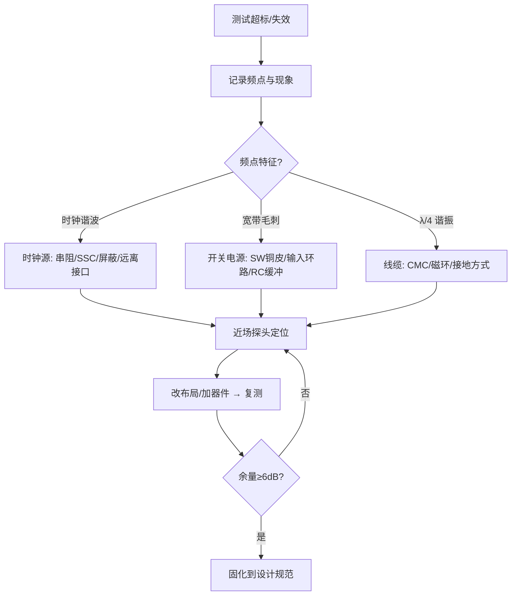
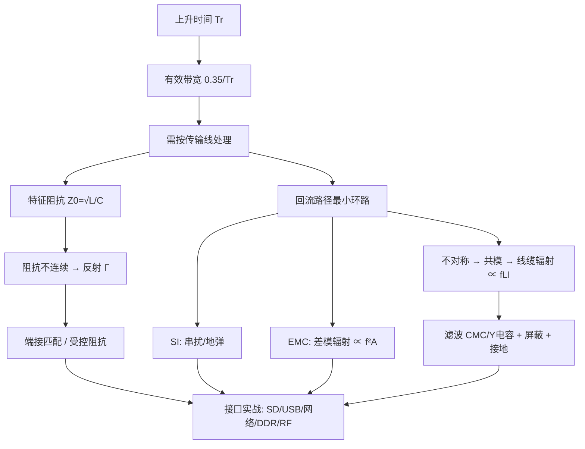

# PCB 电源模块

## 约束输入
- 画出电源树，列明输入范围、每路输出、电流、时序、纹波、效率、故障保护和测试点。
- 根据负载瞬态、允许压降、热和 EMI 目标确定稳压拓扑、器件和布局优先级。
- 把正常电流、峰值电流、浪涌和短路电流分开管理。

## 输入与保护
- 连接器、保险/限流、反接保护、TVS 和输入滤波按能量流向排列。
- TVS 和浪涌电流的泄放路径不得穿过控制器或敏感地；高能量回路短、宽、少过孔。
- 输入电容靠近开关器件或稳压器 VIN/GND，连接器到电容的路径按电流和温升校核。

## 开关电源布局
- 缩小输入热环路、开关管/续流器件环路和输出高频环路。
- `SW` 节点铜皮只做到满足电流与散热，避免扩大高 dv/dt 辐射面积，也避免从敏感走线下方经过。
- 电感靠近功率级，反馈分压和补偿网络靠近反馈脚，并从安静输出点取样。
- 功率地与信号地按芯片手册推荐汇合，避免反馈回流与大电流共用狭窄铜皮。

## LDO 布局
- 输入和输出电容分别紧贴 VIN/VOUT 与 GND，形成短回路。
- 按 `(VIN-VOUT)×IOUT` 估算损耗，通过铜皮和热过孔扩散热量。
- 使能、反馈、噪声旁路和输出放电网络远离高速与开关节点。

## 平面、过孔与去耦
- 电源平面颈缩、过孔阵列和连接器针脚均按电流、压降和温升计算。
- 高频去耦靠近负载脚，大容量电容承担中低频能量；两者位置和回路不可互换。
- 分割电源域时保持相关信号参考连续，不能让高速信号跨越电源/地缺口。

## 评审与测试
- [ ] 关键功率环路、反馈取样、SW 节点和散热路径已标注。
- [ ] 电容有效容量、ESR、耐压、纹波电流和温度降额已核对。
- [ ] 平面、过孔、连接器和保护器件满足电流及温升。
- [ ] 预留输入、输出、纹波、开关节点和温升测试条件。
- [ ] 启动、负载瞬态、短路、反灌、效率和 EMI 已列入验证计划。

## 常见布局失效
- 输入电容离 VIN 远会增大热环路，表现为开关节点尖峰、输入纹波和辐射升高。
- 反馈从大电流铜皮取样会把压降和开关噪声送入控制环路，表现为输出抖动或负载变化异常。
- 用细长走线连接大电流电感、二极管或连接器会造成压降、热点和电流分布不均。

## 磁性器件、环路与补偿
- 电感选型同时核对饱和电流、温升电流、直流电阻、核心损耗和屏蔽结构。峰值电感电流包含负载电流与纹波的一半，接近饱和时电感骤降会使开关器件和电容承受异常应力。
- 输入热环路通常由输入电容、开关管和地构成；输出高频环路由开关管、续流路径、电感/输出电容构成。根据具体拓扑识别真实电流回路，不能只按器件外观距离判断。
- 补偿与反馈元件靠近控制器反馈脚，反馈从安静输出点 Kelvin 取样。改动输出电容、ESR、电感或走线寄生后应重新确认环路稳定性，必要时测量环路响应或负载阶跃。

## 测量与故障定位
- 用短地弹簧或同轴方法测量输出纹波和 SW 节点，长地夹会把辐射耦合误判成纹波。记录带宽限制、探头衰减和测试位置。
- 输入尖峰优先检查输入电容位置和回路，输出抖动优先检查反馈取样、补偿、输出电容和负载阶跃；局部发热检查电感饱和、MOSFET/二极管损耗、过孔电流和铜皮颈缩。
- 启动失败或反复打嗝时同时观察 VIN、EN、SW、VOUT 与输入电流，区分欠压锁定、过流保护、短路、输入阻抗和热保护，不以单点直流电压判断。

+### 电源模块知识条目 1
传导发射（Conducted Emission, CE）测的是：**你的设备通过电源线往电网里"倒灌"了多少噪声**。频段通常 150kHz～30MHz（CISPR 32/14/11 等）。

测试怎么做？被测设备（EUT）的电源线接到 **LISN（线路阻抗稳定网络，又叫人工电源网络 AMN）**，LISN 的作用有三：

1. 给 EUT 提供干净的市电（滤掉电网自身噪声）；
2. 在 150kHz～30MHz 内提供**标准化的 50Ω 阻抗**，保证不同实验室结果可比；
3. 把 EUT 产生的噪声耦合到 EMI 接收机（通过 0.1μF + 1kΩ 的取样支路）。

🔬 **深入原理**

CE 噪声同样分共模与差模：

- **差模噪声（DM）**：在 L 与 N 之间流动，主要来自开关电源输入电容的高频纹波电流（$di/dt$ 在输入回路）。频段偏低（150kHz～数 MHz）。
- **共模噪声（CM）**：L 和 N 同向流出，经由 **Y 电容/寄生电容 → 大地（PE）** 回来。主因是开关管漏极（高 $dv/dt$ 节点）对散热片/机壳的寄生电容 $C_p$。频段偏高（几 MHz～30MHz）。

共模位移电流：

$$i_{CM}=C_p\cdot\frac{dv}{dt}$$

举例：MOSFET 漏极到散热片 $C_p=30\text{pF}$，$dv/dt=10\text{kV}/\mu s=10^{10}\text{V/s}$，则 $i_{CM}=0.3\text{A}$ 峰值脉冲——这就是超标的元凶。

LISN 上两路（L、N）分别测得 $V_L$、$V_N$，可分离：

$$V_{CM}=\frac{V_L+V_N}{2},\qquad V_{DM}=\frac{V_L-V_N}{2}$$

有专门的 **CM/DM 分离器**可以直接测，整改效率高很多。

限值举例（CISPR 32 Class B，AC 电源端口）：

| 频段 | QP | AVG |
|---|---|---|
| 0.15～0.5 MHz | 66→56 dBμV（随 log 频率线性下降） | 56→46 dBμV |
| 0.5～5 MHz | 56 dBμV | 46 dBμV |
| 5～30 MHz | 60 dBμV | 50 dBμV |

🛠 **设计实例/操作**

*例1：判断是 CM 还是 DM。* 一个实用土办法：在 EUT 与 LISN 之间的电源线上**套一个大磁环（绕几圈）**。如果超标点明显下降 → 共模为主；几乎不变 → 差模为主。这一步能省掉一半的盲目整改。

*例2：测试布置的坑。* 桌面设备置于 0.8m 高木桌，距参考接地板 0.4m（垂直）/0.8m（水平）；多余电源线**折成 30～40cm 的 8 字捆扎**，不能盘成大圈（会变天线）。布置不规范导致的复测在实验室极常见。

```
传导测试拓扑
  电网 ──[LISN L]──┬── L ──▶ EUT
        [LISN N]──┼── N ──▶ EUT
                  │  PE ──▶ EUT外壳
                  └──▶ 50Ω ──▶ EMI 接收机
  参考接地板（金属地板）与 LISN 外壳、EUT PE 良好搭接
```

⚠️ **常见误区**

1. 认为 CE 是"电源工程师的事"。数字板的时钟噪声一样会通过 DC-DC、地耦合到输入端。
2. 一超标就狂加 X/Y 电容。Y 电容受**漏电流安规限制**（一般 ≤3.5mA，对应 220V/50Hz 时 Y 电容总量约 ≤4.7nF），加过头无法过安规。
3. 忽略 PE 线。二类设备（无 PE）的共模回路只能靠寄生电容，整改思路完全不同。
4. 用普通示波器在电源线上量"噪声"就下结论。示波器噪底、带宽、检波方式与 EMI 接收机完全不同。

📌 **要点速记**

- CE 频段 150kHz～30MHz，用 LISN 提供 50Ω 标准阻抗并取样。
- 低频段多为差模（输入回路 $di/dt$），高频段多为共模（$C_p \cdot dv/dt$）。
- $i_{CM}=C_p\,dv/dt$，减小 $dv/dt$ 或 $C_p$ 是治本。
- 磁环试探法可快速判别 CM/DM。
- Y 电容受安规漏电流限制，不能无限加。


---
### 电源模块知识条目 2
辐射发射（RE）测的是设备向空间辐射的电磁场强度，频段 30MHz～1GHz（有高频时钟的要测到 6GHz）。3m 法或 10m 法半电波暗室，天线在 1～4m 高度扫描，EUT 转台 360° 旋转，水平/垂直双极化，取最大值。

**最关键的认知**：在 30MHz～1GHz 频段，PCB 本身尺寸（10cm 量级）对应 $\lambda/4$ 约在 750MHz 才谐振，所以**1GHz 以下的辐射，主要天线是线缆和机壳缝隙，而不是 PCB 走线本身**。PCB 的作用是"驱动源"——它把共模电压加到了线缆上。

$$\text{PCB 共模噪声} \xrightarrow{\text{驱动}} \text{线缆(天线)} \xrightarrow{} \text{辐射超标}$$

🔬 **深入原理**

**两种辐射模型**：

差模（环路天线）：
$$E_{DM}=1.32\times10^{-14}\frac{f^2 A I_{DM}}{r}\ \text{V/m}$$

共模（单极子天线）：
$$E_{CM}=1.26\times10^{-6}\frac{f L I_{CM}}{r}\ \text{V/m}$$

**谐振长度**：线缆长度 $L=\lambda/4$ 时辐射效率最高。

$$f_{res}=\frac{c}{4L}\Rightarrow L=1\text{m}\to 75\text{MHz};\ L=0.5\text{m}\to150\text{MHz}$$

看到 75MHz、150MHz、300MHz 附近的宽峰，先怀疑线缆。

**缝隙泄漏**：屏蔽罩缝隙长度 $\ell$ 的屏蔽效能

$$SE(\text{dB})\approx 20\log_{10}\frac{\lambda}{2\ell}$$

$\ell=\lambda/2$ 时 SE=0，完全不屏蔽。所以设计规则：**最长缝隙 < $\lambda_{min}/20$**。1GHz（λ=300mm）→ 缝隙 <15mm；缝合过孔间距同理。

**PCB 边缘辐射（Fringing）**：电源/地平面边缘的边缘场会辐射，解决办法是 **20H 规则**（电源平面比地平面内缩 20 倍介质厚度）与**板边缝合地过孔**（间距 ≤ $\lambda_{min}/20$，工程常取 100～200mil）。

🛠 **设计实例/操作**

*例1：定位超标源。* 用近场探头（H 场环 + E 场棒）在板上扫，配合频谱仪：
- 时钟晶振周围强 → 晶振布局/屏蔽/串阻；
- DC-DC 开关节点强 → 缩小 SW 铜皮、加输入环路电容、加 RC 缓冲；
- 连接器处强 → 共模问题，加 CMC/磁环；
- 用手捏/拔线缆后读数大变 → 确认线缆是天线。

*例2：整改优先级（成本从低到高）。*
1. 改布局布线（缩小环路、完整参考面、换层伴地孔）——免费
2. 时钟串阻 22～33Ω、展频 SSC（±1% 可降 6～10dB）——几分钱
3. 接口加共模磁环/CMC——几毛钱
4. 加屏蔽罩/导电泡棉/铜箔——几元
5. 改叠层/改板——重新打样

*例3：SSC 展频。* 把 100MHz 时钟以 30kHz 三角波调制 ±0.5%，能量被摊到更宽频带，QP 读数可降 6～12dB。注意：**USB/以太网/DDR 有各自对 SSC 的容忍规范，不能乱开**（如 USB3 支持 −0.5% 下展）。

⚠️ **常见误区**

1. 只盯着 PCB 走线，忘了线缆才是主天线。
2. 屏蔽罩接地只焊四个角。应沿边多点焊接，间距 < $\lambda/20$。
3. 开孔散热用大方孔。应改成**多个小圆孔阵列**（同样开孔率，屏蔽效能高很多）。
4. 用展频掩盖问题。SSC 降的是"测量读数"，实际峰值能量还在，对邻近敏感电路照样干扰。
5. 忽略 1GHz 以上。有 DDR4/USB3/HDMI 的产品必须测到 3～6GHz，此时 PCB 走线本身就能辐射。

📌 **要点速记**

- 1GHz 以下辐射的主天线是线缆与缝隙，PCB 提供共模驱动源。
- 共模辐射 $\propto f L I_{CM}$，差模辐射 $\propto f^2 A I_{DM}$。
- $\lambda/4$ 谐振：1m 线 → 75MHz，重点排查。
- 缝隙/缝合孔间距 < $\lambda_{min}/20$；散热孔用小圆孔阵列。
- 整改按"布局→串阻/展频→磁环→屏蔽"的成本顺序推进。


---
### 电源模块知识条目 3
静电放电（ESD）是人体或物体积累的电荷在接触瞬间释放。它的特点是：**电压极高（kV 级）、电流很大（几十 A）、但持续时间极短（ns 级）、总能量很小（mJ 级）**。

IEC 61000-4-2 人体模型（HBM）等效电路：**150pF 电容 + 330Ω 电阻**。

放电波形（8kV 接触放电）：
- 上升时间 **0.6～1 ns**（！比大多数数字信号还快）
- 首峰电流约 **30 A**
- 30ns 时约 16A，60ns 时约 8A

上升时间 1ns 意味着频谱延伸到 **1GHz 以上**——这就是 ESD 难防的根本原因：它不是"电压问题"，而是"高频问题"。任何几 nH 的引线电感在 30A/1ns 的 $di/dt$ 下都会产生巨大压降：

$$V=L\frac{di}{dt}=1\text{nH}\times\frac{30\text{A}}{1\text{ns}}=30\text{V}$$

**1nH 就是 30V！** 这句话是 ESD 防护布局的全部精髓。

🔬 **深入原理**

测试等级（接触放电/空气放电）：

| 等级 | 接触放电 | 空气放电 |
|---|---|---|
| 1 | ±2 kV | ±2 kV |
| 2 | ±4 kV | ±4 kV |
| 3 | ±6 kV | ±8 kV |
| 4 | ±8 kV | ±15 kV |

评判等级：A（正常）、B（可自恢复的性能降低）、C（需人工干预恢复）、D（永久损坏）。消费电子一般要求 A 或 B。

放电方式：直接接触放电（金属外壳、连接器外壳）、空气放电（缝隙、按键）、**间接放电（HCP 水平耦合板、VCP 垂直耦合板）**——间接放电是靠场耦合，很多产品栽在这里。

防护器件关键参数：

| 参数 | 含义 | 高速接口要求 |
|---|---|---|
| $C_j$ 结电容 | 对信号的容性负载 | USB2 <3pF；USB3/HDMI <0.5pF |
| $V_{RWM}$ | 工作电压 | > 信号电平 |
| $V_{clamp}$ | 钳位电压 | < 芯片耐压 |
| $R_{dyn}$ 动态电阻 | 决定大电流下钳位 | 越小越好 |

钳位电压实际值：$V_{clamp}=V_{BR}+I_{PP}\cdot R_{dyn}$，再加上 PCB 引线电感压降。

🛠 **设计实例/操作**

*例1：ESD 器件布局黄金法则。*

```
 ✓ 正确                              ✗ 错误
 连接器 ─┬─ 走线 ─── 芯片            连接器 ─── 走线 ─┬─ 芯片
         │                                            │
       [TVS]                                        [TVS]
         │ 极短极粗                                    │ 长走线
        GND 过孔×2（就近）                            GND
 TVS 紧靠连接器，泄放路径不经过芯片    ESD 电流已经流过芯片才被钳位
```

三条铁律：
1. **TVS 必须在连接器与芯片之间，且紧靠连接器**（<5mm）；
2. **接地引线极短极宽**，最好双过孔直下 GND 平面；
3. **ESD 泄放路径不能与敏感信号并行**，泄放走线下方要有完整地。

*例2：结构层面。* 缝隙处加导电泡棉/弹片；塑胶壳内侧喷导电漆并接机壳地；金属按键下方放泄放环（ring）并接机壳；螺丝柱做接地柱。

*例3：机壳地与信号地。* 常用做法是**通过 1000pF/2kV 电容 + 1MΩ 电阻并联**连接，或在多点用 0Ω 电阻预留（调试时可换）。高频给电容路径，直流靠电阻泄放，避免地环路。

⚠️ **常见误区**

1. 以为"电压高就要选大功率器件"。ESD 能量很小，关键是**速度与低阻抗路径**，不是功率。
2. TVS 放在芯片旁边。等于让 ESD 电流先穿过芯片。
3. 高速口用大电容 TVS。USB3 上放 3pF 器件，眼图直接崩，必须用 <0.5pF 的专用 ESD 阵列。
4. 只做接触放电试验就放心。空气放电和间接放电（HCP/VCP）经常更容易失败。
5. 用普通稳压二极管替代 TVS。响应速度慢几个数量级，来不及钳位。
6. 忽视软件恢复。B 级判据允许自恢复，看门狗 + 寄存器周期重载 + 通信重传，是低成本达标手段。

📌 **要点速记**

- ESD 上升沿 <1ns、峰值 30A，本质是高频问题；1nH 引线 = 30V。
- HBM 模型：150pF + 330Ω。
- TVS 紧靠连接器、接地路径最短最宽，是防护第一原则。
- 高速接口必须选低结电容（<0.5pF）ESD 器件。
- 机壳地与信号地用 1nF/2kV 电容 + 1MΩ 并联连接。


---
### 电源模块知识条目 4
电源既是"受害者"也是"加害者"：芯片开关时从电源抽取瞬态电流，如果电源网络（PDN）阻抗高，就会产生电压波动（纹波、地弹、SSN 同步开关噪声），这些波动既让芯片工作不稳，也通过平面/线缆辐射出去。

核心目标：**在关注频段内把 PDN 阻抗压到目标值以下**。

$$Z_{target}=\frac{V_{dd}\times \text{Ripple}\%}{I_{max\_transient}}$$

例：1.2V 内核、允许 3% 纹波、瞬态电流 5A：

$$Z_{target}=\frac{1.2\times0.03}{5}=7.2\ \text{m}\Omega$$

🔬 **深入原理**

**电容不是理想电容**。实际模型是 RLC 串联：

$$Z=R_{ESR}+j\left(\omega L_{ESL}-\frac{1}{\omega C}\right)$$

自谐振频率：

$$f_{SRF}=\frac{1}{2\pi\sqrt{L_{ESL}C}}$$

低于 SRF 呈容性（阻抗随频率下降），高于 SRF 呈**感性**（阻抗随频率上升，电容失效！）。在 SRF 处阻抗最低 = ESR。

典型 0402 MLCC 的 $L_{ESL}\approx0.5\text{nH}$（含焊盘、过孔可到 1～2nH）：

| 容值 | 理论 SRF（ESL=1nH） |
|---|---|
| 10 μF | 1.6 MHz |
| 1 μF | 5 MHz |
| 100 nF | 16 MHz |
| 10 nF | 50 MHz |
| 1 nF | 159 MHz |

**关键结论**：100MHz 以上，任何分立电容都已呈感性——高频只能靠**平面电容**和**片内电容**。

平面电容：

$$C_{plane}=\varepsilon_0\varepsilon_r\frac{A}{d}$$

面积 100cm²、介质 0.1mm、$\varepsilon_r=4.2$：$C\approx372\text{pF}$——值不大，但 ESL 极低（pH 级），高频表现优异。所以**电源/地平面紧邻（薄介质）是高频去耦的王道**。

**反谐振**：不同容值电容并联时，大电容的感性区与小电容的容性区之间会形成并联谐振峰，阻抗反而升高。所以**不要把容值拉得太开（相邻容值差 10 倍以内），并且多用同容值并联（并 10 个 100nF 比 1 个 1μF+1 个 10nF 更平坦）**。现代做法：**同一容值多颗并联 + 依靠平面电容补高频**。

**地弹（SSN）**：$N$ 个 IO 同时翻转：

$$V_{gnd\_bounce}=N\cdot L_{gnd}\frac{di}{dt}$$

🛠 **设计实例/操作**

*例1：去耦电容放置。* 优先级：**过孔距离 > 容值**。0.1μF 放在离芯片 5mm 处、走 3mm 细线，其引线电感 3nH 已经让它在 30MHz 以上完全失效。正确做法：
- 电容焊盘**紧贴芯片电源引脚**（<2mm）；
- 每个焊盘配**独立过孔**，过孔尽量短（薄板/背钻/盲孔）；
- 双过孔并联可把电感减半；
- 电容与过孔用**短而宽的铜皮**连接，不要用细线。

```
 ✓ 最佳             ✓ 良好            ✗ 差
  ▣●  ●▣            ▣ ● ● ▣          ▣──●   ●──▣
 （过孔在焊盘两侧    （过孔紧邻）       （细长引线, ESL大）
   互为反向, 互感抵消）
```

*例2：DC-DC 布局四要点。*
1. **输入回路面积最小**：$C_{in}$ 紧贴 VIN 与 GND 引脚——这是整个开关电源里 $di/dt$ 最大的环路，也是辐射主源。
2. **SW 节点铜皮尽量小**：它是 $dv/dt$ 最大的节点，铜皮大 = 电场天线。
3. **反馈线远离 SW 和电感**，从输出电容处取样，走内层并有地包围。
4. **散热铜皮与地平面多过孔连接**，兼顾散热与低阻。

*例3：磁珠使用。* 磁珠给模拟电源做隔离时要小心：磁珠（感性）+ 电容 = LC 谐振，可能在几百 kHz 放大噪声 10dB。必须**加阻尼**（并联小电阻，或选 ESR 较大的钽电容/加 1Ω 串阻）。

⚠️ **常见误区**

1. 认为"电容越大越好"。大容值 SRF 低，高频完全无效。
2. 盲目堆多种容值（10μF+1μF+100nF+10nF+1nF），制造多个反谐振峰。
3. 去耦电容离芯片远、共用过孔。等于没放。
4. 电源平面与地平面之间隔了很厚介质。应把 PWR/GND 相邻且介质尽量薄（<0.1mm）。
5. 在敏感模拟电源上滥用磁珠不加阻尼，引入谐振放大。

📌 **要点速记**

- $Z_{target}=V\cdot\text{Ripple}\%/I_{max}$，PDN 设计的第一步。
- 电容有 SRF，超过后变电感；100MHz 以上靠平面电容与片内电容。
- 去耦"位置比容值重要"，过孔电感是主要瓶颈。
- 避免反谐振：同容值多并联优于多容值混搭。
- DC-DC 布局：输入环路最小、SW 铜皮最小、反馈线最远。


---
### 电源模块知识条目 5
🔬 **深入原理：一张总表**

| 实验 | 频段/波形 | 主因 | 首选整改 | 备选 |
|---|---|---|---|---|
| CE 传导 | 150k～30MHz | 低频段差模、高频段共模 | X/Y 电容、CMC、减小 $dv/dt$ | 变压器屏蔽层、磁环、RC 缓冲 |
| RE 辐射 | 30M～1/6GHz | 线缆共模、缝隙泄漏、平面边缘 | 缩小环路、串阻、CMC/磁环 | 屏蔽罩、SSC、改叠层 |
| ESD | <1ns, 30A | 高频路径电感、接地不良 | TVS 靠连接器、地路径最短 | 结构泄放、导电泡棉、软件容错 |
| EFT | 5/50ns 突发 | 共模、地环路 | Y 电容、CMC、机壳多点搭接 | TVS、缩短复位/晶振路径 |
| Surge | 8/20μs, 数百A | 能量泄放不足 | GDT+MOV+TVS 三级 | 退耦电感/PTC、隔离变压器 |
| CS | 150k～80MHz | 电路不平衡、结检波 | 平衡设计、RC 低通、射频旁路 | CMC、屏蔽层 360° 接地 |
| RS | 80M～6GHz | 同 CS + 直接场耦合 | 屏蔽、滤波、缩小敏感环路 | 器件重选、软件滤波 |
| DIP | 电压跌落 | 储能不足 | 加大输入电容、掉电检测 | 宽输入范围电源 |

**通用排查流程：**



🛠 **设计实例/操作**

*例1：把 EMC 前移到设计阶段的 Checklist（板级）。*

1. 叠层：至少一个完整 GND 平面，高速层紧邻 GND，PWR/GND 相邻薄介质。
2. 分区：接口区 / 数字区 / 模拟区 / 电源区物理分开，接口区靠板边集中。
3. 回流：不跨分割，换层伴地孔，排针按 1:3 配地。
4. 时钟：最短、包地、串阻、远离板边与接口 ≥ 300mil。
5. 接口：TVS 靠连接器、CMC 在其后、走线不回穿数字区。
6. 电源：去耦贴引脚、DC-DC 输入环路最小、SW 铜皮最小。
7. 板边：缝合地过孔间距 ≤200mil，20H 规则。
8. 结构：屏蔽罩多点接地、缝隙 <λ/20、螺柱接地。

*例2：整改的"经济学"。* 同样 10dB 的改善：
- 改布线：0 元/台，但需要重新打样（一次性成本）
- 串阻 + 磁环：约 0.2 元/台 × 10 万台 = 2 万元
- 屏蔽罩：约 3 元/台 × 10 万台 = 30 万元

所以**设计阶段多花两天做 EMC 评审，可能省下几十万**。

⚠️ **常见误区**

1. "试错法"整改：随机加电容磁环，改好了也不知道为什么，量产一致性差。
2. 不做近场定位就动手。定位是整改效率的关键。
3. 只解决超标频点，不看整体余量趋势。
4. 整改方案不固化。同一个坑在下一个项目再踩一遍。
5. 忽视测试布置差异。同一台机器在不同实验室差 3～5dB 很正常。

📌 **要点速记**

- 每个实验都有典型主因与首选手段，先按表定位再动手。
- 排查顺序：记录频点 → 判断特征 → 近场定位 → 整改 → 复测。
- 板级 8 条 Checklist 能挡掉大部分问题。
- 整改成本随阶段推后指数上升，前移设计最划算。
- 留 6dB 余量，把有效方案固化为公司设计规范。


---
### 电源模块知识条目 6
以太网第二部分，聚焦**电源/时钟/EMC/调试**这些"配套但决定成败"的内容。

🔬 **深入原理**

**1）PHY 的电源与时钟**

PHY 通常有多组电源：AVDD（模拟，供 MDI 驱动器）、DVDD（数字核）、VDDIO（接口）。噪声敏感度：AVDD ≫ DVDD。

- AVDD 用 **LDO 单独供电**优于直接从 DC-DC 取；若必须用 DC-DC，则加 **π 型 LC 滤波（磁珠 + 10μF + 100nF）**，并注意磁珠谐振要加阻尼。
- 每个电源引脚就近 100nF，整体加 10μF。
- **参考电阻（RBIAS/RSET，如 12.4kΩ 1%）** 必须紧靠 PHY，走线短，下方地完整——它决定 MDI 输出电流幅度，走线长会导致幅度漂移、链路距离缩短。

**2）时钟（25MHz 晶振）**

- 晶振紧靠 PHY（<10mm），负载电容按 $C_L=\frac{C_1C_2}{C_1+C_2}+C_{stray}$ 计算，$C_{stray}$ 取 3～5pF；
- 晶振下方**铺地并打过孔**，禁止走任何信号；
- 25MHz 的谐波（75/125/175/225MHz）正好落在 RE 敏感频段，晶振是辐射主源之一；
- 若用外部时钟输入，串 22～33Ω。

**3）指示灯（LED）**

LED 走线从 PHY 一路走到面板，**长度往往是全板最长的线**，且直连外部——它是典型的"辐射天线 + ESD 入口"：
- 每根 LED 线串 **100Ω～1kΩ 电阻 + 对地 10～100pF 电容**（RC 滤波）；
- LED 线不得跨越隔离沟（若 LED 在 RJ45 内置，需按变压器隔离侧处理）；
- 走线远离 MDI 与晶振。

**4）PoE（若支持）**

- 中间抽头取电，需 GDT/TVS 做浪涌防护（PoE 端口浪涌等级更高）；
- 隔离电源（Flyback）的 Y 电容与变压器屏蔽层要处理好，否则 CE/RE 双超标。

**5）EMC 常见超标点与对策**

| 现象 | 可能原因 | 对策 |
|---|---|---|
| 100/125MHz 峰 | 晶振谐波、RGMII 时钟 | 串阻、包地、屏蔽、缩短走线 |
| 网线插上就超标 | 共模经网线辐射 | Bob Smith、变压器共模抑制、加 CMC |
| ESD 打网口死机 | 隔离不足、地跳变 | 增大爬电距离、TVS、软件复位恢复 |
| 浪涌击穿 PHY | 无防护或防护不足 | GDT + TVS，加大隔离间距 |

🛠 **设计实例/操作**

*例1：隔离沟设计。* 隔离沟宽度按安规爬电距离取，一般 **≥2mm（PoE 建议 ≥3.2mm）**，且**所有层都要挖空**（包括电源层、内层），不能只挖表层。变压器本体尽量骑在隔离沟上。

*例2：链路调试三板斧。*
1. **读 PHY 寄存器**：BMSR（链路状态、自协商）、PHY ID、错误计数器（CRC error、symbol error）。
2. **回环测试**：PHY 近端/远端回环，区分是 MAC-PHY 问题还是 MDI 问题。
3. **换短网线 / 换千兆为百兆**：若百兆稳定千兆不稳，90% 是 RGMII 延时或等长问题。

*例3：布局顺序。* RJ45 靠板边 → 变压器紧邻 → PHY 紧邻变压器 → 晶振紧邻 PHY → 电源滤波在 PHY 另一侧。整条链路成"一"字形，不要 U 形折返（折返会让输入输出靠近，造成耦合）。

⚠️ **常见误区**

1. RBIAS 电阻放远或走线细长，导致链路距离缩短、误码率高。
2. LED 线不加滤波，成为辐射天线。
3. 隔离沟只挖表层，内层电源/地依然连通。
4. AVDD 与数字电源共用且无滤波，MDI 眼图恶化。
5. 变压器选型忽略共模抑制比（CMRR）与隔离耐压等级。
6. 认为"通了就没问题"。必须看错误计数器与长距离（100m）实测。

📌 **要点速记**

- AVDD 单独 LDO 或 π 型滤波；RBIAS 精密电阻必须紧靠 PHY。
- 25MHz 晶振靠 PHY、下方铺地、禁止走线，是 RE 主源。
- LED 线必须 RC 滤波，否则变天线兼 ESD 入口。
- 隔离沟 ≥2mm 且全层挖空，PoE 需更宽。
- 调试三板斧：读寄存器、回环、降速对比。


---
### 电源模块知识条目 7
GNSS（GPS/北斗/GLONASS/Galileo）设计的核心矛盾只有一个：**卫星信号极其微弱**。

到达地面的 GPS L1 信号功率约 **−130 dBm**（有些资料给 −128～−133 dBm），而典型接收机灵敏度要求 −160 dBm（跟踪）。这个量级比热噪声底还低——GPS 靠扩频增益（CDMA 相关处理，约 43dB）才能解调出来。

对比一下：手机 4G 发射功率 +23 dBm。**同一块板上，干扰源比有用信号强 150dB 以上（10¹⁵ 倍）**。所以 GNSS 设计 = 噪声抑制的极限工程。

频段：
| 系统 | 频段 |
|---|---|
| GPS L1 | 1575.42 MHz |
| 北斗 B1I / B1C | 1561.098 / 1575.42 MHz |
| GLONASS L1 | 1598～1606 MHz |
| GPS L5 / 北斗 B2a | 1176.45 MHz |

🔬 **深入原理**

**级联噪声系数（Friis 公式）**决定了 LNA 的位置：

$$NF_{total}=NF_1+\frac{NF_2-1}{G_1}+\frac{NF_3-1}{G_1G_2}+\cdots$$

（线性量）关键结论：**第一级的噪声系数与增益决定全局**。所以：
- **LNA 必须放在最靠近天线的位置**，前面的损耗（走线、连接器、滤波器）会 1:1 地加到 NF 上；
- 从天线到 LNA 之间每 1dB 损耗 = 灵敏度直接损失 1dB。

灵敏度公式：

$$P_{min}=-174\ \text{dBm/Hz}+10\log_{10}(B)+NF+SNR_{min}$$

**为什么要用有源天线？** 有源天线把 LNA 集成在天线里，避免馈线损耗。代价是需要通过同轴馈线供电（Bias-Tee）：

```
 天线(含LNA) ──同轴── [隔直电容 100pF] ── GNSS 模块 RF_IN
                  │
              [电感 27~47nH（射频扼流）] ── 3.3V ── [100nF] ── GND
   电感在 1.575GHz 呈高阻，隔断射频；电容隔直流
```

**接收带内干扰**：任何落在 1559～1610MHz 的谐波都是致命的。常见凶手：
- **DC-DC 开关频率的高次谐波**（1MHz 开关 → 第 1575 次谐波理论存在，但更常见的是宽带噪声）；
- **DDR 时钟谐波**（800MHz × 2 = 1600MHz！正好落在 GLONASS 带内）；
- **USB3.0 的宽带噪声**（5Gbps 的谐波与展频噪声覆盖 1.5～2.5GHz，是著名的 GPS 杀手，Intel 有专门白皮书）；
- **摄像头 MIPI、LCD 时钟**。

🛠 **设计实例/操作**

*例1：RF 走线设计。*
- 用 **50Ω 共面波导接地（GCPW）** 或微带线；
- 走线**短、直、无过孔**（必须换层时，过孔周围环绕 ≥4 个 GND 过孔）；
- 走线两侧**缝合地过孔，间距 ≤ λ/20**。1.575GHz 在 FR-4 中 $\lambda_g\approx 95\text{mm}$，λ/20 ≈ 4.75mm，工程取 **2～3mm**；
- RF 走线下方**参考面绝对完整**，不允许任何走线穿过；
- 阻抗 50Ω，需与板厂确认叠层。

*例2：布局隔离。*
```
  ┌────────────────────────────────────┐
  │ [GNSS天线]                          │
  │    │ 短RF线                          │
  │ [Bias-T][SAW][GNSS模块]  ← 独立区域  │
  │ ─────── 屏蔽罩 + 缝合地孔 ───────    │
  │                                     │
  │  [DDR]   [USB3]   [DC-DC]  ← 干扰源 │
  │   保持 ≥20mm 距离，最好不同侧        │
  └────────────────────────────────────┘
```
- GNSS 模块加**金属屏蔽罩**，多点接地；
- 与 USB3/DDR/DC-DC 距离 **≥15～20mm**，且不在其上下层正对位置；
- 电源用 **LDO 单独供电**（DC-DC 的噪声很难滤干净），或 DC-DC + LDO 两级；
- 模块的 UART/I2C 信号线加 RC 滤波或磁珠，防止把噪声"带进"屏蔽区。

*例3：天线选型与摆放。*
- 陶瓷贴片天线需要**足够的地平面**（典型 ≥50×50mm），地小则增益和方向图变差；
- 天线上方 **不能有金属遮挡**，正上方需净空；
- 若用外置有源天线，注意馈线损耗（RG-174 在 1.5GHz 约 1dB/m）。

⚠️ **常见误区**

1. RF 走线上加过孔换层而不做地过孔包围，损耗与失配剧增。
2. 把 GNSS 模块放在 DC-DC 或 USB3 连接器旁边。
3. 用 DC-DC 直接给 GNSS 供电，噪底抬高十几 dB。
4. 陶瓷天线下方铺地不足或被挖空。
5. 忽略 USB3.0——插上 U 盘就搜不到星是典型症状，需在 USB3 连接器加屏蔽、缩短走线、必要时加接地隔离。
6. 认为"能定位就行"。要看 **C/N₀（载噪比）**，好的设计冷启动时可见星 C/N₀ 应 >40 dB-Hz，<35 就说明噪底偏高。

📌 **要点速记**

- GNSS 信号 ≈ −130dBm，噪声抑制是唯一主题。
- Friis 公式：第一级 NF 决定全局 → LNA/有源天线尽量靠前。
- RF 走线 50Ω、短直无过孔、两侧缝合地孔间距 2～3mm。
- 与 DDR/USB3/DC-DC 隔离 ≥15～20mm，独立 LDO 供电 + 屏蔽罩。
- 用 C/N₀ 评估设计好坏，>40 dB-Hz 为佳。

+### 电源模块进阶知识条目 1
1. **信号怎么走**（阻抗、反射、匹配）——传输线理论；
2. **电流怎么回**（回流路径、地设计、共模/差模）——回路思维；
3. **能量怎么跑掉/进来**（EMC 发射与抗扰）——耦合与屏蔽。

而这三件事本质上都指向同一句话：**高速设计的核心不是"画线"，而是"管理电磁场与电流回路"**。

🔬 **深入原理：知识地图**



**贯穿全课的 5 个数字**：

| 数字 | 含义 |
|---|---|
| **6 mil/ps** | FR-4 内层传播速度（微带约 7） |
| **0.35 / Tr** | 有效带宽（拐点频率） |
| **±3H** | 80% 回流集中范围 |
| **1 nH/mm** | 普通走线/引线电感估算 |
| **λ/20** | 缝隙、缝合孔、地线过孔的间距上限 |

🛠 **设计实例/操作：完整设计流程与自检清单**

**阶段一：原理图/选型**
- [ ] 确认各接口速率、上升时间、阻抗规范（USB 90Ω、以太网/LVDS 100Ω、单端 50Ω、DDR 40/50Ω）
- [ ] 时钟源选型（是否需要 SSC）、串阻位置预留
- [ ] ESD/TVS 选型（结电容匹配速率）、CMC、滤波元件预留
- [ ] 电源架构：噪声敏感模块（GNSS/RF/ADC/PHY-AVDD）用 LDO 或加滤波
- [ ] 预留 π 型匹配、测试点（低速）、调试接口

**阶段二：叠层与阻抗**
- [ ] 每个信号层紧邻完整参考平面
- [ ] PWR 与 GND 平面相邻，介质尽量薄
- [ ] 找板厂确认叠层与 Dk/Df，算准线宽线距
- [ ] 高速差分优先内层带状线（FEXT≈0）

**阶段三：布局**
- [ ] 分区：接口区/数字区/模拟区/电源区/RF 区
- [ ] 接口靠板边集中，走线不回穿数字区
- [ ] 高速链路"一"字排开，不折返
- [ ] 去耦电容贴引脚，DC-DC 输入环路最小
- [ ] 晶振靠芯片、下方铺地
- [ ] 天线净空区、变压器隔离沟先划出

**阶段四：布线**
- [ ] 不跨分割；换层伴地孔（<100～200mil）
- [ ] 3W/4W/5W 间距规则按等级执行
- [ ] 差分：等长、等距、对称，就近补偿
- [ ] DDR：按组等长（时延模式），VTT 在最远端
- [ ] RF：短直无过孔、两侧缝合地孔
- [ ] 时钟包地且地线两端+中间打孔

**阶段五：EMC 加固**
- [ ] 板边缝合地过孔 ≤200mil，20H 规则
- [ ] 排针/连接器按 1:3 配地
- [ ] 屏蔽罩多点接地，缝隙 <λ/20
- [ ] 机壳地与信号地 1nF/2kV + 1MΩ 连接
- [ ] 长线 I/O 预留磁环/CMC 位置

**阶段六：验证**
- [ ] SI 仿真（眼图、串扰、过冲）
- [ ] PDN 阻抗仿真（$Z<Z_{target}$）
- [ ] 功能 + 压力 + 高低温测试
- [ ] EMC 预测试（近场探头 + 简易暗室）
- [ ] 留 6dB 余量再送正式认证

⚠️ **常见误区（全课总结）**

1. **用频率而非上升时间判断高速**——第一原则性错误。
2. **只画线不想回流**——所有 SI/EMC 问题的共同根源。
3. **等长绝对化**——该松的地方过度绕线，反而增加串扰。
4. **EMC 后置**——测试超标才整改，成本高十倍。
5. **迷信单一手段**——屏蔽罩/磁环/展频都不是万能药。
6. **不留余量**——刚好合格 = 量产必炸。
7. **不做定位就整改**——盲目试错，改好了也复现不了。

📌 **要点速记**

- 高速设计三主线：信号路径、回流路径、耦合路径。
- 五个关键数字：6mil/ps、0.35/Tr、±3H、1nH/mm、λ/20。
- 流程六阶段：选型 → 叠层 → 布局 → 布线 → EMC 加固 → 验证。
- 80% 的结果在布局阶段就已决定。
- 一切规则的目的都是：**让电流走最小的环路**。


---
### 电源模块进阶知识条目 2
- **建立"传输线思维"**：判断是否高速看上升时间 $T_r$ 而非时钟频率，掌握 $L_{crit}\approx T_r v/6$ 与 $f_{knee}=0.35/T_r$。
- **吃透阻抗与反射**：$Z_0=\sqrt{L_0/C_0}$、$\Gamma=(Z_2-Z_1)/(Z_2+Z_1)$、弹跳图与振铃频率 $1/4T_d$，能定量估算过冲与定位问题线长。
- **掌握端接选型**：源端串阻（零功耗、点对点首选）、并联/戴维南、AC 端接、片内 ODT 的适用边界与参数计算。
- **确立"回流路径"世界观**：高频回流紧贴信号线（±3H 内 80%），不跨分割、换层伴地孔，这是 SI 与 EMC 的共同命门。
- **区分共模与差模**：理解共模辐射效率远高于差模，掌握不对称→模式转换的机理与 skew 控制要求。
- **建立完整 EMC 框架**：EMI（CE/RE）+ EMS（ESD/EFT/Surge/CS/RS/DIP）的标准、限值、测试布置与整改优先级。
- **熟练使用 dB 语言**：功率 10log / 场量 20log、dBμV=dBm+107、余量与整改目标（超标量 +6dB）的换算。
- **形成滤波与防护方法论**：阻抗失配原则、X/Y 电容与 CMC 分工、TVS 三级配合与能量退耦、ESD "1nH=30V" 的布局铁律。
- **掌握电源完整性基础**：$Z_{target}$ 计算、电容 SRF 与反谐振、去耦"位置优先于容值"、DC-DC 与 PDN 布局要点。
- **打通主流接口 Layout 实战**：SD 卡串阻与 ESD、USB 90Ω 与 AC 耦合、以太网 RGMII 延时与变压器隔离沟、DDR 分组等长与 VREF/VTT、GNSS 噪声隔离、无线天线净空与共存。
- **具备系统化排查能力**：从"记录频点 → 特征判断 → 近场定位 → 整改 → 复测 → 固化规范"的闭环流程。
- **形成可复用的自检清单**：从选型、叠层、布局、布线、EMC 加固到验证的六阶段 checklist，把经验沉淀为标准动作。
### 电源模块进阶知识条目 3
本项目的目标板是"逻辑派 FPGA-G1 开发板"——一块以 FPGA 为核心、外挂 DDR3 内存、带 HDMI 输出、带 MCU 协处理、带 TF 卡与各类排针外设、由多路 DC-DC/LDO 供电的开发板。这种板子有三个典型特征：**BGA 封装（引脚在芯片底下，出不来线）**、**DDR3 高速并行总线（几百 Mbps~1.6Gbps 每根线，要等长）**、**HDMI 高速差分（Gbps 级，要阻抗控制）**。这三条任意一条，都足以让双面板"做不出来"。

所谓"全链路"，指的是下面这条不可跳步的流水线：

```
原理图分析 → 电源树梳理 → 网表/器件导入 → 板框结构导入 → 环境与快捷键
   → 模块抓取/接口定位 → 模块化预布局 → 3D 结构校验
   → 层数分析与叠层设置 → 阻抗理解与计算 → 规则（线宽/间距/过孔/网络类/差分）
   → BGA 扇孔 → 分模块布线 → 电源连通性 → 布线优化 → 时序等长
   → 缝合地过孔 → DRC → 丝印/LOGO → 生产资料输出 → 下单
```
### 电源模块进阶知识条目 4
开工前建议先建立工程目录，把整个项目的"资产"归位：

| 目录 | 内容 | 作用 |
|---|---|---|
| `01_原理图` | SCH 源文件、PDF | 布局布线时随时查 |
| `02_数据手册` | FPGA/DDR3/HDMI/DCDC 的 Datasheet | 查 pinout、封装、布线要求 |
| `03_结构` | 板框 DXF、3D STEP | 导入板框、装配校验 |
| `04_PCB` | PCB 工程 + 版本备份 | 每完成一个阶段存一版 |
| `05_生产资料` | Gerber/钻孔/坐标/BOM | 最后打包下单 |

**例：先确认三条"硬约束"。** ①板框尺寸与安装孔位置（决定布局边界）；②接口器件位置（HDMI、TF、USB、电源座、排针必须落在指定边缘）；③BGA pitch（决定过孔工艺与最小线宽）。这三条一旦后期变更，布局布线基本要推倒重来。
### 电源模块进阶知识条目 5
这一讲教你**怎么"读"一张开发板原理图**。很多人打开原理图只会看"这里连那里"，正确做法是先做**功能分块**，再做**信号流梳理**，最后落到**物理约束**。

逻辑派 FPGA-G1 的原理图通常按页组织，典型分页如下：

| 页面 | 模块 | 关键关注点 |
|---|---|---|
| P1 | 封面/框图 | 系统总览、模块间接口 |
| P2 | FPGA 核心（BANK0~BANK7） | 每个 BANK 的电平标准与 VCCIO |
| P3 | 配置电路（FLASH/JTAG） | 配置模式引脚、上下拉 |
| P4 | DDR3 | 数据/地址/控制分组、VREF、端接 |
| P5 | HDMI | TMDS 差分对、ESD、DDC |
| P6 | MCU | 晶振、下载口、与 FPGA 的通信 |
| P7 | 外设（TF、LED、按键、排针） | IO 归属哪个 BANK |
| P8 | 电源 | DC-DC / LDO / 上电时序 |

读图的正确顺序是：**先看电源 → 再看时钟 → 再看总线 → 最后看杂散 IO**。因为电源决定布局重心，时钟决定关键路径，总线决定等长分组。
### 电源模块进阶知识条目 6
这一讲做一件极其重要但常被跳过的事：**画出这块板的电源树（Power Tree）**。电源树就是"电从哪来 → 经过谁 → 到谁去 → 要多大电流"的一张图。它同时决定了三件事：DC-DC 模块放哪、电源平面怎么分割、铜皮/过孔要多粗。

一块 FPGA 开发板的典型电源树（数值为示例量级，实际以原理图与器件手册为准）：

```
DC 5V 输入 (Type-C / DC 座)
   |
   +-- DCDC1 --> 1.0V / 1.2V  VCCINT   (FPGA 内核, 电流最大, 1~3A)
   |
   +-- DCDC2 --> 1.5V         VCCIO_DDR + DDR3 VDD/VDDQ (0.5~1.5A)
   |                  |
   |                  +-- 分压/专用芯片 --> 0.75V VREF (小电流, mA 级)
   |
   +-- DCDC3 --> 3.3V         VCCIO(3.3V BANK) / MCU / HDMI 5V逻辑周边 (1~2A)
   |                  |
   |                  +-- LDO --> 2.5V / 1.8V  VCCAUX 等 (低噪声小电流)
   |
   +-- 直通 --> HDMI +5V (给 HDMI 连接器 5V 供电, 需限流/ESD)
```
### 电源模块进阶知识条目 7
**为什么必须先画电源树？** 因为电源决定了 PCB 的"重量分布"：

1. **DC-DC 是噪声源**，其开关节点（SW）是 dv/dt 极高的地方，必须远离 HDMI、DDR3、晶振等敏感区；
2. **VCCINT 电流最大**，铜皮宽度与过孔数量要按电流算；
3. **上电时序**：FPGA 通常要求内核电压先于 IO 电压建立（或有特定顺序），这决定了要不要加使能链、要不要 RC 延时；
4. **去耦网络**决定 PDN（电源分配网络）阻抗，是高速板成败的一半。

铜皮载流可用 IPC-2152 的工程近似（外层 1oz，温升 10℃）：

$$I \approx 0.0647 \cdot \Delta T^{0.4281} \cdot A^{0.6732}$$

其中 $A$ 为截面积（mil²），$\Delta T$ 为温升（℃）。工程上更常用的速记是：**外层 1oz 铜，10mil 线宽 ≈ 1A（温升 10℃）；内层 0.5oz，同宽度按一半估**。

过孔载流速记：**0.3mm 孔径的过孔约 1A**，所以 3A 的 VCCINT 换层至少要 4~6 个过孔并联（并留裕量）。

去耦电容的作用可以用阻抗理解，电容的自谐振频率：

$$f_{SRF}=\frac{1}{2\pi\sqrt{L_{ESL}C}}$$

超过 $f_{SRF}$ 后电容呈感性、失去去耦作用，所以要用 **10µF（低频）+ 0.1µF（中频）+ 0.01µF/1nF（高频）** 的组合，且高频小电容必须**离引脚最近**。
### 电源模块进阶知识条目 8
**为什么接口先放？** 因为接口位置是唯一由外部世界（外壳、插头、面板）决定的，属于硬约束。主芯片位置是"软约束"，可以为接口让路。如果先放主芯片，往往会发现 HDMI 走不过去，只能重来。

**接口布局的三条准则：**

| 准则 | 说明 |
|---|---|
| 就近原则 | 接口的 ESD/滤波/端接器件紧贴接口，不能拉长走线 |
| 出线方向 | 接口引脚朝板内，走线不绕大弯 |
| 隔离原则 | 高速接口（HDMI）与电源输入、DC-DC 分区放，避免噪声耦合 |

**HDMI 接口的特殊要求**：TMDS 差分线从连接器出来后应**尽快、笔直**地进入 FPGA 侧，ESD 保护器件（如 TVS 阵列）必须紧贴连接器焊盘（走线 stub < 5mm），否则 ESD 电流会先进板内再被泄放，起不到保护作用；同时 TVS 的寄生电容会影响 Gbps 信号，必须选低容值（≤1pF 级）器件。
### 电源模块进阶知识条目 9
**例1：逻辑派 FPGA-G1 的接口分边规划（示例思路）**

```
        ┌──────────── 上边缘: 排针 IO / 扩展口 ────────────┐
        │                                                  │
 左边缘 │   [FPGA BGA]        [DDR3]                       │ 右边缘
 电源座 │        ↑              ↑                          │ HDMI
 +DCDC  │     核心区(板中)                                  │ TF卡
        │                                                  │ USB/串口
        └──────────── 下边缘: 按键/LED/复位 ────────────────┘
```

要点：
- **电源输入 + DC-DC 集中在一侧**（本例左侧），噪声源统一隔离；
- **TF 卡**要能插拔，卡槽开口必须超出板边或对齐外壳槽口；
- **按键/LED**放人手可及的边缘，且远离高速区。

**例2：模块抓取实操。** 在原理图 P4（DDR3 页）框选全部器件 → 使用"布局传递/交叉选择"功能 → PCB 中这些器件被高亮并可整体拖动到 DDR3 预定区域。然后把该组临时"锁定"，防止后续误拖。
### 电源模块进阶知识条目 10
**模块化布局的核心思想是"最小化关键路径长度"**。可以用一个简单的评价指标：把所有高速网络的飞线长度加起来（EDA 一般有"飞线总长"统计），预布局的目标就是让这个数尽量小，同时不违反其他约束。

**分区（Partition）与隔离**：一块板在物理上应划分为几个"域"：

| 域 | 内容 | 隔离要求 |
|---|---|---|
| 高速数字域 | FPGA、DDR3 | 参考面完整，内部走线最短 |
| 高速差分域 | HDMI TMDS | 远离 DC-DC 与晶振 |
| 低速数字域 | MCU、按键、LED | 无特殊要求 |
| 电源域 | DC-DC、电感、大电容 | 与前三者物理隔开 |
| 模拟/时钟域 | 晶振、PLL 供电 | 独立铺地，远离开关节点 |

**DDR3 与 FPGA 的距离**：点对点（一颗 DDR3）连接时，走线长度建议控制在 **2000~3000 mil（约 50~76mm）以内**。太长会让等长绕线难做、信号完整性变差。因此 DDR3 芯片应放在 FPGA 对应 BANK 的正对面，间距 15~25mm 是常见的舒适值（要给扇孔和等长绕线留空间）。
### 电源模块进阶知识条目 11
**例1：预布局的"泡泡图"画法。** 先在纸上（或 PCB 上用画线工具）画出各功能块的矩形，标注面积估算：

```
+----------------------------------------------------------+
|  电源区        |            FPGA 核心区        |  HDMI    |
|  (DC-DC x3)    |         [BGA 17x17mm]         |  区      |
|  电感/大电容    |                                |  TVS/连接器
|----------------|-------------------------------|----------|
|  MCU 区        |   DDR3 区 [x16, 一颗]          |  TF 卡区 |
|  晶振/下载口    |   + 去耦 + VREF               |          |
+----------------------------------------------------------+
|                    排针 / 扩展 IO 区                       |
+----------------------------------------------------------+
```

**例2：面积估算方法。** 每个模块的面积 ≈ 主芯片面积 × 2.5~3（要给去耦电容、扇孔过孔、走线通道留位置）。BGA 区域尤其要注意：BGA 下方基本被扇孔过孔占满，去耦电容只能放**背面**。
### 电源模块进阶知识条目 12
**BANK 朝向决定一切。** 假设 FPGA 的 BANK 分布如下（示意）：

```
            BANK 0 (顶边)
      ┌──────────────────────┐
BANK7 │                      │ BANK 1
(左)  │      FPGA  BGA       │  (右)
BANK6 │                      │ BANK 2
      └──────────────────────┘
            BANK 3/4 (底边)
```

如果 DDR3 分配在 BANK 1/2（右侧），HDMI 在 BANK 0（顶边），那么 DDR3 就该放在芯片右侧、HDMI 放在顶部。若结构上 HDMI 必须在右边，就把 FPGA **旋转 90°**，而不是让走线绕半圈。**旋转芯片是零成本的，绕线是有代价的。**

**FPGA 去耦网络的分层思想（PDN 三段式）：**

| 频段 | 电容 | 位置 |
|---|---|---|
| DC~100kHz | 稳压器本身 | DC-DC 输出 |
| 100kHz~1MHz | 100µF/47µF 钽电容/固态电容 | 电源入口附近 |
| 1MHz~50MHz | 10µF/4.7µF 0603/0805 MLCC | BGA 外围一圈 |
| 50MHz~500MHz | 100nF 0402 MLCC | **BGA 背面正对电源球** |
| >500MHz | 平面电容（L4-L5 间距薄） | 靠叠层保证 |

目标是让 PDN 阻抗在关注频段内低于目标阻抗：

$$Z_{target}=\frac{V_{dd}\times \text{ripple}\%}{I_{max}}$$

例：$V_{dd}=1.0\mathrm{V}$，允许纹波 5%，$I_{max}=2\mathrm{A}$，则 $Z_{target}=\dfrac{1.0\times0.05}{2}=25\ \mathrm{m}\Omega$。
### 电源模块进阶知识条目 13
**核心概念：热回路（Hot Loop）。** Buck 中电流路径分两个相位：

```
上管导通 (相位1):  Vin → Cin → 上管 → L → Cout → GND → Cin
下管导通 (相位2):  L → Cout → GND → 下管 → L

两相位电流之"差"= 高频交流环流, 只流经:
      Cin → 上管 → 下管 → GND → Cin      <== 这就是热回路
```

**只有热回路是高 di/dt 的**，它的面积决定了辐射和 SW 振铃。所以第一优先级永远是：**Cin 紧贴芯片 VIN 和 GND 引脚，环路面积最小（目标 <5mm²）。**

环路电感产生的尖峰电压：

$$V_{spike}=L_{loop}\cdot\frac{di}{dt}$$

若 $L_{loop}=5\ \mathrm{nH}$，$di/dt=2\ \mathrm{A/ns}$，则 $V_{spike}=10\ \mathrm{V}$——足以让 5V 输入的芯片看到 15V 尖峰而损坏。

**SW 节点：铜皮面积要"够用即可，越小越好"。** SW 是 dv/dt 最高的节点（几 V/ns），面积大就是天线。但又要能过电流，所以取折中：宽度按电流够用（如 2A 取 40~60mil 或一小块铜），长度尽量短，**不要为了散热把 SW 铺一大片**。

**反馈（FB）走线**：FB 是高阻抗节点，最怕干扰。规则：
- FB 走细线（6~10mil），从 **Cout 正极就近取样**（真正的负载点），不要从电感出口取；
- FB 走线远离 SW 和电感，必要时在下方铺地隔离；
- 分压电阻靠近芯片 FB 引脚。
### 电源模块进阶知识条目 14
**例1：Buck 标准布局（ASCII）**

```
        VIN 进来
          │
      ┌───┴───┐ Cin(0402/0603 x2, 紧贴!)
      │  ▓▓▓  │
   ┌──┴───────┴──┐
   │   DCDC IC   │── SW ──[ 电感 L ]──┬── VOUT
   │  VIN    SW  │   短且窄            │
   │  GND    FB  │◄──细线取样───────┤
   └──┬──────────┘                    │
      │                          ┌────┴────┐
     GND 大面积铺铜 + 多过孔      │  Cout   │
                                 └────┬────┘
                                     GND
```

顺序口诀：**Cin 最先摆 → 芯片 → 电感 → Cout → FB 分压 → 其他。**

**例2：热设计与隔离。**
- 芯片散热焊盘下方打 **4~9 个过孔（0.3mm）**，把热导到内层地平面；
- 三路 DC-DC 之间保持 5mm 以上间距，电感之间尽量**错开轴向**，减少磁耦合；
- 电源区与 HDMI/DDR3 区之间，用**一整片地铜 + 缝合过孔**隔开；
- 输入端加 π 型滤波（磁珠 + 电容）抑制传导 EMI。
### 电源模块进阶知识条目 15
**电源过孔的三个作用：**
1. **载流**：把电流从 L4 平面送到 L1/L6 的器件；
2. **降低 PDN 阻抗**：过孔电感串在供电路径上，越多越并联，电感越小；
3. **散热**：把 DC-DC 芯片的热导到内层铜。

**并联电感。** $N$ 个过孔并联，总电感约（忽略互感）：

$$L_{total}\approx\frac{L_{single}}{N}$$

单个 0.3mm 通孔电感约 **0.8~1.0 nH**（1.6mm 板厚）。要把电源换层电感降到 0.2nH，需要 **4~5 个过孔**。实际因为互感，效果会略差于理想并联，所以工程上"宁多勿少"。

**地过孔更重要。** 一个常被忽略的事实：**电源电流的回路是地**。给电源打了 6 个过孔，地只打 2 个，回路电感仍由地决定。原则：**地过孔数量 ≥ 电源过孔数量**。

**热过孔。** DC-DC 芯片散热焊盘下的过孔阵列：
- 孔径 0.3mm，间距 1.0~1.2mm；
- 数量 9~16 个；
- 连到 L2/L5 大面积地铜（内层铜是主要散热路径）；
- 若板厂支持，可做**树脂塞孔**避免焊料流失。
### 电源模块进阶知识条目 16
**例1：DC-DC 输出到负载的电源通路**

```
  L1(TOP):  [DCDC] ── SW ──[L]──┬── 铺铜块 VOUT
                                 │
                            ●●●●●●●●   <- 过孔阵列 (0.3mm x 6~8)
                                 ↓
  L4(PWR):        ┌──────────────────────┐
                  │   1V0 平面分区        │
                  └──────────┬───────────┘
                             ↓
                        ●●●●●●●●●●        <- 到 BGA 电源球区
  L1(TOP):            FPGA VCCINT 球
```

**例2：地平面的"缝合"。** L2 和 L5 是两个独立的地平面，必须用大量过孔连成"一个地"：
- DC-DC 区域：地铜下密集打孔（间距 2~3mm）；
- BGA 区域：每个 GND 球一个孔；
- 目的：让 L2 和 L5 电位一致，任何信号换层时回流都能"就近跳层"。

**例3：电源过孔数量速查表**

| 电流 | 最少过孔（0.3mm） | 推荐数量 |
|---|---|---|
| 0.5A | 1 | 2 |
| 1A | 1 | 2~3 |
| 2A | 2 | 4~6 |
| 3A | 3 | 6~8 |
| 5A | 5 | 10~12 |
### 电源模块进阶知识条目 17
🔬 深入原理
- 载流能力：外层 1oz 铜、1mm 线宽约可载 1A；内层因散热差需更宽。`电流→铜宽`经验：温升 10℃ 时 $W(mil)\approx I(A)\times 20$（粗略）。
- 压降：$V_{drop}=I\times R_{trace}$，$R=\rho L/(W\times T)$。长距离细电源走线会掉压，必须用铺铜（polygon）或加宽。
- 为什么重要：FPGA 核心 1.0V 瞬时电流大，若通道电阻大，核压跌落触发欠压保护。

🛠 设计实例/操作
1. 例：DCDC 输出 3.3V，先铺一块 3.3V 铜皮覆盖 FPGA/MCU 的 3.3V BANK，再用过孔"树状"分到各引脚；用 `Highlight` 验证每个 3.3V 引脚都被铜皮覆盖。
2. 例：1.0V 核心电源用 L3/L4 两层同时铺铜并打多过孔并联，降低平面电阻与电感。

⚠️ 常见误区
- 以为"一个过孔就够了"——单过孔载流有限（约 1A@10mil 孔），大电流需多个并联。
- 电源铺铜被信号过孔"打穿"成孤岛，实际没连通。

📌 要点速记
- 先画电源树：源→负载一目了然。
- 大电流用铺铜+多过孔，勿用细线。
- 核压（1.0V）走线最短最宽。
- 铺铜后务必高亮验证全连通。
- 电源过孔要足够多，降低 R/L。

## 2026-09 新增：PGND/SGND 单点汇接、电源分割与防反接

**来源**：`接地、分割与叠层——模数混合PCB设计五套视频整合详解总结 2026-09-09.md`（唐老师讲电赛开关电源专项 + 电源分割与多路供电章节）。

### 一、开关电源的地：PGND 与 SGND 为什么"先汇聚、再单点"

- **PGND**（功率地）承载开关管的脉冲大电流（`di/dt` 极高），**SGND**（小信号地）承载反馈、基准、控制小电流。二者共用地阻抗时，脉冲电流会在 `L(di/dt)` 上产生尖峰，直接污染反馈采样。
- 正确做法是"**先汇聚、再单点**"：先在功率级内部把 PGND 就地聚成一块（输入电容地、输出电容地、MOS 源极、检流电阻共用短而宽的铜），再**用单点**与 SGND 相连；而不是让 SGND 沿途与 PGND 多处搭接。
- 反馈分压/`FB` 采样必须走 **Kelvin 回到输出电容地**，并远离 SW 节点与电感；反馈走线穿过功率区等于把开关噪声直接注入环路。
- **输入/输出电容的接地用"过孔下地"**：电容焊盘旁直接打多个过孔到地平面，缩短高频回路，避免电流绕行。
- 接地环路要破除：`V = L(di/dt)`，凡是大 di/dt 回路的面积都要最小化。

### 二、开关电源的三类关键环路（布局优先级）

| 环路 | 内容 | 布局要求 |
|---|---|---|
| 输入高 di/dt 环路 | 输入电容 → 高侧开关 → 地 | 面积最小，电容紧靠 VIN/GND，回路要短而宽 |
| 开关节点（SW/LX） | 开关管 → 电感 | 铜面尽量小（是天线），不与反馈/敏感信号平行 |
| 输出环路 | 电感 → 输出电容 → 负载 | 输出电容靠近电感与负载，降低纹波与环路面积 |

### 三、数字电源与模拟电源的分割

- 原理：数字负载的大电流脉冲会在电源平面阻抗上产生噪声，经共用电源路径耦合到模拟轨道。分割的目标仍是**管理电流路径**，而非画出"两块电源铜"。
- 实践口径：优先**分区布局 + 各自就近去耦 + 单点/星形汇接**；确需在平面层分割时，保留尽可能大的面积（层电容），并确保**没有信号跨分割**。
- 模拟轨道优先由**独立 LDO 或单独滤波支路**供给；开关电源直接给 ADC 模拟轨供电时，必须实测其开关纹波与采样时钟的拍频。

### 四、多路电源防反接方案对照

| 方案 | 优点 | 代价 | 适用 |
|---|---|---|---|
| P-MOS 防反接 | 压降低、损耗小 | 需栅极驱动/分压，注意 `Vgs` 耐压与结温 | 中大电流主路，推荐 |
| 肖特基二极管 | 最简单、自带反向阻断 | 正向压降大（`P = Vf × I`），发热明显 | 小电流或辅助路 |
| 二极管"或" | 支持多路同时供电 | 每路都有压降，母线储能要够 | 双路冗余供电 |
| 理想二极管控制器 | 损耗最低 | 成本与复杂度最高 | 大电流高效率场合 |

- 核算要点：P-MOS 方案的发热 `P = I² × Rds(on)`，肖特基方案按实际 `Vf` 曲线算功耗，二者都不能只看器件标称电流。
- 多路共同供电还要检查**上电顺序、掉电反灌、负载未上电时的倒灌路径**。

### 五、电源树与布局联动

- 先画电源树（源 → 各级稳压 → 各负载），标出电压、电流、压差与开关频率；电源树的拓扑直接决定分区与叠层。
- 大电流路径用铺铜 + 多过孔（单孔约 1 A@10 mil，按需并联），勿用细线；核压走线最短最宽。
- 铺铜后高亮验证全连通，避免被信号过孔"打穿"成孤岛。

## 来源定位
- `原始备份/03_无痛入门！6层高速PCB设计...md`：电源模块布局、连通、平面和六层板实现。
- `原始备份/07_【EEVblog】电源设计...md`：拓扑、反馈、功率回路、损耗和测试。
- `原始备份/08_【Altium Academy】电源完整性...md`：去耦、PDN、回路和电源噪声。
- `原始备份/接地、分割与叠层——模数混合PCB设计五套视频整合详解总结 2026-09-09.md`：PGND/SGND 单点汇接、开关电源三类关键环路、数字/模拟电源分割、四类防反接方案与电源树联动（2026-09-10 接入）。
