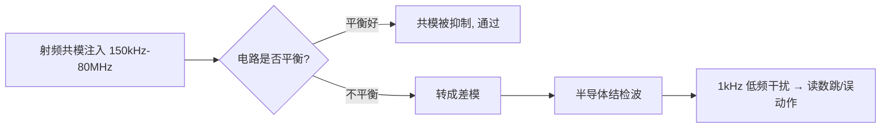

# PCB 连接器、保护与 EMC 模块

## 模块目标和应力建模
- 每个外部端口都要定义正常信号、电源故障、ESD、EFT、浪涌、共模电流和误接路径；端口不同，防护等级与失效判据也不同。
- ESD、EFT 和浪涌的能量、波形、重复次数及耦合方式不同，不能用单一“TVS 功率”指标替代完整设计。
- 目标应写成可验证条目：被保护器件不超过绝对最大额定值、通信不丢帧或可自动恢复、输入保护不产生危险温升，并明确所用测试等级和端口状态。

## 入口分区与电流路径
- 从连接器到板内通常按“连接器、泄放/TVS、共模或差模滤波、串联匹配或限流、收发器”组织，实际顺序以接口规范和器件推荐电路为准。
- 关键原则是受扰电流在进入主控、模拟采集和电源敏感区前被限制或引走。保护器件分散在板内会拉长泄放路径并扩大耦合面积。
- 连接器 pinout 优先为高速或敏感信号安排相邻回流针脚，避免高速信号与电源、大电流针脚交叉；屏蔽壳和机壳结构同步设计。

## TVS 与钳位器件选型
- TVS 的反向工作电压 VRWM 应覆盖端口正常最高电压与容差；击穿电压、动态钳位电压和残压必须落在受保护器件的电压与时间承受范围内。
- 比较峰值功率时使用同一脉冲波形。不同数据手册的瓦数若波形不同，不能直接等价；电源入口还需评估串联阻抗、重复浪涌、热积累和失效模式。
- 高速保护阵列重点核对寄生电容、漏电、通道间匹配和封装引脚拓扑。额外电容会降低带宽、破坏差分平衡并影响共模转换。
- 低压供电和 GPIO 保护还应考虑反接、热插拔、误接高压及外部电源倒灌；TVS 往往需与保险丝/PTC、MOSFET、限流电阻或压敏器件协同。

## 布局与回流细节
- TVS 紧贴连接器，受保护信号先经过 TVS 再进入板内；TVS 到泄放参考面的路径短、宽、直且少过孔，优先使用多个近距离地过孔。
- 将 TVS 放在连接器附近但让信号先绕到收发器，或让 TVS 地线绕过敏感区，都会使 ESD 电流仍穿过板内。
- 差分对通过保护阵列、共模扼流圈和 AC 耦合器件时保持同层、同参考、同长度和对称焊盘过渡；器件前后不要以铜皮或走线旁路高频能量。
- 过滤器输入和输出侧在空间和回流上分离，避免绕线、地铜缝隙或相邻层走线形成旁路耦合。磁珠和共模扼流圈必须基于阻抗曲线与问题频段选择。

## 屏蔽、机壳地和安装孔
- 屏蔽层、机壳地和数字地的连接策略由频率、安规、结构、ESD 路径和线缆屏蔽方式共同决定，不以单点或多点接地的口号代替分析。
- 高频泄放需要低电感连接。屏蔽壳附近的宽铜区、密集接地过孔和合适的机壳连接可提供短路径，远端单根细线或单颗螺丝通常不能。
- 安装孔周边的铜、过孔、禁布和绝缘距离须与机械图、螺钉垫圈和安规要求一致；避免装配后意外将功能地短接至机壳。

## 预兼容测试与整改
- 传导超限优先沿电源入口、线束和 DC/DC 输入输出定位共模/差模电流；结合 LISN、电流探头或近场探头确定频段，再选择阻尼、滤波或缩小回路。
- 辐射超限优先检查快速边沿、SW 节点、时钟谐波、长线缆和缝隙天线。降低源头边沿、减小回路、保持回流连续通常比末端堆叠磁珠有效。
- ESD 失效要区分永久损坏、复位、通信中断、ADC 漂移和软件锁死；记录接触点、极性、次数、恢复方式、板号和波形，才能定位到泄放、供电扰动或锁存路径。

## 接口专项检查
- USB、以太网、CAN/RS-485 等接口分别核对阻抗、共模容限、隔离要求、浪涌等级和屏蔽接法；同为差分线不代表能使用相同 TVS 或扼流圈。
- 外接供电口核对反接、热插拔、负载突降、线缆压降和浪涌；外接按键、GPIO、传感器线核对人为接触 ESD、误接和线束耦合。
- 预留可选 TVS、共模器件、串联电阻和滤波电容位，标明默认装配状态和调试原则，避免首板整改只能飞线。

## 评审与验证清单
- [ ] 每个端口均有“应力类型-泄放终点-限流/滤波器件-受保护对象”对照表。
- [ ] TVS 的 VRWM、钳位、波形功率、寄生电容、漏电、热和接口带宽均已核对。
- [ ] 实物与 Gerber 均证明连接器至 TVS、TVS 至地没有额外绕行。
- [ ] 高速端口装入保护与滤波器件后已完成眼图、误码率或等效链路测试。
- [ ] 机壳地、屏蔽层、数字地、安装孔和线缆方案已与结构和安规共同评审。

+### 连接器保护与EMC知识条目 1
直觉记忆：
- **容性突变** → 阻抗局部变低 → 先出现一个**向下的凹坑**，边沿被"拖慢"。
- **感性突变** → 阻抗局部变高 → 先出现一个**向上的凸起**（尖峰）。

🔬 **深入原理**

对于长度远小于上升沿空间长度的小突变，可以用集总元件近似。

一段长度 $\ell$、阻抗 $Z_1$ 的短线插在 $Z_0$ 系统中：

- 若 $Z_1<Z_0$，等效电容 $C=\dfrac{T_{d1}}{Z_1}$
- 若 $Z_1>Z_0$，等效电感 $L=T_{d1}\cdot Z_1$

其中 $T_{d1}$ 为该段的延时。

容性突变的反射峰值近似：

$$V_{refl}\approx -\frac{Z_0 C}{2T_r}V_{step}$$

感性突变：

$$V_{refl}\approx +\frac{L}{2Z_0T_r}V_{step}$$

物理含义：**同样的寄生，上升沿越快（$T_r$ 越小），反射越严重**。这解释了为什么老板子换个更快的芯片就出问题——板子没变，$T_r$ 变了。

容性负载还会拉低有效阻抗与拉慢速度。均匀分布 $N$ 个负载电容 $C_L$ 在长度 $\ell$ 上：

$$Z_{eff}=\frac{Z_0}{\sqrt{1+\frac{C_L^{total}}{C_{line}}}},\qquad v_{eff}=\frac{v}{\sqrt{1+\frac{C_L^{total}}{C_{line}}}}$$

这就是 DDR 早期 T 型拓扑、多 DIMM 总线阻抗被"压低"的根源。

🛠 **设计实例/操作**

*例1：过孔电容引起的凹坑。* 一个 0.3mm 钻孔、1.0mm 反焊盘的过孔约 0.3～0.5pF。$Z_0=50Ω$、$T_r=100\text{ps}$、$C=0.5\text{pF}$：
$$V_{refl}\approx-\frac{50\times0.5\times10^{-12}}{2\times100\times10^{-12}}=-0.125\ (\text{即}-12.5\%)$$
12.5% 的反射足以吃掉眼图裕量。对策：**增大反焊盘、减小焊盘直径、去除无用焊盘（non-functional pad）、背钻去 stub**。

*例2：细颈感性突变。* BGA 出线处线宽被迫从 5mil 缩到 3mil，长 40mil。这段等效 $Z_1\approx70Ω$、$T_{d1}\approx6.7\text{ps}$，$L=70\times6.7\text{ps}=0.47\text{nH}$。$T_r=50\text{ps}$ 时反射约 $+0.47\text{nH}/(2\times50\times50\text{ps})=+9.4\%$。对策：**颈缩长度尽量短（<100mil），或在颈缩处同步减薄介质补偿**。

```
波形指纹速查
 电容突变:  ─────╲   ╱─────    先掉坑（阻抗↓）
                  ╲_╱
 电感突变:  ─────╱╲──────      先冲高（阻抗↑）
                ╱  ╲
 开路末端:  ─────┌───────      台阶翻倍
 短路末端:  ─────┐  ┌──        先归零再回升
                 └──┘
```

⚠️ **常见误区**

1. 认为过孔"只要打通就行"。高速下过孔是三重寄生：桩线谐振、焊盘电容、桶电感。10Gbps 以上必须背钻或用盲埋孔。
2. 在高速线上"随手加个测试点/焊盘"。一个 40mil 测试盘就是几百 fF 的容性突变。
3. 认为串联电容（AC 耦合电容）不影响完整性。0402 焊盘比 0201 大，容性突变更明显；高速差分线优先 0201/0402 并做焊盘挖空（antipad）。
4. 忽略连接器。USB/网口连接器往往是全链路最大的不连续点，必须查其 S 参数。

📌 **要点速记**

- 容性突变 = 阻抗凹坑（下冲），感性突变 = 阻抗凸起（过冲）。
- 反射幅度正比于寄生量、反比于上升时间 $T_r$。
- 过孔电容典型 0.3～0.5pF，桩线谐振是高速大敌，10G+ 需背钻。
- 均布容性负载会同时降低 $Z_{eff}$ 和 $v_{eff}$。


---
### 连接器保护与EMC知识条目 2
初学者最容易忽略的一句话：**电流永远走回路，没有回路就没有电流**。你在 PCB 上画的那根信号线只是"去路"，还有一条看不见的"回路"，它走在参考平面上。

低频时，回流走**电阻最小**的路径——也就是在平面上大面积铺开、直奔电源地。但高频时，回流走**电感最小（阻抗最小）**的路径——它会紧紧贴着信号线的正下方回来，形成尽可能小的环路面积。

这个"高频回流紧贴信号线"的规律，是理解**串扰、EMI 辐射、地弹、参考面分割危害**的总钥匙。

🔬 **深入原理**

回流路径宽度近似满足：距信号线中心 $x$ 处的回流电流密度

$$i(x)=\frac{I_0}{\pi H}\cdot\frac{1}{1+(x/H)^2}$$

其中 $H$ 是信号线到参考面的高度。积分可知，**约 80% 回流集中在 $\pm 3H$ 范围内，97% 在 $\pm 20H$ 内**。$H=4\text{mil}$ 时，回流基本挤在信号线两侧 12mil 内——这就是"参考面只要在信号线正下方完整就行"的物理依据，也是**为什么跨分割如此致命**。

环路面积决定辐射。差模辐射远场公式（自由空间）：

$$E=1.32\times10^{-14}\cdot\frac{f^2\,A\,I}{r}\quad (\text{V/m})$$

其中 $f$ 单位 Hz，$A$ 为环路面积（m²），$I$ 为电流（A），$r$ 为距离（m）。**辐射正比于 $f^2$ 和环路面积 $A$**——把 $A$ 从 100mm² 降到 10mm²，辐射直接降 20dB。这是 EMC 设计里最便宜的 20dB。

换层带来的回流断点：信号从 L1（参考 L2-GND）换到 L4（参考 L3-GND），回流必须从 L2 跳到 L3。若附近没有 GND 过孔，回流被迫绕远路，环路面积暴增，等效串入电感：

$$L_{via}\approx 5.08h\left[\ln\frac{4h}{d}+1\right]\ \text{(nH, h/d 单位 inch)}$$

典型 1.6mm 板厚过孔约 1～1.5nH。

🛠 **设计实例/操作**

*例1：换层必伴地孔。* 高速信号每一个换层过孔，**在 100～200mil 内放 1～2 个 GND 过孔**（差分对可共用，放在对的两侧）。若两个参考面电压不同（GND↔PWR），则需在换层处放 0.01～0.1μF 去耦电容作为高频回流桥——但电容+过孔约 1～2nH，效果远不如 GND 过孔，能不跨就不跨。

*例2：绝不跨分割。* 下图左是灾难，右是正确做法：

```
 ✗ 错误：信号跨越平面缝隙            ✓ 正确：绕行或改参考面
  ┌──────────┬──────────┐            ┌──────────┬──────────┐
  │  GND     │  VCC     │            │  GND     │  VCC     │
  │   ───────┼──────▶   │            │  ──┐     │          │
  │          │          │            │    └───▶ │          │
  └──────────┴──────────┘            └──────────┴──────────┘
   回流被迫绕缝隙一圈                 回流始终在同一平面下方
   环路面积↑↑ → 辐射↑↑、串扰↑↑
```

*例3：接口区域。* USB/网口/HDMI 的走线下方参考面必须完整无缝，且不要有其它电源平面的"孤岛"横穿。

⚠️ **常见误区**

1. 以为"地就是地，到处都一样"。平面上不同点在高频下电位差可达几百 mV（地弹）。
2. 在平面上"挖槽"分割数字地/模拟地却让信号横穿槽——这是 90% EMC 超标案例的根因。
3. 认为电源平面不能当参考面。可以，只要电源平面完整且有足够去耦电容与地平面高频短接。
4. 只在信号过孔"附近某处"放地孔。要放在**紧邻（<100mil）**，距离越远等效电感越大。
5. 忽视连接器/排针区。排针一排全信号没有地针，回流无路可走，是辐射天线的经典成因——**每 2～4 根信号配 1 根地**。

📌 **要点速记**

- 高频回流紧贴信号线正下方，80% 集中在 ±3H 内。
- 辐射 $\propto f^2 \times$ 环路面积，最小化环路是最廉价的 EMC 手段。
- 换层必伴地孔（<100～200mil）；跨分割是大忌。
- 参考面变换（GND→PWR）需靠去耦电容做高频桥，效果不如同层 GND。
- 连接器/排针必须按比例配地针。


---
### 连接器保护与EMC知识条目 3
两根线上的电流，可以分解成两个"视角"：

- **差模（Differential Mode, DM）**：两根线电流大小相等、方向相反。这是我们**想要**的信号形式。去和回的磁场互相抵消，环路小，辐射低。
- **共模（Common Mode, CM）**：两根线电流大小相等、方向相同，回流通过大地/机壳/线缆寄生电容回来。这是我们**不想要**的，环路巨大，是辐射超标的头号元凶。

一句话记住：**差模是信号，共模是麻烦**。

🔬 **深入原理**

数学分解：设两根线电压 $V_1$、$V_2$

$$V_{DM}=V_1-V_2,\qquad V_{CM}=\frac{V_1+V_2}{2}$$

电流：$I_{DM}=\dfrac{I_1-I_2}{2}$，$I_{CM}=I_1+I_2$

**关键的量级对比**：共模辐射远比差模可怕。共模辐射（单极子/线缆天线模型）：

$$E_{CM}=1.26\times10^{-6}\cdot\frac{f\,L\,I_{CM}}{r}\quad(\text{V/m})$$

对比差模式 $E_{DM}\propto f^2 A I_{DM}$。做个数值对比：3m 处、100MHz、线缆长 1m：产生 $30\ \mu V/m$ 只需 **8nA** 共模电流；而要靠差模达到同样场强，在 10cm² 环路里需要约 **200μA**。**共模电流的"辐射效率"高出四个数量级**——所以 EMC 整改 80% 的功夫都在压共模。

共模是怎么产生的？三大来源：

1. **不对称/不平衡**：差分对两根线长度不等（skew）、耦合不均、一根跨了分割 → 差模转共模（mode conversion）。$S_{cd21}$ 就是衡量这个的 S 参数。
2. **地电位差**：板内地弹、地阻抗压降驱动线缆共模。
3. **公共阻抗耦合**：多个电路共用一段地走线。

差模→共模转换与 skew 的关系（近似）：

$$V_{CM}\approx \frac{\Delta T_{skew}}{T_r}\cdot\frac{V_{DM}}{2}$$

所以差分对内**skew 必须远小于上升时间**，工程上常要求 $<5\%\,T_r$（USB3 要求 <5ps，DDR 差分 <2mil 长度差）。

🛠 **设计实例/操作**

*例1：共模扼流圈（CMC）选型。* USB2.0 用 90Ω@100MHz CMC，以太网用 100～200Ω CMC。原理：对差模磁通抵消、呈现极低阻抗（不影响信号）；对共模磁通叠加、呈现高阻抗（阻断噪声）。注意 CMC 本身不对称也会引入模式转换，高速链路要选低 $S_{cd21}$ 的型号。

*例2：差分对布线三原则。*
- **等长**：对内 skew 严控，蛇形补偿要靠近失配处补。
- **等距**：全程保持恒定间距，避免间距忽宽忽窄造成阻抗起伏。
- **对称**：换层同时换、过孔对称、绕线尽量对内自补偿而非单边绕。

```
差模 vs 共模 电流方向
   差模（好）              共模（坏）
  ──▶──── 线1            ──▶──── 线1
  ◀────── 线2            ──▶──── 线2
   磁场抵消，环路小        回流经机壳/大地，环路巨大
   辐射低                  辐射高（线缆变天线）
```

⚠️ **常见误区**

1. 认为"用了差分就一定抗干扰"。差分抗扰的前提是**平衡**，一旦不对称就退化。
2. 差分对内为补长度画大蛇形而在一根上绕、离失配点很远——中间那段变成了单端，反而制造共模。
3. 把差分对当成"两根普通线，间距远点也无所谓"。间距变化会改变差分阻抗。
4. 在差分线上一根加电阻/测试点另一根不加，人为制造不对称。
5. CMC 放的位置不对。应**紧靠连接器**，在 ESD 器件之后、走线进板之前。

📌 **要点速记**

- 差模是信号，共模是辐射元凶；共模辐射效率高出差模数个数量级。
- 共模三大来源：不对称、地电位差、公共阻抗耦合。
- 对内 skew 应 $<5\%\,T_r$，就近补偿。
- CMC 对差模低阻、对共模高阻，紧靠连接器放置。
- 差分布线三原则：等长、等距、对称。


---
### 连接器保护与EMC知识条目 4
EMC（电磁兼容）= **EMI（发射，不害人）+ EMS（抗扰，不怕人）**。产品要过认证，两边都得达标。

标准体系速览：

```
EMC
├── EMI 电磁干扰（发射）
│   ├── CE  传导发射 (Conducted Emission)   150kHz~30MHz  测电源线
│   ├── RE  辐射发射 (Radiated Emission)    30MHz~1/6GHz  测空间场
│   ├── Harmonics 谐波电流   IEC 61000-3-2
│   └── Flicker 闪烁         IEC 61000-3-3
└── EMS 电磁抗扰（抗扰度）
    ├── ESD  静电放电       IEC 61000-4-2   ±4/8kV 接触/空气
    ├── RS   辐射抗扰       IEC 61000-4-3   3/10 V/m
    ├── EFT  电快速瞬变脉冲群 IEC 61000-4-4  ±1/2kV
    ├── Surge 浪涌          IEC 61000-4-5   ±1/2/4kV
    ├── CS   传导抗扰       IEC 61000-4-6   3/10 Vrms
    ├── PFMF 工频磁场       IEC 61000-4-8
    └── DIP  电压跌落中断    IEC 61000-4-11
```

常用产品标准：信息技术类 CISPR 32/35（原 CISPR 22/24）、家电 CISPR 14、工业 IEC 61000-6-2/-6-4、车载 CISPR 25 / ISO 11452。

🔬 **深入原理**

**干扰三要素模型**：干扰源 → 耦合路径 → 敏感设备。整改也只有三条路：

1. **抑制源**：降低 $dv/dt$、$di/dt$，展频（SSC），选边沿更缓的驱动，减小环路。
2. **切断耦合**：滤波、屏蔽、隔离、增大距离、改变布局。
3. **加固受体**：提高抗扰门限、加钳位、软件容错（看门狗、CRC 重传）。

**耦合四类**：传导耦合、公共阻抗耦合、容性（电场）耦合、感性（磁场）耦合、辐射耦合。近场（$r<\lambda/2\pi$）以电场或磁场单独为主，远场（$r>\lambda/2\pi$）以平面波为主，波阻抗趋于 377Ω。分界距离：

$$r_{boundary}=\frac{\lambda}{2\pi}=\frac{c}{2\pi f}$$

100MHz 时约 0.48m——所以 3m 法测试是远场，板级探头是近场。

**限值举例**（CISPR 32 Class B，3m 法辐射，准峰值 QP）：

| 频段 | 限值 |
|---|---|
| 30～230 MHz | 30 dBμV/m |
| 230～1000 MHz | 37 dBμV/m |

Class A（工业）比 Class B（家用）宽松约 10dB。设计时应留 **6dB 以上余量**。

🛠 **设计实例/操作**

*例1：估算你产品的关键频点。* 时钟 25MHz、上升沿 2ns，则拐点频率 $f_{knee}=0.35/2\text{ns}=175\text{MHz}$。意味着 25MHz 的谐波在 175MHz 之前衰减很慢（20dB/dec），之后加速（40dB/dec）。测试超标常出现在 3、5、7 次谐波（75/125/175MHz），整改优先看这些点。

*例2：三层防线设计法。* 芯片级（去耦、边沿控制）→ 板级（分区、地设计、回流）→ 系统级（屏蔽壳、滤波器、线缆处理）。**越早处理成本越低**：原理图阶段改一颗电容 = 0 元；量产后加屏蔽罩 = 每台几元 + 认证重测。

⚠️ **常见误区**

1. 认为"EMC 是最后测试的事"。80% 的 EMC 结果在布局布线阶段就已注定。
2. 把 EMI 和 EMS 混为一谈，甚至用相反的手段（比如为了过 ESD 加大电容，却恶化了信号完整性）。
3. 迷信"加屏蔽罩万能"。屏蔽罩如果接地不良、有大缝隙，反而成为谐振腔。缝隙长度接近 $\lambda/2$ 时几乎不屏蔽。
4. 只关注辐射不关注传导。CE 超标往往是开关电源共模问题，与 RE 同源。

📌 **要点速记**

- EMC = EMI（发射）+ EMS（抗扰），两者都要过。
- 整改三条路：抑源、断耦合、加固受体。
- 远近场分界 $\lambda/2\pi$；CISPR 32 Class B 30～230MHz 限值 30 dBμV/m。
- $f_{knee}=0.35/T_r$ 决定你的噪声频谱能延伸多高。
- EMC 成本随设计阶段推后呈指数上升。


---
### 连接器保护与EMC知识条目 5
传导超标的整改，本质是给噪声修一条"回家的近路"，同时在通往电网的路上设卡。核心工具是 **EMI 输入滤波器**。

一个典型 AC 输入 EMI 滤波器：

```
 L ──┬──[ X1 ]──┬──▮▮▮ CMC ▮▮▮──┬──[ X2 ]──┬──▶ 整流桥
     │          │   （共模扼流圈） │          │
    保险丝     压敏                          ├─[Y1]─┐
     │          │                            │      ├── PE
 N ──┴──────────┴──▮▮▮────────────┴─[Y2]─────┘
```

各元件分工：

| 元件 | 抑制对象 | 原理 |
|---|---|---|
| X 电容（L-N 之间） | 差模 | 给差模电流就近短路 |
| Y 电容（L/N 对 PE） | 共模 | 把共模电流引回 PE，缩小环路 |
| CMC 共模扼流圈 | 共模 | 对共模呈高阻（mH 级），对差模低阻 |
| 差模电感 / CMC 漏感 | 差模 | 串联高阻 |
| 磁珠 / 铁氧体 | 高频 | 等效为高频电阻，耗散能量 |

🔬 **深入原理**

滤波器是"阻抗失配"器件，插入损耗依赖源阻抗与负载阻抗：

$$IL(\text{dB})=20\log_{10}\left|\frac{V_{without}}{V_{with}}\right|$$

**阻抗失配原则**：噪声源阻抗低 → 用串联电感阻挡；噪声源阻抗高 → 用并联电容旁路。所以：
- 差模噪声源（输入电容回路）阻抗低 → 优先加差模电感/CMC 漏感。
- 共模噪声源阻抗高（寄生电容耦合） → Y 电容效果显著。

CMC 的共模阻抗：$Z_{CM}=j\omega L_{CM}$，典型 $L_{CM}$ 为 1～10mH，在 1MHz 时 $Z$ 达数 kΩ。但 CMC 有**自谐振频率 SRF**，超过 SRF 后寄生电容主导，阻抗反而下降——所以高频段常需再加一级小磁环或磁珠。

滤波器截止频率（LC 二阶）：

$$f_c=\frac{1}{2\pi\sqrt{LC}}$$

理论 −40dB/dec。设计时让 $f_c$ 比最低超标频点低 5～10 倍。

**衰减目标计算**：超标 12dB → 目标 18dB → 若单级 −40dB/dec，需要 $f_c$ 满足 $18=40\log(f/f_c)$，即 $f/f_c=10^{0.45}=2.8$，取 $f_c \le f_{超标}/3$。

🛠 **设计实例/操作**

*例1：0.5MHz 超标 10dB（差模为主）。* 输入端 X 电容从 0.22μF 增至 0.47μF，并串入 1mH 差模电感（或选漏感更大的 CMC）。$f_c=1/(2\pi\sqrt{1\text{mH}\times0.47\mu F})=7.3\text{kHz}$，在 0.5MHz 处理论衰减很大，实测可降 12～15dB。

*例2：15MHz 超标（共模为主）。* 15MHz 已超过多数 CMC 的 SRF，加大 CMC 电感值往往无效甚至更差。正确做法：
- 在输出线上套**镍锌材质小磁环**（高频阻抗好）；
- 减小开关节点铜皮面积，降低 $C_p$；
- 变压器加**屏蔽层（法拉第屏蔽）**并接原边地；
- MOSFET 栅极电阻适当加大，减缓 $dv/dt$（代价是效率）。

*例3：布局是滤波器的一半。* 滤波器输入端与输出端走线**绝不能平行靠近**，否则高频直接空间耦合"跨过"滤波器，实测衰减腰斩。滤波器区域下方**不要铺连续地平面连到数字地**，应独立并单点搭接机壳。

⚠️ **常见误区**

1. **只换元件不改布局**。滤波器失效 80% 是布局问题：输入输出耦合、Y 电容回流路径长、地环路大。
2. Y 电容走线绕远。Y 电容到 PE 的路径必须**极短、宽**，否则等效电感抵消其作用。
3. 一味加大 CMC 电感。超过 SRF 后无效；应改用多级、不同材质（锰锌低频/镍锌高频）组合。
4. 忽略安规。X 电容需 X1/X2 等级 + 泄放电阻（断电后 1s 内降到 37%）；Y 电容需 Y1/Y2 等级。
5. 用陶瓷电容当 X 电容。X 电容必须是安规认证的薄膜电容。

📌 **要点速记**

- X 电容治差模，Y 电容+CMC 治共模。
- 阻抗失配原则：低阻源用串感，高阻源用并容。
- CMC 有 SRF，高频段需换材质或加磁环。
- 滤波器输入/输出走线必须隔离，Y 电容回 PE 路径要极短。
- 安规限制 Y 电容容量与漏电流，不能无限堆料。


---
### 连接器保护与EMC知识条目 6
CS（Conducted Susceptibility，传导抗扰度，IEC 61000-4-6）模拟的场景是：**在 150kHz～80MHz 频段，外界电磁场在线缆上感应出共模电压，顺着线缆灌进设备**。

为什么是这个频段？因为 80MHz 以下，波长（>3.75m）远大于普通设备尺寸，机壳不能有效接收电磁波，但**线缆长度接近 $\lambda/4$，成了高效接收天线**。80MHz 以上则改用辐射抗扰（RS，IEC 61000-4-3）直接照射。

测试等级：Level 1 = 1V、Level 2 = 3V、Level 3 = 10V（rms，未调制载波），实测时用 **1kHz 正弦、80% AM 调幅**，扫频步进 1%，每点驻留 ≥0.5s。

🔬 **深入原理**

注入方式三种：

| 方式 | 器件 | 特点 |
|---|---|---|
| CDN（耦合去耦网络） | CDN-M2/M3、AF、T2 等 | 首选，阻抗标准 150Ω |
| EM-Clamp（电磁钳） | 钳夹线缆 | 无法用 CDN 时（如屏蔽线） |
| 直接注入（BCI/直接耦合） | 100Ω 电阻注入 | 同轴/单线场合 |

**150Ω 共模阻抗**是这个标准的核心参数——它代表人体/线缆对地的典型共模阻抗。CDN 保证注入点看到 150Ω。

设备内部为什么会误动作？共模电压 $V_{CM}$ 通过**不平衡**转成差模干扰：

$$V_{DM}=V_{CM}\cdot\frac{\Delta Z}{Z}$$

$\Delta Z/Z$ 就是电路的不平衡度。差分接收电路（RS-485、以太网）平衡好，抗扰强；单端信号（UART、GPIO、模拟采样）平衡差，容易被击穿。

此外 80MHz 以下的干扰还会被半导体结**检波（rectification）**——PN 结的非线性把射频包络解调出来，变成 1kHz 的低频干扰，直接叠加到运放/ADC 输入，表现为读数跳动。这就是为什么调制是 80% AM 1kHz：**它专门检验解调敏感度**。

🛠 **设计实例/操作**

*例1：模拟采样口被干扰。* 4-20mA 输入在 20MHz 附近读数跳 ±5%。整改：
- 输入端加 **RC 低通**（如 100Ω + 1nF，$f_c=1.6\text{MHz}$）；
- 运放输入引脚就近加 10～100pF 到地（射频旁路）；
- 差分走线，增加共模抑制；
- 线缆入口加 CMC 或磁环。

*例2：I/O 口复位。* 长线 GPIO 在 5MHz 处触发复位。整改：GPIO 加 TVS + 串 100Ω + 1nF 对地；软件加去抖与看门狗；PCB 上把该信号的地回流路径缩短。



⚠️ **常见误区**

1. 只在软件上打补丁（滤波算法）。射频检波产生的是真实模拟量，软件无法完全消除。
2. 在信号线上加大电容却忽略上升沿要求，导致通信速率不达标。要按 $f_c$ 与信号带宽折中。
3. 认为屏蔽线一定好。屏蔽层若**只单端接地或接地阻抗高**，反而成为共模注入通道。高频应 360° 环接。
4. 忘记电源端口也要做 CS。DC 电源输入端同样需要 CMC + Y 电容。
5. 把 CS 与 EFT/Surge 混淆。CS 是持续射频，EFT 是脉冲群，Surge 是大能量单脉冲，防护器件完全不同。

📌 **要点速记**

- CS = IEC 61000-4-6，150kHz～80MHz，共模注入，150Ω 标准阻抗。
- 用 1kHz/80% AM 调制，专门考核半导体结的检波敏感度。
- 不平衡度决定共模→差模转换，平衡设计是根本。
- 端口整改套路：CMC/磁环 + RC 低通 + 就近射频旁路电容 + TVS。
- 屏蔽层需 360° 低阻接地才有效。


---
### 连接器保护与EMC知识条目 7
核心对照表（记住波形与能量量级，选型就不会错）：

| 实验 | 标准 | 波形 | 重复率 | 能量 | 典型防护 |
|---|---|---|---|---|---|
| EFT 脉冲群 | 61000-4-4 | 5/50 ns | 5 或 100 kHz 突发 | 小（能量低、频谱宽到几百 MHz） | Y 电容、CMC、TVS、缩短地路径 |
| Surge 浪涌 | 61000-4-5 | 1.2/50 μs 电压，8/20 μs 电流 | 单次，正负各 5 次 | **大**（可达数百 A） | GDT + 压敏 + TVS 三级配合 |
| RS 辐射抗扰 | 61000-4-3 | 80MHz～1/6GHz，3～10 V/m | 扫频 | — | 屏蔽、滤波、平衡设计 |
| DIP 电压跌落 | 61000-4-11 | 0%/40%/70% 跌落 | — | — | 大容量输入电容、掉电检测 |
| PFMF 工频磁场 | 61000-4-8 | 50Hz，30～100 A/m | 持续 | — | 远离、屏蔽（高导磁材料）、减小环路 |

🔬 **深入原理**

**EFT 的本质**：5ns 上升沿意味着频谱延伸到 $0.35/5\text{ns}=70\text{MHz}$ 甚至更高，且是**共模**注入（通过容性耦合夹或耦合网络）。它能量不大，但频率高，专挑寄生电容与地环路的漏洞。**EFT 整改的关键是"给共模电流一条尽量短的返回路径"**——所以 Y 电容、机壳搭接、屏蔽层接地至关重要。

**Surge 的本质**：1.2/50μs 波形，开路电压 $U_{oc}$、短路电流 $I_{sc}$，源阻抗 2Ω（线对线）或 12Ω（线对地）。2kV/2Ω = 1000A 峰值。这么大的能量，**必须靠能量泄放器件而不是滤波**。

三级防护配合的关键是**能量配合**（用阻抗梯度）：

```
 线路 ──[GDT 气体放电管]──/\/\/── [MOV 压敏]──/\/\/── [TVS]── 内部电路
        （kA 级, 响应 μs）  退耦   （几百A, 响应 ns）  退耦   （几十A, 响应 ps）
                        电感/PTC/电阻          小电阻
```

没有中间退耦阻抗，后级 TVS 会先动作被烧毁。TVS 选型三要素：
- $V_{RWM}$（反向工作电压）> 电路最高工作电压；
- $V_{BR}$（击穿电压）留 10% 余量；
- $V_{C}$（钳位电压）< 被保护器件耐压；
- $P_{PP}$ 峰值功率满足波形要求（10/1000μs 与 8/20μs 的额定不同，别混用）。

**电压跌落**：设计要点是输入储能电容能撑过跌落时间：

$$C\ge\frac{2P\cdot t_{hold}}{V_{nom}^2-V_{min}^2}$$

🛠 **设计实例/操作**

*例1：以太网口浪涌 ±2kV 共模。* 变压器（隔离）+ Bob Smith 电路（4×75Ω 汇到 1000pF/2kV 电容到机壳）+ 中心抽头对机壳的高压电容。若是 PoE，还要加 GDT。切忌把 Bob Smith 的地直接连数字地。

*例2：EFT ±2kV 电源口导致 MCU 复位。* 排查顺序：
1. 复位引脚是否有 0.1μF 电容和上拉；
2. 晶振布线是否远离电源入口；
3. 输入端 Y 电容到机壳的路径是否够短；
4. 机壳与 PCB 地的搭接是否多点低阻；
5. 长线 I/O 是否加了共模磁环。

*例3：工频磁场。* 霍尔传感器/互感器附近别放变压器；敏感回路面积最小化；必要时用**坡莫合金/硅钢**做磁屏蔽（铝铜屏蔽对 50Hz 磁场几乎无效）。

⚠️ **常见误区**

1. 用 TVS 直接扛 Surge。单个小封装 TVS（SMAJ）在 2kV/2Ω 下会炸；必须前级泄放。
2. 把 8/20μs 与 10/1000μs 的额定功率混用，选型偏小。
3. 认为 ESD 器件能兼做浪涌。ESD 器件电容小但能量小；浪涌器件能量大但电容大，高速口要权衡。
4. EFT 整改只想着加电容，忽略机壳搭接与地设计。
5. 抗扰测试时把 EUT 悬空放置。测试布置（10cm 绝缘垫、参考接地板、线缆长度）严重影响结果。

📌 **要点速记**

- EFT 频谱宽、能量小 → 治共模路径；Surge 能量大 → 三级泄放 + 阻抗退耦。
- TVS 选型看 $V_{RWM}/V_{BR}/V_C/P_{PP}$，注意波形定义。
- 保护器件动作顺序靠退耦阻抗保证。
- 工频磁场只能用高导磁材料屏蔽，铝/铜无效。
- 抗扰失败先查"地"与"搭接"，再查器件。

+### 接口防护进阶知识条目 1
辐射发射（RE）测的是设备向空间辐射的电磁场强度，频段 30MHz～1GHz（有高频时钟的要测到 6GHz）。3m 法或 10m 法半电波暗室，天线在 1～4m 高度扫描，EUT 转台 360° 旋转，水平/垂直双极化，取最大值。

**最关键的认知**：在 30MHz～1GHz 频段，PCB 本身尺寸（10cm 量级）对应 $\lambda/4$ 约在 750MHz 才谐振，所以**1GHz 以下的辐射，主要天线是线缆和机壳缝隙，而不是 PCB 走线本身**。PCB 的作用是"驱动源"——它把共模电压加到了线缆上。

$$\text{PCB 共模噪声} \xrightarrow{\text{驱动}} \text{线缆(天线)} \xrightarrow{} \text{辐射超标}$$

🔬 **深入原理**

**两种辐射模型**：

差模（环路天线）：
$$E_{DM}=1.32\times10^{-14}\frac{f^2 A I_{DM}}{r}\ \text{V/m}$$

共模（单极子天线）：
$$E_{CM}=1.26\times10^{-6}\frac{f L I_{CM}}{r}\ \text{V/m}$$

**谐振长度**：线缆长度 $L=\lambda/4$ 时辐射效率最高。

$$f_{res}=\frac{c}{4L}\Rightarrow L=1\text{m}\to 75\text{MHz};\ L=0.5\text{m}\to150\text{MHz}$$

看到 75MHz、150MHz、300MHz 附近的宽峰，先怀疑线缆。

**缝隙泄漏**：屏蔽罩缝隙长度 $\ell$ 的屏蔽效能

$$SE(\text{dB})\approx 20\log_{10}\frac{\lambda}{2\ell}$$

$\ell=\lambda/2$ 时 SE=0，完全不屏蔽。所以设计规则：**最长缝隙 < $\lambda_{min}/20$**。1GHz（λ=300mm）→ 缝隙 <15mm；缝合过孔间距同理。

**PCB 边缘辐射（Fringing）**：电源/地平面边缘的边缘场会辐射，解决办法是 **20H 规则**（电源平面比地平面内缩 20 倍介质厚度）与**板边缝合地过孔**（间距 ≤ $\lambda_{min}/20$，工程常取 100～200mil）。

🛠 **设计实例/操作**

*例1：定位超标源。* 用近场探头（H 场环 + E 场棒）在板上扫，配合频谱仪：
- 时钟晶振周围强 → 晶振布局/屏蔽/串阻；
- DC-DC 开关节点强 → 缩小 SW 铜皮、加输入环路电容、加 RC 缓冲；
- 连接器处强 → 共模问题，加 CMC/磁环；
- 用手捏/拔线缆后读数大变 → 确认线缆是天线。

*例2：整改优先级（成本从低到高）。*
1. 改布局布线（缩小环路、完整参考面、换层伴地孔）——免费
2. 时钟串阻 22～33Ω、展频 SSC（±1% 可降 6～10dB）——几分钱
3. 接口加共模磁环/CMC——几毛钱
4. 加屏蔽罩/导电泡棉/铜箔——几元
5. 改叠层/改板——重新打样

*例3：SSC 展频。* 把 100MHz 时钟以 30kHz 三角波调制 ±0.5%，能量被摊到更宽频带，QP 读数可降 6～12dB。注意：**USB/以太网/DDR 有各自对 SSC 的容忍规范，不能乱开**（如 USB3 支持 −0.5% 下展）。

⚠️ **常见误区**

1. 只盯着 PCB 走线，忘了线缆才是主天线。
2. 屏蔽罩接地只焊四个角。应沿边多点焊接，间距 < $\lambda/20$。
3. 开孔散热用大方孔。应改成**多个小圆孔阵列**（同样开孔率，屏蔽效能高很多）。
4. 用展频掩盖问题。SSC 降的是"测量读数"，实际峰值能量还在，对邻近敏感电路照样干扰。
5. 忽略 1GHz 以上。有 DDR4/USB3/HDMI 的产品必须测到 3～6GHz，此时 PCB 走线本身就能辐射。

📌 **要点速记**

- 1GHz 以下辐射的主天线是线缆与缝隙，PCB 提供共模驱动源。
- 共模辐射 $\propto f L I_{CM}$，差模辐射 $\propto f^2 A I_{DM}$。
- $\lambda/4$ 谐振：1m 线 → 75MHz，重点排查。
- 缝隙/缝合孔间距 < $\lambda_{min}/20$；散热孔用小圆孔阵列。
- 整改按"布局→串阻/展频→磁环→屏蔽"的成本顺序推进。


---
### 接口防护进阶知识条目 2
静电放电（ESD）是人体或物体积累的电荷在接触瞬间释放。它的特点是：**电压极高（kV 级）、电流很大（几十 A）、但持续时间极短（ns 级）、总能量很小（mJ 级）**。

IEC 61000-4-2 人体模型（HBM）等效电路：**150pF 电容 + 330Ω 电阻**。

放电波形（8kV 接触放电）：
- 上升时间 **0.6～1 ns**（！比大多数数字信号还快）
- 首峰电流约 **30 A**
- 30ns 时约 16A，60ns 时约 8A

上升时间 1ns 意味着频谱延伸到 **1GHz 以上**——这就是 ESD 难防的根本原因：它不是"电压问题"，而是"高频问题"。任何几 nH 的引线电感在 30A/1ns 的 $di/dt$ 下都会产生巨大压降：

$$V=L\frac{di}{dt}=1\text{nH}\times\frac{30\text{A}}{1\text{ns}}=30\text{V}$$

**1nH 就是 30V！** 这句话是 ESD 防护布局的全部精髓。

🔬 **深入原理**

测试等级（接触放电/空气放电）：

| 等级 | 接触放电 | 空气放电 |
|---|---|---|
| 1 | ±2 kV | ±2 kV |
| 2 | ±4 kV | ±4 kV |
| 3 | ±6 kV | ±8 kV |
| 4 | ±8 kV | ±15 kV |

评判等级：A（正常）、B（可自恢复的性能降低）、C（需人工干预恢复）、D（永久损坏）。消费电子一般要求 A 或 B。

放电方式：直接接触放电（金属外壳、连接器外壳）、空气放电（缝隙、按键）、**间接放电（HCP 水平耦合板、VCP 垂直耦合板）**——间接放电是靠场耦合，很多产品栽在这里。

防护器件关键参数：

| 参数 | 含义 | 高速接口要求 |
|---|---|---|
| $C_j$ 结电容 | 对信号的容性负载 | USB2 <3pF；USB3/HDMI <0.5pF |
| $V_{RWM}$ | 工作电压 | > 信号电平 |
| $V_{clamp}$ | 钳位电压 | < 芯片耐压 |
| $R_{dyn}$ 动态电阻 | 决定大电流下钳位 | 越小越好 |

钳位电压实际值：$V_{clamp}=V_{BR}+I_{PP}\cdot R_{dyn}$，再加上 PCB 引线电感压降。

🛠 **设计实例/操作**

*例1：ESD 器件布局黄金法则。*

```
 ✓ 正确                              ✗ 错误
 连接器 ─┬─ 走线 ─── 芯片            连接器 ─── 走线 ─┬─ 芯片
         │                                            │
       [TVS]                                        [TVS]
         │ 极短极粗                                    │ 长走线
        GND 过孔×2（就近）                            GND
 TVS 紧靠连接器，泄放路径不经过芯片    ESD 电流已经流过芯片才被钳位
```

三条铁律：
1. **TVS 必须在连接器与芯片之间，且紧靠连接器**（<5mm）；
2. **接地引线极短极宽**，最好双过孔直下 GND 平面；
3. **ESD 泄放路径不能与敏感信号并行**，泄放走线下方要有完整地。

*例2：结构层面。* 缝隙处加导电泡棉/弹片；塑胶壳内侧喷导电漆并接机壳地；金属按键下方放泄放环（ring）并接机壳；螺丝柱做接地柱。

*例3：机壳地与信号地。* 常用做法是**通过 1000pF/2kV 电容 + 1MΩ 电阻并联**连接，或在多点用 0Ω 电阻预留（调试时可换）。高频给电容路径，直流靠电阻泄放，避免地环路。

⚠️ **常见误区**

1. 以为"电压高就要选大功率器件"。ESD 能量很小，关键是**速度与低阻抗路径**，不是功率。
2. TVS 放在芯片旁边。等于让 ESD 电流先穿过芯片。
3. 高速口用大电容 TVS。USB3 上放 3pF 器件，眼图直接崩，必须用 <0.5pF 的专用 ESD 阵列。
4. 只做接触放电试验就放心。空气放电和间接放电（HCP/VCP）经常更容易失败。
5. 用普通稳压二极管替代 TVS。响应速度慢几个数量级，来不及钳位。
6. 忽视软件恢复。B 级判据允许自恢复，看门狗 + 寄存器周期重载 + 通信重传，是低成本达标手段。

📌 **要点速记**

- ESD 上升沿 <1ns、峰值 30A，本质是高频问题；1nH 引线 = 30V。
- HBM 模型：150pF + 330Ω。
- TVS 紧靠连接器、接地路径最短最宽，是防护第一原则。
- 高速接口必须选低结电容（<0.5pF）ESD 器件。
- 机壳地与信号地用 1nF/2kV 电容 + 1MΩ 并联连接。


---
### 接口防护进阶知识条目 3
🔬 **深入原理：一张总表**

| 实验 | 频段/波形 | 主因 | 首选整改 | 备选 |
|---|---|---|---|---|
| CE 传导 | 150k～30MHz | 低频段差模、高频段共模 | X/Y 电容、CMC、减小 $dv/dt$ | 变压器屏蔽层、磁环、RC 缓冲 |
| RE 辐射 | 30M～1/6GHz | 线缆共模、缝隙泄漏、平面边缘 | 缩小环路、串阻、CMC/磁环 | 屏蔽罩、SSC、改叠层 |
| ESD | <1ns, 30A | 高频路径电感、接地不良 | TVS 靠连接器、地路径最短 | 结构泄放、导电泡棉、软件容错 |
| EFT | 5/50ns 突发 | 共模、地环路 | Y 电容、CMC、机壳多点搭接 | TVS、缩短复位/晶振路径 |
| Surge | 8/20μs, 数百A | 能量泄放不足 | GDT+MOV+TVS 三级 | 退耦电感/PTC、隔离变压器 |
| CS | 150k～80MHz | 电路不平衡、结检波 | 平衡设计、RC 低通、射频旁路 | CMC、屏蔽层 360° 接地 |
| RS | 80M～6GHz | 同 CS + 直接场耦合 | 屏蔽、滤波、缩小敏感环路 | 器件重选、软件滤波 |
| DIP | 电压跌落 | 储能不足 | 加大输入电容、掉电检测 | 宽输入范围电源 |

**通用排查流程：**

```mermaid
flowchart TD
  A[测试超标/失效] --> B[记录频点与现象]
  B --> C{频点特征?}
  C -- 时钟谐波 --> D[时钟源: 串阻/SSC/屏蔽/远离接口]
  C -- 宽带毛刺 --> E[开关电源: SW铜皮/输入环路/RC缓冲]
  C -- λ/4 谐振 --> F[线缆: CMC/磁环/接地方式]
  D & E & F --> G[近场探头定位]
  G --> H[改布局/加器件 → 复测]
  H --> I{余量≥6dB?}
  I -- 否 --> G
  I -- 是 --> J[固化到设计规范]
```



🛠 **设计实例/操作**

*例1：把 EMC 前移到设计阶段的 Checklist（板级）。*

1. 叠层：至少一个完整 GND 平面，高速层紧邻 GND，PWR/GND 相邻薄介质。
2. 分区：接口区 / 数字区 / 模拟区 / 电源区物理分开，接口区靠板边集中。
3. 回流：不跨分割，换层伴地孔，排针按 1:3 配地。
4. 时钟：最短、包地、串阻、远离板边与接口 ≥ 300mil。
5. 接口：TVS 靠连接器、CMC 在其后、走线不回穿数字区。
6. 电源：去耦贴引脚、DC-DC 输入环路最小、SW 铜皮最小。
7. 板边：缝合地过孔间距 ≤200mil，20H 规则。
8. 结构：屏蔽罩多点接地、缝隙 <λ/20、螺柱接地。

*例2：整改的"经济学"。* 同样 10dB 的改善：
- 改布线：0 元/台，但需要重新打样（一次性成本）
- 串阻 + 磁环：约 0.2 元/台 × 10 万台 = 2 万元
- 屏蔽罩：约 3 元/台 × 10 万台 = 30 万元

所以**设计阶段多花两天做 EMC 评审，可能省下几十万**。

⚠️ **常见误区**

1. "试错法"整改：随机加电容磁环，改好了也不知道为什么，量产一致性差。
2. 不做近场定位就动手。定位是整改效率的关键。
3. 只解决超标频点，不看整体余量趋势。
4. 整改方案不固化。同一个坑在下一个项目再踩一遍。
5. 忽视测试布置差异。同一台机器在不同实验室差 3～5dB 很正常。

📌 **要点速记**

- 每个实验都有典型主因与首选手段，先按表定位再动手。
- 排查顺序：记录频点 → 判断特征 → 近场定位 → 整改 → 复测。
- 板级 8 条 Checklist 能挡掉大部分问题。
- 整改成本随阶段推后指数上升，前移设计最划算。
- 留 6dB 余量，把有效方案固化为公司设计规范。


---
### 接口防护进阶知识条目 4
"地"不是电位为零的理想节点，而是**回流电流的公共通道**。所有 SI 与 EMC 问题追到底，都能追到地上。

三个必须建立的观念：
1. 地平面上任意两点都有阻抗，高频下电感占主导 → 存在电位差。
2. 电流走的是**回路阻抗最小**的路径，你无法"命令"电流去哪，只能设计路径。
3. "分割地"是为了控制回流路径，**不是为了让噪声消失**；分割用错比不分割更糟。

🔬 **深入原理**

**地阻抗**：一段铜皮的电感约

$$L\approx 0.2\ell\left[\ln\frac{2\ell}{w+t}+0.5+0.2235\frac{w+t}{\ell}\right]\ (\text{nH},\ \text{mm})$$

粗略记忆：**一段普通走线约 1nH/mm**，宽平面可低到 0.1nH/mm 以下。所以平面永远优于走线。

**单点接地 vs 多点接地**：

| 方式 | 适用频率 | 原理 | 场景 |
|---|---|---|---|
| 单点接地 | < 1 MHz | 消除地环路，避免公共阻抗耦合 | 低频模拟、音频、精密测量 |
| 多点接地 | > 10 MHz | 缩短回流路径，降低电感 | 数字、高速、RF |
| 混合接地 | 宽频 | 电容实现"直流单点、高频多点" | 混合信号板、机壳地 |

判据：接地线长度 $< \lambda/20$ 时可视为单点，否则必须多点。

**分割（Split）的正确用法**：只有当**跨区信号极少且能被严格控制**时才分割。典型是 ADC/DAC：
- 模拟地与数字地在**ADC 芯片正下方单点连接**（现在更主流的做法是**不分割，用布局分区代替分割**）；
- 若分割，则跨越缝隙的信号必须为零，或在跨越处提供桥接。

现代主流观点（Henry Ott / Howard Johnson）：**优先"不分割 + 布局分区"**。理由：完整平面提供最低阻抗与最短回流；分割带来的缝隙一旦被信号跨越，代价远大于收益。

🛠 **设计实例/操作**

*例1：混合信号板布局分区（不分割地）。*

```
  ┌─────────────────────────────────────┐
  │  数字区        │  ADC  │   模拟区    │
  │  MCU/DDR/时钟  │ 芯片  │  运放/基准  │
  │                │       │             │
  │   ← 数字回流 →  │       │ ← 模拟回流 →│
  └─────────────────────────────────────┘
         整块完整 GND 平面（不分割）
   要点：数字信号绝不走到模拟区上方；
         ADC 数字侧串阻 + 数字电源单独 LC 滤波
```

*例2：机壳地 / 保护地 / 信号地。* 三者关系用"电容+电阻+磁珠"选择性连接：
- 高频短接（1nF/2kV 电容）→ 给 ESD/EFT 共模电流回路；
- 直流隔离或高阻（1MΩ）→ 避免地环路电流与安全问题；
- 接口连接器金属壳建议直接接机壳地，而非信号地。

*例3：过孔缝合（Stitching）。*
- 板边：间距 ≤ $\lambda_{min}/20$，工程取 100～200mil；
- 高速信号换层：紧邻（<100mil）伴 1～2 个 GND 过孔；
- 大面积铜皮：均匀铺缝合孔，防止形成谐振腔（腔模谐振频率 $f_{mn}=\frac{c}{2\sqrt{\varepsilon_r}}\sqrt{(m/a)^2+(n/b)^2}$）。

⚠️ **常见误区**

1. **为了"隔离"随手挖槽**，然后让信号横穿。这是 EMC 头号杀手。
2. 用"星形地"处理高速数字。高频下星形地的长引线电感巨大，完全失效。
3. 认为"地平面越多越好"。层数增加成本，关键是**每个信号层都紧邻一个完整参考面**。
4. 大面积铜皮不打缝合孔，形成腔体谐振，某些频点辐射突增。
5. 把 ADC 的 AGND/DGND 引脚理解为"必须接到两个不同的地"。数据手册里它们通常是芯片内部已分开、外部应接同一块地。

📌 **要点速记**

- 地是回流通道，平面阻抗远低于走线（约 1nH/mm vs <0.1nH/mm）。
- 单点接地 <1MHz，多点接地 >10MHz，混合用电容实现。
- 现代主流：**布局分区优于平面分割**；一定要分割就绝不让信号跨越。
- 换层伴地孔、板边缝合孔间距 ≤λ/20。
- 机壳地与信号地用 1nF+1MΩ 并联做混合连接。


---
### 接口防护进阶知识条目 5
SD/TF 卡看起来简单，却是很多产品的"翻车重灾区"——插拔可靠性、ESD、时序、EMC 全都涉及。

接口模式与速率：

| 模式 | 时钟 | 位宽 | 带宽 | 电平 |
|---|---|---|---|---|
| Default Speed | 25 MHz | 4-bit | 12.5 MB/s | 3.3V |
| High Speed | 50 MHz | 4-bit | 25 MB/s | 3.3V |
| SDR50 / SDR104 | 100/208 MHz | 4-bit | 50/104 MB/s | **1.8V** |
| DDR50 | 50 MHz 双沿 | 4-bit | 50 MB/s | 3.3V/1.8V |

信号：CLK、CMD、DAT0～DAT3、VDD、VSS、CD（插入检测）、WP。SPI 模式下只用 CLK/CMD(MOSI)/DAT0(MISO)/DAT3(CS)。

🔬 **深入原理**

SD 是**源同步单端总线**，时序模型为：

$$t_{setup}=t_{CLK\_period}-t_{CLK\_delay}-t_{OD}-t_{DAT\_delay}$$

在 50MHz（20ns 周期）下，允许的 skew 很宽松（几 ns），所以**等长要求不严**（一般 CLK 与 DAT/CMD 长度差 <100～200mil 即可）。但到了 SDR104（208MHz，4.8ns 周期），等长要求收紧到 ±50mil 以内，且必须做阻抗控制（50Ω±10%）。

真正的难点其实在三处：
1. **CLK 的信号完整性**：CLK 边沿快、扇出到卡座（容性负载 ~10pF），容易过冲振铃。
2. **ESD**：卡槽是人手直接接触的开口，是 ESD 的首要入口。
3. **电源瞬态**：卡插入瞬间的浪涌电流会拉低 VDD。

🛠 **设计实例/操作**

*例1：标准的 SD 卡外围电路。*

```
 MCU ──[33Ω]──────────────── CLK ─┐
 MCU ──[33Ω]──┬── 10k↑VDD ── CMD ─┤
 MCU ──[33Ω]──┬── 10k↑VDD ── DAT0─┤  SD 卡座
 MCU ──[33Ω]──┬── 10k↑VDD ── DAT1─┤
 MCU ──[33Ω]──┬── 10k↑VDD ── DAT2─┤
 MCU ──[33Ω]──┬── 10k↑VDD ── DAT3─┘
              └── ESD 阵列（<5pF）就近卡座
 VDD ──[10μF ∥ 100nF ∥ 1nF]── 卡座 VDD（尽量靠近）
```

要点：
- **串阻 22～33Ω 靠 MCU 侧**（驱动端），抑制过冲；
- **上拉 10～100kΩ 在 CMD/DAT0～3**（DAT3 上拉在 SPI 模式下作 CS，需注意卡内部上拉冲突）；
- **ESD 阵列紧靠卡座**，选低电容型（SDR104 需 <3pF）；
- **VDD 去耦 10μF + 100nF 紧贴卡座**，应对插入浪涌；
- CD 引脚加去抖（RC + 软件双重）。

*例2：布线要点。*
- CLK 优先短、直、**两侧包地并打地孔**；
- CLK 与 DAT/CMD 间距 ≥ 3W（3 倍线宽），减小串扰；
- 卡座下方地平面**完整无缝**，不要走其它信号；
- 卡座金属外壳接**机壳地**（若有）或通过 1nF+1MΩ 接信号地；
- 高速模式（SDR104）需 50Ω 单端阻抗控制，CLK 与数据等长 ±50mil。

*例3：热插拔与可靠性。* 卡座固定脚要焊接牢固（机械应力）；VDD 供电路径线宽足够（>0.5mm，峰值电流可达 200mA+）；若支持热插拔，考虑加 load switch 做上电时序控制。

⚠️ **常见误区**

1. 串阻加在卡座侧。应加在 MCU（驱动）侧。
2. ESD 器件放在 MCU 附近。必须在卡座旁。
3. 用普通 TVS（几十 pF）保护 SDR104，眼图直接崩。
4. 忘记上拉电阻，导致 CMD/DAT 悬空，初始化失败或误识别。
5. CLK 走线绕大弯或跨分割，造成读写偶发错误（这类错误极难定位，常被误判为"卡不兼容"）。
6. 认为 SD 卡不用管阻抗。25/50MHz 可以宽松，但边沿仍是 1～2ns，走线超过 2～3cm 就该串阻。

📌 **要点速记**

- SD 是源同步单端总线；50MHz 以下等长宽松，SDR104 需严格控阻抗与等长。
- 串阻 22～33Ω 放驱动端；CMD/DAT 上拉 10～100k。
- ESD 阵列必须紧靠卡座，高速模式选 <3pF。
- 卡座 VDD 就近去耦 10μF+100nF 应对插入浪涌。
- CLK 包地、远离数据线 ≥3W、下方参考面完整。


---
### 接口防护进阶知识条目 6
USB 是最常见的差分高速接口，也是差分设计的最佳教材。

版本与要求：

| 版本 | 速率 | 差分阻抗 | 编码 | 关键要求 |
|---|---|---|---|---|
| USB1.1 LS/FS | 1.5/12 Mbps | 90Ω | NRZI | 宽松 |
| USB2.0 HS | 480 Mbps | **90Ω ±15%** | NRZI+位填充 | 对内 skew <150ps，长度差 <50mil |
| USB3.0/3.1 Gen1 | 5 Gbps | **90Ω ±10%** | 8b/10b | 需 AC 耦合、背钻、损耗预算 |
| USB3.1 Gen2 | 10 Gbps | 90Ω ±10% | 128b/132b | 需完整 S 参数/眼图仿真 |

🔬 **深入原理**

**为什么是 90Ω？** USB 规范定义的差分阻抗，来自电缆特性与收发器设计的折中。注意：$Z_{diff}=90Ω$ 对应单端约 45～50Ω（耦合越紧，单端越接近 45Ω）。

**眼图与抖动预算**。USB2.0 HS 一个 UI（单位间隔）= 1/480MHz = 2.083ns。总抖动预算：

$$TJ = DJ + n\cdot RJ_{rms}$$

其中 $n$ 在 BER=10⁻¹² 时取 14.069。板级设计要把 **ISI（码间干扰）** 和串扰控制住，给收发器留裕量。

**损耗预算（USB3.0）**：5Gbps 的 Nyquist 频率 2.5GHz。FR-4 在 2.5GHz 的损耗约 **0.4～0.6 dB/inch**（含导体损耗与介质损耗）。规范允许通道总损耗约 −7～−8dB，扣除连接器和线缆，**PCB 走线通常限制在 6～8 inch 以内**，超过要用低损耗板材（如 Megtron6、S1000-2M）或加 Redriver。

损耗模型：

$$\alpha_{total}=\alpha_{conductor}(\propto\sqrt{f})+\alpha_{dielectric}(\propto f\cdot D_f)$$

高频段介质损耗主导，所以 $D_f$（损耗角正切）是选板材的关键指标。

🛠 **设计实例/操作**

*例1：USB2.0 布线清单。*
1. 差分阻抗 90Ω，走内层带状线更佳（若走表层需注意阻焊影响）。
2. 对内长度差 **<50mil（约 8ps）**，就近补偿。
3. 对间距全程恒定；与其它信号间距 ≥ **4W**（时钟/开关电源 ≥ 5W 或隔地）。
4. 换层过孔**成对对称**，紧邻放 GND 过孔。
5. **不跨分割**，下方参考面完整。
6. ESD 器件紧靠连接器，电容 <3pF（HS 建议 <1.5pF）；CMC 放 ESD 之后。
7. 连接器外壳接机壳地，通过 1nF/2kV + 1MΩ 接信号地。
8. VBUS 加 500mA～1A 自恢复保险丝 + 大电容 + TVS。

*例2：USB3.0 额外要求。*
- TX 对必须串 **0.1μF AC 耦合电容（0201/0402）**，放在发送端一侧，两颗对称摆放；
- 电容焊盘下方做 **antipad 挖空**，减小容性突变；
- 过孔 **stub 必须处理**（背钻或用薄板/盲埋孔）；
- 走线尽量少换层，一次换层不超过 2 个过孔；
- SSTX/SSRX 与 D+/D− 保持 ≥30mil 距离；
- 屏蔽壳多点接地，Type-C 的 CC/SBU 线远离高速对。

```
 USB Type-C 高速部分布局示意
  连接器 ─┬─ TX1± ── [0.1μF×2] ── 过孔对 ── 内层 ── SoC
          ├─ RX1± ─────────────── 过孔对 ── 内层 ── SoC
          ├─ D±  ── [ESD<1.5pF] ── [CMC 90Ω] ── SoC
          └─ CC1/CC2 ── PD 芯片（远离高速对）
   ESD/CMC 紧靠连接器；地过孔环绕；壳体接机壳地
```

⚠️ **常见误区**

1. 用 100Ω 差分规则去做 USB（应是 90Ω）。多数 EDA 默认 100Ω，务必改。
2. 对内绕线在离失配点很远处补偿，中间形成共模。
3. AC 耦合电容用 0603 且焊盘不挖空，造成明显阻抗凹坑。
4. ESD 器件选电容大的通用型，HS 眼图不合格。
5. CMC 放在 ESD 之前，ESD 电流会先冲击 CMC。
6. USB3 走线穿越连接器区/电源区，或从板边贴边走（板边辐射）。
7. 忘记 VBUS 的浪涌与反灌保护（尤其是 OTG/双角色口）。

📌 **要点速记**

- USB 差分阻抗 **90Ω**，不是 100Ω。
- USB2.0 HS 对内长度差 <50mil；USB3 需背钻/低损耗板材，PCB 走线一般 <6～8 inch。
- ESD（<1.5～3pF）靠连接器，CMC 在其后。
- USB3 TX 侧 0.1μF AC 耦合，焊盘 antipad 挖空。
- 全程恒定间距、不跨分割、换层成对伴地孔。

## 来源定位
- `原始备份/01_提高篇全集-高速信号的设计.md`：接口、共模/差模、ESD、传导、辐射和地设计。
- `原始备份/【Altium Academy】信号完整性 _ 2025 _ 吃透 SI 设计，搞定高速电路板｜全集总结 2026-08-06.md`：高速接口回流、保护、滤波和 EMC 联合约束。
