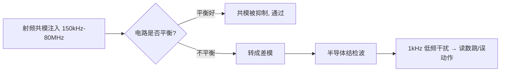
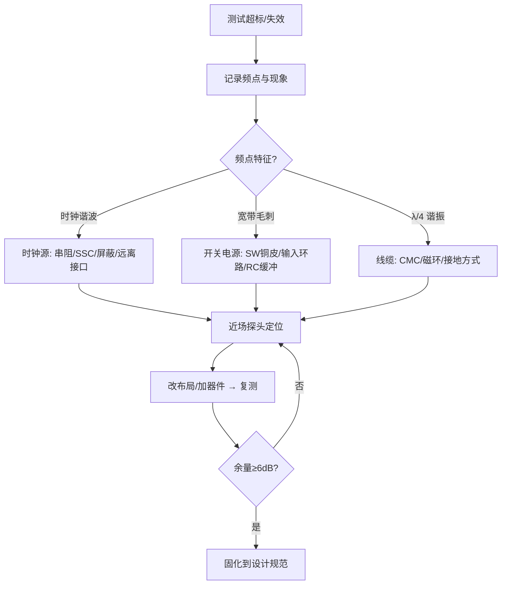
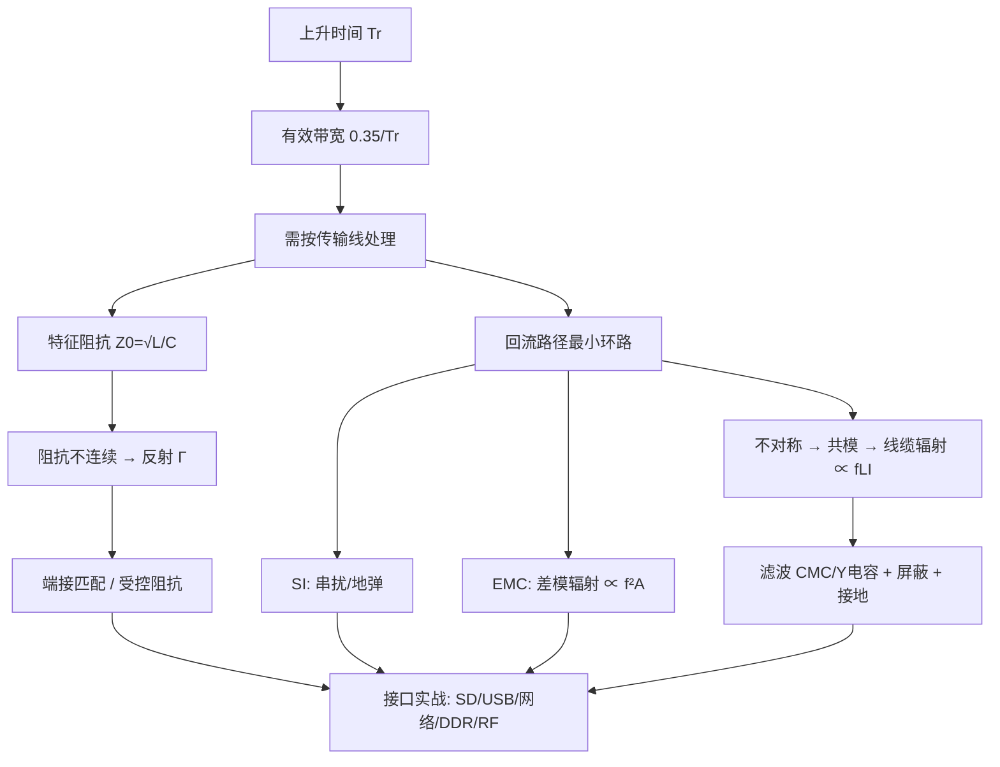

# 提高篇全集-高速信号的设计

> **说明**：本文基于该视频分集标题 + 高速信号完整性/EMC 领域知识展开的详细知识点讲解，并非视频语音/字幕逐字转写。
>
> **一句话定位**：系统讲解高速信号设计与EMC实战的进阶教程。
> **适合人群**：已懂基本PCB画板、想进阶高速信号与EMC的硬件工程师。
> **学习建议**：配合6层板实战（嘉立创EDA）与叠层阻抗教程一起看，先懂阻抗再学匹配与EMC。

## 第1集：1阻抗与特征阻抗

📖 **这一集讲什么**

低频时代我们说"阻抗"，脑子里想的是 $Z=U/I$，一个电阻、一个电容的容抗，都是"元件的属性"。但到了高速领域，信号在一根 PCB 走线上跑，这根线本身还没有接到负载，它也会呈现出一个阻抗——这就是**特征阻抗**（Characteristic Impedance，$Z_0$）。

打个比方：你在一条很长的水管里推一股水流，水流"感受"到的阻力，取决于管径、管壁材质，而不取决于管子尽头接了什么。信号在 PCB 上传播时也是一样：信号是电磁波，它沿着导体和参考平面之间的介质向前"爬"，每往前走一小段，都要给这一小段线充上电容、给这一小段回路建立磁场。信号"往前走一步要付出的代价"，就是特征阻抗。

关键认知：**特征阻抗是传输线的固有属性，与线长无关，与末端负载无关**。50Ω 的线不管切 1cm 还是 10cm，信号刚出发时看到的都是 50Ω。

🔬 **深入原理**

把传输线切成无数微元，每段有分布电感 $L_0$（单位长度电感）和分布电容 $C_0$（单位长度电容），无损条件下：

$$Z_0=\sqrt{\frac{L_0}{C_0}}$$

有损情况下完整式为：

$$Z_0=\sqrt{\frac{R_0+j\omega L_0}{G_0+j\omega C_0}}$$

高频时 $\omega L_0 \gg R_0$、$\omega C_0 \gg G_0$，退化回 $\sqrt{L_0/C_0}$，这就是为什么高速下 $Z_0$ 近似为纯实数、与频率无关。

信号传播速度：

$$v=\frac{1}{\sqrt{L_0C_0}}=\frac{c}{\sqrt{\varepsilon_r}}$$

FR-4 的 $\varepsilon_r\approx 4.2$，则 $v\approx 1.46\times10^8\ \text{m/s}$，约 **6 mil/ps**（记住这个数：166 ps/inch，或约 6.7 ps/mm）。这是后面等长计算的命根子。

微带线（表层走线，单参考面）常用近似式：

$$Z_0\approx\frac{87}{\sqrt{\varepsilon_r+1.41}}\ln\!\left(\frac{5.98H}{0.8W+T}\right)$$

带状线（内层，双参考面）：

$$Z_0\approx\frac{60}{\sqrt{\varepsilon_r}}\ln\!\left(\frac{4H}{0.67\pi(0.8W+T)}\right)$$

物理含义一句话：$H$（线到参考面距离）↑ → $Z_0$↑；$W$（线宽）↑ → $Z_0$↓；$\varepsilon_r$↑ → $Z_0$↓；$T$（铜厚）↑ → $Z_0$略↓。

🛠 **设计实例/操作**

*例1：四层板做 50Ω 单端。* 板厚 1.6mm，叠层 TOP/GND/PWR/BOTTOM，TOP 到 GND 的介质厚 0.1mm（约 3.94mil），1oz 铜（1.4mil）。用嘉立创/Polar SI9000 算，线宽约 6.5～7mil 得到 50Ω。若把介质改成 0.2mm，同样 50Ω 需要线宽约 13～14mil——所以**薄介质是高密度布线的前提**。

*例2：100Ω 差分。* 内层差分带状线，线宽 5mil、线距 5mil、上下各 4mil 介质，差分阻抗约 100Ω。注意差分阻抗 $Z_{diff}\approx 2Z_{odd}$，不是 $2Z_0$，因为耦合使奇模阻抗低于单端阻抗。

```
   微带线截面                     带状线截面
  ┌────W────┐                      ┌───GND───┐
  ▓▓▓▓▓▓▓▓▓▓  ← 信号线              ▒▒▒▒ H1
  ▒▒▒▒▒▒▒▒▒▒  H (介质 εr)          ┌──W──┐
  ████████████ ← GND 参考平面        ▓▓▓▓▓▓  ← 信号线
                                    ▒▒▒▒ H2
                                   └───GND───┘
```

⚠️ **常见误区**

1. 以为"阻抗是用万用表能量出来的"。万用表量的是直流电阻，$Z_0$ 要用 TDR（时域反射计）或按叠层计算，两者毫无关系。
2. 以为"线越短就不用管阻抗"。判据是上升沿，不是时钟频率（见第2集）。
3. 把 $\varepsilon_r$ 当常数 4.2 用到 GHz。FR-4 的 $\varepsilon_r$ 随频率下降（10GHz 时约 3.9～4.0），高频设计要用板厂给的 Dk/Df 表。
4. 只控制线宽却忘了参考平面完整。参考面一破，$H$ 等效变大、$Z_0$ 突变，算得再准也白搭。
5. 认为 50Ω 是"物理定律"。50Ω 只是功率容量与损耗折中的历史选择；视频/射频用 75Ω，USB/以太网用 90/100Ω 差分。

📌 **要点速记**

- $Z_0=\sqrt{L_0/C_0}$，是传输线固有属性，与线长、负载无关。
- FR-4 上信号速度约 **6 mil/ps（166 ps/inch）**，是等长换算的基准。
- $H$↑ 阻抗↑，$W$↑ 阻抗↓，$\varepsilon_r$↑ 阻抗↓。
- 差分阻抗 ≈ 2×奇模阻抗，耦合越紧差分阻抗越低。
- 阻抗控制的前提是**连续的参考平面**。

🔗 **承上启下**

本集是整套课程的地基。只有先建立"走线=传输线、有固有阻抗"的观念，才能理解下一集为什么阻抗一变化信号就会"弹回来"——那就是反射。第2～4集将连续三集把反射讲透。

---

## 第2集：2反射1

📖 **这一集讲什么**

反射的本质一句话：**信号在传播路径上遇到阻抗突变，就会有一部分能量原路返回**。

用最直观的比喻：一条粗绳接一条细绳，你在粗绳这头抖一下，波传到接头处，一部分继续往细绳走，一部分弹回来。PCB 上完全同理——走线 50Ω，突然接到一个 1kΩ 的输入引脚，信号"撞墙"就反弹。

那为什么低频不用管？因为**是否需要按传输线处理，取决于上升时间 $T_r$ 与传播延时 $T_d$ 的比值**，而不是时钟频率。一个 1kHz 的方波，如果上升沿只有 200ps，它照样会产生严重反射；一个 100MHz 的正弦波如果沿很缓，反而问题不大。

判据（工程常用）：当

$$T_d > \frac{T_r}{6} \quad\text{（保守取 } \frac{T_r}{10}\text{）}$$

时必须做传输线分析。等价说法：**关键长度**

$$L_{crit}=\frac{T_r \cdot v}{6}$$

🔬 **深入原理**

反射系数（在阻抗从 $Z_1$ 进入 $Z_2$ 的界面上）：

$$\Gamma=\frac{Z_2-Z_1}{Z_2+Z_1}$$

透射系数 $\tau = 1+\Gamma = \dfrac{2Z_2}{Z_1+Z_2}$。

三种极端情况必须刻进脑子：

| 末端条件 | $Z_L$ | $\Gamma$ | 现象 |
|---|---|---|---|
| 开路 | ∞ | +1 | 全反射，同相，末端电压翻倍（过冲） |
| 短路 | 0 | −1 | 全反射，反相，末端电压为 0（下冲） |
| 匹配 | $Z_0$ | 0 | 无反射，能量全部被吸收 |

再看信号刚发出时的**分压关系**。驱动器输出阻抗 $R_s$，走线 $Z_0$，信号刚出发时看不到负载，只看到 $Z_0$：

$$V_{launch}=V_{s}\cdot\frac{Z_0}{R_s+Z_0}$$

例如 3.3V 驱动、$R_s=20Ω$、$Z_0=50Ω$，则出发电压只有 $3.3\times50/70=2.36V$——这叫**初始台阶**。它不是"信号变弱了"，而是波还在路上，等末端反射回来才会叠加到全幅。

🛠 **设计实例/操作**

*例1：算关键长度。* 某 MCU IO 上升沿 $T_r=1\text{ns}$，FR-4 上 $v\approx6\text{ mil/ps}$。
$$L_{crit}=\frac{1000\text{ps}\times6\text{mil/ps}}{6}=1000\text{ mil}=25.4\text{ mm}$$
即超过约 2.5cm 就要考虑端接。若换成 FPGA 的 200ps 沿，$L_{crit}$ 只剩 5mm——这就是为什么高速器件旁边"随手一根线"都可能出问题。

*例2：估算过冲幅度。* 50Ω 线末端接 CMOS 输入（近似开路，$\Gamma_L=+1$），源端 $R_s=10Ω$（$\Gamma_S=(10-50)/60=-0.67$）。初始台阶 $3.3\times50/60=2.75V$，第一次末端反射后为 $2.75\times2=5.5V$——远超 3.3V+0.5V 的绝对最大额定值，长期会打坏输入 ESD 二极管。

⚠️ **常见误区**

1. **用时钟频率判断要不要控阻抗**。错。要看上升沿。经验换算：信号有效带宽 $f_{knee}\approx 0.35/T_r$。
2. 认为"反射只发生在末端"。任何阻抗突变点都反射：过孔、接插件、线宽突变、参考平面换层、桩线（stub）。
3. 认为过冲只是"波形难看"。它会造成 EMI 加剧、器件闩锁、长期可靠性下降。
4. 把 $\Gamma$ 的正负号搞反。记忆法：**遇大变正（过冲）、遇小变负（下冲）**。

📌 **要点速记**

- $\Gamma=(Z_2-Z_1)/(Z_2+Z_1)$；开路 +1、短路 −1、匹配 0。
- 判据是 $T_r$ 不是频率；$L_{crit}\approx T_r v/6$。
- 初始台阶由 $R_s$ 与 $Z_0$ 分压决定，不是故障。
- 有效带宽 $f_{knee}\approx0.35/T_r$，决定要关注多高频率的完整性。

🔗 **承上启下**

第1集告诉我们阻抗是什么，本集说明阻抗突变会带来反射与判据。下一集将用"弹跳图（Lattice Diagram）"把多次来回反射的过程算清楚，看懂振铃波形到底怎么来的。

---

## 第3集：3反射2

📖 **这一集讲什么**

上一集只算了"第一次反弹"。真实波形里的**振铃（Ringing）**是信号在源端和末端之间来回弹好几次的结果。这一集通常会讲解如何用**弹跳图（Lattice Diagram / 反射网格图）**把每一次来回的电压量化，从而解释示波器上那些"台阶"和"衰减振荡"到底是怎么形成的。

核心图景：波从源端出发 → 到末端反射 → 回到源端再反射 → 再去末端…… 每来回一次，幅度乘以 $\Gamma_S\Gamma_L$，因为 $|\Gamma|<1$（除非全开路/全短路），所以振铃会逐渐衰减收敛到直流稳态值。

🔬 **深入原理**

设源端反射系数 $\Gamma_S=\dfrac{R_s-Z_0}{R_s+Z_0}$，末端 $\Gamma_L=\dfrac{Z_L-Z_0}{Z_L+Z_0}$，单程延时 $T_d$。

初始入射波：$V_1=V_s\dfrac{Z_0}{R_s+Z_0}$

末端在 $t=T_d$ 时电压：$V_L(T_d)=V_1(1+\Gamma_L)$

源端在 $t=2T_d$ 时电压：$V_S(2T_d)=V_1(1+\Gamma_L+\Gamma_L\Gamma_S)$

末端在 $t=3T_d$：$V_L(3T_d)=V_1(1+\Gamma_L)(1+\Gamma_S\Gamma_L)$

一般化为等比级数，稳态值：

$$V_{\infty}=V_1\cdot\frac{(1+\Gamma_L)}{1-\Gamma_S\Gamma_L}=V_s\cdot\frac{Z_L}{R_s+Z_L}$$

漂亮的地方在于：**最终稳态与传输线无关，回到了欧姆定律的分压结果**。传输线只影响"到达稳态之前的过程"。

振铃周期 $T_{ring}=4T_d$（一个完整往返两次才回到同相），对应振铃频率：

$$f_{ring}=\frac{1}{4T_d}$$

这条公式极其实用：示波器上量出振铃频率，反推 $T_d$，就能定位是哪一段线在作怪。

```
弹跳图（Lattice Diagram）
 源端 t=0 ──V1──▶ 末端 t=Td      (末端电压 = V1(1+ΓL))
 源端 t=2Td ◀─V1·ΓL──            (叠加)
 源端 ──V1·ΓL·ΓS──▶ 末端 t=3Td
 末端 ◀── V1·ΓL²·ΓS ──  ... 逐次乘以 ΓSΓL 衰减
```

🛠 **设计实例/操作**

*例：3.3V 驱动，$R_s=10Ω$，$Z_0=50Ω$，$Z_L=\infty$（CMOS 输入），线长 6 inch（$T_d\approx1\text{ns}$）。*

- $\Gamma_S=(10-50)/60=-0.667$，$\Gamma_L=+1$
- $V_1=3.3\times50/60=2.75V$
- $t=1\text{ns}$：末端 $2.75\times2=5.50V$（严重过冲）
- $t=3\text{ns}$：末端 $5.50+2.75\times(-0.667)\times2=5.50-3.67=1.83V$（下冲）
- $t=5\text{ns}$：$1.83+2.75\times0.444\times2=4.27V$
- 收敛于 3.3V，振铃频率 $1/(4\times1\text{ns})=250\text{MHz}$

结论：只要把 $R_s$ 提高到 50Ω（即源端串阻 40Ω），$\Gamma_S=0$，一次往返后立刻稳定，振铃消失。这正是下一集/第5集端接的动机。

⚠️ **常见误区**

1. 认为"振铃是电源纹波"。振铃频率 $1/4T_d$ 通常在 100MHz～1GHz，与电源纹波（kHz～MHz）量级差远了。
2. 用示波器 1:1 探头+长地线量振铃，量出来的"振铃"其实是探头地环路的 LC 谐振。必须用弹簧地环、带宽≥5倍 $f_{knee}$。
3. 以为多加电容能压振铃。加电容会降低边沿（有一定效果），但同时增加驱动电流、恶化 $Z_0$ 连续性，是治标手段。
4. 忽略中间不连续点。真实板上还有过孔、接插件，弹跳图会更复杂，需要仿真（HyperLynx/SIwave/ADS）。

📌 **要点速记**

- 振铃 = 多次反射叠加，衰减因子为 $\Gamma_S\Gamma_L$。
- 稳态电压与传输线无关，只由 $R_s$、$Z_L$ 分压决定。
- 振铃频率 $f_{ring}=1/(4T_d)$，可反推问题线长。
- 令 $\Gamma_S=0$（源端串阻）即可一次往返收敛，是最省事的解法。

🔗 **承上启下**

上一集给了反射系数，本集把多次反射量化为弹跳图与振铃公式。下一集将把反射与实际波形失真（过冲、下冲、台阶、非单调边沿）对应起来，并引入容性/感性突变的反射形态。

---

## 第4集：4反射3

📖 **这一集讲什么**

前两集讲的都是"电阻性阻抗突变"，反射出来的是台阶。但真实板子上更多的是**容性突变**（BGA 焊盘、过孔盘、接插件、多负载挂载）和**感性突变**（细颈走线、过孔桶、引线键合、磁珠）。这一集通常会讲解这两类突变各自的反射"长相"，以及怎样从波形反推是哪种寄生。

直觉记忆：
- **容性突变** → 阻抗局部变低 → 先出现一个**向下的凹坑**，边沿被"拖慢"。
- **感性突变** → 阻抗局部变高 → 先出现一个**向上的凸起**（尖峰）。

🔬 **深入原理**

对于长度远小于上升沿空间长度的小突变，可以用集总元件近似。

一段长度 $\ell$、阻抗 $Z_1$ 的短线插在 $Z_0$ 系统中：

- 若 $Z_1<Z_0$，等效电容 $C=\dfrac{T_{d1}}{Z_1}$
- 若 $Z_1>Z_0$，等效电感 $L=T_{d1}\cdot Z_1$

其中 $T_{d1}$ 为该段的延时。

容性突变的反射峰值近似：

$$V_{refl}\approx -\frac{Z_0 C}{2T_r}V_{step}$$

感性突变：

$$V_{refl}\approx +\frac{L}{2Z_0T_r}V_{step}$$

物理含义：**同样的寄生，上升沿越快（$T_r$ 越小），反射越严重**。这解释了为什么老板子换个更快的芯片就出问题——板子没变，$T_r$ 变了。

容性负载还会拉低有效阻抗与拉慢速度。均匀分布 $N$ 个负载电容 $C_L$ 在长度 $\ell$ 上：

$$Z_{eff}=\frac{Z_0}{\sqrt{1+\frac{C_L^{total}}{C_{line}}}},\qquad v_{eff}=\frac{v}{\sqrt{1+\frac{C_L^{total}}{C_{line}}}}$$

这就是 DDR 早期 T 型拓扑、多 DIMM 总线阻抗被"压低"的根源。

🛠 **设计实例/操作**

*例1：过孔电容引起的凹坑。* 一个 0.3mm 钻孔、1.0mm 反焊盘的过孔约 0.3～0.5pF。$Z_0=50Ω$、$T_r=100\text{ps}$、$C=0.5\text{pF}$：
$$V_{refl}\approx-\frac{50\times0.5\times10^{-12}}{2\times100\times10^{-12}}=-0.125\ (\text{即}-12.5\%)$$
12.5% 的反射足以吃掉眼图裕量。对策：**增大反焊盘、减小焊盘直径、去除无用焊盘（non-functional pad）、背钻去 stub**。

*例2：细颈感性突变。* BGA 出线处线宽被迫从 5mil 缩到 3mil，长 40mil。这段等效 $Z_1\approx70Ω$、$T_{d1}\approx6.7\text{ps}$，$L=70\times6.7\text{ps}=0.47\text{nH}$。$T_r=50\text{ps}$ 时反射约 $+0.47\text{nH}/(2\times50\times50\text{ps})=+9.4\%$。对策：**颈缩长度尽量短（<100mil），或在颈缩处同步减薄介质补偿**。

```
波形指纹速查
 电容突变:  ─────╲   ╱─────    先掉坑（阻抗↓）
                  ╲_╱
 电感突变:  ─────╱╲──────      先冲高（阻抗↑）
                ╱  ╲
 开路末端:  ─────┌───────      台阶翻倍
 短路末端:  ─────┐  ┌──        先归零再回升
                 └──┘
```

⚠️ **常见误区**

1. 认为过孔"只要打通就行"。高速下过孔是三重寄生：桩线谐振、焊盘电容、桶电感。10Gbps 以上必须背钻或用盲埋孔。
2. 在高速线上"随手加个测试点/焊盘"。一个 40mil 测试盘就是几百 fF 的容性突变。
3. 认为串联电容（AC 耦合电容）不影响完整性。0402 焊盘比 0201 大，容性突变更明显；高速差分线优先 0201/0402 并做焊盘挖空（antipad）。
4. 忽略连接器。USB/网口连接器往往是全链路最大的不连续点，必须查其 S 参数。

📌 **要点速记**

- 容性突变 = 阻抗凹坑（下冲），感性突变 = 阻抗凸起（过冲）。
- 反射幅度正比于寄生量、反比于上升时间 $T_r$。
- 过孔电容典型 0.3～0.5pF，桩线谐振是高速大敌，10G+ 需背钻。
- 均布容性负载会同时降低 $Z_{eff}$ 和 $v_{eff}$。

🔗 **承上启下**

三集反射讲完，问题已经定性定量。下一集正面回答"怎么治"——阻抗匹配与四种端接方式的选型、参数计算与实战取舍。

---

## 第5集：5阻抗匹配

📖 **这一集讲什么**

既然反射来自阻抗不连续，那治理思路只有两条：**要么让线路本身连续（受控阻抗设计）**，**要么在两端加电阻把反射吸收掉（端接）**。这一集讲的就是端接（Termination）。

四种经典端接方式，可以按"电阻放在哪儿"来记：

| 方式 | 位置 | 典型值 | 直流功耗 | 适用场景 |
|---|---|---|---|---|
| 源端串联端接 | 驱动器旁 | $R=Z_0-R_{out}$，常 22～33Ω | 无 | 点对点、CMOS、时钟、SPI、SD |
| 并联端接（到GND/VCC） | 接收端 | $R=Z_0$ | 大 | 少用，功耗高 |
| 戴维南端接 | 接收端 | $R_1\parallel R_2=Z_0$ | 大 | TTL 电平、少量总线 |
| AC 端接（RC） | 接收端 | $R=Z_0$，$C$ 100pF～1nF | 极小 | 时钟等周期信号 |
| 二极管端接 | 接收端 | 肖特基钳位 | 小 | 保护为主，非匹配 |

🔬 **深入原理**

**源端串联端接**为什么最常用？它令 $\Gamma_S\approx0$：波第一次到末端全反射（$\Gamma_L=+1$）后回到源端被吸收，**一次往返即稳定**，且直流路径上无电流，几乎零功耗。代价是"半波"传输：线中间点电压只有一半，因此**中间不能挂负载**（点对点专用）。

$$R_{series}=Z_0-R_{out(driver)}$$

驱动器输出阻抗典型 10～25Ω，所以常见 22Ω、27Ω、33Ω。

**AC 端接**的时间常数要求：

$$\tau=RC \gg T_r,\quad \text{同时}\ \tau \ll \frac{T_{bit}}{2}$$

工程取 $C$ 使 $RC \approx 3\sim5\,T_r$。例如 $Z_0=50Ω$、$T_r=1\text{ns}$，取 $C=100\text{pF}$，$\tau=5\text{ns}$，合适。

**戴维南端接**：要求 $R_1\parallel R_2=Z_0$，且分压中点等于信号中心电平。例如 3.3V 系统、50Ω：$R_1=R_2=100Ω$，中点 1.65V，等效 50Ω，但静态电流 3.3V/200Ω=16.5mA，功耗 54mW/线——DDR2 之前的 SSTL 就是这么干的，很费电。

**差分对端接**：接收端跨接 100Ω（LVDS/以太网/USB），有时用 2×50Ω 到中点电容接地，同时吸收差模和共模。

🛠 **设计实例/操作**

*例1：SPI Flash 时钟串阻。* CLK 50MHz，但驱动沿 1.5ns，走线 40mm > $L_{crit}$。在**紧靠 MCU 引脚**（<200mil）串 22Ω，实测过冲从 1.2V 降到 0.2V 以内。注意：**串阻必须靠近驱动端，不是中间也不是接收端**。

*例2：以太网 RGMII。* 4 对数据 + 时钟，走线 60mm，各串 22Ω 于 MAC 侧；TX_CLK/RX_CLK 单独串阻并等长。若 PHY 侧驱动 RX 数据，需要在 PHY 侧串阻——**串阻跟着驱动方向走**，双向总线（如 DDR DQ）反而不适合单侧串阻，要用 ODT。


⚠️ **常见误区**

1. **串阻放到接收端**。放错位置等于没放，源端反射依然存在。
2. 在多点总线上用源端串接。中间节点会看到半幅台阶，逻辑误判。
3. 端接电阻用 1206 大封装。寄生电感大，高频失效，应选 0402/0201 薄膜电阻，且精度 1%。
4. 忘了驱动器本身有输出阻抗，直接串 50Ω 造成过阻尼、边沿变缓、时序不足。
5. 认为"加了端接就不用控阻抗"。端接只解决两端，中间的过孔/换层不连续照样反射。

📌 **要点速记**

- 源端串联端接性价比最高：零功耗、一次往返收敛，但仅限点对点。
- $R_{series}=Z_0-R_{out}$，必须紧贴驱动引脚。
- 并联/戴维南匹配效果好但耗电；AC 端接省电但只适合周期信号。
- 差分线用 100Ω 跨接；现代 DDR/SerDes 用片内 ODT 替代外部电阻。
- 端接治两端，受控阻抗治全程，两者缺一不可。

🔗 **承上启下**

到这里，"信号往前走"这条路已经讲清楚。但电流是回路，信号跑出去必须回得来。下一集讲**回流路径**——它是 SI 与 EMC 的共同命门，也是整套课程最重要的一集。

---

## 第6集：6回流路径

📖 **这一集讲什么**

初学者最容易忽略的一句话：**电流永远走回路，没有回路就没有电流**。你在 PCB 上画的那根信号线只是"去路"，还有一条看不见的"回路"，它走在参考平面上。

低频时，回流走**电阻最小**的路径——也就是在平面上大面积铺开、直奔电源地。但高频时，回流走**电感最小（阻抗最小）**的路径——它会紧紧贴着信号线的正下方回来，形成尽可能小的环路面积。

这个"高频回流紧贴信号线"的规律，是理解**串扰、EMI 辐射、地弹、参考面分割危害**的总钥匙。

🔬 **深入原理**

回流路径宽度近似满足：距信号线中心 $x$ 处的回流电流密度

$$i(x)=\frac{I_0}{\pi H}\cdot\frac{1}{1+(x/H)^2}$$

其中 $H$ 是信号线到参考面的高度。积分可知，**约 80% 回流集中在 $\pm 3H$ 范围内，97% 在 $\pm 20H$ 内**。$H=4\text{mil}$ 时，回流基本挤在信号线两侧 12mil 内——这就是"参考面只要在信号线正下方完整就行"的物理依据，也是**为什么跨分割如此致命**。

环路面积决定辐射。差模辐射远场公式（自由空间）：

$$E=1.32\times10^{-14}\cdot\frac{f^2\,A\,I}{r}\quad (\text{V/m})$$

其中 $f$ 单位 Hz，$A$ 为环路面积（m²），$I$ 为电流（A），$r$ 为距离（m）。**辐射正比于 $f^2$ 和环路面积 $A$**——把 $A$ 从 100mm² 降到 10mm²，辐射直接降 20dB。这是 EMC 设计里最便宜的 20dB。

换层带来的回流断点：信号从 L1（参考 L2-GND）换到 L4（参考 L3-GND），回流必须从 L2 跳到 L3。若附近没有 GND 过孔，回流被迫绕远路，环路面积暴增，等效串入电感：

$$L_{via}\approx 5.08h\left[\ln\frac{4h}{d}+1\right]\ \text{(nH, h/d 单位 inch)}$$

典型 1.6mm 板厚过孔约 1～1.5nH。

🛠 **设计实例/操作**

*例1：换层必伴地孔。* 高速信号每一个换层过孔，**在 100～200mil 内放 1～2 个 GND 过孔**（差分对可共用，放在对的两侧）。若两个参考面电压不同（GND↔PWR），则需在换层处放 0.01～0.1μF 去耦电容作为高频回流桥——但电容+过孔约 1～2nH，效果远不如 GND 过孔，能不跨就不跨。

*例2：绝不跨分割。* 下图左是灾难，右是正确做法：

```
 ✗ 错误：信号跨越平面缝隙            ✓ 正确：绕行或改参考面
  ┌──────────┬──────────┐            ┌──────────┬──────────┐
  │  GND     │  VCC     │            │  GND     │  VCC     │
  │   ───────┼──────▶   │            │  ──┐     │          │
  │          │          │            │    └───▶ │          │
  └──────────┴──────────┘            └──────────┴──────────┘
   回流被迫绕缝隙一圈                 回流始终在同一平面下方
   环路面积↑↑ → 辐射↑↑、串扰↑↑
```

*例3：接口区域。* USB/网口/HDMI 的走线下方参考面必须完整无缝，且不要有其它电源平面的"孤岛"横穿。

⚠️ **常见误区**

1. 以为"地就是地，到处都一样"。平面上不同点在高频下电位差可达几百 mV（地弹）。
2. 在平面上"挖槽"分割数字地/模拟地却让信号横穿槽——这是 90% EMC 超标案例的根因。
3. 认为电源平面不能当参考面。可以，只要电源平面完整且有足够去耦电容与地平面高频短接。
4. 只在信号过孔"附近某处"放地孔。要放在**紧邻（<100mil）**，距离越远等效电感越大。
5. 忽视连接器/排针区。排针一排全信号没有地针，回流无路可走，是辐射天线的经典成因——**每 2～4 根信号配 1 根地**。

📌 **要点速记**

- 高频回流紧贴信号线正下方，80% 集中在 ±3H 内。
- 辐射 $\propto f^2 \times$ 环路面积，最小化环路是最廉价的 EMC 手段。
- 换层必伴地孔（<100～200mil）；跨分割是大忌。
- 参考面变换（GND→PWR）需靠去耦电容做高频桥，效果不如同层 GND。
- 连接器/排针必须按比例配地针。

🔗 **承上启下**

回流路径是 SI 与 EMC 的交汇点。理解了"电流环路"，下一集的共模与差模就水到渠成——共模电流正是回流路径被破坏后产生的"意外电流"。

---

## 第7集：7共模与差模

📖 **这一集讲什么**

两根线上的电流，可以分解成两个"视角"：

- **差模（Differential Mode, DM）**：两根线电流大小相等、方向相反。这是我们**想要**的信号形式。去和回的磁场互相抵消，环路小，辐射低。
- **共模（Common Mode, CM）**：两根线电流大小相等、方向相同，回流通过大地/机壳/线缆寄生电容回来。这是我们**不想要**的，环路巨大，是辐射超标的头号元凶。

一句话记住：**差模是信号，共模是麻烦**。

🔬 **深入原理**

数学分解：设两根线电压 $V_1$、$V_2$

$$V_{DM}=V_1-V_2,\qquad V_{CM}=\frac{V_1+V_2}{2}$$

电流：$I_{DM}=\dfrac{I_1-I_2}{2}$，$I_{CM}=I_1+I_2$

**关键的量级对比**：共模辐射远比差模可怕。共模辐射（单极子/线缆天线模型）：

$$E_{CM}=1.26\times10^{-6}\cdot\frac{f\,L\,I_{CM}}{r}\quad(\text{V/m})$$

对比差模式 $E_{DM}\propto f^2 A I_{DM}$。做个数值对比：3m 处、100MHz、线缆长 1m：产生 $30\ \mu V/m$ 只需 **8nA** 共模电流；而要靠差模达到同样场强，在 10cm² 环路里需要约 **200μA**。**共模电流的"辐射效率"高出四个数量级**——所以 EMC 整改 80% 的功夫都在压共模。

共模是怎么产生的？三大来源：

1. **不对称/不平衡**：差分对两根线长度不等（skew）、耦合不均、一根跨了分割 → 差模转共模（mode conversion）。$S_{cd21}$ 就是衡量这个的 S 参数。
2. **地电位差**：板内地弹、地阻抗压降驱动线缆共模。
3. **公共阻抗耦合**：多个电路共用一段地走线。

差模→共模转换与 skew 的关系（近似）：

$$V_{CM}\approx \frac{\Delta T_{skew}}{T_r}\cdot\frac{V_{DM}}{2}$$

所以差分对内**skew 必须远小于上升时间**，工程上常要求 $<5\%\,T_r$（USB3 要求 <5ps，DDR 差分 <2mil 长度差）。

🛠 **设计实例/操作**

*例1：共模扼流圈（CMC）选型。* USB2.0 用 90Ω@100MHz CMC，以太网用 100～200Ω CMC。原理：对差模磁通抵消、呈现极低阻抗（不影响信号）；对共模磁通叠加、呈现高阻抗（阻断噪声）。注意 CMC 本身不对称也会引入模式转换，高速链路要选低 $S_{cd21}$ 的型号。

*例2：差分对布线三原则。*
- **等长**：对内 skew 严控，蛇形补偿要靠近失配处补。
- **等距**：全程保持恒定间距，避免间距忽宽忽窄造成阻抗起伏。
- **对称**：换层同时换、过孔对称、绕线尽量对内自补偿而非单边绕。

```
差模 vs 共模 电流方向
   差模（好）              共模（坏）
  ──▶──── 线1            ──▶──── 线1
  ◀────── 线2            ──▶──── 线2
   磁场抵消，环路小        回流经机壳/大地，环路巨大
   辐射低                  辐射高（线缆变天线）
```

⚠️ **常见误区**

1. 认为"用了差分就一定抗干扰"。差分抗扰的前提是**平衡**，一旦不对称就退化。
2. 差分对内为补长度画大蛇形而在一根上绕、离失配点很远——中间那段变成了单端，反而制造共模。
3. 把差分对当成"两根普通线，间距远点也无所谓"。间距变化会改变差分阻抗。
4. 在差分线上一根加电阻/测试点另一根不加，人为制造不对称。
5. CMC 放的位置不对。应**紧靠连接器**，在 ESD 器件之后、走线进板之前。

📌 **要点速记**

- 差模是信号，共模是辐射元凶；共模辐射效率高出差模数个数量级。
- 共模三大来源：不对称、地电位差、公共阻抗耦合。
- 对内 skew 应 $<5\%\,T_r$，就近补偿。
- CMC 对差模低阻、对共模高阻，紧靠连接器放置。
- 差分布线三原则：等长、等距、对称。

🔗 **承上启下**

共模概念是 EMC 的入场券。从下一集开始，课程正式转入 EMC 板块：先建立 EMC 的整体框架（发射/抗扰、传导/辐射），再逐项讲实验与整改。

---

## 第8集：8EMC的基本知识

📖 **这一集讲什么**

EMC（电磁兼容）= **EMI（发射，不害人）+ EMS（抗扰，不怕人）**。产品要过认证，两边都得达标。

标准体系速览：

```
EMC
├── EMI 电磁干扰（发射）
│   ├── CE  传导发射 (Conducted Emission)   150kHz~30MHz  测电源线
│   ├── RE  辐射发射 (Radiated Emission)    30MHz~1/6GHz  测空间场
│   ├── Harmonics 谐波电流   IEC 61000-3-2
│   └── Flicker 闪烁         IEC 61000-3-3
└── EMS 电磁抗扰（抗扰度）
    ├── ESD  静电放电       IEC 61000-4-2   ±4/8kV 接触/空气
    ├── RS   辐射抗扰       IEC 61000-4-3   3/10 V/m
    ├── EFT  电快速瞬变脉冲群 IEC 61000-4-4  ±1/2kV
    ├── Surge 浪涌          IEC 61000-4-5   ±1/2/4kV
    ├── CS   传导抗扰       IEC 61000-4-6   3/10 Vrms
    ├── PFMF 工频磁场       IEC 61000-4-8
    └── DIP  电压跌落中断    IEC 61000-4-11
```

常用产品标准：信息技术类 CISPR 32/35（原 CISPR 22/24）、家电 CISPR 14、工业 IEC 61000-6-2/-6-4、车载 CISPR 25 / ISO 11452。

🔬 **深入原理**

**干扰三要素模型**：干扰源 → 耦合路径 → 敏感设备。整改也只有三条路：

1. **抑制源**：降低 $dv/dt$、$di/dt$，展频（SSC），选边沿更缓的驱动，减小环路。
2. **切断耦合**：滤波、屏蔽、隔离、增大距离、改变布局。
3. **加固受体**：提高抗扰门限、加钳位、软件容错（看门狗、CRC 重传）。

**耦合四类**：传导耦合、公共阻抗耦合、容性（电场）耦合、感性（磁场）耦合、辐射耦合。近场（$r<\lambda/2\pi$）以电场或磁场单独为主，远场（$r>\lambda/2\pi$）以平面波为主，波阻抗趋于 377Ω。分界距离：

$$r_{boundary}=\frac{\lambda}{2\pi}=\frac{c}{2\pi f}$$

100MHz 时约 0.48m——所以 3m 法测试是远场，板级探头是近场。

**限值举例**（CISPR 32 Class B，3m 法辐射，准峰值 QP）：

| 频段 | 限值 |
|---|---|
| 30～230 MHz | 30 dBμV/m |
| 230～1000 MHz | 37 dBμV/m |

Class A（工业）比 Class B（家用）宽松约 10dB。设计时应留 **6dB 以上余量**。

🛠 **设计实例/操作**

*例1：估算你产品的关键频点。* 时钟 25MHz、上升沿 2ns，则拐点频率 $f_{knee}=0.35/2\text{ns}=175\text{MHz}$。意味着 25MHz 的谐波在 175MHz 之前衰减很慢（20dB/dec），之后加速（40dB/dec）。测试超标常出现在 3、5、7 次谐波（75/125/175MHz），整改优先看这些点。

*例2：三层防线设计法。* 芯片级（去耦、边沿控制）→ 板级（分区、地设计、回流）→ 系统级（屏蔽壳、滤波器、线缆处理）。**越早处理成本越低**：原理图阶段改一颗电容 = 0 元；量产后加屏蔽罩 = 每台几元 + 认证重测。

⚠️ **常见误区**

1. 认为"EMC 是最后测试的事"。80% 的 EMC 结果在布局布线阶段就已注定。
2. 把 EMI 和 EMS 混为一谈，甚至用相反的手段（比如为了过 ESD 加大电容，却恶化了信号完整性）。
3. 迷信"加屏蔽罩万能"。屏蔽罩如果接地不良、有大缝隙，反而成为谐振腔。缝隙长度接近 $\lambda/2$ 时几乎不屏蔽。
4. 只关注辐射不关注传导。CE 超标往往是开关电源共模问题，与 RE 同源。

📌 **要点速记**

- EMC = EMI（发射）+ EMS（抗扰），两者都要过。
- 整改三条路：抑源、断耦合、加固受体。
- 远近场分界 $\lambda/2\pi$；CISPR 32 Class B 30～230MHz 限值 30 dBμV/m。
- $f_{knee}=0.35/T_r$ 决定你的噪声频谱能延伸多高。
- EMC 成本随设计阶段推后呈指数上升。

🔗 **承上启下**

有了 EMC 的地图，就需要学会读"坐标"——所有 EMC 数据都以 dB 表示。下一集专门讲 dB、dBμV、dBμV/m、dBm 的换算与工程意义。

---

## 第9集：9db的概念

📖 **这一集讲什么**

EMC 报告上全是 dBμV、dBμV/m、dBm、dB，很多工程师看得云里雾里。这一集要把 dB 彻底讲明白。

dB 的本质：**把乘除变成加减的对数刻度**。为什么要它？因为 EMC 里的量级跨度太大——从 1μV 到 1V 就是 6 个数量级，用线性坐标画不出来；而且级联系统的增益/衰减是相乘关系，取对数后变成相加，心算方便。

🔬 **深入原理**

两套定义，务必分清：

- **功率量**：$\text{dB}=10\log_{10}\dfrac{P_2}{P_1}$
- **场量（电压/电流/场强）**：$\text{dB}=20\log_{10}\dfrac{V_2}{V_1}$

为什么场量用 20？因为 $P\propto V^2$，$10\log(V^2)=20\log V$。

**绝对单位**（带参考基准）：

| 单位 | 参考基准 | 公式 |
|---|---|---|
| dBμV | 1 μV | $20\log_{10}(V/1\mu V)$ |
| dBμV/m | 1 μV/m | $20\log_{10}(E/1\mu V/m)$ |
| dBm | 1 mW | $10\log_{10}(P/1mW)$ |
| dBμA | 1 μA | $20\log_{10}(I/1\mu A)$ |

**必背换算表**（场量）：

| 倍数 | dB | 倍数 | dB |
|---|---|---|---|
| ×2 | +6 | ×10 | +20 |
| ×4 | +12 | ×100 | +40 |
| ×√2 | +3 | ×1000 | +60 |
| ×0.5 | −6 | ×0.1 | −20 |

**dBm ↔ dBμV（50Ω 系统）**：

$$\text{dB}\mu V = \text{dBm} + 107$$

推导：0 dBm = 1mW，在 50Ω 上 $V=\sqrt{PR}=\sqrt{0.001\times50}=0.2236V=223600\mu V$，$20\log(223600)=107\text{ dB}\mu V$。

🛠 **设计实例/操作**

*例1：读懂测试报告。* 报告写"120MHz 处 QP = 42.5 dBμV/m，限值 30 dBμV/m，余量 −12.5dB"。
反推场强：$E=10^{42.5/20}=133\ \mu V/m$，限值 $10^{30/20}=31.6\ \mu V/m$。
超标 12.5dB ≈ 场强超了约 4.2 倍。要达标需**至少衰减 12.5dB，工程上按 18dB（留 6dB 余量）设计整改**。18dB ≈ 场强降到 1/8，对应"环路面积降到 1/8"或"共模电流降到 1/8"。

*例2：滤波器级联。* 一个 π 型滤波器 −25dB，加一个 CMC −15dB，理想级联 −40dB。但**实测往往只有 −30dB**，因为两级之间存在耦合、寄生参数、阻抗失配。所以别指望简单相加。

*例3：EMI 接收机的三种检波。* 峰值(Peak) ≥ 准峰值(QP) ≥ 平均值(AVG)。预扫用 Peak 快速定位（快但严格），终测按标准用 QP/AVG。若 Peak 就已经在限值以下，直接合格，不必再测 QP。

```
读图口诀
  余量 = 限值 − 实测   （正数=合格，负数=超标）
  −6dB  ≈ 幅度减半
  −20dB ≈ 幅度降到 1/10
  整改目标 = 超标量 + 6dB 余量
```

⚠️ **常见误区**

1. **功率用 20log、电压用 10log**——搞反是最常见的低级错误。
2. dB 与 dBμV 混用。dB 是相对量（无量纲），dBμV 是绝对量。"衰减了 20dBμV"这句话是错的，应说"衰减了 20dB"。
3. 认为"合格就行"。产线一致性、温度、老化都会漂，**必须留 6dB 余量**，关键频点建议 10dB。
4. 用 Peak 值超标就慌。Peak 是最严格的检波方式，QP 通常低几个 dB，AVG 更低。
5. dBm+107 这个换算只在 50Ω 系统成立，别套到高阻测量上。

📌 **要点速记**

- 功率 $10\log$，电压/场强/电流 $20\log$。
- ×2=+6dB，×10=+20dB，牢记这两条能心算大部分问题。
- 50Ω 下 dBμV = dBm + 107。
- 余量 = 限值 − 实测；整改目标 = 超标量 + 6dB。
- 检波严格度：Peak ≥ QP ≥ AVG。

🔗 **承上启下**

会读数据之后，下一集进入第一个具体实验——传导发射（CE），学习 LISN 原理、测试布置以及噪声从哪里来。

---

## 第10集：10传导实验基础知识

📖 **这一集讲什么**

传导发射（Conducted Emission, CE）测的是：**你的设备通过电源线往电网里"倒灌"了多少噪声**。频段通常 150kHz～30MHz（CISPR 32/14/11 等）。

测试怎么做？被测设备（EUT）的电源线接到 **LISN（线路阻抗稳定网络，又叫人工电源网络 AMN）**，LISN 的作用有三：

1. 给 EUT 提供干净的市电（滤掉电网自身噪声）；
2. 在 150kHz～30MHz 内提供**标准化的 50Ω 阻抗**，保证不同实验室结果可比；
3. 把 EUT 产生的噪声耦合到 EMI 接收机（通过 0.1μF + 1kΩ 的取样支路）。

🔬 **深入原理**

CE 噪声同样分共模与差模：

- **差模噪声（DM）**：在 L 与 N 之间流动，主要来自开关电源输入电容的高频纹波电流（$di/dt$ 在输入回路）。频段偏低（150kHz～数 MHz）。
- **共模噪声（CM）**：L 和 N 同向流出，经由 **Y 电容/寄生电容 → 大地（PE）** 回来。主因是开关管漏极（高 $dv/dt$ 节点）对散热片/机壳的寄生电容 $C_p$。频段偏高（几 MHz～30MHz）。

共模位移电流：

$$i_{CM}=C_p\cdot\frac{dv}{dt}$$

举例：MOSFET 漏极到散热片 $C_p=30\text{pF}$，$dv/dt=10\text{kV}/\mu s=10^{10}\text{V/s}$，则 $i_{CM}=0.3\text{A}$ 峰值脉冲——这就是超标的元凶。

LISN 上两路（L、N）分别测得 $V_L$、$V_N$，可分离：

$$V_{CM}=\frac{V_L+V_N}{2},\qquad V_{DM}=\frac{V_L-V_N}{2}$$

有专门的 **CM/DM 分离器**可以直接测，整改效率高很多。

限值举例（CISPR 32 Class B，AC 电源端口）：

| 频段 | QP | AVG |
|---|---|---|
| 0.15～0.5 MHz | 66→56 dBμV（随 log 频率线性下降） | 56→46 dBμV |
| 0.5～5 MHz | 56 dBμV | 46 dBμV |
| 5～30 MHz | 60 dBμV | 50 dBμV |

🛠 **设计实例/操作**

*例1：判断是 CM 还是 DM。* 一个实用土办法：在 EUT 与 LISN 之间的电源线上**套一个大磁环（绕几圈）**。如果超标点明显下降 → 共模为主；几乎不变 → 差模为主。这一步能省掉一半的盲目整改。

*例2：测试布置的坑。* 桌面设备置于 0.8m 高木桌，距参考接地板 0.4m（垂直）/0.8m（水平）；多余电源线**折成 30～40cm 的 8 字捆扎**，不能盘成大圈（会变天线）。布置不规范导致的复测在实验室极常见。

```
传导测试拓扑
  电网 ──[LISN L]──┬── L ──▶ EUT
        [LISN N]──┼── N ──▶ EUT
                  │  PE ──▶ EUT外壳
                  └──▶ 50Ω ──▶ EMI 接收机
  参考接地板（金属地板）与 LISN 外壳、EUT PE 良好搭接
```

⚠️ **常见误区**

1. 认为 CE 是"电源工程师的事"。数字板的时钟噪声一样会通过 DC-DC、地耦合到输入端。
2. 一超标就狂加 X/Y 电容。Y 电容受**漏电流安规限制**（一般 ≤3.5mA，对应 220V/50Hz 时 Y 电容总量约 ≤4.7nF），加过头无法过安规。
3. 忽略 PE 线。二类设备（无 PE）的共模回路只能靠寄生电容，整改思路完全不同。
4. 用普通示波器在电源线上量"噪声"就下结论。示波器噪底、带宽、检波方式与 EMI 接收机完全不同。

📌 **要点速记**

- CE 频段 150kHz～30MHz，用 LISN 提供 50Ω 标准阻抗并取样。
- 低频段多为差模（输入回路 $di/dt$），高频段多为共模（$C_p \cdot dv/dt$）。
- $i_{CM}=C_p\,dv/dt$，减小 $dv/dt$ 或 $C_p$ 是治本。
- 磁环试探法可快速判别 CM/DM。
- Y 电容受安规漏电流限制，不能无限加。

🔗 **承上启下**

知道了噪声从哪来，下一集就讲怎么治——EMI 滤波器结构、元件选型、布局要点与实战整改流程。

---

## 第11集：11传导实验解决办法

📖 **这一集讲什么**

传导超标的整改，本质是给噪声修一条"回家的近路"，同时在通往电网的路上设卡。核心工具是 **EMI 输入滤波器**。

一个典型 AC 输入 EMI 滤波器：

```
 L ──┬──[ X1 ]──┬──▮▮▮ CMC ▮▮▮──┬──[ X2 ]──┬──▶ 整流桥
     │          │   （共模扼流圈） │          │
    保险丝     压敏                          ├─[Y1]─┐
     │          │                            │      ├── PE
 N ──┴──────────┴──▮▮▮────────────┴─[Y2]─────┘
```

各元件分工：

| 元件 | 抑制对象 | 原理 |
|---|---|---|
| X 电容（L-N 之间） | 差模 | 给差模电流就近短路 |
| Y 电容（L/N 对 PE） | 共模 | 把共模电流引回 PE，缩小环路 |
| CMC 共模扼流圈 | 共模 | 对共模呈高阻（mH 级），对差模低阻 |
| 差模电感 / CMC 漏感 | 差模 | 串联高阻 |
| 磁珠 / 铁氧体 | 高频 | 等效为高频电阻，耗散能量 |

🔬 **深入原理**

滤波器是"阻抗失配"器件，插入损耗依赖源阻抗与负载阻抗：

$$IL(\text{dB})=20\log_{10}\left|\frac{V_{without}}{V_{with}}\right|$$

**阻抗失配原则**：噪声源阻抗低 → 用串联电感阻挡；噪声源阻抗高 → 用并联电容旁路。所以：
- 差模噪声源（输入电容回路）阻抗低 → 优先加差模电感/CMC 漏感。
- 共模噪声源阻抗高（寄生电容耦合） → Y 电容效果显著。

CMC 的共模阻抗：$Z_{CM}=j\omega L_{CM}$，典型 $L_{CM}$ 为 1～10mH，在 1MHz 时 $Z$ 达数 kΩ。但 CMC 有**自谐振频率 SRF**，超过 SRF 后寄生电容主导，阻抗反而下降——所以高频段常需再加一级小磁环或磁珠。

滤波器截止频率（LC 二阶）：

$$f_c=\frac{1}{2\pi\sqrt{LC}}$$

理论 −40dB/dec。设计时让 $f_c$ 比最低超标频点低 5～10 倍。

**衰减目标计算**：超标 12dB → 目标 18dB → 若单级 −40dB/dec，需要 $f_c$ 满足 $18=40\log(f/f_c)$，即 $f/f_c=10^{0.45}=2.8$，取 $f_c \le f_{超标}/3$。

🛠 **设计实例/操作**

*例1：0.5MHz 超标 10dB（差模为主）。* 输入端 X 电容从 0.22μF 增至 0.47μF，并串入 1mH 差模电感（或选漏感更大的 CMC）。$f_c=1/(2\pi\sqrt{1\text{mH}\times0.47\mu F})=7.3\text{kHz}$，在 0.5MHz 处理论衰减很大，实测可降 12～15dB。

*例2：15MHz 超标（共模为主）。* 15MHz 已超过多数 CMC 的 SRF，加大 CMC 电感值往往无效甚至更差。正确做法：
- 在输出线上套**镍锌材质小磁环**（高频阻抗好）；
- 减小开关节点铜皮面积，降低 $C_p$；
- 变压器加**屏蔽层（法拉第屏蔽）**并接原边地；
- MOSFET 栅极电阻适当加大，减缓 $dv/dt$（代价是效率）。

*例3：布局是滤波器的一半。* 滤波器输入端与输出端走线**绝不能平行靠近**，否则高频直接空间耦合"跨过"滤波器，实测衰减腰斩。滤波器区域下方**不要铺连续地平面连到数字地**，应独立并单点搭接机壳。

⚠️ **常见误区**

1. **只换元件不改布局**。滤波器失效 80% 是布局问题：输入输出耦合、Y 电容回流路径长、地环路大。
2. Y 电容走线绕远。Y 电容到 PE 的路径必须**极短、宽**，否则等效电感抵消其作用。
3. 一味加大 CMC 电感。超过 SRF 后无效；应改用多级、不同材质（锰锌低频/镍锌高频）组合。
4. 忽略安规。X 电容需 X1/X2 等级 + 泄放电阻（断电后 1s 内降到 37%）；Y 电容需 Y1/Y2 等级。
5. 用陶瓷电容当 X 电容。X 电容必须是安规认证的薄膜电容。

📌 **要点速记**

- X 电容治差模，Y 电容+CMC 治共模。
- 阻抗失配原则：低阻源用串感，高阻源用并容。
- CMC 有 SRF，高频段需换材质或加磁环。
- 滤波器输入/输出走线必须隔离，Y 电容回 PE 路径要极短。
- 安规限制 Y 电容容量与漏电流，不能无限堆料。

🔗 **承上启下**

CE 讲的是"设备往外发"，下一集的 CS（传导抗扰）反过来——外界噪声顺着线缆灌进来，设备能不能扛住。

---

## 第12集：12CS实验

📖 **这一集讲什么**

CS（Conducted Susceptibility，传导抗扰度，IEC 61000-4-6）模拟的场景是：**在 150kHz～80MHz 频段，外界电磁场在线缆上感应出共模电压，顺着线缆灌进设备**。

为什么是这个频段？因为 80MHz 以下，波长（>3.75m）远大于普通设备尺寸，机壳不能有效接收电磁波，但**线缆长度接近 $\lambda/4$，成了高效接收天线**。80MHz 以上则改用辐射抗扰（RS，IEC 61000-4-3）直接照射。

测试等级：Level 1 = 1V、Level 2 = 3V、Level 3 = 10V（rms，未调制载波），实测时用 **1kHz 正弦、80% AM 调幅**，扫频步进 1%，每点驻留 ≥0.5s。

🔬 **深入原理**

注入方式三种：

| 方式 | 器件 | 特点 |
|---|---|---|
| CDN（耦合去耦网络） | CDN-M2/M3、AF、T2 等 | 首选，阻抗标准 150Ω |
| EM-Clamp（电磁钳） | 钳夹线缆 | 无法用 CDN 时（如屏蔽线） |
| 直接注入（BCI/直接耦合） | 100Ω 电阻注入 | 同轴/单线场合 |

**150Ω 共模阻抗**是这个标准的核心参数——它代表人体/线缆对地的典型共模阻抗。CDN 保证注入点看到 150Ω。

设备内部为什么会误动作？共模电压 $V_{CM}$ 通过**不平衡**转成差模干扰：

$$V_{DM}=V_{CM}\cdot\frac{\Delta Z}{Z}$$

$\Delta Z/Z$ 就是电路的不平衡度。差分接收电路（RS-485、以太网）平衡好，抗扰强；单端信号（UART、GPIO、模拟采样）平衡差，容易被击穿。

此外 80MHz 以下的干扰还会被半导体结**检波（rectification）**——PN 结的非线性把射频包络解调出来，变成 1kHz 的低频干扰，直接叠加到运放/ADC 输入，表现为读数跳动。这就是为什么调制是 80% AM 1kHz：**它专门检验解调敏感度**。

🛠 **设计实例/操作**

*例1：模拟采样口被干扰。* 4-20mA 输入在 20MHz 附近读数跳 ±5%。整改：
- 输入端加 **RC 低通**（如 100Ω + 1nF，$f_c=1.6\text{MHz}$）；
- 运放输入引脚就近加 10～100pF 到地（射频旁路）；
- 差分走线，增加共模抑制；
- 线缆入口加 CMC 或磁环。

*例2：I/O 口复位。* 长线 GPIO 在 5MHz 处触发复位。整改：GPIO 加 TVS + 串 100Ω + 1nF 对地；软件加去抖与看门狗；PCB 上把该信号的地回流路径缩短。



⚠️ **常见误区**

1. 只在软件上打补丁（滤波算法）。射频检波产生的是真实模拟量，软件无法完全消除。
2. 在信号线上加大电容却忽略上升沿要求，导致通信速率不达标。要按 $f_c$ 与信号带宽折中。
3. 认为屏蔽线一定好。屏蔽层若**只单端接地或接地阻抗高**，反而成为共模注入通道。高频应 360° 环接。
4. 忘记电源端口也要做 CS。DC 电源输入端同样需要 CMC + Y 电容。
5. 把 CS 与 EFT/Surge 混淆。CS 是持续射频，EFT 是脉冲群，Surge 是大能量单脉冲，防护器件完全不同。

📌 **要点速记**

- CS = IEC 61000-4-6，150kHz～80MHz，共模注入，150Ω 标准阻抗。
- 用 1kHz/80% AM 调制，专门考核半导体结的检波敏感度。
- 不平衡度决定共模→差模转换，平衡设计是根本。
- 端口整改套路：CMC/磁环 + RC 低通 + 就近射频旁路电容 + TVS。
- 屏蔽层需 360° 低阻接地才有效。

🔗 **承上启下**

CS 只是抗扰家族的一员。下一集把 EFT、Surge、跌落、工频磁场等抗扰实验串起来讲，形成完整的 EMS 防护体系。

---

## 第13集：13抗扰实验

📖 **这一集讲什么**

抗扰（EMS）家族里除了 CS，还有一批"脉冲型"和"场型"实验。这一集通常会讲解它们各自的波形、能量量级与防护策略。

核心对照表（记住波形与能量量级，选型就不会错）：

| 实验 | 标准 | 波形 | 重复率 | 能量 | 典型防护 |
|---|---|---|---|---|---|
| EFT 脉冲群 | 61000-4-4 | 5/50 ns | 5 或 100 kHz 突发 | 小（能量低、频谱宽到几百 MHz） | Y 电容、CMC、TVS、缩短地路径 |
| Surge 浪涌 | 61000-4-5 | 1.2/50 μs 电压，8/20 μs 电流 | 单次，正负各 5 次 | **大**（可达数百 A） | GDT + 压敏 + TVS 三级配合 |
| RS 辐射抗扰 | 61000-4-3 | 80MHz～1/6GHz，3～10 V/m | 扫频 | — | 屏蔽、滤波、平衡设计 |
| DIP 电压跌落 | 61000-4-11 | 0%/40%/70% 跌落 | — | — | 大容量输入电容、掉电检测 |
| PFMF 工频磁场 | 61000-4-8 | 50Hz，30～100 A/m | 持续 | — | 远离、屏蔽（高导磁材料）、减小环路 |

🔬 **深入原理**

**EFT 的本质**：5ns 上升沿意味着频谱延伸到 $0.35/5\text{ns}=70\text{MHz}$ 甚至更高，且是**共模**注入（通过容性耦合夹或耦合网络）。它能量不大，但频率高，专挑寄生电容与地环路的漏洞。**EFT 整改的关键是"给共模电流一条尽量短的返回路径"**——所以 Y 电容、机壳搭接、屏蔽层接地至关重要。

**Surge 的本质**：1.2/50μs 波形，开路电压 $U_{oc}$、短路电流 $I_{sc}$，源阻抗 2Ω（线对线）或 12Ω（线对地）。2kV/2Ω = 1000A 峰值。这么大的能量，**必须靠能量泄放器件而不是滤波**。

三级防护配合的关键是**能量配合**（用阻抗梯度）：

```
 线路 ──[GDT 气体放电管]──/\/\/── [MOV 压敏]──/\/\/── [TVS]── 内部电路
        （kA 级, 响应 μs）  退耦   （几百A, 响应 ns）  退耦   （几十A, 响应 ps）
                        电感/PTC/电阻          小电阻
```

没有中间退耦阻抗，后级 TVS 会先动作被烧毁。TVS 选型三要素：
- $V_{RWM}$（反向工作电压）> 电路最高工作电压；
- $V_{BR}$（击穿电压）留 10% 余量；
- $V_{C}$（钳位电压）< 被保护器件耐压；
- $P_{PP}$ 峰值功率满足波形要求（10/1000μs 与 8/20μs 的额定不同，别混用）。

**电压跌落**：设计要点是输入储能电容能撑过跌落时间：

$$C\ge\frac{2P\cdot t_{hold}}{V_{nom}^2-V_{min}^2}$$

🛠 **设计实例/操作**

*例1：以太网口浪涌 ±2kV 共模。* 变压器（隔离）+ Bob Smith 电路（4×75Ω 汇到 1000pF/2kV 电容到机壳）+ 中心抽头对机壳的高压电容。若是 PoE，还要加 GDT。切忌把 Bob Smith 的地直接连数字地。

*例2：EFT ±2kV 电源口导致 MCU 复位。* 排查顺序：
1. 复位引脚是否有 0.1μF 电容和上拉；
2. 晶振布线是否远离电源入口；
3. 输入端 Y 电容到机壳的路径是否够短；
4. 机壳与 PCB 地的搭接是否多点低阻；
5. 长线 I/O 是否加了共模磁环。

*例3：工频磁场。* 霍尔传感器/互感器附近别放变压器；敏感回路面积最小化；必要时用**坡莫合金/硅钢**做磁屏蔽（铝铜屏蔽对 50Hz 磁场几乎无效）。

⚠️ **常见误区**

1. 用 TVS 直接扛 Surge。单个小封装 TVS（SMAJ）在 2kV/2Ω 下会炸；必须前级泄放。
2. 把 8/20μs 与 10/1000μs 的额定功率混用，选型偏小。
3. 认为 ESD 器件能兼做浪涌。ESD 器件电容小但能量小；浪涌器件能量大但电容大，高速口要权衡。
4. EFT 整改只想着加电容，忽略机壳搭接与地设计。
5. 抗扰测试时把 EUT 悬空放置。测试布置（10cm 绝缘垫、参考接地板、线缆长度）严重影响结果。

📌 **要点速记**

- EFT 频谱宽、能量小 → 治共模路径；Surge 能量大 → 三级泄放 + 阻抗退耦。
- TVS 选型看 $V_{RWM}/V_{BR}/V_C/P_{PP}$，注意波形定义。
- 保护器件动作顺序靠退耦阻抗保证。
- 工频磁场只能用高导磁材料屏蔽，铝/铜无效。
- 抗扰失败先查"地"与"搭接"，再查器件。

🔗 **承上启下**

抗扰讲完，回到发射侧的另一半——辐射发射（RE）。下一集讲 30MHz 以上噪声怎么变成电磁波跑出去，以及板级/系统级整改手法。

---

## 第14集：14辐射发射

📖 **这一集讲什么**

辐射发射（RE）测的是设备向空间辐射的电磁场强度，频段 30MHz～1GHz（有高频时钟的要测到 6GHz）。3m 法或 10m 法半电波暗室，天线在 1～4m 高度扫描，EUT 转台 360° 旋转，水平/垂直双极化，取最大值。

**最关键的认知**：在 30MHz～1GHz 频段，PCB 本身尺寸（10cm 量级）对应 $\lambda/4$ 约在 750MHz 才谐振，所以**1GHz 以下的辐射，主要天线是线缆和机壳缝隙，而不是 PCB 走线本身**。PCB 的作用是"驱动源"——它把共模电压加到了线缆上。

$$\text{PCB 共模噪声} \xrightarrow{\text{驱动}} \text{线缆(天线)} \xrightarrow{} \text{辐射超标}$$

🔬 **深入原理**

**两种辐射模型**：

差模（环路天线）：
$$E_{DM}=1.32\times10^{-14}\frac{f^2 A I_{DM}}{r}\ \text{V/m}$$

共模（单极子天线）：
$$E_{CM}=1.26\times10^{-6}\frac{f L I_{CM}}{r}\ \text{V/m}$$

**谐振长度**：线缆长度 $L=\lambda/4$ 时辐射效率最高。

$$f_{res}=\frac{c}{4L}\Rightarrow L=1\text{m}\to 75\text{MHz};\ L=0.5\text{m}\to150\text{MHz}$$

看到 75MHz、150MHz、300MHz 附近的宽峰，先怀疑线缆。

**缝隙泄漏**：屏蔽罩缝隙长度 $\ell$ 的屏蔽效能

$$SE(\text{dB})\approx 20\log_{10}\frac{\lambda}{2\ell}$$

$\ell=\lambda/2$ 时 SE=0，完全不屏蔽。所以设计规则：**最长缝隙 < $\lambda_{min}/20$**。1GHz（λ=300mm）→ 缝隙 <15mm；缝合过孔间距同理。

**PCB 边缘辐射（Fringing）**：电源/地平面边缘的边缘场会辐射，解决办法是 **20H 规则**（电源平面比地平面内缩 20 倍介质厚度）与**板边缝合地过孔**（间距 ≤ $\lambda_{min}/20$，工程常取 100～200mil）。

🛠 **设计实例/操作**

*例1：定位超标源。* 用近场探头（H 场环 + E 场棒）在板上扫，配合频谱仪：
- 时钟晶振周围强 → 晶振布局/屏蔽/串阻；
- DC-DC 开关节点强 → 缩小 SW 铜皮、加输入环路电容、加 RC 缓冲；
- 连接器处强 → 共模问题，加 CMC/磁环；
- 用手捏/拔线缆后读数大变 → 确认线缆是天线。

*例2：整改优先级（成本从低到高）。*
1. 改布局布线（缩小环路、完整参考面、换层伴地孔）——免费
2. 时钟串阻 22～33Ω、展频 SSC（±1% 可降 6～10dB）——几分钱
3. 接口加共模磁环/CMC——几毛钱
4. 加屏蔽罩/导电泡棉/铜箔——几元
5. 改叠层/改板——重新打样

*例3：SSC 展频。* 把 100MHz 时钟以 30kHz 三角波调制 ±0.5%，能量被摊到更宽频带，QP 读数可降 6～12dB。注意：**USB/以太网/DDR 有各自对 SSC 的容忍规范，不能乱开**（如 USB3 支持 −0.5% 下展）。

⚠️ **常见误区**

1. 只盯着 PCB 走线，忘了线缆才是主天线。
2. 屏蔽罩接地只焊四个角。应沿边多点焊接，间距 < $\lambda/20$。
3. 开孔散热用大方孔。应改成**多个小圆孔阵列**（同样开孔率，屏蔽效能高很多）。
4. 用展频掩盖问题。SSC 降的是"测量读数"，实际峰值能量还在，对邻近敏感电路照样干扰。
5. 忽略 1GHz 以上。有 DDR4/USB3/HDMI 的产品必须测到 3～6GHz，此时 PCB 走线本身就能辐射。

📌 **要点速记**

- 1GHz 以下辐射的主天线是线缆与缝隙，PCB 提供共模驱动源。
- 共模辐射 $\propto f L I_{CM}$，差模辐射 $\propto f^2 A I_{DM}$。
- $\lambda/4$ 谐振：1m 线 → 75MHz，重点排查。
- 缝隙/缝合孔间距 < $\lambda_{min}/20$；散热孔用小圆孔阵列。
- 整改按"布局→串阻/展频→磁环→屏蔽"的成本顺序推进。

🔗 **承上启下**

RE 之后，下一集进入最"日常"也最难缠的项目——静电（ESD）。它是唯一在使用现场天天发生的 EMC 事件。

---

## 第15集：15静电

📖 **这一集讲什么**

静电放电（ESD）是人体或物体积累的电荷在接触瞬间释放。它的特点是：**电压极高（kV 级）、电流很大（几十 A）、但持续时间极短（ns 级）、总能量很小（mJ 级）**。

IEC 61000-4-2 人体模型（HBM）等效电路：**150pF 电容 + 330Ω 电阻**。

放电波形（8kV 接触放电）：
- 上升时间 **0.6～1 ns**（！比大多数数字信号还快）
- 首峰电流约 **30 A**
- 30ns 时约 16A，60ns 时约 8A

上升时间 1ns 意味着频谱延伸到 **1GHz 以上**——这就是 ESD 难防的根本原因：它不是"电压问题"，而是"高频问题"。任何几 nH 的引线电感在 30A/1ns 的 $di/dt$ 下都会产生巨大压降：

$$V=L\frac{di}{dt}=1\text{nH}\times\frac{30\text{A}}{1\text{ns}}=30\text{V}$$

**1nH 就是 30V！** 这句话是 ESD 防护布局的全部精髓。

🔬 **深入原理**

测试等级（接触放电/空气放电）：

| 等级 | 接触放电 | 空气放电 |
|---|---|---|
| 1 | ±2 kV | ±2 kV |
| 2 | ±4 kV | ±4 kV |
| 3 | ±6 kV | ±8 kV |
| 4 | ±8 kV | ±15 kV |

评判等级：A（正常）、B（可自恢复的性能降低）、C（需人工干预恢复）、D（永久损坏）。消费电子一般要求 A 或 B。

放电方式：直接接触放电（金属外壳、连接器外壳）、空气放电（缝隙、按键）、**间接放电（HCP 水平耦合板、VCP 垂直耦合板）**——间接放电是靠场耦合，很多产品栽在这里。

防护器件关键参数：

| 参数 | 含义 | 高速接口要求 |
|---|---|---|
| $C_j$ 结电容 | 对信号的容性负载 | USB2 <3pF；USB3/HDMI <0.5pF |
| $V_{RWM}$ | 工作电压 | > 信号电平 |
| $V_{clamp}$ | 钳位电压 | < 芯片耐压 |
| $R_{dyn}$ 动态电阻 | 决定大电流下钳位 | 越小越好 |

钳位电压实际值：$V_{clamp}=V_{BR}+I_{PP}\cdot R_{dyn}$，再加上 PCB 引线电感压降。

🛠 **设计实例/操作**

*例1：ESD 器件布局黄金法则。*

```
 ✓ 正确                              ✗ 错误
 连接器 ─┬─ 走线 ─── 芯片            连接器 ─── 走线 ─┬─ 芯片
         │                                            │
       [TVS]                                        [TVS]
         │ 极短极粗                                    │ 长走线
        GND 过孔×2（就近）                            GND
 TVS 紧靠连接器，泄放路径不经过芯片    ESD 电流已经流过芯片才被钳位
```

三条铁律：
1. **TVS 必须在连接器与芯片之间，且紧靠连接器**（<5mm）；
2. **接地引线极短极宽**，最好双过孔直下 GND 平面；
3. **ESD 泄放路径不能与敏感信号并行**，泄放走线下方要有完整地。

*例2：结构层面。* 缝隙处加导电泡棉/弹片；塑胶壳内侧喷导电漆并接机壳地；金属按键下方放泄放环（ring）并接机壳；螺丝柱做接地柱。

*例3：机壳地与信号地。* 常用做法是**通过 1000pF/2kV 电容 + 1MΩ 电阻并联**连接，或在多点用 0Ω 电阻预留（调试时可换）。高频给电容路径，直流靠电阻泄放，避免地环路。

⚠️ **常见误区**

1. 以为"电压高就要选大功率器件"。ESD 能量很小，关键是**速度与低阻抗路径**，不是功率。
2. TVS 放在芯片旁边。等于让 ESD 电流先穿过芯片。
3. 高速口用大电容 TVS。USB3 上放 3pF 器件，眼图直接崩，必须用 <0.5pF 的专用 ESD 阵列。
4. 只做接触放电试验就放心。空气放电和间接放电（HCP/VCP）经常更容易失败。
5. 用普通稳压二极管替代 TVS。响应速度慢几个数量级，来不及钳位。
6. 忽视软件恢复。B 级判据允许自恢复，看门狗 + 寄存器周期重载 + 通信重传，是低成本达标手段。

📌 **要点速记**

- ESD 上升沿 <1ns、峰值 30A，本质是高频问题；1nH 引线 = 30V。
- HBM 模型：150pF + 330Ω。
- TVS 紧靠连接器、接地路径最短最宽，是防护第一原则。
- 高速接口必须选低结电容（<0.5pF）ESD 器件。
- 机壳地与信号地用 1nF/2kV 电容 + 1MΩ 并联连接。

🔗 **承上启下**

ESD 是从外部灌入的瞬态。下一集看内部——电源本身产生的干扰，以及去耦、PDN 与开关电源布局。

---

## 第16集：16电源干扰

📖 **这一集讲什么**

电源既是"受害者"也是"加害者"：芯片开关时从电源抽取瞬态电流，如果电源网络（PDN）阻抗高，就会产生电压波动（纹波、地弹、SSN 同步开关噪声），这些波动既让芯片工作不稳，也通过平面/线缆辐射出去。

核心目标：**在关注频段内把 PDN 阻抗压到目标值以下**。

$$Z_{target}=\frac{V_{dd}\times \text{Ripple}\%}{I_{max\_transient}}$$

例：1.2V 内核、允许 3% 纹波、瞬态电流 5A：

$$Z_{target}=\frac{1.2\times0.03}{5}=7.2\ \text{m}\Omega$$

🔬 **深入原理**

**电容不是理想电容**。实际模型是 RLC 串联：

$$Z=R_{ESR}+j\left(\omega L_{ESL}-\frac{1}{\omega C}\right)$$

自谐振频率：

$$f_{SRF}=\frac{1}{2\pi\sqrt{L_{ESL}C}}$$

低于 SRF 呈容性（阻抗随频率下降），高于 SRF 呈**感性**（阻抗随频率上升，电容失效！）。在 SRF 处阻抗最低 = ESR。

典型 0402 MLCC 的 $L_{ESL}\approx0.5\text{nH}$（含焊盘、过孔可到 1～2nH）：

| 容值 | 理论 SRF（ESL=1nH） |
|---|---|
| 10 μF | 1.6 MHz |
| 1 μF | 5 MHz |
| 100 nF | 16 MHz |
| 10 nF | 50 MHz |
| 1 nF | 159 MHz |

**关键结论**：100MHz 以上，任何分立电容都已呈感性——高频只能靠**平面电容**和**片内电容**。

平面电容：

$$C_{plane}=\varepsilon_0\varepsilon_r\frac{A}{d}$$

面积 100cm²、介质 0.1mm、$\varepsilon_r=4.2$：$C\approx372\text{pF}$——值不大，但 ESL 极低（pH 级），高频表现优异。所以**电源/地平面紧邻（薄介质）是高频去耦的王道**。

**反谐振**：不同容值电容并联时，大电容的感性区与小电容的容性区之间会形成并联谐振峰，阻抗反而升高。所以**不要把容值拉得太开（相邻容值差 10 倍以内），并且多用同容值并联（并 10 个 100nF 比 1 个 1μF+1 个 10nF 更平坦）**。现代做法：**同一容值多颗并联 + 依靠平面电容补高频**。

**地弹（SSN）**：$N$ 个 IO 同时翻转：

$$V_{gnd\_bounce}=N\cdot L_{gnd}\frac{di}{dt}$$

🛠 **设计实例/操作**

*例1：去耦电容放置。* 优先级：**过孔距离 > 容值**。0.1μF 放在离芯片 5mm 处、走 3mm 细线，其引线电感 3nH 已经让它在 30MHz 以上完全失效。正确做法：
- 电容焊盘**紧贴芯片电源引脚**（<2mm）；
- 每个焊盘配**独立过孔**，过孔尽量短（薄板/背钻/盲孔）；
- 双过孔并联可把电感减半；
- 电容与过孔用**短而宽的铜皮**连接，不要用细线。

```
 ✓ 最佳             ✓ 良好            ✗ 差
  ▣●  ●▣            ▣ ● ● ▣          ▣──●   ●──▣
 （过孔在焊盘两侧    （过孔紧邻）       （细长引线, ESL大）
   互为反向, 互感抵消）
```

*例2：DC-DC 布局四要点。*
1. **输入回路面积最小**：$C_{in}$ 紧贴 VIN 与 GND 引脚——这是整个开关电源里 $di/dt$ 最大的环路，也是辐射主源。
2. **SW 节点铜皮尽量小**：它是 $dv/dt$ 最大的节点，铜皮大 = 电场天线。
3. **反馈线远离 SW 和电感**，从输出电容处取样，走内层并有地包围。
4. **散热铜皮与地平面多过孔连接**，兼顾散热与低阻。

*例3：磁珠使用。* 磁珠给模拟电源做隔离时要小心：磁珠（感性）+ 电容 = LC 谐振，可能在几百 kHz 放大噪声 10dB。必须**加阻尼**（并联小电阻，或选 ESR 较大的钽电容/加 1Ω 串阻）。

⚠️ **常见误区**

1. 认为"电容越大越好"。大容值 SRF 低，高频完全无效。
2. 盲目堆多种容值（10μF+1μF+100nF+10nF+1nF），制造多个反谐振峰。
3. 去耦电容离芯片远、共用过孔。等于没放。
4. 电源平面与地平面之间隔了很厚介质。应把 PWR/GND 相邻且介质尽量薄（<0.1mm）。
5. 在敏感模拟电源上滥用磁珠不加阻尼，引入谐振放大。

📌 **要点速记**

- $Z_{target}=V\cdot\text{Ripple}\%/I_{max}$，PDN 设计的第一步。
- 电容有 SRF，超过后变电感；100MHz 以上靠平面电容与片内电容。
- 去耦"位置比容值重要"，过孔电感是主要瓶颈。
- 避免反谐振：同容值多并联优于多容值混搭。
- DC-DC 布局：输入环路最小、SW 铜皮最小、反馈线最远。

🔗 **承上启下**

至此 EMC 各实验与电源问题都过了一遍。下一集做阶段性总结，把实验现象与整改手段整理成一张可查的对照表和排查流程。

---

## 第17集：17实验总结

📖 **这一集讲什么**

这一集把前面所有 EMC 实验串成一张"作战地图"：**看到什么现象 → 大概率是什么原因 → 用什么手段整改 → 成本多少**。它的价值在于把零散知识变成可复用的流程。

🔬 **深入原理：一张总表**

| 实验 | 频段/波形 | 主因 | 首选整改 | 备选 |
|---|---|---|---|---|
| CE 传导 | 150k～30MHz | 低频段差模、高频段共模 | X/Y 电容、CMC、减小 $dv/dt$ | 变压器屏蔽层、磁环、RC 缓冲 |
| RE 辐射 | 30M～1/6GHz | 线缆共模、缝隙泄漏、平面边缘 | 缩小环路、串阻、CMC/磁环 | 屏蔽罩、SSC、改叠层 |
| ESD | <1ns, 30A | 高频路径电感、接地不良 | TVS 靠连接器、地路径最短 | 结构泄放、导电泡棉、软件容错 |
| EFT | 5/50ns 突发 | 共模、地环路 | Y 电容、CMC、机壳多点搭接 | TVS、缩短复位/晶振路径 |
| Surge | 8/20μs, 数百A | 能量泄放不足 | GDT+MOV+TVS 三级 | 退耦电感/PTC、隔离变压器 |
| CS | 150k～80MHz | 电路不平衡、结检波 | 平衡设计、RC 低通、射频旁路 | CMC、屏蔽层 360° 接地 |
| RS | 80M～6GHz | 同 CS + 直接场耦合 | 屏蔽、滤波、缩小敏感环路 | 器件重选、软件滤波 |
| DIP | 电压跌落 | 储能不足 | 加大输入电容、掉电检测 | 宽输入范围电源 |

**通用排查流程：**



🛠 **设计实例/操作**

*例1：把 EMC 前移到设计阶段的 Checklist（板级）。*

1. 叠层：至少一个完整 GND 平面，高速层紧邻 GND，PWR/GND 相邻薄介质。
2. 分区：接口区 / 数字区 / 模拟区 / 电源区物理分开，接口区靠板边集中。
3. 回流：不跨分割，换层伴地孔，排针按 1:3 配地。
4. 时钟：最短、包地、串阻、远离板边与接口 ≥ 300mil。
5. 接口：TVS 靠连接器、CMC 在其后、走线不回穿数字区。
6. 电源：去耦贴引脚、DC-DC 输入环路最小、SW 铜皮最小。
7. 板边：缝合地过孔间距 ≤200mil，20H 规则。
8. 结构：屏蔽罩多点接地、缝隙 <λ/20、螺柱接地。

*例2：整改的"经济学"。* 同样 10dB 的改善：
- 改布线：0 元/台，但需要重新打样（一次性成本）
- 串阻 + 磁环：约 0.2 元/台 × 10 万台 = 2 万元
- 屏蔽罩：约 3 元/台 × 10 万台 = 30 万元

所以**设计阶段多花两天做 EMC 评审，可能省下几十万**。

⚠️ **常见误区**

1. "试错法"整改：随机加电容磁环，改好了也不知道为什么，量产一致性差。
2. 不做近场定位就动手。定位是整改效率的关键。
3. 只解决超标频点，不看整体余量趋势。
4. 整改方案不固化。同一个坑在下一个项目再踩一遍。
5. 忽视测试布置差异。同一台机器在不同实验室差 3～5dB 很正常。

📌 **要点速记**

- 每个实验都有典型主因与首选手段，先按表定位再动手。
- 排查顺序：记录频点 → 判断特征 → 近场定位 → 整改 → 复测。
- 板级 8 条 Checklist 能挡掉大部分问题。
- 整改成本随阶段推后指数上升，前移设计最划算。
- 留 6dB 余量，把有效方案固化为公司设计规范。

🔗 **承上启下**

EMC 模块结束。接下来课程回到 PCB 设计本身，第一站就是所有问题的共同根源——**地设计**。

---

## 第18集：18地设计

📖 **这一集讲什么**

"地"不是电位为零的理想节点，而是**回流电流的公共通道**。所有 SI 与 EMC 问题追到底，都能追到地上。

三个必须建立的观念：
1. 地平面上任意两点都有阻抗，高频下电感占主导 → 存在电位差。
2. 电流走的是**回路阻抗最小**的路径，你无法"命令"电流去哪，只能设计路径。
3. "分割地"是为了控制回流路径，**不是为了让噪声消失**；分割用错比不分割更糟。

🔬 **深入原理**

**地阻抗**：一段铜皮的电感约

$$L\approx 0.2\ell\left[\ln\frac{2\ell}{w+t}+0.5+0.2235\frac{w+t}{\ell}\right]\ (\text{nH},\ \text{mm})$$

粗略记忆：**一段普通走线约 1nH/mm**，宽平面可低到 0.1nH/mm 以下。所以平面永远优于走线。

**单点接地 vs 多点接地**：

| 方式 | 适用频率 | 原理 | 场景 |
|---|---|---|---|
| 单点接地 | < 1 MHz | 消除地环路，避免公共阻抗耦合 | 低频模拟、音频、精密测量 |
| 多点接地 | > 10 MHz | 缩短回流路径，降低电感 | 数字、高速、RF |
| 混合接地 | 宽频 | 电容实现"直流单点、高频多点" | 混合信号板、机壳地 |

判据：接地线长度 $< \lambda/20$ 时可视为单点，否则必须多点。

**分割（Split）的正确用法**：只有当**跨区信号极少且能被严格控制**时才分割。典型是 ADC/DAC：
- 模拟地与数字地在**ADC 芯片正下方单点连接**（现在更主流的做法是**不分割，用布局分区代替分割**）；
- 若分割，则跨越缝隙的信号必须为零，或在跨越处提供桥接。

现代主流观点（Henry Ott / Howard Johnson）：**优先"不分割 + 布局分区"**。理由：完整平面提供最低阻抗与最短回流；分割带来的缝隙一旦被信号跨越，代价远大于收益。

🛠 **设计实例/操作**

*例1：混合信号板布局分区（不分割地）。*

```
  ┌─────────────────────────────────────┐
  │  数字区        │  ADC  │   模拟区    │
  │  MCU/DDR/时钟  │ 芯片  │  运放/基准  │
  │                │       │             │
  │   ← 数字回流 →  │       │ ← 模拟回流 →│
  └─────────────────────────────────────┘
         整块完整 GND 平面（不分割）
   要点：数字信号绝不走到模拟区上方；
         ADC 数字侧串阻 + 数字电源单独 LC 滤波
```

*例2：机壳地 / 保护地 / 信号地。* 三者关系用"电容+电阻+磁珠"选择性连接：
- 高频短接（1nF/2kV 电容）→ 给 ESD/EFT 共模电流回路；
- 直流隔离或高阻（1MΩ）→ 避免地环路电流与安全问题；
- 接口连接器金属壳建议直接接机壳地，而非信号地。

*例3：过孔缝合（Stitching）。*
- 板边：间距 ≤ $\lambda_{min}/20$，工程取 100～200mil；
- 高速信号换层：紧邻（<100mil）伴 1～2 个 GND 过孔；
- 大面积铜皮：均匀铺缝合孔，防止形成谐振腔（腔模谐振频率 $f_{mn}=\frac{c}{2\sqrt{\varepsilon_r}}\sqrt{(m/a)^2+(n/b)^2}$）。

⚠️ **常见误区**

1. **为了"隔离"随手挖槽**，然后让信号横穿。这是 EMC 头号杀手。
2. 用"星形地"处理高速数字。高频下星形地的长引线电感巨大，完全失效。
3. 认为"地平面越多越好"。层数增加成本，关键是**每个信号层都紧邻一个完整参考面**。
4. 大面积铜皮不打缝合孔，形成腔体谐振，某些频点辐射突增。
5. 把 ADC 的 AGND/DGND 引脚理解为"必须接到两个不同的地"。数据手册里它们通常是芯片内部已分开、外部应接同一块地。

📌 **要点速记**

- 地是回流通道，平面阻抗远低于走线（约 1nH/mm vs <0.1nH/mm）。
- 单点接地 <1MHz，多点接地 >10MHz，混合用电容实现。
- 现代主流：**布局分区优于平面分割**；一定要分割就绝不让信号跨越。
- 换层伴地孔、板边缝合孔间距 ≤λ/20。
- 机壳地与信号地用 1nF+1MΩ 并联做混合连接。

🔗 **承上启下**

地设计是通用基础。从下一集起，课程进入具体接口的 Layout 实战：SD 卡、USB、以太网、DDR、GNSS、无线，逐个拆解。

---

## 第19集：19SD卡设计

📖 **这一集讲什么**

SD/TF 卡看起来简单，却是很多产品的"翻车重灾区"——插拔可靠性、ESD、时序、EMC 全都涉及。

接口模式与速率：

| 模式 | 时钟 | 位宽 | 带宽 | 电平 |
|---|---|---|---|---|
| Default Speed | 25 MHz | 4-bit | 12.5 MB/s | 3.3V |
| High Speed | 50 MHz | 4-bit | 25 MB/s | 3.3V |
| SDR50 / SDR104 | 100/208 MHz | 4-bit | 50/104 MB/s | **1.8V** |
| DDR50 | 50 MHz 双沿 | 4-bit | 50 MB/s | 3.3V/1.8V |

信号：CLK、CMD、DAT0～DAT3、VDD、VSS、CD（插入检测）、WP。SPI 模式下只用 CLK/CMD(MOSI)/DAT0(MISO)/DAT3(CS)。

🔬 **深入原理**

SD 是**源同步单端总线**，时序模型为：

$$t_{setup}=t_{CLK\_period}-t_{CLK\_delay}-t_{OD}-t_{DAT\_delay}$$

在 50MHz（20ns 周期）下，允许的 skew 很宽松（几 ns），所以**等长要求不严**（一般 CLK 与 DAT/CMD 长度差 <100～200mil 即可）。但到了 SDR104（208MHz，4.8ns 周期），等长要求收紧到 ±50mil 以内，且必须做阻抗控制（50Ω±10%）。

真正的难点其实在三处：
1. **CLK 的信号完整性**：CLK 边沿快、扇出到卡座（容性负载 ~10pF），容易过冲振铃。
2. **ESD**：卡槽是人手直接接触的开口，是 ESD 的首要入口。
3. **电源瞬态**：卡插入瞬间的浪涌电流会拉低 VDD。

🛠 **设计实例/操作**

*例1：标准的 SD 卡外围电路。*

```
 MCU ──[33Ω]──────────────── CLK ─┐
 MCU ──[33Ω]──┬── 10k↑VDD ── CMD ─┤
 MCU ──[33Ω]──┬── 10k↑VDD ── DAT0─┤  SD 卡座
 MCU ──[33Ω]──┬── 10k↑VDD ── DAT1─┤
 MCU ──[33Ω]──┬── 10k↑VDD ── DAT2─┤
 MCU ──[33Ω]──┬── 10k↑VDD ── DAT3─┘
              └── ESD 阵列（<5pF）就近卡座
 VDD ──[10μF ∥ 100nF ∥ 1nF]── 卡座 VDD（尽量靠近）
```

要点：
- **串阻 22～33Ω 靠 MCU 侧**（驱动端），抑制过冲；
- **上拉 10～100kΩ 在 CMD/DAT0～3**（DAT3 上拉在 SPI 模式下作 CS，需注意卡内部上拉冲突）；
- **ESD 阵列紧靠卡座**，选低电容型（SDR104 需 <3pF）；
- **VDD 去耦 10μF + 100nF 紧贴卡座**，应对插入浪涌；
- CD 引脚加去抖（RC + 软件双重）。

*例2：布线要点。*
- CLK 优先短、直、**两侧包地并打地孔**；
- CLK 与 DAT/CMD 间距 ≥ 3W（3 倍线宽），减小串扰；
- 卡座下方地平面**完整无缝**，不要走其它信号；
- 卡座金属外壳接**机壳地**（若有）或通过 1nF+1MΩ 接信号地；
- 高速模式（SDR104）需 50Ω 单端阻抗控制，CLK 与数据等长 ±50mil。

*例3：热插拔与可靠性。* 卡座固定脚要焊接牢固（机械应力）；VDD 供电路径线宽足够（>0.5mm，峰值电流可达 200mA+）；若支持热插拔，考虑加 load switch 做上电时序控制。

⚠️ **常见误区**

1. 串阻加在卡座侧。应加在 MCU（驱动）侧。
2. ESD 器件放在 MCU 附近。必须在卡座旁。
3. 用普通 TVS（几十 pF）保护 SDR104，眼图直接崩。
4. 忘记上拉电阻，导致 CMD/DAT 悬空，初始化失败或误识别。
5. CLK 走线绕大弯或跨分割，造成读写偶发错误（这类错误极难定位，常被误判为"卡不兼容"）。
6. 认为 SD 卡不用管阻抗。25/50MHz 可以宽松，但边沿仍是 1～2ns，走线超过 2～3cm 就该串阻。

📌 **要点速记**

- SD 是源同步单端总线；50MHz 以下等长宽松，SDR104 需严格控阻抗与等长。
- 串阻 22～33Ω 放驱动端；CMD/DAT 上拉 10～100k。
- ESD 阵列必须紧靠卡座，高速模式选 <3pF。
- 卡座 VDD 就近去耦 10μF+100nF 应对插入浪涌。
- CLK 包地、远离数据线 ≥3W、下方参考面完整。

🔗 **承上启下**

SD 卡是"入门级高速接口"。下一集升级到真正的差分高速接口——USB，从 USB2.0 的 90Ω 差分讲到 USB3.0 的 SerDes 要求。

---

## 第20集：20USB设计

📖 **这一集讲什么**

USB 是最常见的差分高速接口，也是差分设计的最佳教材。

版本与要求：

| 版本 | 速率 | 差分阻抗 | 编码 | 关键要求 |
|---|---|---|---|---|
| USB1.1 LS/FS | 1.5/12 Mbps | 90Ω | NRZI | 宽松 |
| USB2.0 HS | 480 Mbps | **90Ω ±15%** | NRZI+位填充 | 对内 skew <150ps，长度差 <50mil |
| USB3.0/3.1 Gen1 | 5 Gbps | **90Ω ±10%** | 8b/10b | 需 AC 耦合、背钻、损耗预算 |
| USB3.1 Gen2 | 10 Gbps | 90Ω ±10% | 128b/132b | 需完整 S 参数/眼图仿真 |

🔬 **深入原理**

**为什么是 90Ω？** USB 规范定义的差分阻抗，来自电缆特性与收发器设计的折中。注意：$Z_{diff}=90Ω$ 对应单端约 45～50Ω（耦合越紧，单端越接近 45Ω）。

**眼图与抖动预算**。USB2.0 HS 一个 UI（单位间隔）= 1/480MHz = 2.083ns。总抖动预算：

$$TJ = DJ + n\cdot RJ_{rms}$$

其中 $n$ 在 BER=10⁻¹² 时取 14.069。板级设计要把 **ISI（码间干扰）** 和串扰控制住，给收发器留裕量。

**损耗预算（USB3.0）**：5Gbps 的 Nyquist 频率 2.5GHz。FR-4 在 2.5GHz 的损耗约 **0.4～0.6 dB/inch**（含导体损耗与介质损耗）。规范允许通道总损耗约 −7～−8dB，扣除连接器和线缆，**PCB 走线通常限制在 6～8 inch 以内**，超过要用低损耗板材（如 Megtron6、S1000-2M）或加 Redriver。

损耗模型：

$$\alpha_{total}=\alpha_{conductor}(\propto\sqrt{f})+\alpha_{dielectric}(\propto f\cdot D_f)$$

高频段介质损耗主导，所以 $D_f$（损耗角正切）是选板材的关键指标。

🛠 **设计实例/操作**

*例1：USB2.0 布线清单。*
1. 差分阻抗 90Ω，走内层带状线更佳（若走表层需注意阻焊影响）。
2. 对内长度差 **<50mil（约 8ps）**，就近补偿。
3. 对间距全程恒定；与其它信号间距 ≥ **4W**（时钟/开关电源 ≥ 5W 或隔地）。
4. 换层过孔**成对对称**，紧邻放 GND 过孔。
5. **不跨分割**，下方参考面完整。
6. ESD 器件紧靠连接器，电容 <3pF（HS 建议 <1.5pF）；CMC 放 ESD 之后。
7. 连接器外壳接机壳地，通过 1nF/2kV + 1MΩ 接信号地。
8. VBUS 加 500mA～1A 自恢复保险丝 + 大电容 + TVS。

*例2：USB3.0 额外要求。*
- TX 对必须串 **0.1μF AC 耦合电容（0201/0402）**，放在发送端一侧，两颗对称摆放；
- 电容焊盘下方做 **antipad 挖空**，减小容性突变；
- 过孔 **stub 必须处理**（背钻或用薄板/盲埋孔）；
- 走线尽量少换层，一次换层不超过 2 个过孔；
- SSTX/SSRX 与 D+/D− 保持 ≥30mil 距离；
- 屏蔽壳多点接地，Type-C 的 CC/SBU 线远离高速对。

```
 USB Type-C 高速部分布局示意
  连接器 ─┬─ TX1± ── [0.1μF×2] ── 过孔对 ── 内层 ── SoC
          ├─ RX1± ─────────────── 过孔对 ── 内层 ── SoC
          ├─ D±  ── [ESD<1.5pF] ── [CMC 90Ω] ── SoC
          └─ CC1/CC2 ── PD 芯片（远离高速对）
   ESD/CMC 紧靠连接器；地过孔环绕；壳体接机壳地
```

⚠️ **常见误区**

1. 用 100Ω 差分规则去做 USB（应是 90Ω）。多数 EDA 默认 100Ω，务必改。
2. 对内绕线在离失配点很远处补偿，中间形成共模。
3. AC 耦合电容用 0603 且焊盘不挖空，造成明显阻抗凹坑。
4. ESD 器件选电容大的通用型，HS 眼图不合格。
5. CMC 放在 ESD 之前，ESD 电流会先冲击 CMC。
6. USB3 走线穿越连接器区/电源区，或从板边贴边走（板边辐射）。
7. 忘记 VBUS 的浪涌与反灌保护（尤其是 OTG/双角色口）。

📌 **要点速记**

- USB 差分阻抗 **90Ω**，不是 100Ω。
- USB2.0 HS 对内长度差 <50mil；USB3 需背钻/低损耗板材，PCB 走线一般 <6～8 inch。
- ESD（<1.5～3pF）靠连接器，CMC 在其后。
- USB3 TX 侧 0.1μF AC 耦合，焊盘 antipad 挖空。
- 全程恒定间距、不跨分割、换层成对伴地孔。

🔗 **承上启下**

USB 讲清了差分设计的通用套路。下一集进入以太网——它多了变压器隔离、Bob Smith 电路、以及更复杂的 EMC 要求。

---

## 第21集：21网络设计1

📖 **这一集讲什么**

以太网接口的第一部分：**架构与信号链路**。

一个典型的百兆/千兆以太网口链路：

```
 MAC(SoC/MCU) ──MII/RMII/RGMII/SGMII── PHY ──MDI(差分)── 变压器 ── RJ45 ── 网线
                （数字并行/串行接口）        （模拟差分）  （隔离）
```

两大部分要分开理解：
- **MAC↔PHY 侧**：数字接口，单端或差分，关注时序与等长。
- **PHY↔RJ45 侧（MDI）**：模拟差分，100Ω，关注阻抗、对称、隔离与 EMC。

MAC-PHY 接口对比：

| 接口 | 引脚数 | 时钟 | 速率 | 等长要求 |
|---|---|---|---|---|
| MII | 16 | 25MHz | 100M | 宽松 |
| RMII | 8 | 50MHz | 100M | ±0.5 inch |
| RGMII | 12 | 125MHz DDR | 1000M | **±10～25mil，需 skew 处理** |
| SGMII | 4（2 对差分） | 625MHz | 1000M | 100Ω 差分，严格 |
| RGMII-ID | 12 | 内部延时 | 1000M | 由 PHY 内部补偿 2ns |

🔬 **深入原理**

**RGMII 的 2ns 延时问题**是千兆以太网最经典的坑。RGMII 规范要求时钟相对数据有 **1.5～2.0ns 的延时**（数据在时钟边沿附近变化时无法采样）。实现方式三选一：

1. **PCB 延时**：把 TXC/RXC 走线加长约 **2ns × 6mil/ps = 12000mil ≈ 305mm**——显然不现实；
2. **PHY 内部延时（RGMII-ID）**：通过寄存器或引脚配置，PHY 内部加 2ns，**推荐做法**；
3. **MAC 内部延时**：SoC 侧配置。

**注意：MAC 和 PHY 两边不能都开延时，也不能都不开。**这是千兆网口"能通但丢包/只能跑百兆"的头号原因。

**MDI 差分**：1000Base-T 使用 4 对线全双工，每对 250Mbps，采用 PAM-5 编码，实际符号率 125MBaud。差分阻抗 **100Ω ±10%**。

**变压器的作用**：
1. **电气隔离**（1500Vrms 耐压，安规要求）；
2. **阻抗匹配与共模抑制**；
3. **隔断直流与地环路**。

**Bob Smith 电路**（共模端接）：

$$Z_{CM}=\frac{Z_{diff}}{4}\Rightarrow \text{每线 } 75Ω \text{ 汇合后经 1000pF/2kV 接机壳地}$$

原因：4 根线并联的共模阻抗应为 $300/4=75Ω$，实际用 4 个 75Ω 汇到一点，再经高压电容到机壳，把线缆上的共模噪声导走。

🛠 **设计实例/操作**

*例1：RGMII 布线。*
- TXD[3:0]+TX_CTL+TXC 一组，RXD[3:0]+RX_CTL+RXC 一组，**组内等长 ±25mil（严格些 ±10mil）**；
- 两组之间不必等长；
- 时钟线 TXC/RXC 单独包地，串阻 22Ω；
- 每根信号串 22～33Ω（靠驱动端），抑制过冲和 EMI；
- 走线尽量短（<15cm），50Ω 单端阻抗控制。

*例2：MDI 与变压器布局。*

```
  PHY ──差分100Ω，短且对称── 变压器 ──短── RJ45
        │                       ║隔离沟║
      数字地                    ║(挖空)║   机壳地/隔离地
        │                       ║      ║       │
   [中心抽头 → 电源+电容到地]    ║      ║  [Bob Smith 75Ω×4 + 1nF/2kV]
```

要点：
- PHY 到变压器走线 **<25mm，越短越好**；
- 变压器到 RJ45 **<25mm**；
- **变压器下方及 RJ45 侧的地平面必须挖空（隔离沟，宽度 ≥2mm）**，把"网口侧"与"数字侧"隔开，这是极少数**应该分割地**的场景；
- 隔离沟上**绝不允许任何走线跨越**；
- PHY 侧中心抽头接 PHY 电源（按数据手册）并加去耦电容；
- RJ45 屏蔽壳接机壳地（或经 1nF/2kV + 1MΩ）。

⚠️ **常见误区**

1. RGMII 延时两边都开或都不开 → 千兆不稳定。
2. 变压器下方地平面不挖空，隔离失效，共模噪声直接进数字地，RE 超标。
3. 隔离沟被走线跨越（尤其是 LED 指示灯的线），前功尽弃。
4. MDI 走线过长或绕弯，损耗与不对称增加。
5. 把 Bob Smith 的公共点接到数字地，而不是机壳地。
6. 变压器摆放方向错误，导致差分线交叉绕行。

📌 **要点速记**

- 链路分两段：MAC-PHY（数字）与 MDI（模拟差分 100Ω）。
- RGMII 需 2ns 延时，优先用 PHY 内部 ID 模式，两边只能开一次。
- RGMII 组内等长 ±25mil，时钟包地串阻。
- 变压器下方必须挖空隔离，且不得有任何走线跨越。
- Bob Smith 75Ω×4 + 1nF/2kV 接机壳地，用于共模端接。

🔗 **承上启下**

本集讲了以太网的架构与布局主干。下一集继续深入网络设计的细节：电源与时钟、指示灯、PoE、EMC 整改与常见故障排查。

---

## 第22集：22网络设计2

📖 **这一集讲什么**

以太网第二部分，聚焦**电源/时钟/EMC/调试**这些"配套但决定成败"的内容。

🔬 **深入原理**

**1）PHY 的电源与时钟**

PHY 通常有多组电源：AVDD（模拟，供 MDI 驱动器）、DVDD（数字核）、VDDIO（接口）。噪声敏感度：AVDD ≫ DVDD。

- AVDD 用 **LDO 单独供电**优于直接从 DC-DC 取；若必须用 DC-DC，则加 **π 型 LC 滤波（磁珠 + 10μF + 100nF）**，并注意磁珠谐振要加阻尼。
- 每个电源引脚就近 100nF，整体加 10μF。
- **参考电阻（RBIAS/RSET，如 12.4kΩ 1%）** 必须紧靠 PHY，走线短，下方地完整——它决定 MDI 输出电流幅度，走线长会导致幅度漂移、链路距离缩短。

**2）时钟（25MHz 晶振）**

- 晶振紧靠 PHY（<10mm），负载电容按 $C_L=\frac{C_1C_2}{C_1+C_2}+C_{stray}$ 计算，$C_{stray}$ 取 3～5pF；
- 晶振下方**铺地并打过孔**，禁止走任何信号；
- 25MHz 的谐波（75/125/175/225MHz）正好落在 RE 敏感频段，晶振是辐射主源之一；
- 若用外部时钟输入，串 22～33Ω。

**3）指示灯（LED）**

LED 走线从 PHY 一路走到面板，**长度往往是全板最长的线**，且直连外部——它是典型的"辐射天线 + ESD 入口"：
- 每根 LED 线串 **100Ω～1kΩ 电阻 + 对地 10～100pF 电容**（RC 滤波）；
- LED 线不得跨越隔离沟（若 LED 在 RJ45 内置，需按变压器隔离侧处理）；
- 走线远离 MDI 与晶振。

**4）PoE（若支持）**

- 中间抽头取电，需 GDT/TVS 做浪涌防护（PoE 端口浪涌等级更高）；
- 隔离电源（Flyback）的 Y 电容与变压器屏蔽层要处理好，否则 CE/RE 双超标。

**5）EMC 常见超标点与对策**

| 现象 | 可能原因 | 对策 |
|---|---|---|
| 100/125MHz 峰 | 晶振谐波、RGMII 时钟 | 串阻、包地、屏蔽、缩短走线 |
| 网线插上就超标 | 共模经网线辐射 | Bob Smith、变压器共模抑制、加 CMC |
| ESD 打网口死机 | 隔离不足、地跳变 | 增大爬电距离、TVS、软件复位恢复 |
| 浪涌击穿 PHY | 无防护或防护不足 | GDT + TVS，加大隔离间距 |

🛠 **设计实例/操作**

*例1：隔离沟设计。* 隔离沟宽度按安规爬电距离取，一般 **≥2mm（PoE 建议 ≥3.2mm）**，且**所有层都要挖空**（包括电源层、内层），不能只挖表层。变压器本体尽量骑在隔离沟上。

*例2：链路调试三板斧。*
1. **读 PHY 寄存器**：BMSR（链路状态、自协商）、PHY ID、错误计数器（CRC error、symbol error）。
2. **回环测试**：PHY 近端/远端回环，区分是 MAC-PHY 问题还是 MDI 问题。
3. **换短网线 / 换千兆为百兆**：若百兆稳定千兆不稳，90% 是 RGMII 延时或等长问题。

*例3：布局顺序。* RJ45 靠板边 → 变压器紧邻 → PHY 紧邻变压器 → 晶振紧邻 PHY → 电源滤波在 PHY 另一侧。整条链路成"一"字形，不要 U 形折返（折返会让输入输出靠近，造成耦合）。

⚠️ **常见误区**

1. RBIAS 电阻放远或走线细长，导致链路距离缩短、误码率高。
2. LED 线不加滤波，成为辐射天线。
3. 隔离沟只挖表层，内层电源/地依然连通。
4. AVDD 与数字电源共用且无滤波，MDI 眼图恶化。
5. 变压器选型忽略共模抑制比（CMRR）与隔离耐压等级。
6. 认为"通了就没问题"。必须看错误计数器与长距离（100m）实测。

📌 **要点速记**

- AVDD 单独 LDO 或 π 型滤波；RBIAS 精密电阻必须紧靠 PHY。
- 25MHz 晶振靠 PHY、下方铺地、禁止走线，是 RE 主源。
- LED 线必须 RC 滤波，否则变天线兼 ESD 入口。
- 隔离沟 ≥2mm 且全层挖空，PoE 需更宽。
- 调试三板斧：读寄存器、回环、降速对比。

🔗 **承上启下**

网络接口告一段落。接下来是整套课程最硬的部分——DDR，连续四集从原理、拓扑、等长到电源与时序全面拆解。

---

## 第23集：23DDR设计1

📖 **这一集讲什么**

DDR 设计的第一集：**信号分类与总体架构**。想做好 DDR，第一步不是画线，而是把上百根信号分成几类，因为**不同类的规则完全不同**。

DDR 信号三大类：

| 类别 | 信号 | 特点 | 参考时钟 |
|---|---|---|---|
| **数据组（Byte Lane）** | DQ[7:0]、DQS±、DQM/DM | 双向，**源同步**，按字节分组 | DQS（该组自己的选通） |
| **地址/命令/控制** | A[]、BA[]、RAS#、CAS#、WE#、CS#、CKE、ODT | 单向（控制器→颗粒） | CK± |
| **时钟** | CK±、CK#（差分） | 差分，最关键 | — |

**核心规则**：**等长是"组内相对"的，不是"全部一样长"。**

- DQ0～DQ7、DM0 相对 **DQS0±** 等长（组内 ±10～25mil）
- DQ8～DQ15、DM1 相对 **DQS1±** 等长
- 所有地址/命令/控制相对 **CK±** 等长（±25～50mil）
- **DQS 组之间不需要互相等长**（DDR3 支持 write leveling / read leveling 自动校准）
- CK 通常做成"最长"，地址组略短于 CK（Flight time 匹配）

🔬 **深入原理**

**为什么源同步能跑这么快？** 传统共同时钟（Common Clock）架构下，时序裕量要扣掉时钟树偏斜、板级延时等一大堆；源同步把**选通信号 DQS 与数据一起发送**，接收端用 DQS 采数据，两者共同经历同样的板级延时，**延时被抵消**，只剩下 skew。

写时序（Write）中 DQS 与 DQ 是**边沿对齐（DDR3 为中心对齐由控制器移相 90°）**；读时序（Read）中颗粒输出 DQS 与 DQ 边沿对齐，控制器内部延时 90° 再采样。

时序裕量：

$$t_{margin}=\frac{UI}{2}-t_{setup}-t_{hold}-t_{skew}-t_{jitter}-t_{ISI}-t_{xtalk}$$

DDR3-1600：数据率 1600MT/s，$UI=625\text{ps}$，半个 UI 只有 312ps。扣掉颗粒 setup/hold（各约 50～100ps）、时钟抖动、串扰，留给 PCB skew 的往往只有 **50～100ps**。按 6mil/ps 算，就是 **300～600mil** 的总预算——听起来宽，但要扣掉封装内部走线（package skew）与过孔差异，实际给布线的通常按 ±25mil 控制。

**关键概念：Flight Time 与过孔延时。** 现代做法不是"物理等长"而是"**时延等长（tuned by delay）**"：
- 表层微带线速度 ≈ 7 mil/ps（$\varepsilon_{eff}$ 较小）
- 内层带状线速度 ≈ 6 mil/ps
- **两者速度不同！** 同样 1000mil，微带比带状快约 20ps。所以**同一组信号应尽量走同一层**，或用 EDA 的"时延等长"模式而非"长度等长"。
- 过孔也有延时，1.6mm 板厚过孔约 10～15ps，等长时应计入。

🛠 **设计实例/操作**

*例1：分组示例（DDR3 x16 单颗粒）。*

```
 组1: DQ0-7   + DM0 + DQS0± → 相对 DQS0 等长 ±25mil
 组2: DQ8-15  + DM1 + DQS1± → 相对 DQS1 等长 ±25mil
 组3: A0-14, BA0-2, RAS,CAS,WE,CS,CKE,ODT → 相对 CK± 等长 ±50mil
 组4: CK± 差分, 对内 ±5mil, 100Ω 差分
 组间: 组1 与 组2 无需等长；地址组通常比 CK 短 0~200mil
```

*例2：叠层与阻抗。* DDR 推荐 **6 层以上**：
```
 L1 SIG (DQ组1)      ← 参考 L2
 L2 GND ★完整
 L3 SIG (地址/命令)   ← 参考 L2/L4
 L4 PWR (VDD/VDDQ)
 L5 GND ★
 L6 SIG (DQ组2)      ← 参考 L5
```
单端 40～50Ω（DDR3 常用 40Ω 或 50Ω，按控制器要求），差分 80～100Ω。

⚠️ **常见误区**

1. **把所有 DDR 信号等长到同一个值**。这不但没必要，还会让绕线爆炸、串扰增加。
2. 用"长度等长"跨层混走。微带与带状速度不同，必须用时延等长或统一走线层。
3. 忘记算过孔延时和封装内 skew（高端 SoC 的 package skew 表必须查）。
4. DQ 与地址线混在一起走，互相串扰。
5. 认为 DDR3 有校准就可以随便画。校准能补偿的是**固定偏移**，补不了串扰、反射和抖动。

📌 **要点速记**

- DDR 信号分三类：数据组（参考 DQS）、地址命令（参考 CK）、时钟（差分）。
- 等长是"组内相对参考信号"，组间不必等长。
- 源同步架构靠 DQS 抵消板级延时。
- 微带 7mil/ps、带状 6mil/ps，速度不同 → 用时延等长。
- 过孔延时与封装 skew 必须计入预算。

🔗 **承上启下**

分好组、定好叠层后，下一集讲拓扑结构（点对点 / T 型 / Fly-by）与端接策略，这决定了整块板的走线骨架。

---

## 第24集：24DDR设计2

📖 **这一集讲什么**

DDR 第二集：**拓扑与端接**。

三种经典拓扑：

| 拓扑 | 结构 | 适用 | 特点 |
|---|---|---|---|
| **点对点（P2P）** | 控制器 ↔ 1 颗粒 | 单颗 DDR3/4 | 最简单，SI 最好 |
| **T 型（Tree）** | 中心分叉到 2 颗粒 | 2 颗 DDR2/DDR3 数据组 | 分支必须严格对称 |
| **Fly-by（菊花链）** | 依次串过各颗粒 | DDR3/4 地址命令线 | 需 write leveling 补偿 |

**核心分工**：
- **数据组（DQ/DQS）**：点对点（每组 DQ 只接一颗粒的一个字节），或 2 颗时用 T 型；
- **地址/命令/时钟**：**Fly-by** 依次经过所有颗粒，末端接 VTT 端接电阻。

🔬 **深入原理**

**为什么地址线要用 Fly-by？** DDR3 起，地址线数量多、负载多（多颗粒同时接收），若用 T 型会形成多个分支 stub，反射严重。Fly-by 把颗粒串成一条线，每个颗粒只是一个小的容性负载，主干阻抗基本连续，末端用 VTT 端接吸收。

代价是：**每个颗粒收到 CK 的时间不同**（有 skew）。DDR3 用 **Write Leveling** 解决——控制器逐颗粒调整 DQS 相位以对齐 CK。

**T 型拓扑的对称要求**：

```
                    ┌──── L2 ────[ 颗粒 A ]
 控制器 ───L1───────┤
                    └──── L3 ────[ 颗粒 B ]
  要求：L2 = L3（严格，±5mil）
  分叉点尽量靠近颗粒（L1 长，L2/L3 短）
  分支阻抗：主干 Z0，分支后并联使阻抗降低 → 分支线可适当细一点
```

分叉点处阻抗突变：主干看到两条 $Z_0$ 并联 = $Z_0/2$，反射系数 $\Gamma=(Z_0/2-Z_0)/(Z_0/2+Z_0)=-1/3$，即 **−33% 的反射**。所以 T 型分支必须**短**（$T_{d,branch}\ll T_r$），让它表现为集总电容而非传输线。

**VTT 端接**：地址/命令线 Fly-by 末端接 $R_{tt}$（典型 39～56Ω）到 **VTT = VDDQ/2**。

$$V_{TT}=\frac{V_{DDQ}}{2},\quad I_{VTT}\text{ 需双向（source/sink）}$$

VTT 电源必须用**专用 VTT LDO/跟踪型稳压器**（如 TPS51200），能吸能灌，且**必须紧跟 VREF 跟踪 VDDQ/2**。VTT 附近要放足量陶瓷电容（每 2～3 个端接电阻配 1 个 100nF，总体 10～22μF）。

**ODT（On-Die Termination）**：DDR3/4 颗粒内部集成端接，可通过 MR 寄存器配置（40/60/120Ω 等）。数据线因此**不需要外部端接**——这是 DDR3 相比 DDR2 布线大幅简化的原因。

🛠 **设计实例/操作**

*例1：单颗 DDR3 x16 布局。*
```
   ┌──────────┐              ┌──────────┐
   │  SoC     │  DQ0-7 ────▶ │ DDR3 x16 │
   │          │  DQ8-15 ───▶ │          │
   │          │  ADDR/CMD ─▶ │          │──▶ VTT 端接排
   │          │  CK± ──────▶ │          │
   └──────────┘              └──────────┘
   距离控制在 25~50mm；VTT 端接排放在颗粒之后（远端）
```
关键：**VTT 端接必须在链路"最远端"**，不能放在颗粒之前，否则颗粒看到的是 stub。

*例2：两颗 DDR3 x8 组成 16bit。*
- DQ 组：颗粒 A 接 DQ0-7/DQS0，颗粒 B 接 DQ8-15/DQS1 —— **各自点对点，最优**；
- 地址/命令/CK：Fly-by 依次经过 A、B，末端 VTT；
- 两颗粒尽量并排、间距近，缩短 Fly-by 长度。

*例3：绕线（蛇形）规范。*
- 蛇形**幅度 ≥ 3 倍线宽**（避免自耦合降低有效延时）；
- 蛇形间距 ≥ 3W，段长尽量短；
- 优先用 **锯齿/圆弧形** 而非直角方波形；
- **就近补偿**——在失配产生的地方附近绕，而不是全堆在末端。

⚠️ **常见误区**

1. VTT 端接放在颗粒前面，形成 stub。
2. T 型分支不对称或分支过长。
3. VTT 电源用普通 LDO（不能 sink 电流），导致电平漂移。
4. 忘了 VREF：VREF = VDDQ/2，需**单独分压 + 就近 100nF 去耦**，走线细但要远离噪声源，且**不能与 VTT 共用一路走线**。
5. 蛇形绕得太密，自耦合使实际延时小于计算值。
6. 认为有 ODT 就不用管数据线 SI。ODT 只解决端接，不解决串扰与参考面。

📌 **要点速记**

- 数据线点对点/T 型 + 片内 ODT；地址命令用 Fly-by + 末端 VTT。
- T 型分支必须严格对称且尽量短（$T_d \ll T_r$）。
- VTT = VDDQ/2，需可 source/sink 的专用电源，端接必须在最远端。
- VREF 单独分压、就近去耦、远离噪声。
- 蛇形绕线幅度 ≥3W、就近补偿。

🔗 **承上启下**

骨架搭好后，下一集进入最耗时的环节：具体的等长实现、串扰控制与布线细节。

---

## 第25集：25DDR设计3

📖 **这一集讲什么**

DDR 第三集：**等长实现与串扰控制**——真正动手画线的部分。

等长预算表（DDR3-1600 参考值，实际以芯片手册为准）：

| 项目 | 建议值 |
|---|---|
| DQ 相对 DQS 组内 | ±25 mil（严格 ±10 mil） |
| DQS± 对内 | ±5 mil |
| CK± 对内 | ±5 mil |
| 地址/命令相对 CK | ±50 mil（严格 ±25 mil） |
| CK 与 DQS 组间 | ±500 mil（宽松，有 leveling） |
| 同组内间距 | ≥ 3W |
| 不同组之间间距 | ≥ 4W |
| DQ 与地址组之间 | ≥ 4～5W 或隔地 |
| CK/DQS 与其它信号 | ≥ 5W，最好包地 |

🔬 **深入原理**

**串扰（Crosstalk）**。两条平行线之间通过互容 $C_m$ 与互感 $L_m$ 耦合，分为：

- **近端串扰 NEXT（后向）**：
$$K_b=\frac{1}{4}\left(\frac{C_m}{C_{11}}+\frac{L_m}{L_{11}}\right)$$
特点：与耦合长度无关（饱和后），持续时间 $2T_d$。

- **远端串扰 FEXT（前向）**：
$$V_{FEXT}=-\frac{1}{2}\left(\frac{C_m}{C_{11}}-\frac{L_m}{L_{11}}\right)\cdot T_d\cdot\frac{dV}{dt}$$
特点：**正比于耦合长度**，脉冲宽度等于 $T_r$。

**关键结论**：
- 在**带状线**（均匀介质）中，$C_m/C_{11}=L_m/L_{11}$，**FEXT ≈ 0**！这是内层走线的巨大优势。
- 在**微带线**（介质不均匀）中 FEXT 不为零，长距离并行时问题明显。
- 所以 **DDR 高速数据优先走内层带状线**。

**3W 规则**的来源：串扰随间距 $S$ 与高度 $H$ 的比值快速衰减，近似 $\propto \dfrac{1}{1+(S/H)^2}$。当 $S=3W$（且 $W\approx 2H$ 时 $S\approx 6H$），串扰可降到 <1%。**注意 3W 中的 W 是线宽，真正起作用的是 $S/H$ 比值**——薄介质（H 小）时，同样间距串扰更小。

**ISI（码间干扰）**：由损耗和反射造成，前一个码元的残留影响下一个。DDR3 距离短、速率相对低，ISI 主要来自阻抗不连续（过孔、颈缩）。

🛠 **设计实例/操作**

*例1：BGA 扇出（Fanout）策略。*

```
  BGA 焊盘阵列（0.8mm pitch）
   ● ● ● ● ●     扇出方式：
   ● ○ ○ ○ ●     - 外两圈：表层直接引出
   ● ○ ◎ ○ ●     - 内圈：Dog-bone 过孔换层
   ● ○ ○ ○ ●     - 过孔尽量对齐成"通道"，给回流留空间
   ● ● ● ● ●     - 每 2~3 个信号过孔配 1 个 GND 过孔
                  - 电源引脚用多过孔并联
```
0.8mm pitch 下，过孔盘 0.45mm、钻孔 0.2mm，两过孔之间可过 1 根 4mil 线（需 6/6 工艺）。这是决定层数的关键——过不去就得加层。

*例2：等长实操顺序。*
1. 先完成所有信号的**拓扑连接**（不管长度）；
2. 测量每组的最长线，定为目标值；
3. **从最短的开始补**，优先在**靠近失配处**的空白区绕；
4. DQS/CK 差分对**先对内等长再对外等长**；
5. 用"时延（delay）"模式而非"长度（length）"模式，让 EDA 自动考虑层速度差；
6. 最后加上封装 skew 补偿（若芯片厂提供 package delay 表）。

*例3：串扰控制实战。*
- CK± 与 DQS± 两侧各留 ≥5W 或加地线（地线两端必须打过孔，间距 <λ/20，否则地线本身变天线）；
- 相邻层信号**正交走线**（L1 横 / L3 竖），避免层间串扰；
- 若两层信号必须同向且相邻，中间必须夹一个完整平面。

⚠️ **常见误区**

1. 只看"总长度相等"，忽略走线层不同导致的速度差。
2. 蛇形绕线自身间距太小（<3W），自耦合让实际延时缩水 5～10%。
3. 用直角蛇形。虽然直角本身在 DDR 频段影响有限，但圆弧/45° 更稳妥，也便于 EDA 计算。
4. 包地线只包不打过孔。**没有过孔的地线是天线，比不包更糟**。
5. 忽略 BGA 区域内的短距离并行——BGA 扇出区往往是串扰最严重的地方，因为线间距被迫极小。
6. 在 DQ 组里插入其它信号（如 I2C、GPIO），造成异步串扰。

📌 **要点速记**

- DQ 对 DQS ±25mil，差分对内 ±5mil，地址对 CK ±50mil。
- 带状线 FEXT ≈ 0，DDR 数据优先走内层。
- 3W 规则本质是 $S/H$ 比值，薄介质更抗串扰。
- 用时延等长而非长度等长；就近补偿。
- 包地线必须两端 + 中间打过孔，否则适得其反。

🔗 **承上启下**

布线完成后，还剩最关键的一环：电源与参考电平。下一集讲 DDR 的 PDN、VREF、VTT、去耦策略与仿真验证。

---

## 第26集：26DDR设计4

📖 **这一集讲什么**

DDR 第四集：**电源完整性（PDN）、VREF/VTT 与验证方法**。很多"布线看起来完美但跑不稳"的板子，问题都在电源上。

DDR3 典型电源：

| 电源 | 电压 | 用途 | 要求 |
|---|---|---|---|
| VDD/VDDQ | 1.5V (DDR3) / 1.35V (DDR3L) / 1.2V (DDR4) | 核心与 IO | 纹波 <±3%，大电流 |
| VTT | VDDQ/2 = 0.75V | 地址线端接 | 可 source/sink，±3% |
| VREF (VREFDQ/VREFCA) | VDDQ/2 | 接收比较基准 | **纹波 <±1%**，极静 |
| VPP (DDR4) | 2.5V | 字线升压 | 小电流 |

🔬 **深入原理**

**为什么 VREF 要求这么严？** VREF 是接收器判决门限。DDR3 的输入摆幅可能只有 ±100mV，若 VREF 漂移 25mV，就吃掉了 25% 的电压裕量。所以：

$$\text{Noise Margin} = \frac{V_{swing}}{2} - V_{REF\_noise} - V_{ISI} - V_{xtalk} - V_{SSN}$$

VREF 设计要点：
- 用 **1% 精度电阻分压**（如 2×1kΩ），或用 VTT 芯片提供的 VREF 输出（更好，能跟踪 VDDQ）；
- **就近去耦**：分压点 100nF + 每个 VREF 引脚 100nF；
- 走线宽度 ≥ 15～20mil（降低阻抗）但不必很宽（电流极小，μA 级）；
- **VREF 走线必须远离 DQ/CK，且下方参考面完整**；
- 多颗粒时 VREF 用**星型分配**，每颗粒单独一段并各自去耦。

**SSN（同步开关噪声）**：16 位数据同时翻转时，瞬态电流巨大。

$$\Delta V=L_{eff}\cdot N\cdot\frac{di}{dt}$$

对策：VDDQ 去耦电容数量要足（经验：**每个 VDDQ 引脚配 1 个 100nF**，另加 2～4 个 10μF），且 VDDQ 与 GND 平面相邻、介质薄。

**PDN 目标阻抗**：DDR3 1.5V、允许 5% 纹波、瞬态电流 2A：

$$Z_{target}=\frac{1.5\times0.05}{2}=37.5\ \text{m}\Omega$$

需要在 DC～数百 MHz 内维持这个阻抗，靠"稳压器（<100kHz）+ 大电容（100k～1MHz）+ 陶瓷电容（1M～100MHz）+ 平面电容（>100MHz）"四级接力。

🛠 **设计实例/操作**

*例1：去耦布局。*
```
 SoC 侧            DDR 颗粒侧
 [10μF]×2         [10μF]×1
 [100nF]×N        [100nF]×N  （N = VDDQ 引脚数）
  ↑贴引脚，双过孔   ↑贴引脚，最好放在颗粒背面正下方
 VDDQ 平面：整块铺，避免细长条；与 GND 平面相邻，介质 ≤0.1mm
```

*例2：验证方法（层层递进）。*

1. **DRC/规则检查**：等长、间距、阻抗、过孔数。
2. **SI 仿真**：HyperLynx / SIwave / ADS，看眼图、过冲、串扰。DDR3-1600 眼高应 >150mV、眼宽 >0.4UI。
3. **硬件调试**：
   - 先降频跑（DDR3-800）确认基本功能；
   - 用 **memtester / stressapptest / Linux memtest** 长时间压测（≥8 小时）；
   - 高低温循环测试（−20℃～70℃），温度会改变时序；
   - 读取控制器的 **训练结果寄存器**（write leveling delay、read gate delay、DQ deskew 值），看各 bit 的窗口是否居中、是否有异常离群值——**离群的那一位往往就是布线有问题的那根线**。
4. **示波器实测**：用高带宽差分探头量 DQS/CK 眼图（注意探头本身会引入负载）。

*例3：常见故障对照。*

| 现象 | 可能原因 |
|---|---|
| 完全跑不起来 | 电源时序、复位、ZQ 电阻（240Ω 1%）、初始化配置 |
| 降频可以，高频不行 | 等长/串扰/阻抗/VREF 噪声 |
| 个别 bit 错误 | 该 bit 走线异常（跨分割、串扰、虚焊） |
| 高温不稳 | 时序裕量不足，温度使延时变化 |
| 偶发死机 | SSN、去耦不足、地弹 |

⚠️ **常见误区**

1. VREF 用普通 5% 电阻分压且不去耦。
2. VREF 与 VTT 共用走线或共用分压点（VTT 有大电流，会污染 VREF）。
3. 忘记 **ZQ 校准电阻 240Ω 1%**，或走线太长（应 <10mm，且接 GND）。
4. VDDQ 平面被走线切成细长条，等效电感大。
5. 去耦电容数量够但过孔共用/距离远。
6. 只做功能测试不做压力与高低温测试，量产后批量返修。

📌 **要点速记**

- VREF 纹波 <±1%，1% 电阻分压或用 VTT 芯片输出，星型分配 + 就近去耦。
- VTT 需可 source/sink，端接在链路最远端。
- 每个 VDDQ 引脚配 100nF，VDDQ 与 GND 平面相邻薄介质。
- ZQ 电阻 240Ω 1%，靠近颗粒接 GND。
- 验证：仿真 → 降频 → 压测 → 高低温 → 读训练寄存器定位坏 bit。

🔗 **承上启下**

DDR 四集结束。接下来两集转向射频类接口：GNSS 与蓝牙/WiFi/4G，它们的核心矛盾从"时序"变成了"灵敏度与共存"。

---

## 第27集：27GNSS

📖 **这一集讲什么**

GNSS（GPS/北斗/GLONASS/Galileo）设计的核心矛盾只有一个：**卫星信号极其微弱**。

到达地面的 GPS L1 信号功率约 **−130 dBm**（有些资料给 −128～−133 dBm），而典型接收机灵敏度要求 −160 dBm（跟踪）。这个量级比热噪声底还低——GPS 靠扩频增益（CDMA 相关处理，约 43dB）才能解调出来。

对比一下：手机 4G 发射功率 +23 dBm。**同一块板上，干扰源比有用信号强 150dB 以上（10¹⁵ 倍）**。所以 GNSS 设计 = 噪声抑制的极限工程。

频段：
| 系统 | 频段 |
|---|---|
| GPS L1 | 1575.42 MHz |
| 北斗 B1I / B1C | 1561.098 / 1575.42 MHz |
| GLONASS L1 | 1598～1606 MHz |
| GPS L5 / 北斗 B2a | 1176.45 MHz |

🔬 **深入原理**

**级联噪声系数（Friis 公式）**决定了 LNA 的位置：

$$NF_{total}=NF_1+\frac{NF_2-1}{G_1}+\frac{NF_3-1}{G_1G_2}+\cdots$$

（线性量）关键结论：**第一级的噪声系数与增益决定全局**。所以：
- **LNA 必须放在最靠近天线的位置**，前面的损耗（走线、连接器、滤波器）会 1:1 地加到 NF 上；
- 从天线到 LNA 之间每 1dB 损耗 = 灵敏度直接损失 1dB。

灵敏度公式：

$$P_{min}=-174\ \text{dBm/Hz}+10\log_{10}(B)+NF+SNR_{min}$$

**为什么要用有源天线？** 有源天线把 LNA 集成在天线里，避免馈线损耗。代价是需要通过同轴馈线供电（Bias-Tee）：

```
 天线(含LNA) ──同轴── [隔直电容 100pF] ── GNSS 模块 RF_IN
                  │
              [电感 27~47nH（射频扼流）] ── 3.3V ── [100nF] ── GND
   电感在 1.575GHz 呈高阻，隔断射频；电容隔直流
```

**接收带内干扰**：任何落在 1559～1610MHz 的谐波都是致命的。常见凶手：
- **DC-DC 开关频率的高次谐波**（1MHz 开关 → 第 1575 次谐波理论存在，但更常见的是宽带噪声）；
- **DDR 时钟谐波**（800MHz × 2 = 1600MHz！正好落在 GLONASS 带内）；
- **USB3.0 的宽带噪声**（5Gbps 的谐波与展频噪声覆盖 1.5～2.5GHz，是著名的 GPS 杀手，Intel 有专门白皮书）；
- **摄像头 MIPI、LCD 时钟**。

🛠 **设计实例/操作**

*例1：RF 走线设计。*
- 用 **50Ω 共面波导接地（GCPW）** 或微带线；
- 走线**短、直、无过孔**（必须换层时，过孔周围环绕 ≥4 个 GND 过孔）；
- 走线两侧**缝合地过孔，间距 ≤ λ/20**。1.575GHz 在 FR-4 中 $\lambda_g\approx 95\text{mm}$，λ/20 ≈ 4.75mm，工程取 **2～3mm**；
- RF 走线下方**参考面绝对完整**，不允许任何走线穿过；
- 阻抗 50Ω，需与板厂确认叠层。

*例2：布局隔离。*
```
  ┌────────────────────────────────────┐
  │ [GNSS天线]                          │
  │    │ 短RF线                          │
  │ [Bias-T][SAW][GNSS模块]  ← 独立区域  │
  │ ─────── 屏蔽罩 + 缝合地孔 ───────    │
  │                                     │
  │  [DDR]   [USB3]   [DC-DC]  ← 干扰源 │
  │   保持 ≥20mm 距离，最好不同侧        │
  └────────────────────────────────────┘
```
- GNSS 模块加**金属屏蔽罩**，多点接地；
- 与 USB3/DDR/DC-DC 距离 **≥15～20mm**，且不在其上下层正对位置；
- 电源用 **LDO 单独供电**（DC-DC 的噪声很难滤干净），或 DC-DC + LDO 两级；
- 模块的 UART/I2C 信号线加 RC 滤波或磁珠，防止把噪声"带进"屏蔽区。

*例3：天线选型与摆放。*
- 陶瓷贴片天线需要**足够的地平面**（典型 ≥50×50mm），地小则增益和方向图变差；
- 天线上方 **不能有金属遮挡**，正上方需净空；
- 若用外置有源天线，注意馈线损耗（RG-174 在 1.5GHz 约 1dB/m）。

⚠️ **常见误区**

1. RF 走线上加过孔换层而不做地过孔包围，损耗与失配剧增。
2. 把 GNSS 模块放在 DC-DC 或 USB3 连接器旁边。
3. 用 DC-DC 直接给 GNSS 供电，噪底抬高十几 dB。
4. 陶瓷天线下方铺地不足或被挖空。
5. 忽略 USB3.0——插上 U 盘就搜不到星是典型症状，需在 USB3 连接器加屏蔽、缩短走线、必要时加接地隔离。
6. 认为"能定位就行"。要看 **C/N₀（载噪比）**，好的设计冷启动时可见星 C/N₀ 应 >40 dB-Hz，<35 就说明噪底偏高。

📌 **要点速记**

- GNSS 信号 ≈ −130dBm，噪声抑制是唯一主题。
- Friis 公式：第一级 NF 决定全局 → LNA/有源天线尽量靠前。
- RF 走线 50Ω、短直无过孔、两侧缝合地孔间距 2～3mm。
- 与 DDR/USB3/DC-DC 隔离 ≥15～20mm，独立 LDO 供电 + 屏蔽罩。
- 用 C/N₀ 评估设计好坏，>40 dB-Hz 为佳。

🔗 **承上启下**

GNSS 是"纯接收"场景。下一集的蓝牙/WiFi/4G 既发又收，还要处理多制式共存与天线协同——难度再上一层。

---

## 第28集：28蓝牙&WIFI&4G

📖 **这一集讲什么**

无线模块设计的三大议题：**射频链路、共存干扰、天线与认证**。

主要频段：

| 制式 | 频段 | 发射功率 |
|---|---|---|
| BLE / BT | 2.400～2.4835 GHz | 0～+10 dBm |
| WiFi 2.4G | 2.400～2.4835 GHz | +15～+20 dBm |
| WiFi 5G | 5.15～5.85 GHz | +15～+20 dBm |
| 4G LTE B1 | 1920～1980（上行）/2110～2170（下行） | +23 dBm |
| 4G LTE B3 | 1710～1785 / 1805～1880 | +23 dBm |
| 4G LTE B39/B41 | 1880～1920 / 2496～2690 | +23 dBm |

🔬 **深入原理**

**1）共存干扰（Coexistence）**

最经典的冲突：**LTE B40/B41（2300～2400 / 2496～2690MHz）与 WiFi/BT 2.4G 频谱相邻**。LTE 发射 +23dBm，WiFi 接收灵敏度 −90dBm，隔离度需求：

$$\text{隔离需求}=P_{TX}-P_{RX,max\_tolerable}=23-(-40)=63\ \text{dB(阻塞)}$$

实际靠三招：
- **空间隔离**：天线间距 ≥ λ/4（2.4GHz → 31mm），越远越好；
- **频域隔离**：加带通滤波器 / 双工器；
- **时域隔离**：BT/WiFi/LTE 共存协调信号（**2-wire/3-wire coex 接口**），由芯片协商错开收发时隙。

**2）阻抗匹配与 π 型网络**

天线馈点几乎不可能天生 50Ω，需要匹配网络：

```
 模块RF ──┬── [L/C 串] ──┬── 天线馈点
          │              │
        [C/L]          [C/L]
          │              │
         GND            GND
   预留 π 型（3 元件）位置，调试时用 VNA 实测 S11 后再填元件
```

匹配目标：**$S_{11} < -10\text{dB}$（VSWR < 2）**，优秀设计可做到 −15dB 以下。

回波损耗与反射功率关系：$S_{11}=-10\text{dB}$ 表示 10% 功率被反射。

**3）天线净空区（Keep-out）**

天线区域下方及周围**不能有任何铜（含地平面）**：
- PIFA/FPC 天线：净空 ≥ **5mm**，最好 8～10mm；
- 陶瓷天线：按数据手册，通常需要特定尺寸的净空与地；
- 净空区内不能放器件、螺丝、金属结构件；
- 天线远离电池、屏、金属外壳（金属壳需开缝或做天线一体化）。

🛠 **设计实例/操作**

*例1：模块化设计的布局流程。*
1. 先定天线位置（板边、角落，远离用户手持部位与金属）；
2. 天线净空区拉出，标注禁布；
3. 模块紧邻天线，RF 走线 <20mm；
4. π 型匹配网络放在模块与天线之间，靠近天线；
5. 模块周围打一圈地过孔，间距 <2mm；
6. 电源用 LDO 或加 π 滤波，注意 **4G 模块的 2A 峰值脉冲电流**（每 4.6ms 一次突发），必须配 **≥470μF 低 ESR 电容 + 10μF 陶瓷**，否则电压跌落导致重启。

*例2：多天线协同。*
```
   ┌──────────────────────────────┐
   │ [4G主天线]              [WiFi/BT]│  ← 对角布置
   │      ↑净空                 ↑净空 │
   │                                 │
   │        主板器件区                │
   │                                 │
   │ [GNSS]                [4G分集]  │  ← 距离最大化
   └──────────────────────────────┘
   原则：同频段天线尽量正交极化 + 最大间距
```

*例3：SAR / 认证注意点。*
- 需过 **SRRC（国内）/ FCC / CE-RED** 认证，杂散发射（Spurious）限值严格；
- 谐波是常见超标点：2.4GHz 的二次谐波 4.8GHz、三次 7.2GHz，需在匹配网络中加低通（π 型可兼做低通）；
- 若用已认证模组（含天线），可走简化认证流程，但**改天线就要重测**。

⚠️ **常见误区**

1. 天线净空区被"铺地"覆盖（很多人习惯性全板铺铜，忘了挖空）。
2. RF 走线用普通 EDA 默认线宽，不做 50Ω 阻抗控制。
3. 不预留匹配网络位置。天线在真实结构中的阻抗与仿真差别很大，**必须留 π 型位置**。
4. 4G 电源电容不足，发射瞬间电压跌落 → 模块复位/掉网。这是最常见的量产问题之一。
5. 多个天线挤在一起，隔离度不足，互相拉低灵敏度。
6. 忽略结构件影响。同一块板装进金属壳后天线性能可能下降 10dB 以上，**必须整机 OTA 测试**。
7. 用示波器/频谱仪直接量 RF 走线（探头会破坏阻抗），应通过定向耦合器或用 VNA 测 S11。

📌 **要点速记**

- 三种隔离手段：空间（≥λ/4）、频域（滤波器）、时域（coex 协调）。
- 必须预留 π 型匹配网络，实测 $S_{11}<-10\text{dB}$。
- 天线净空区严格禁铜禁器件，PIFA/FPC ≥5mm。
- 4G 模块需大容量低 ESR 电容应对 2A 突发电流。
- 认证要看杂散与谐波，改天线需重测；整机 OTA 才是真实性能。

🔗 **承上启下**

至此所有接口讲完。最后一集做总体总结，把高速 SI 与 EMC 的方法论、设计流程与自检清单整合起来。

---

## 第29集：29总结

📖 **这一集讲什么**

把 28 集内容压缩成一套**可执行的方法论**。整套课程其实只讲了三件事：

1. **信号怎么走**（阻抗、反射、匹配）——传输线理论；
2. **电流怎么回**（回流路径、地设计、共模/差模）——回路思维；
3. **能量怎么跑掉/进来**（EMC 发射与抗扰）——耦合与屏蔽。

而这三件事本质上都指向同一句话：**高速设计的核心不是"画线"，而是"管理电磁场与电流回路"**。

🔬 **深入原理：知识地图**



**贯穿全课的 5 个数字**：

| 数字 | 含义 |
|---|---|
| **6 mil/ps** | FR-4 内层传播速度（微带约 7） |
| **0.35 / Tr** | 有效带宽（拐点频率） |
| **±3H** | 80% 回流集中范围 |
| **1 nH/mm** | 普通走线/引线电感估算 |
| **λ/20** | 缝隙、缝合孔、地线过孔的间距上限 |

🛠 **设计实例/操作：完整设计流程与自检清单**

**阶段一：原理图/选型**
- [ ] 确认各接口速率、上升时间、阻抗规范（USB 90Ω、以太网/LVDS 100Ω、单端 50Ω、DDR 40/50Ω）
- [ ] 时钟源选型（是否需要 SSC）、串阻位置预留
- [ ] ESD/TVS 选型（结电容匹配速率）、CMC、滤波元件预留
- [ ] 电源架构：噪声敏感模块（GNSS/RF/ADC/PHY-AVDD）用 LDO 或加滤波
- [ ] 预留 π 型匹配、测试点（低速）、调试接口

**阶段二：叠层与阻抗**
- [ ] 每个信号层紧邻完整参考平面
- [ ] PWR 与 GND 平面相邻，介质尽量薄
- [ ] 找板厂确认叠层与 Dk/Df，算准线宽线距
- [ ] 高速差分优先内层带状线（FEXT≈0）

**阶段三：布局**
- [ ] 分区：接口区/数字区/模拟区/电源区/RF 区
- [ ] 接口靠板边集中，走线不回穿数字区
- [ ] 高速链路"一"字排开，不折返
- [ ] 去耦电容贴引脚，DC-DC 输入环路最小
- [ ] 晶振靠芯片、下方铺地
- [ ] 天线净空区、变压器隔离沟先划出

**阶段四：布线**
- [ ] 不跨分割；换层伴地孔（<100～200mil）
- [ ] 3W/4W/5W 间距规则按等级执行
- [ ] 差分：等长、等距、对称，就近补偿
- [ ] DDR：按组等长（时延模式），VTT 在最远端
- [ ] RF：短直无过孔、两侧缝合地孔
- [ ] 时钟包地且地线两端+中间打孔

**阶段五：EMC 加固**
- [ ] 板边缝合地过孔 ≤200mil，20H 规则
- [ ] 排针/连接器按 1:3 配地
- [ ] 屏蔽罩多点接地，缝隙 <λ/20
- [ ] 机壳地与信号地 1nF/2kV + 1MΩ 连接
- [ ] 长线 I/O 预留磁环/CMC 位置

**阶段六：验证**
- [ ] SI 仿真（眼图、串扰、过冲）
- [ ] PDN 阻抗仿真（$Z<Z_{target}$）
- [ ] 功能 + 压力 + 高低温测试
- [ ] EMC 预测试（近场探头 + 简易暗室）
- [ ] 留 6dB 余量再送正式认证

⚠️ **常见误区（全课总结）**

1. **用频率而非上升时间判断高速**——第一原则性错误。
2. **只画线不想回流**——所有 SI/EMC 问题的共同根源。
3. **等长绝对化**——该松的地方过度绕线，反而增加串扰。
4. **EMC 后置**——测试超标才整改，成本高十倍。
5. **迷信单一手段**——屏蔽罩/磁环/展频都不是万能药。
6. **不留余量**——刚好合格 = 量产必炸。
7. **不做定位就整改**——盲目试错，改好了也复现不了。

📌 **要点速记**

- 高速设计三主线：信号路径、回流路径、耦合路径。
- 五个关键数字：6mil/ps、0.35/Tr、±3H、1nH/mm、λ/20。
- 流程六阶段：选型 → 叠层 → 布局 → 布线 → EMC 加固 → 验证。
- 80% 的结果在布局阶段就已决定。
- 一切规则的目的都是：**让电流走最小的环路**。

🔗 **承上启下**

本集是全套课程的收束。往前，它把第 1～28 集的公式、规则与实战串成一条线；往后，建议以此为框架，去做 6 层板实战、叠层阻抗计算与电源完整性的深化训练，并在真实项目中不断校准自己的经验值。

---

## 核心收获清单

- **建立"传输线思维"**：判断是否高速看上升时间 $T_r$ 而非时钟频率，掌握 $L_{crit}\approx T_r v/6$ 与 $f_{knee}=0.35/T_r$。
- **吃透阻抗与反射**：$Z_0=\sqrt{L_0/C_0}$、$\Gamma=(Z_2-Z_1)/(Z_2+Z_1)$、弹跳图与振铃频率 $1/4T_d$，能定量估算过冲与定位问题线长。
- **掌握端接选型**：源端串阻（零功耗、点对点首选）、并联/戴维南、AC 端接、片内 ODT 的适用边界与参数计算。
- **确立"回流路径"世界观**：高频回流紧贴信号线（±3H 内 80%），不跨分割、换层伴地孔，这是 SI 与 EMC 的共同命门。
- **区分共模与差模**：理解共模辐射效率远高于差模，掌握不对称→模式转换的机理与 skew 控制要求。
- **建立完整 EMC 框架**：EMI（CE/RE）+ EMS（ESD/EFT/Surge/CS/RS/DIP）的标准、限值、测试布置与整改优先级。
- **熟练使用 dB 语言**：功率 10log / 场量 20log、dBμV=dBm+107、余量与整改目标（超标量 +6dB）的换算。
- **形成滤波与防护方法论**：阻抗失配原则、X/Y 电容与 CMC 分工、TVS 三级配合与能量退耦、ESD "1nH=30V" 的布局铁律。
- **掌握电源完整性基础**：$Z_{target}$ 计算、电容 SRF 与反谐振、去耦"位置优先于容值"、DC-DC 与 PDN 布局要点。
- **打通主流接口 Layout 实战**：SD 卡串阻与 ESD、USB 90Ω 与 AC 耦合、以太网 RGMII 延时与变压器隔离沟、DDR 分组等长与 VREF/VTT、GNSS 噪声隔离、无线天线净空与共存。
- **具备系统化排查能力**：从"记录频点 → 特征判断 → 近场定位 → 整改 → 复测 → 固化规范"的闭环流程。
- **形成可复用的自检清单**：从选型、叠层、布局、布线、EMC 加固到验证的六阶段 checklist，把经验沉淀为标准动作。

> **配套学习建议**：本套课程偏"原理 + 规则"，建议再配合三类课程形成闭环——① **多层板（4/6 层）完整实战类课程**，跟着从原理图导入、叠层设置、模块布局、扇孔、布线到出 Gerber 走一遍全流程，把本套的规则落到手上；② **叠层与阻抗计算专题**，重点练习不同叠层模型（微带/带状/共面）的阻抗求解、与板厂沟通 Dk/Df 与工艺能力，做到"给定阻抗能反推线宽线距"；③ **电源完整性（PDN）与去耦专题**，深入电容建模、目标阻抗仿真、平面谐振与反谐振抑制。此外，建议动手做两件事：一是用免费/试用版仿真工具（如 HyperLynx、SIwave、LTspice、Qucs 等）复现本套的反射与串扰现象；二是自制近场探头（同轴线做小磁环）配合频谱仪，在自己的板子上"看见"噪声源——把书本上的公式和示波器上的波形对应起来，才算真正学会。


