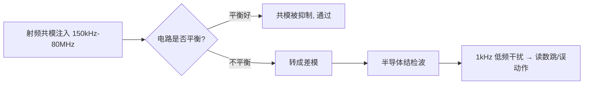

# EMC

## 问题模型
- EMC 问题都可拆成噪声源、耦合路径和受害者/天线；整改前先确认主导链路和频段。
- 差模电流沿功能回路流动；共模电流经寄生电容、屏蔽层、线缆、机壳和大地形成辐射。
- 传导发射、辐射发射、ESD、EFT、浪涌和辐射抗扰使用不同测试配置，不能用一种整改方法替代全部验证。

## 频域与测量
- dB 是比值单位；电压、电流、功率和场强的 dB 换算基准不同，报告中应标明测量量。
- 测量结果受线缆、负载、探头、接地、极化、频段、带宽和布置影响；整改前后必须固定配置。
- 近场探头用于定位源和回流路径，远场/暗室测试用于验证系统级辐射，不应互相替代。

## 抑制源与路径
- 缩小高 `di/dt` 和高 `dv/dt` 环路、降低不必要边沿、保持参考平面连续，是减少辐射和共模转换的基础。
- 接口保护器件靠近连接器；TVS 泄放路径短、宽、低电感，滤波器输入侧与输出侧不能在 PCB 上旁路耦合。
- 屏蔽、机壳接地、共模器件和磁珠必须按频段、直流电流、插损、钳位和泄放路径验证，不能盲目堆器件。
- 参考平面切割、长回流绕行、连接器地针不足和高速线跨域会把差模电流转换为共模电流。

## 抗扰设计
- ESD 保护关注钳位残压、寄生电容和泄放路径；EFT/浪涌还需校核能量、重复频率和电源入口保护。
- 敏感复位、时钟、模拟输入和高阻节点要远离接口入口、开关节点和大电流回路，并提供确定的参考和滤波。
- 整改优先级通常是先消除主导回路和参考中断，再调整边沿、屏蔽和滤波器件。

## 传导与辐射路径
- 电源线上的差模噪声通常与开关电流环路和输入/输出滤波相关；共模噪声常通过寄生电容耦合到线缆后辐射。
- 长线缆在特定频段可成为高效天线，接口处的参考和屏蔽连接方式往往比板内增加单个电容更关键。
- 高速差分对的共模转换来自不对称、过孔、连接器和参考中断，应从源头减少，而不是只在接口补共模器件。

## 整改流程
1. 固定测试配置，确认超标频段、极化和线缆状态。
2. 用近场探头和波形测量定位源、耦合路径与天线。
3. 先验证回流、环路面积、接地和屏蔽连续性。
4. 再比较端接、边沿控制、滤波、吸收和共模器件的效果。
5. 将有效修改回写原理图、PCB 规则和结构要求，避免只保留试验补丁。

## 设计文档要求
- 接口保护等级、测试标准、线缆条件和允许性能降级要在需求阶段明确。
- EMC 修改必须记录元件型号、位置、接地方式和测试结果，确保后续版本可复现。

## 验证清单
- [ ] 每个超标频点都有源、路径、受害者假设和复测方法。
- [ ] 传导、辐射、ESD、EFT、浪涌和抗扰测试配置已记录。
- [ ] 保护器件和滤波器的正常工作、带宽、温升和可靠性已验证。
- [ ] 整改前后波形、频谱、线缆、探头和极化条件可复现。

+### EMC知识条目 1
低频时代我们说"阻抗"，脑子里想的是 $Z=U/I$，一个电阻、一个电容的容抗，都是"元件的属性"。但到了高速领域，信号在一根 PCB 走线上跑，这根线本身还没有接到负载，它也会呈现出一个阻抗——这就是**特征阻抗**（Characteristic Impedance，$Z_0$）。

打个比方：你在一条很长的水管里推一股水流，水流"感受"到的阻力，取决于管径、管壁材质，而不取决于管子尽头接了什么。信号在 PCB 上传播时也是一样：信号是电磁波，它沿着导体和参考平面之间的介质向前"爬"，每往前走一小段，都要给这一小段线充上电容、给这一小段回路建立磁场。信号"往前走一步要付出的代价"，就是特征阻抗。

关键认知：**特征阻抗是传输线的固有属性，与线长无关，与末端负载无关**。50Ω 的线不管切 1cm 还是 10cm，信号刚出发时看到的都是 50Ω。

🔬 **深入原理**

把传输线切成无数微元，每段有分布电感 $L_0$（单位长度电感）和分布电容 $C_0$（单位长度电容），无损条件下：

$$Z_0=\sqrt{\frac{L_0}{C_0}}$$

有损情况下完整式为：

$$Z_0=\sqrt{\frac{R_0+j\omega L_0}{G_0+j\omega C_0}}$$

高频时 $\omega L_0 \gg R_0$、$\omega C_0 \gg G_0$，退化回 $\sqrt{L_0/C_0}$，这就是为什么高速下 $Z_0$ 近似为纯实数、与频率无关。

信号传播速度：

$$v=\frac{1}{\sqrt{L_0C_0}}=\frac{c}{\sqrt{\varepsilon_r}}$$

FR-4 的 $\varepsilon_r\approx 4.2$，则 $v\approx 1.46\times10^8\ \text{m/s}$，约 **6 mil/ps**（记住这个数：166 ps/inch，或约 6.7 ps/mm）。这是后面等长计算的命根子。

微带线（表层走线，单参考面）常用近似式：

$$Z_0\approx\frac{87}{\sqrt{\varepsilon_r+1.41}}\ln\!\left(\frac{5.98H}{0.8W+T}\right)$$

带状线（内层，双参考面）：

$$Z_0\approx\frac{60}{\sqrt{\varepsilon_r}}\ln\!\left(\frac{4H}{0.67\pi(0.8W+T)}\right)$$

物理含义一句话：$H$（线到参考面距离）↑ → $Z_0$↑；$W$（线宽）↑ → $Z_0$↓；$\varepsilon_r$↑ → $Z_0$↓；$T$（铜厚）↑ → $Z_0$略↓。

🛠 **设计实例/操作**

*例1：四层板做 50Ω 单端。* 板厚 1.6mm，叠层 TOP/GND/PWR/BOTTOM，TOP 到 GND 的介质厚 0.1mm（约 3.94mil），1oz 铜（1.4mil）。用嘉立创/Polar SI9000 算，线宽约 6.5～7mil 得到 50Ω。若把介质改成 0.2mm，同样 50Ω 需要线宽约 13～14mil——所以**薄介质是高密度布线的前提**。

*例2：100Ω 差分。* 内层差分带状线，线宽 5mil、线距 5mil、上下各 4mil 介质，差分阻抗约 100Ω。注意差分阻抗 $Z_{diff}\approx 2Z_{odd}$，不是 $2Z_0$，因为耦合使奇模阻抗低于单端阻抗。

```
   微带线截面                     带状线截面
  ┌────W────┐                      ┌───GND───┐
  ▓▓▓▓▓▓▓▓▓▓  ← 信号线              ▒▒▒▒ H1
  ▒▒▒▒▒▒▒▒▒▒  H (介质 εr)          ┌──W──┐
  ████████████ ← GND 参考平面        ▓▓▓▓▓▓  ← 信号线
                                    ▒▒▒▒ H2
                                   └───GND───┘
```

⚠️ **常见误区**

1. 以为"阻抗是用万用表能量出来的"。万用表量的是直流电阻，$Z_0$ 要用 TDR（时域反射计）或按叠层计算，两者毫无关系。
3. 把 $\varepsilon_r$ 当常数 4.2 用到 GHz。FR-4 的 $\varepsilon_r$ 随频率下降（10GHz 时约 3.9～4.0），高频设计要用板厂给的 Dk/Df 表。
4. 只控制线宽却忘了参考平面完整。参考面一破，$H$ 等效变大、$Z_0$ 突变，算得再准也白搭。


📌 **要点速记**

- $Z_0=\sqrt{L_0/C_0}$，是传输线固有属性，与线长、负载无关。
- FR-4 上信号速度约 **6 mil/ps（166 ps/inch）**，是等长换算的基准。
- $H$↑ 阻抗↑，$W$↑ 阻抗↓，$\varepsilon_r$↑ 阻抗↓。
- 差分阻抗 ≈ 2×奇模阻抗，耦合越紧差分阻抗越低。
- 阻抗控制的前提是**连续的参考平面**。


---
### EMC知识条目 2
反射的本质一句话：**信号在传播路径上遇到阻抗突变，就会有一部分能量原路返回**。

用最直观的比喻：一条粗绳接一条细绳，你在粗绳这头抖一下，波传到接头处，一部分继续往细绳走，一部分弹回来。PCB 上完全同理——走线 50Ω，突然接到一个 1kΩ 的输入引脚，信号"撞墙"就反弹。

那为什么低频不用管？因为**是否需要按传输线处理，取决于上升时间 $T_r$ 与传播延时 $T_d$ 的比值**，而不是时钟频率。一个 1kHz 的方波，如果上升沿只有 200ps，它照样会产生严重反射；一个 100MHz 的正弦波如果沿很缓，反而问题不大。

判据（工程常用）：当

$$T_d > \frac{T_r}{6} \quad\text{（保守取 } \frac{T_r}{10}\text{）}$$

时必须做传输线分析。等价说法：**关键长度**

$$L_{crit}=\frac{T_r \cdot v}{6}$$

🔬 **深入原理**

反射系数（在阻抗从 $Z_1$ 进入 $Z_2$ 的界面上）：

$$\Gamma=\frac{Z_2-Z_1}{Z_2+Z_1}$$

透射系数 $\tau = 1+\Gamma = \dfrac{2Z_2}{Z_1+Z_2}$。

三种极端情况必须刻进脑子：

| 末端条件 | $Z_L$ | $\Gamma$ | 现象 |
|---|---|---|---|
| 开路 | ∞ | +1 | 全反射，同相，末端电压翻倍（过冲） |
| 短路 | 0 | −1 | 全反射，反相，末端电压为 0（下冲） |
| 匹配 | $Z_0$ | 0 | 无反射，能量全部被吸收 |

再看信号刚发出时的**分压关系**。驱动器输出阻抗 $R_s$，走线 $Z_0$，信号刚出发时看不到负载，只看到 $Z_0$：

$$V_{launch}=V_{s}\cdot\frac{Z_0}{R_s+Z_0}$$

例如 3.3V 驱动、$R_s=20Ω$、$Z_0=50Ω$，则出发电压只有 $3.3\times50/70=2.36V$——这叫**初始台阶**。它不是"信号变弱了"，而是波还在路上，等末端反射回来才会叠加到全幅。

🛠 **设计实例/操作**

*例1：算关键长度。* 某 MCU IO 上升沿 $T_r=1\text{ns}$，FR-4 上 $v\approx6\text{ mil/ps}$。
$$L_{crit}=\frac{1000\text{ps}\times6\text{mil/ps}}{6}=1000\text{ mil}=25.4\text{ mm}$$
即超过约 2.5cm 就要考虑端接。若换成 FPGA 的 200ps 沿，$L_{crit}$ 只剩 5mm——这就是为什么高速器件旁边"随手一根线"都可能出问题。

*例2：估算过冲幅度。* 50Ω 线末端接 CMOS 输入（近似开路，$\Gamma_L=+1$），源端 $R_s=10Ω$（$\Gamma_S=(10-50)/60=-0.67$）。初始台阶 $3.3\times50/60=2.75V$，第一次末端反射后为 $2.75\times2=5.5V$——远超 3.3V+0.5V 的绝对最大额定值，长期会打坏输入 ESD 二极管。

⚠️ **常见误区**

1. **用时钟频率判断要不要控阻抗**。错。要看上升沿。经验换算：信号有效带宽 $f_{knee}\approx 0.35/T_r$。
2. 认为"反射只发生在末端"。任何阻抗突变点都反射：过孔、接插件、线宽突变、参考平面换层、桩线（stub）。
3. 认为过冲只是"波形难看"。它会造成 EMI 加剧、器件闩锁、长期可靠性下降。
4. 把 $\Gamma$ 的正负号搞反。记忆法：**遇大变正（过冲）、遇小变负（下冲）**。

📌 **要点速记**

- $\Gamma=(Z_2-Z_1)/(Z_2+Z_1)$；开路 +1、短路 −1、匹配 0。
- 判据是 $T_r$ 不是频率；$L_{crit}\approx T_r v/6$。
- 初始台阶由 $R_s$ 与 $Z_0$ 分压决定，不是故障。
- 有效带宽 $f_{knee}\approx0.35/T_r$，决定要关注多高频率的完整性。


---
### EMC知识条目 3
四种经典端接方式，可以按"电阻放在哪儿"来记：

| 方式 | 位置 | 典型值 | 直流功耗 | 适用场景 |
|---|---|---|---|---|
| 源端串联端接 | 驱动器旁 | $R=Z_0-R_{out}$，常 22～33Ω | 无 | 点对点、CMOS、时钟、SPI、SD |
| 并联端接（到GND/VCC） | 接收端 | $R=Z_0$ | 大 | 少用，功耗高 |
| 戴维南端接 | 接收端 | $R_1\parallel R_2=Z_0$ | 大 | TTL 电平、少量总线 |
| AC 端接（RC） | 接收端 | $R=Z_0$，$C$ 100pF～1nF | 极小 | 时钟等周期信号 |
| 二极管端接 | 接收端 | 肖特基钳位 | 小 | 保护为主，非匹配 |

🔬 **深入原理**

**源端串联端接**为什么最常用？它令 $\Gamma_S\approx0$：波第一次到末端全反射（$\Gamma_L=+1$）后回到源端被吸收，**一次往返即稳定**，且直流路径上无电流，几乎零功耗。代价是"半波"传输：线中间点电压只有一半，因此**中间不能挂负载**（点对点专用）。

$$R_{series}=Z_0-R_{out(driver)}$$

驱动器输出阻抗典型 10～25Ω，所以常见 22Ω、27Ω、33Ω。

**AC 端接**的时间常数要求：

$$\tau=RC \gg T_r,\quad \text{同时}\ \tau \ll \frac{T_{bit}}{2}$$

工程取 $C$ 使 $RC \approx 3\sim5\,T_r$。例如 $Z_0=50Ω$、$T_r=1\text{ns}$，取 $C=100\text{pF}$，$\tau=5\text{ns}$，合适。

**戴维南端接**：要求 $R_1\parallel R_2=Z_0$，且分压中点等于信号中心电平。例如 3.3V 系统、50Ω：$R_1=R_2=100Ω$，中点 1.65V，等效 50Ω，但静态电流 3.3V/200Ω=16.5mA，功耗 54mW/线——DDR2 之前的 SSTL 就是这么干的，很费电。

**差分对端接**：接收端跨接 100Ω（LVDS/以太网/USB），有时用 2×50Ω 到中点电容接地，同时吸收差模和共模。

🛠 **设计实例/操作**

*例1：SPI Flash 时钟串阻。* CLK 50MHz，但驱动沿 1.5ns，走线 40mm > $L_{crit}$。在**紧靠 MCU 引脚**（<200mil）串 22Ω，实测过冲从 1.2V 降到 0.2V 以内。注意：**串阻必须靠近驱动端，不是中间也不是接收端**。

*例2：以太网 RGMII。* 4 对数据 + 时钟，走线 60mm，各串 22Ω 于 MAC 侧；TX_CLK/RX_CLK 单独串阻并等长。若 PHY 侧驱动 RX 数据，需要在 PHY 侧串阻——**串阻跟着驱动方向走**，双向总线（如 DDR DQ）反而不适合单侧串阻，要用 ODT。


⚠️ **常见误区**

1. **串阻放到接收端**。放错位置等于没放，源端反射依然存在。
2. 在多点总线上用源端串接。中间节点会看到半幅台阶，逻辑误判。
3. 端接电阻用 1206 大封装。寄生电感大，高频失效，应选 0402/0201 薄膜电阻，且精度 1%。
4. 忘了驱动器本身有输出阻抗，直接串 50Ω 造成过阻尼、边沿变缓、时序不足。
5. 认为"加了端接就不用控阻抗"。端接只解决两端，中间的过孔/换层不连续照样反射。

📌 **要点速记**

- 源端串联端接性价比最高：零功耗、一次往返收敛，但仅限点对点。
- $R_{series}=Z_0-R_{out}$，必须紧贴驱动引脚。
- 并联/戴维南匹配效果好但耗电；AC 端接省电但只适合周期信号。
- 差分线用 100Ω 跨接；现代 DDR/SerDes 用片内 ODT 替代外部电阻。
- 端接治两端，受控阻抗治全程，两者缺一不可。


---
### EMC知识条目 4
初学者最容易忽略的一句话：**电流永远走回路，没有回路就没有电流**。你在 PCB 上画的那根信号线只是"去路"，还有一条看不见的"回路"，它走在参考平面上。

低频时，回流走**电阻最小**的路径——也就是在平面上大面积铺开、直奔电源地。但高频时，回流走**电感最小（阻抗最小）**的路径——它会紧紧贴着信号线的正下方回来，形成尽可能小的环路面积。

这个"高频回流紧贴信号线"的规律，是理解**串扰、EMI 辐射、地弹、参考面分割危害**的总钥匙。

🔬 **深入原理**

回流路径宽度近似满足：距信号线中心 $x$ 处的回流电流密度

$$i(x)=\frac{I_0}{\pi H}\cdot\frac{1}{1+(x/H)^2}$$

其中 $H$ 是信号线到参考面的高度。积分可知，**约 80% 回流集中在 $\pm 3H$ 范围内，97% 在 $\pm 20H$ 内**。$H=4\text{mil}$ 时，回流基本挤在信号线两侧 12mil 内——这就是"参考面只要在信号线正下方完整就行"的物理依据，也是**为什么跨分割如此致命**。

环路面积决定辐射。差模辐射远场公式（自由空间）：

$$E=1.32\times10^{-14}\cdot\frac{f^2\,A\,I}{r}\quad (\text{V/m})$$

其中 $f$ 单位 Hz，$A$ 为环路面积（m²），$I$ 为电流（A），$r$ 为距离（m）。**辐射正比于 $f^2$ 和环路面积 $A$**——把 $A$ 从 100mm² 降到 10mm²，辐射直接降 20dB。这是 EMC 设计里最便宜的 20dB。

换层带来的回流断点：信号从 L1（参考 L2-GND）换到 L4（参考 L3-GND），回流必须从 L2 跳到 L3。若附近没有 GND 过孔，回流被迫绕远路，环路面积暴增，等效串入电感：

$$L_{via}\approx 5.08h\left[\ln\frac{4h}{d}+1\right]\ \text{(nH, h/d 单位 inch)}$$

典型 1.6mm 板厚过孔约 1～1.5nH。

🛠 **设计实例/操作**

*例1：换层必伴地孔。* 高速信号每一个换层过孔，**在 100～200mil 内放 1～2 个 GND 过孔**（差分对可共用，放在对的两侧）。若两个参考面电压不同（GND↔PWR），则需在换层处放 0.01～0.1μF 去耦电容作为高频回流桥——但电容+过孔约 1～2nH，效果远不如 GND 过孔，能不跨就不跨。

*例2：绝不跨分割。* 下图左是灾难，右是正确做法：

```
 ✗ 错误：信号跨越平面缝隙            ✓ 正确：绕行或改参考面
  ┌──────────┬──────────┐            ┌──────────┬──────────┐
  │  GND     │  VCC     │            │  GND     │  VCC     │
  │   ───────┼──────▶   │            │  ──┐     │          │
  │          │          │            │    └───▶ │          │
  └──────────┴──────────┘            └──────────┴──────────┘
   回流被迫绕缝隙一圈                 回流始终在同一平面下方
   环路面积↑↑ → 辐射↑↑、串扰↑↑
```

*例3：接口区域。* USB/网口/HDMI 的走线下方参考面必须完整无缝，且不要有其它电源平面的"孤岛"横穿。

⚠️ **常见误区**

1. 以为"地就是地，到处都一样"。平面上不同点在高频下电位差可达几百 mV（地弹）。
2. 在平面上"挖槽"分割数字地/模拟地却让信号横穿槽——这是 90% EMC 超标案例的根因。
3. 认为电源平面不能当参考面。可以，只要电源平面完整且有足够去耦电容与地平面高频短接。
4. 只在信号过孔"附近某处"放地孔。要放在**紧邻（<100mil）**，距离越远等效电感越大。
5. 忽视连接器/排针区。排针一排全信号没有地针，回流无路可走，是辐射天线的经典成因——**每 2～4 根信号配 1 根地**。

📌 **要点速记**

- 高频回流紧贴信号线正下方，80% 集中在 ±3H 内。
- 辐射 $\propto f^2 \times$ 环路面积，最小化环路是最廉价的 EMC 手段。
- 换层必伴地孔（<100～200mil）；跨分割是大忌。
- 参考面变换（GND→PWR）需靠去耦电容做高频桥，效果不如同层 GND。
- 连接器/排针必须按比例配地针。


---
### EMC知识条目 5
两根线上的电流，可以分解成两个"视角"：

- **差模（Differential Mode, DM）**：两根线电流大小相等、方向相反。这是我们**想要**的信号形式。去和回的磁场互相抵消，环路小，辐射低。
- **共模（Common Mode, CM）**：两根线电流大小相等、方向相同，回流通过大地/机壳/线缆寄生电容回来。这是我们**不想要**的，环路巨大，是辐射超标的头号元凶。

一句话记住：**差模是信号，共模是麻烦**。

🔬 **深入原理**

数学分解：设两根线电压 $V_1$、$V_2$

$$V_{DM}=V_1-V_2,\qquad V_{CM}=\frac{V_1+V_2}{2}$$

电流：$I_{DM}=\dfrac{I_1-I_2}{2}$，$I_{CM}=I_1+I_2$

**关键的量级对比**：共模辐射远比差模可怕。共模辐射（单极子/线缆天线模型）：

$$E_{CM}=1.26\times10^{-6}\cdot\frac{f\,L\,I_{CM}}{r}\quad(\text{V/m})$$

对比差模式 $E_{DM}\propto f^2 A I_{DM}$。做个数值对比：3m 处、100MHz、线缆长 1m：产生 $30\ \mu V/m$ 只需 **8nA** 共模电流；而要靠差模达到同样场强，在 10cm² 环路里需要约 **200μA**。**共模电流的"辐射效率"高出四个数量级**——所以 EMC 整改 80% 的功夫都在压共模。

共模是怎么产生的？三大来源：

1. **不对称/不平衡**：差分对两根线长度不等（skew）、耦合不均、一根跨了分割 → 差模转共模（mode conversion）。$S_{cd21}$ 就是衡量这个的 S 参数。
2. **地电位差**：板内地弹、地阻抗压降驱动线缆共模。
3. **公共阻抗耦合**：多个电路共用一段地走线。

差模→共模转换与 skew 的关系（近似）：

$$V_{CM}\approx \frac{\Delta T_{skew}}{T_r}\cdot\frac{V_{DM}}{2}$$

所以差分对内**skew 必须远小于上升时间**，工程上常要求 $<5\%\,T_r$（USB3 要求 <5ps，DDR 差分 <2mil 长度差）。

🛠 **设计实例/操作**

*例1：共模扼流圈（CMC）选型。* USB2.0 用 90Ω@100MHz CMC，以太网用 100～200Ω CMC。原理：对差模磁通抵消、呈现极低阻抗（不影响信号）；对共模磁通叠加、呈现高阻抗（阻断噪声）。注意 CMC 本身不对称也会引入模式转换，高速链路要选低 $S_{cd21}$ 的型号。

*例2：差分对布线三原则。*
- **等长**：对内 skew 严控，蛇形补偿要靠近失配处补。
- **等距**：全程保持恒定间距，避免间距忽宽忽窄造成阻抗起伏。
- **对称**：换层同时换、过孔对称、绕线尽量对内自补偿而非单边绕。

```
差模 vs 共模 电流方向
   差模（好）              共模（坏）
  ──▶──── 线1            ──▶──── 线1
  ◀────── 线2            ──▶──── 线2
   磁场抵消，环路小        回流经机壳/大地，环路巨大
   辐射低                  辐射高（线缆变天线）
```

⚠️ **常见误区**

1. 认为"用了差分就一定抗干扰"。差分抗扰的前提是**平衡**，一旦不对称就退化。
2. 差分对内为补长度画大蛇形而在一根上绕、离失配点很远——中间那段变成了单端，反而制造共模。
3. 把差分对当成"两根普通线，间距远点也无所谓"。间距变化会改变差分阻抗。
4. 在差分线上一根加电阻/测试点另一根不加，人为制造不对称。
5. CMC 放的位置不对。应**紧靠连接器**，在 ESD 器件之后、走线进板之前。

📌 **要点速记**

- 差模是信号，共模是辐射元凶；共模辐射效率高出差模数个数量级。
- 共模三大来源：不对称、地电位差、公共阻抗耦合。
- 对内 skew 应 $<5\%\,T_r$，就近补偿。
- CMC 对差模低阻、对共模高阻，紧靠连接器放置。
- 差分布线三原则：等长、等距、对称。


---
### EMC知识条目 6
EMC（电磁兼容）= **EMI（发射，不害人）+ EMS（抗扰，不怕人）**。产品要过认证，两边都得达标。

标准体系速览：

```
EMC
├── EMI 电磁干扰（发射）
│   ├── CE  传导发射 (Conducted Emission)   150kHz~30MHz  测电源线
│   ├── RE  辐射发射 (Radiated Emission)    30MHz~1/6GHz  测空间场
│   ├── Harmonics 谐波电流   IEC 61000-3-2
│   └── Flicker 闪烁         IEC 61000-3-3
└── EMS 电磁抗扰（抗扰度）
    ├── ESD  静电放电       IEC 61000-4-2   ±4/8kV 接触/空气
    ├── RS   辐射抗扰       IEC 61000-4-3   3/10 V/m
    ├── EFT  电快速瞬变脉冲群 IEC 61000-4-4  ±1/2kV
    ├── Surge 浪涌          IEC 61000-4-5   ±1/2/4kV
    ├── CS   传导抗扰       IEC 61000-4-6   3/10 Vrms
    ├── PFMF 工频磁场       IEC 61000-4-8
    └── DIP  电压跌落中断    IEC 61000-4-11
```

常用产品标准：信息技术类 CISPR 32/35（原 CISPR 22/24）、家电 CISPR 14、工业 IEC 61000-6-2/-6-4、车载 CISPR 25 / ISO 11452。

🔬 **深入原理**

**干扰三要素模型**：干扰源 → 耦合路径 → 敏感设备。整改也只有三条路：

1. **抑制源**：降低 $dv/dt$、$di/dt$，展频（SSC），选边沿更缓的驱动，减小环路。
2. **切断耦合**：滤波、屏蔽、隔离、增大距离、改变布局。
3. **加固受体**：提高抗扰门限、加钳位、软件容错（看门狗、CRC 重传）。

**耦合四类**：传导耦合、公共阻抗耦合、容性（电场）耦合、感性（磁场）耦合、辐射耦合。近场（$r<\lambda/2\pi$）以电场或磁场单独为主，远场（$r>\lambda/2\pi$）以平面波为主，波阻抗趋于 377Ω。分界距离：

$$r_{boundary}=\frac{\lambda}{2\pi}=\frac{c}{2\pi f}$$

100MHz 时约 0.48m——所以 3m 法测试是远场，板级探头是近场。

**限值举例**（CISPR 32 Class B，3m 法辐射，准峰值 QP）：

| 频段 | 限值 |
|---|---|
| 30～230 MHz | 30 dBμV/m |
| 230～1000 MHz | 37 dBμV/m |

Class A（工业）比 Class B（家用）宽松约 10dB。设计时应留 **6dB 以上余量**。

🛠 **设计实例/操作**

*例1：估算你产品的关键频点。* 时钟 25MHz、上升沿 2ns，则拐点频率 $f_{knee}=0.35/2\text{ns}=175\text{MHz}$。意味着 25MHz 的谐波在 175MHz 之前衰减很慢（20dB/dec），之后加速（40dB/dec）。测试超标常出现在 3、5、7 次谐波（75/125/175MHz），整改优先看这些点。

*例2：三层防线设计法。* 芯片级（去耦、边沿控制）→ 板级（分区、地设计、回流）→ 系统级（屏蔽壳、滤波器、线缆处理）。**越早处理成本越低**：原理图阶段改一颗电容 = 0 元；量产后加屏蔽罩 = 每台几元 + 认证重测。

⚠️ **常见误区**

1. 认为"EMC 是最后测试的事"。80% 的 EMC 结果在布局布线阶段就已注定。
2. 把 EMI 和 EMS 混为一谈，甚至用相反的手段（比如为了过 ESD 加大电容，却恶化了信号完整性）。
3. 迷信"加屏蔽罩万能"。屏蔽罩如果接地不良、有大缝隙，反而成为谐振腔。缝隙长度接近 $\lambda/2$ 时几乎不屏蔽。
4. 只关注辐射不关注传导。CE 超标往往是开关电源共模问题，与 RE 同源。

📌 **要点速记**

- EMC = EMI（发射）+ EMS（抗扰），两者都要过。
- 整改三条路：抑源、断耦合、加固受体。
- 远近场分界 $\lambda/2\pi$；CISPR 32 Class B 30～230MHz 限值 30 dBμV/m。
- $f_{knee}=0.35/T_r$ 决定你的噪声频谱能延伸多高。
- EMC 成本随设计阶段推后呈指数上升。


---
### EMC知识条目 7
dB 的本质：**把乘除变成加减的对数刻度**。为什么要它？因为 EMC 里的量级跨度太大——从 1μV 到 1V 就是 6 个数量级，用线性坐标画不出来；而且级联系统的增益/衰减是相乘关系，取对数后变成相加，心算方便。

🔬 **深入原理**

两套定义，务必分清：

- **功率量**：$\text{dB}=10\log_{10}\dfrac{P_2}{P_1}$
- **场量（电压/电流/场强）**：$\text{dB}=20\log_{10}\dfrac{V_2}{V_1}$

为什么场量用 20？因为 $P\propto V^2$，$10\log(V^2)=20\log V$。

**绝对单位**（带参考基准）：

| 单位 | 参考基准 | 公式 |
|---|---|---|
| dBμV | 1 μV | $20\log_{10}(V/1\mu V)$ |
| dBμV/m | 1 μV/m | $20\log_{10}(E/1\mu V/m)$ |
| dBm | 1 mW | $10\log_{10}(P/1mW)$ |
| dBμA | 1 μA | $20\log_{10}(I/1\mu A)$ |

**必背换算表**（场量）：

| 倍数 | dB | 倍数 | dB |
|---|---|---|---|
| ×2 | +6 | ×10 | +20 |
| ×4 | +12 | ×100 | +40 |
| ×√2 | +3 | ×1000 | +60 |
| ×0.5 | −6 | ×0.1 | −20 |

**dBm ↔ dBμV（50Ω 系统）**：

$$\text{dB}\mu V = \text{dBm} + 107$$

推导：0 dBm = 1mW，在 50Ω 上 $V=\sqrt{PR}=\sqrt{0.001\times50}=0.2236V=223600\mu V$，$20\log(223600)=107\text{ dB}\mu V$。

🛠 **设计实例/操作**

*例1：读懂测试报告。* 报告写"120MHz 处 QP = 42.5 dBμV/m，限值 30 dBμV/m，余量 −12.5dB"。
反推场强：$E=10^{42.5/20}=133\ \mu V/m$，限值 $10^{30/20}=31.6\ \mu V/m$。
超标 12.5dB ≈ 场强超了约 4.2 倍。要达标需**至少衰减 12.5dB，工程上按 18dB（留 6dB 余量）设计整改**。18dB ≈ 场强降到 1/8，对应"环路面积降到 1/8"或"共模电流降到 1/8"。

*例2：滤波器级联。* 一个 π 型滤波器 −25dB，加一个 CMC −15dB，理想级联 −40dB。但**实测往往只有 −30dB**，因为两级之间存在耦合、寄生参数、阻抗失配。所以别指望简单相加。

*例3：EMI 接收机的三种检波。* 峰值(Peak) ≥ 准峰值(QP) ≥ 平均值(AVG)。预扫用 Peak 快速定位（快但严格），终测按标准用 QP/AVG。若 Peak 就已经在限值以下，直接合格，不必再测 QP。

```
读图口诀
  余量 = 限值 − 实测   （正数=合格，负数=超标）
  −6dB  ≈ 幅度减半
  −20dB ≈ 幅度降到 1/10
  整改目标 = 超标量 + 6dB 余量
```

⚠️ **常见误区**

1. **功率用 20log、电压用 10log**——搞反是最常见的低级错误。
2. dB 与 dBμV 混用。dB 是相对量（无量纲），dBμV 是绝对量。"衰减了 20dBμV"这句话是错的，应说"衰减了 20dB"。
3. 认为"合格就行"。产线一致性、温度、老化都会漂，**必须留 6dB 余量**，关键频点建议 10dB。
4. 用 Peak 值超标就慌。Peak 是最严格的检波方式，QP 通常低几个 dB，AVG 更低。
5. dBm+107 这个换算只在 50Ω 系统成立，别套到高阻测量上。

📌 **要点速记**

- 功率 $10\log$，电压/场强/电流 $20\log$。
- ×2=+6dB，×10=+20dB，牢记这两条能心算大部分问题。
- 50Ω 下 dBμV = dBm + 107。
- 余量 = 限值 − 实测；整改目标 = 超标量 + 6dB。
- 检波严格度：Peak ≥ QP ≥ AVG。

+### EMC进阶知识条目 1
传导发射（Conducted Emission, CE）测的是：**你的设备通过电源线往电网里"倒灌"了多少噪声**。频段通常 150kHz～30MHz（CISPR 32/14/11 等）。

测试怎么做？被测设备（EUT）的电源线接到 **LISN（线路阻抗稳定网络，又叫人工电源网络 AMN）**，LISN 的作用有三：

1. 给 EUT 提供干净的市电（滤掉电网自身噪声）；
2. 在 150kHz～30MHz 内提供**标准化的 50Ω 阻抗**，保证不同实验室结果可比；
3. 把 EUT 产生的噪声耦合到 EMI 接收机（通过 0.1μF + 1kΩ 的取样支路）。

🔬 **深入原理**

CE 噪声同样分共模与差模：

- **差模噪声（DM）**：在 L 与 N 之间流动，主要来自开关电源输入电容的高频纹波电流（$di/dt$ 在输入回路）。频段偏低（150kHz～数 MHz）。
- **共模噪声（CM）**：L 和 N 同向流出，经由 **Y 电容/寄生电容 → 大地（PE）** 回来。主因是开关管漏极（高 $dv/dt$ 节点）对散热片/机壳的寄生电容 $C_p$。频段偏高（几 MHz～30MHz）。

共模位移电流：

$$i_{CM}=C_p\cdot\frac{dv}{dt}$$

举例：MOSFET 漏极到散热片 $C_p=30\text{pF}$，$dv/dt=10\text{kV}/\mu s=10^{10}\text{V/s}$，则 $i_{CM}=0.3\text{A}$ 峰值脉冲——这就是超标的元凶。

LISN 上两路（L、N）分别测得 $V_L$、$V_N$，可分离：

$$V_{CM}=\frac{V_L+V_N}{2},\qquad V_{DM}=\frac{V_L-V_N}{2}$$

有专门的 **CM/DM 分离器**可以直接测，整改效率高很多。

限值举例（CISPR 32 Class B，AC 电源端口）：

| 频段 | QP | AVG |
|---|---|---|
| 0.15～0.5 MHz | 66→56 dBμV（随 log 频率线性下降） | 56→46 dBμV |
| 0.5～5 MHz | 56 dBμV | 46 dBμV |
| 5～30 MHz | 60 dBμV | 50 dBμV |

🛠 **设计实例/操作**

*例1：判断是 CM 还是 DM。* 一个实用土办法：在 EUT 与 LISN 之间的电源线上**套一个大磁环（绕几圈）**。如果超标点明显下降 → 共模为主；几乎不变 → 差模为主。这一步能省掉一半的盲目整改。

*例2：测试布置的坑。* 桌面设备置于 0.8m 高木桌，距参考接地板 0.4m（垂直）/0.8m（水平）；多余电源线**折成 30～40cm 的 8 字捆扎**，不能盘成大圈（会变天线）。布置不规范导致的复测在实验室极常见。

```
传导测试拓扑
  电网 ──[LISN L]──┬── L ──▶ EUT
        [LISN N]──┼── N ──▶ EUT
                  │  PE ──▶ EUT外壳
                  └──▶ 50Ω ──▶ EMI 接收机
  参考接地板（金属地板）与 LISN 外壳、EUT PE 良好搭接
```

⚠️ **常见误区**

1. 认为 CE 是"电源工程师的事"。数字板的时钟噪声一样会通过 DC-DC、地耦合到输入端。
2. 一超标就狂加 X/Y 电容。Y 电容受**漏电流安规限制**（一般 ≤3.5mA，对应 220V/50Hz 时 Y 电容总量约 ≤4.7nF），加过头无法过安规。
3. 忽略 PE 线。二类设备（无 PE）的共模回路只能靠寄生电容，整改思路完全不同。
4. 用普通示波器在电源线上量"噪声"就下结论。示波器噪底、带宽、检波方式与 EMI 接收机完全不同。

📌 **要点速记**

- CE 频段 150kHz～30MHz，用 LISN 提供 50Ω 标准阻抗并取样。
- 低频段多为差模（输入回路 $di/dt$），高频段多为共模（$C_p \cdot dv/dt$）。
- $i_{CM}=C_p\,dv/dt$，减小 $dv/dt$ 或 $C_p$ 是治本。
- 磁环试探法可快速判别 CM/DM。
- Y 电容受安规漏电流限制，不能无限加。


---
### EMC进阶知识条目 2
传导超标的整改，本质是给噪声修一条"回家的近路"，同时在通往电网的路上设卡。核心工具是 **EMI 输入滤波器**。

一个典型 AC 输入 EMI 滤波器：

```
 L ──┬──[ X1 ]──┬──▮▮▮ CMC ▮▮▮──┬──[ X2 ]──┬──▶ 整流桥
     │          │   （共模扼流圈） │          │
    保险丝     压敏                          ├─[Y1]─┐
     │          │                            │      ├── PE
 N ──┴──────────┴──▮▮▮────────────┴─[Y2]─────┘
```

各元件分工：

| 元件 | 抑制对象 | 原理 |
|---|---|---|
| X 电容（L-N 之间） | 差模 | 给差模电流就近短路 |
| Y 电容（L/N 对 PE） | 共模 | 把共模电流引回 PE，缩小环路 |
| CMC 共模扼流圈 | 共模 | 对共模呈高阻（mH 级），对差模低阻 |
| 差模电感 / CMC 漏感 | 差模 | 串联高阻 |
| 磁珠 / 铁氧体 | 高频 | 等效为高频电阻，耗散能量 |

🔬 **深入原理**

滤波器是"阻抗失配"器件，插入损耗依赖源阻抗与负载阻抗：

$$IL(\text{dB})=20\log_{10}\left|\frac{V_{without}}{V_{with}}\right|$$

**阻抗失配原则**：噪声源阻抗低 → 用串联电感阻挡；噪声源阻抗高 → 用并联电容旁路。所以：
- 差模噪声源（输入电容回路）阻抗低 → 优先加差模电感/CMC 漏感。
- 共模噪声源阻抗高（寄生电容耦合） → Y 电容效果显著。

CMC 的共模阻抗：$Z_{CM}=j\omega L_{CM}$，典型 $L_{CM}$ 为 1～10mH，在 1MHz 时 $Z$ 达数 kΩ。但 CMC 有**自谐振频率 SRF**，超过 SRF 后寄生电容主导，阻抗反而下降——所以高频段常需再加一级小磁环或磁珠。

滤波器截止频率（LC 二阶）：

$$f_c=\frac{1}{2\pi\sqrt{LC}}$$

理论 −40dB/dec。设计时让 $f_c$ 比最低超标频点低 5～10 倍。

**衰减目标计算**：超标 12dB → 目标 18dB → 若单级 −40dB/dec，需要 $f_c$ 满足 $18=40\log(f/f_c)$，即 $f/f_c=10^{0.45}=2.8$，取 $f_c \le f_{超标}/3$。

🛠 **设计实例/操作**

*例1：0.5MHz 超标 10dB（差模为主）。* 输入端 X 电容从 0.22μF 增至 0.47μF，并串入 1mH 差模电感（或选漏感更大的 CMC）。$f_c=1/(2\pi\sqrt{1\text{mH}\times0.47\mu F})=7.3\text{kHz}$，在 0.5MHz 处理论衰减很大，实测可降 12～15dB。

*例2：15MHz 超标（共模为主）。* 15MHz 已超过多数 CMC 的 SRF，加大 CMC 电感值往往无效甚至更差。正确做法：
- 在输出线上套**镍锌材质小磁环**（高频阻抗好）；
- 减小开关节点铜皮面积，降低 $C_p$；
- 变压器加**屏蔽层（法拉第屏蔽）**并接原边地；
- MOSFET 栅极电阻适当加大，减缓 $dv/dt$（代价是效率）。

*例3：布局是滤波器的一半。* 滤波器输入端与输出端走线**绝不能平行靠近**，否则高频直接空间耦合"跨过"滤波器，实测衰减腰斩。滤波器区域下方**不要铺连续地平面连到数字地**，应独立并单点搭接机壳。

⚠️ **常见误区**

1. **只换元件不改布局**。滤波器失效 80% 是布局问题：输入输出耦合、Y 电容回流路径长、地环路大。
2. Y 电容走线绕远。Y 电容到 PE 的路径必须**极短、宽**，否则等效电感抵消其作用。
3. 一味加大 CMC 电感。超过 SRF 后无效；应改用多级、不同材质（锰锌低频/镍锌高频）组合。
4. 忽略安规。X 电容需 X1/X2 等级 + 泄放电阻（断电后 1s 内降到 37%）；Y 电容需 Y1/Y2 等级。
5. 用陶瓷电容当 X 电容。X 电容必须是安规认证的薄膜电容。

📌 **要点速记**

- X 电容治差模，Y 电容+CMC 治共模。
- 阻抗失配原则：低阻源用串感，高阻源用并容。
- CMC 有 SRF，高频段需换材质或加磁环。
- 滤波器输入/输出走线必须隔离，Y 电容回 PE 路径要极短。
- 安规限制 Y 电容容量与漏电流，不能无限堆料。


---
### EMC进阶知识条目 3
CS（Conducted Susceptibility，传导抗扰度，IEC 61000-4-6）模拟的场景是：**在 150kHz～80MHz 频段，外界电磁场在线缆上感应出共模电压，顺着线缆灌进设备**。

为什么是这个频段？因为 80MHz 以下，波长（>3.75m）远大于普通设备尺寸，机壳不能有效接收电磁波，但**线缆长度接近 $\lambda/4$，成了高效接收天线**。80MHz 以上则改用辐射抗扰（RS，IEC 61000-4-3）直接照射。

测试等级：Level 1 = 1V、Level 2 = 3V、Level 3 = 10V（rms，未调制载波），实测时用 **1kHz 正弦、80% AM 调幅**，扫频步进 1%，每点驻留 ≥0.5s。

🔬 **深入原理**

注入方式三种：

| 方式 | 器件 | 特点 |
|---|---|---|
| CDN（耦合去耦网络） | CDN-M2/M3、AF、T2 等 | 首选，阻抗标准 150Ω |
| EM-Clamp（电磁钳） | 钳夹线缆 | 无法用 CDN 时（如屏蔽线） |
| 直接注入（BCI/直接耦合） | 100Ω 电阻注入 | 同轴/单线场合 |

**150Ω 共模阻抗**是这个标准的核心参数——它代表人体/线缆对地的典型共模阻抗。CDN 保证注入点看到 150Ω。

设备内部为什么会误动作？共模电压 $V_{CM}$ 通过**不平衡**转成差模干扰：

$$V_{DM}=V_{CM}\cdot\frac{\Delta Z}{Z}$$

$\Delta Z/Z$ 就是电路的不平衡度。差分接收电路（RS-485、以太网）平衡好，抗扰强；单端信号（UART、GPIO、模拟采样）平衡差，容易被击穿。

此外 80MHz 以下的干扰还会被半导体结**检波（rectification）**——PN 结的非线性把射频包络解调出来，变成 1kHz 的低频干扰，直接叠加到运放/ADC 输入，表现为读数跳动。这就是为什么调制是 80% AM 1kHz：**它专门检验解调敏感度**。

🛠 **设计实例/操作**

*例1：模拟采样口被干扰。* 4-20mA 输入在 20MHz 附近读数跳 ±5%。整改：
- 输入端加 **RC 低通**（如 100Ω + 1nF，$f_c=1.6\text{MHz}$）；
- 运放输入引脚就近加 10～100pF 到地（射频旁路）；
- 差分走线，增加共模抑制；
- 线缆入口加 CMC 或磁环。

*例2：I/O 口复位。* 长线 GPIO 在 5MHz 处触发复位。整改：GPIO 加 TVS + 串 100Ω + 1nF 对地；软件加去抖与看门狗；PCB 上把该信号的地回流路径缩短。



⚠️ **常见误区**

1. 只在软件上打补丁（滤波算法）。射频检波产生的是真实模拟量，软件无法完全消除。
2. 在信号线上加大电容却忽略上升沿要求，导致通信速率不达标。要按 $f_c$ 与信号带宽折中。
3. 认为屏蔽线一定好。屏蔽层若**只单端接地或接地阻抗高**，反而成为共模注入通道。高频应 360° 环接。
4. 忘记电源端口也要做 CS。DC 电源输入端同样需要 CMC + Y 电容。
5. 把 CS 与 EFT/Surge 混淆。CS 是持续射频，EFT 是脉冲群，Surge 是大能量单脉冲，防护器件完全不同。

📌 **要点速记**

- CS = IEC 61000-4-6，150kHz～80MHz，共模注入，150Ω 标准阻抗。
- 用 1kHz/80% AM 调制，专门考核半导体结的检波敏感度。
- 不平衡度决定共模→差模转换，平衡设计是根本。
- 端口整改套路：CMC/磁环 + RC 低通 + 就近射频旁路电容 + TVS。
- 屏蔽层需 360° 低阻接地才有效。


---
### EMC进阶知识条目 4
核心对照表（记住波形与能量量级，选型就不会错）：

| 实验 | 标准 | 波形 | 重复率 | 能量 | 典型防护 |
|---|---|---|---|---|---|
| EFT 脉冲群 | 61000-4-4 | 5/50 ns | 5 或 100 kHz 突发 | 小（能量低、频谱宽到几百 MHz） | Y 电容、CMC、TVS、缩短地路径 |
| Surge 浪涌 | 61000-4-5 | 1.2/50 μs 电压，8/20 μs 电流 | 单次，正负各 5 次 | **大**（可达数百 A） | GDT + 压敏 + TVS 三级配合 |
| RS 辐射抗扰 | 61000-4-3 | 80MHz～1/6GHz，3～10 V/m | 扫频 | — | 屏蔽、滤波、平衡设计 |
| DIP 电压跌落 | 61000-4-11 | 0%/40%/70% 跌落 | — | — | 大容量输入电容、掉电检测 |
| PFMF 工频磁场 | 61000-4-8 | 50Hz，30～100 A/m | 持续 | — | 远离、屏蔽（高导磁材料）、减小环路 |

🔬 **深入原理**

**EFT 的本质**：5ns 上升沿意味着频谱延伸到 $0.35/5\text{ns}=70\text{MHz}$ 甚至更高，且是**共模**注入（通过容性耦合夹或耦合网络）。它能量不大，但频率高，专挑寄生电容与地环路的漏洞。**EFT 整改的关键是"给共模电流一条尽量短的返回路径"**——所以 Y 电容、机壳搭接、屏蔽层接地至关重要。

**Surge 的本质**：1.2/50μs 波形，开路电压 $U_{oc}$、短路电流 $I_{sc}$，源阻抗 2Ω（线对线）或 12Ω（线对地）。2kV/2Ω = 1000A 峰值。这么大的能量，**必须靠能量泄放器件而不是滤波**。

三级防护配合的关键是**能量配合**（用阻抗梯度）：

```
 线路 ──[GDT 气体放电管]──/\/\/── [MOV 压敏]──/\/\/── [TVS]── 内部电路
        （kA 级, 响应 μs）  退耦   （几百A, 响应 ns）  退耦   （几十A, 响应 ps）
                        电感/PTC/电阻          小电阻
```

没有中间退耦阻抗，后级 TVS 会先动作被烧毁。TVS 选型三要素：
- $V_{RWM}$（反向工作电压）> 电路最高工作电压；
- $V_{BR}$（击穿电压）留 10% 余量；
- $V_{C}$（钳位电压）< 被保护器件耐压；
- $P_{PP}$ 峰值功率满足波形要求（10/1000μs 与 8/20μs 的额定不同，别混用）。

**电压跌落**：设计要点是输入储能电容能撑过跌落时间：

$$C\ge\frac{2P\cdot t_{hold}}{V_{nom}^2-V_{min}^2}$$

🛠 **设计实例/操作**

*例1：以太网口浪涌 ±2kV 共模。* 变压器（隔离）+ Bob Smith 电路（4×75Ω 汇到 1000pF/2kV 电容到机壳）+ 中心抽头对机壳的高压电容。若是 PoE，还要加 GDT。切忌把 Bob Smith 的地直接连数字地。

*例2：EFT ±2kV 电源口导致 MCU 复位。* 排查顺序：
1. 复位引脚是否有 0.1μF 电容和上拉；
2. 晶振布线是否远离电源入口；
3. 输入端 Y 电容到机壳的路径是否够短；
4. 机壳与 PCB 地的搭接是否多点低阻；
5. 长线 I/O 是否加了共模磁环。

*例3：工频磁场。* 霍尔传感器/互感器附近别放变压器；敏感回路面积最小化；必要时用**坡莫合金/硅钢**做磁屏蔽（铝铜屏蔽对 50Hz 磁场几乎无效）。

⚠️ **常见误区**

1. 用 TVS 直接扛 Surge。单个小封装 TVS（SMAJ）在 2kV/2Ω 下会炸；必须前级泄放。
2. 把 8/20μs 与 10/1000μs 的额定功率混用，选型偏小。
3. 认为 ESD 器件能兼做浪涌。ESD 器件电容小但能量小；浪涌器件能量大但电容大，高速口要权衡。
4. EFT 整改只想着加电容，忽略机壳搭接与地设计。
5. 抗扰测试时把 EUT 悬空放置。测试布置（10cm 绝缘垫、参考接地板、线缆长度）严重影响结果。

📌 **要点速记**

- EFT 频谱宽、能量小 → 治共模路径；Surge 能量大 → 三级泄放 + 阻抗退耦。
- TVS 选型看 $V_{RWM}/V_{BR}/V_C/P_{PP}$，注意波形定义。
- 保护器件动作顺序靠退耦阻抗保证。
- 工频磁场只能用高导磁材料屏蔽，铝/铜无效。
- 抗扰失败先查"地"与"搭接"，再查器件。


---
### EMC进阶知识条目 5
辐射发射（RE）测的是设备向空间辐射的电磁场强度，频段 30MHz～1GHz（有高频时钟的要测到 6GHz）。3m 法或 10m 法半电波暗室，天线在 1～4m 高度扫描，EUT 转台 360° 旋转，水平/垂直双极化，取最大值。

**最关键的认知**：在 30MHz～1GHz 频段，PCB 本身尺寸（10cm 量级）对应 $\lambda/4$ 约在 750MHz 才谐振，所以**1GHz 以下的辐射，主要天线是线缆和机壳缝隙，而不是 PCB 走线本身**。PCB 的作用是"驱动源"——它把共模电压加到了线缆上。

$$\text{PCB 共模噪声} \xrightarrow{\text{驱动}} \text{线缆(天线)} \xrightarrow{} \text{辐射超标}$$

🔬 **深入原理**

**两种辐射模型**：

差模（环路天线）：
$$E_{DM}=1.32\times10^{-14}\frac{f^2 A I_{DM}}{r}\ \text{V/m}$$

共模（单极子天线）：
$$E_{CM}=1.26\times10^{-6}\frac{f L I_{CM}}{r}\ \text{V/m}$$

**谐振长度**：线缆长度 $L=\lambda/4$ 时辐射效率最高。

$$f_{res}=\frac{c}{4L}\Rightarrow L=1\text{m}\to 75\text{MHz};\ L=0.5\text{m}\to150\text{MHz}$$

看到 75MHz、150MHz、300MHz 附近的宽峰，先怀疑线缆。

**缝隙泄漏**：屏蔽罩缝隙长度 $\ell$ 的屏蔽效能

$$SE(\text{dB})\approx 20\log_{10}\frac{\lambda}{2\ell}$$

$\ell=\lambda/2$ 时 SE=0，完全不屏蔽。所以设计规则：**最长缝隙 < $\lambda_{min}/20$**。1GHz（λ=300mm）→ 缝隙 <15mm；缝合过孔间距同理。

**PCB 边缘辐射（Fringing）**：电源/地平面边缘的边缘场会辐射，解决办法是 **20H 规则**（电源平面比地平面内缩 20 倍介质厚度）与**板边缝合地过孔**（间距 ≤ $\lambda_{min}/20$，工程常取 100～200mil）。

🛠 **设计实例/操作**

*例1：定位超标源。* 用近场探头（H 场环 + E 场棒）在板上扫，配合频谱仪：
- 时钟晶振周围强 → 晶振布局/屏蔽/串阻；
- DC-DC 开关节点强 → 缩小 SW 铜皮、加输入环路电容、加 RC 缓冲；
- 连接器处强 → 共模问题，加 CMC/磁环；
- 用手捏/拔线缆后读数大变 → 确认线缆是天线。

*例2：整改优先级（成本从低到高）。*
1. 改布局布线（缩小环路、完整参考面、换层伴地孔）——免费
2. 时钟串阻 22～33Ω、展频 SSC（±1% 可降 6～10dB）——几分钱
3. 接口加共模磁环/CMC——几毛钱
4. 加屏蔽罩/导电泡棉/铜箔——几元
5. 改叠层/改板——重新打样

*例3：SSC 展频。* 把 100MHz 时钟以 30kHz 三角波调制 ±0.5%，能量被摊到更宽频带，QP 读数可降 6～12dB。注意：**USB/以太网/DDR 有各自对 SSC 的容忍规范，不能乱开**（如 USB3 支持 −0.5% 下展）。

⚠️ **常见误区**

1. 只盯着 PCB 走线，忘了线缆才是主天线。
2. 屏蔽罩接地只焊四个角。应沿边多点焊接，间距 < $\lambda/20$。
3. 开孔散热用大方孔。应改成**多个小圆孔阵列**（同样开孔率，屏蔽效能高很多）。
4. 用展频掩盖问题。SSC 降的是"测量读数"，实际峰值能量还在，对邻近敏感电路照样干扰。
5. 忽略 1GHz 以上。有 DDR4/USB3/HDMI 的产品必须测到 3～6GHz，此时 PCB 走线本身就能辐射。

📌 **要点速记**

- 1GHz 以下辐射的主天线是线缆与缝隙，PCB 提供共模驱动源。
- 共模辐射 $\propto f L I_{CM}$，差模辐射 $\propto f^2 A I_{DM}$。
- $\lambda/4$ 谐振：1m 线 → 75MHz，重点排查。
- 缝隙/缝合孔间距 < $\lambda_{min}/20$；散热孔用小圆孔阵列。
- 整改按"布局→串阻/展频→磁环→屏蔽"的成本顺序推进。


---
### EMC进阶知识条目 6
静电放电（ESD）是人体或物体积累的电荷在接触瞬间释放。它的特点是：**电压极高（kV 级）、电流很大（几十 A）、但持续时间极短（ns 级）、总能量很小（mJ 级）**。

IEC 61000-4-2 人体模型（HBM）等效电路：**150pF 电容 + 330Ω 电阻**。

放电波形（8kV 接触放电）：
- 上升时间 **0.6～1 ns**（！比大多数数字信号还快）
- 首峰电流约 **30 A**
- 30ns 时约 16A，60ns 时约 8A

上升时间 1ns 意味着频谱延伸到 **1GHz 以上**——这就是 ESD 难防的根本原因：它不是"电压问题"，而是"高频问题"。任何几 nH 的引线电感在 30A/1ns 的 $di/dt$ 下都会产生巨大压降：

$$V=L\frac{di}{dt}=1\text{nH}\times\frac{30\text{A}}{1\text{ns}}=30\text{V}$$

**1nH 就是 30V！** 这句话是 ESD 防护布局的全部精髓。

🔬 **深入原理**

测试等级（接触放电/空气放电）：

| 等级 | 接触放电 | 空气放电 |
|---|---|---|
| 1 | ±2 kV | ±2 kV |
| 2 | ±4 kV | ±4 kV |
| 3 | ±6 kV | ±8 kV |
| 4 | ±8 kV | ±15 kV |

评判等级：A（正常）、B（可自恢复的性能降低）、C（需人工干预恢复）、D（永久损坏）。消费电子一般要求 A 或 B。

放电方式：直接接触放电（金属外壳、连接器外壳）、空气放电（缝隙、按键）、**间接放电（HCP 水平耦合板、VCP 垂直耦合板）**——间接放电是靠场耦合，很多产品栽在这里。

防护器件关键参数：

| 参数 | 含义 | 高速接口要求 |
|---|---|---|
| $C_j$ 结电容 | 对信号的容性负载 | USB2 <3pF；USB3/HDMI <0.5pF |
| $V_{RWM}$ | 工作电压 | > 信号电平 |
| $V_{clamp}$ | 钳位电压 | < 芯片耐压 |
| $R_{dyn}$ 动态电阻 | 决定大电流下钳位 | 越小越好 |

钳位电压实际值：$V_{clamp}=V_{BR}+I_{PP}\cdot R_{dyn}$，再加上 PCB 引线电感压降。

🛠 **设计实例/操作**

*例1：ESD 器件布局黄金法则。*

```
 ✓ 正确                              ✗ 错误
 连接器 ─┬─ 走线 ─── 芯片            连接器 ─── 走线 ─┬─ 芯片
         │                                            │
       [TVS]                                        [TVS]
         │ 极短极粗                                    │ 长走线
        GND 过孔×2（就近）                            GND
 TVS 紧靠连接器，泄放路径不经过芯片    ESD 电流已经流过芯片才被钳位
```

三条铁律：
1. **TVS 必须在连接器与芯片之间，且紧靠连接器**（<5mm）；
2. **接地引线极短极宽**，最好双过孔直下 GND 平面；
3. **ESD 泄放路径不能与敏感信号并行**，泄放走线下方要有完整地。

*例2：结构层面。* 缝隙处加导电泡棉/弹片；塑胶壳内侧喷导电漆并接机壳地；金属按键下方放泄放环（ring）并接机壳；螺丝柱做接地柱。

*例3：机壳地与信号地。* 常用做法是**通过 1000pF/2kV 电容 + 1MΩ 电阻并联**连接，或在多点用 0Ω 电阻预留（调试时可换）。高频给电容路径，直流靠电阻泄放，避免地环路。

⚠️ **常见误区**

1. 以为"电压高就要选大功率器件"。ESD 能量很小，关键是**速度与低阻抗路径**，不是功率。
2. TVS 放在芯片旁边。等于让 ESD 电流先穿过芯片。
3. 高速口用大电容 TVS。USB3 上放 3pF 器件，眼图直接崩，必须用 <0.5pF 的专用 ESD 阵列。
4. 只做接触放电试验就放心。空气放电和间接放电（HCP/VCP）经常更容易失败。
5. 用普通稳压二极管替代 TVS。响应速度慢几个数量级，来不及钳位。
6. 忽视软件恢复。B 级判据允许自恢复，看门狗 + 寄存器周期重载 + 通信重传，是低成本达标手段。

📌 **要点速记**

- ESD 上升沿 <1ns、峰值 30A，本质是高频问题；1nH 引线 = 30V。
- HBM 模型：150pF + 330Ω。
- TVS 紧靠连接器、接地路径最短最宽，是防护第一原则。
- 高速接口必须选低结电容（<0.5pF）ESD 器件。
- 机壳地与信号地用 1nF/2kV 电容 + 1MΩ 并联连接。


---
### EMC进阶知识条目 7
电源既是"受害者"也是"加害者"：芯片开关时从电源抽取瞬态电流，如果电源网络（PDN）阻抗高，就会产生电压波动（纹波、地弹、SSN 同步开关噪声），这些波动既让芯片工作不稳，也通过平面/线缆辐射出去。

核心目标：**在关注频段内把 PDN 阻抗压到目标值以下**。

$$Z_{target}=\frac{V_{dd}\times \text{Ripple}\%}{I_{max\_transient}}$$

例：1.2V 内核、允许 3% 纹波、瞬态电流 5A：

$$Z_{target}=\frac{1.2\times0.03}{5}=7.2\ \text{m}\Omega$$

🔬 **深入原理**

**电容不是理想电容**。实际模型是 RLC 串联：

$$Z=R_{ESR}+j\left(\omega L_{ESL}-\frac{1}{\omega C}\right)$$

自谐振频率：

$$f_{SRF}=\frac{1}{2\pi\sqrt{L_{ESL}C}}$$

低于 SRF 呈容性（阻抗随频率下降），高于 SRF 呈**感性**（阻抗随频率上升，电容失效！）。在 SRF 处阻抗最低 = ESR。

典型 0402 MLCC 的 $L_{ESL}\approx0.5\text{nH}$（含焊盘、过孔可到 1～2nH）：

| 容值 | 理论 SRF（ESL=1nH） |
|---|---|
| 10 μF | 1.6 MHz |
| 1 μF | 5 MHz |
| 100 nF | 16 MHz |
| 10 nF | 50 MHz |
| 1 nF | 159 MHz |

**关键结论**：100MHz 以上，任何分立电容都已呈感性——高频只能靠**平面电容**和**片内电容**。

平面电容：

$$C_{plane}=\varepsilon_0\varepsilon_r\frac{A}{d}$$

面积 100cm²、介质 0.1mm、$\varepsilon_r=4.2$：$C\approx372\text{pF}$——值不大，但 ESL 极低（pH 级），高频表现优异。所以**电源/地平面紧邻（薄介质）是高频去耦的王道**。

**反谐振**：不同容值电容并联时，大电容的感性区与小电容的容性区之间会形成并联谐振峰，阻抗反而升高。所以**不要把容值拉得太开（相邻容值差 10 倍以内），并且多用同容值并联（并 10 个 100nF 比 1 个 1μF+1 个 10nF 更平坦）**。现代做法：**同一容值多颗并联 + 依靠平面电容补高频**。

**地弹（SSN）**：$N$ 个 IO 同时翻转：

$$V_{gnd\_bounce}=N\cdot L_{gnd}\frac{di}{dt}$$

🛠 **设计实例/操作**

*例1：去耦电容放置。* 优先级：**过孔距离 > 容值**。0.1μF 放在离芯片 5mm 处、走 3mm 细线，其引线电感 3nH 已经让它在 30MHz 以上完全失效。正确做法：
- 电容焊盘**紧贴芯片电源引脚**（<2mm）；
- 每个焊盘配**独立过孔**，过孔尽量短（薄板/背钻/盲孔）；
- 双过孔并联可把电感减半；
- 电容与过孔用**短而宽的铜皮**连接，不要用细线。

```
 ✓ 最佳             ✓ 良好            ✗ 差
  ▣●  ●▣            ▣ ● ● ▣          ▣──●   ●──▣
 （过孔在焊盘两侧    （过孔紧邻）       （细长引线, ESL大）
   互为反向, 互感抵消）
```

*例2：DC-DC 布局四要点。*
1. **输入回路面积最小**：$C_{in}$ 紧贴 VIN 与 GND 引脚——这是整个开关电源里 $di/dt$ 最大的环路，也是辐射主源。
2. **SW 节点铜皮尽量小**：它是 $dv/dt$ 最大的节点，铜皮大 = 电场天线。
3. **反馈线远离 SW 和电感**，从输出电容处取样，走内层并有地包围。
4. **散热铜皮与地平面多过孔连接**，兼顾散热与低阻。

*例3：磁珠使用。* 磁珠给模拟电源做隔离时要小心：磁珠（感性）+ 电容 = LC 谐振，可能在几百 kHz 放大噪声 10dB。必须**加阻尼**（并联小电阻，或选 ESR 较大的钽电容/加 1Ω 串阻）。

⚠️ **常见误区**

1. 认为"电容越大越好"。大容值 SRF 低，高频完全无效。
2. 盲目堆多种容值（10μF+1μF+100nF+10nF+1nF），制造多个反谐振峰。
3. 去耦电容离芯片远、共用过孔。等于没放。
4. 电源平面与地平面之间隔了很厚介质。应把 PWR/GND 相邻且介质尽量薄（<0.1mm）。
5. 在敏感模拟电源上滥用磁珠不加阻尼，引入谐振放大。

📌 **要点速记**

- $Z_{target}=V\cdot\text{Ripple}\%/I_{max}$，PDN 设计的第一步。
- 电容有 SRF，超过后变电感；100MHz 以上靠平面电容与片内电容。
- 去耦"位置比容值重要"，过孔电感是主要瓶颈。
- 避免反谐振：同容值多并联优于多容值混搭。
- DC-DC 布局：输入环路最小、SW 铜皮最小、反馈线最远。

## 2026-09 新增 EMI/EMC 要点

- 整改仍按“源—耦合路径—受体”定位；1 GHz 以下辐射常由线缆和机壳缝隙承担天线角色，PCB 的主要作用是控制共模驱动和回流。
- ESD、EFT、Surge 和辐射抗扰的波形、能量与测试配置不同。ESD 重点是纳秒级低电感泄放；EFT 重点是高频共模回路；Surge 需要按能量和阻抗做分级泄放，不能用单个小 TVS 代替。
- 接口 TVS 应靠近连接器，泄放路径短、宽、直接回到参考平面；高速接口还必须同时检查结电容、钳位残压和信号完整性。
- 辐射定位优先使用近场探头配合频谱仪区分晶振、开关节点、连接器和线缆源，再按布局、边沿、共模器件、屏蔽的成本顺序整改。
- PDN 的目标阻抗可用 `Ztarget = Vdd × 允许纹波 / 瞬态电流` 初估；电容位置、过孔电感和反谐振必须通过阻抗或波形测量确认。

## 2026-09 新增：接地环路、浮地与机壳地

**来源**：`接地、分割与叠层——模数混合PCB设计五套视频整合详解总结 2026-09-09.md` 第十一章。

- **接地环路的形成**：当两个接地点之间存在电位差，又有第二条导电通路（屏蔽层、线缆屏蔽与地两端同时接地、机壳与信号地多点搭接），就会形成环路；环路面积越大，对外磁场耦合越强，既抬升辐射也降低抗扰度。
- **破除方法**：① 环路面积最小化（地平面就近回流）；② 一端接地（屏蔽层单端接地）；③ 磁环/共模扼流圈提高共模阻抗；④ 需要两端接地时改用高频旁路（电容搭接）提供低感通路。
- **浮地系统的代价**：浮地可隔离地环路，但**缺少 ESD 泄放路径**，且整板对地形成寄生电容后相当于一根天线，容易在 ESD/EFT 下发生电位漂移与放电。浮地必须配明确的泄放通路（Y 电容、TVS、气体放电管）与绝缘耐压核算。
- **DGND / AGND / 机壳地的三方关系**：数字地与模拟地的关系见 [[wiki/PCB/模拟与采集模块|模拟与采集模块]]（"通常不分割"与"单点分地"两种口径）；机壳地（PE）用于承接 ESD 与共模电流，应通过**低阻抗、短而宽**的路径与板内地连接（常用多点搭接 + Y 电容组合），不要把机壳地当作信号回流路径。
- 与接口保护联动：连接器处的 TVS/ESD 器件泄放路径必须短、宽、直接回到参考平面或机壳地，见 [[wiki/PCB/连接器保护与EMC模块|连接器、保护与 EMC 模块]]。

## 来源定位
- `原始备份/01_提高篇全集...md`：共模/差模、传导、辐射、ESD、接口和地设计。
- `原始备份/【Altium Academy】信号完整性...md`：回流、串扰、接口和 EMC 联合设计。
- `原始备份/Altium Academy EMI-EMC 电磁干扰与电磁兼容 2024 全6讲总结.md`：EMI/EMC 测试、ESD/EFT/Surge、共模辐射和整改流程。
- `原始备份/【Altium Academy】信号完整性...（详解版）2026-09-08.md`：SI 与 EMC 联合分析、PDN 和测量边界。
- `原始备份/接地、分割与叠层——模数混合PCB设计五套视频整合详解总结 2026-09-09.md`：接地环路破除、浮地代价与泄放通路、DGND/AGND/机壳地的三方关系（2026-09-10 接入）。
