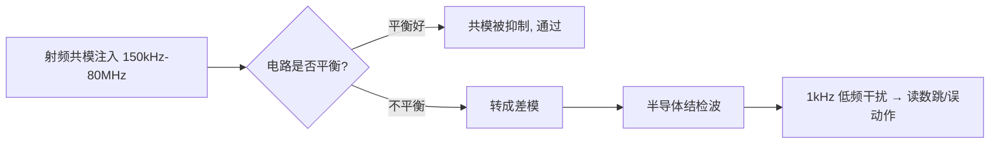
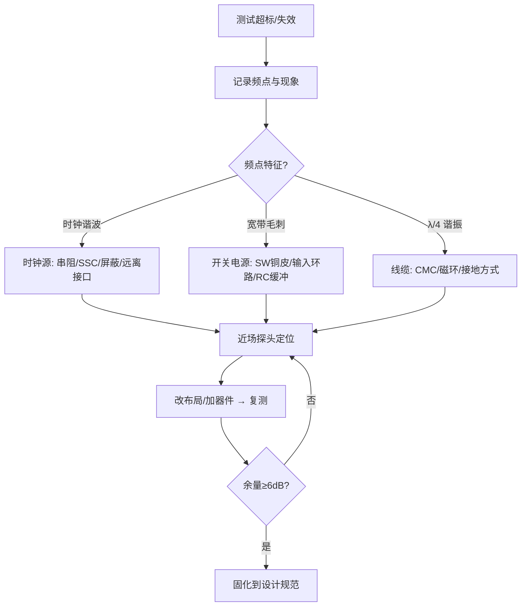
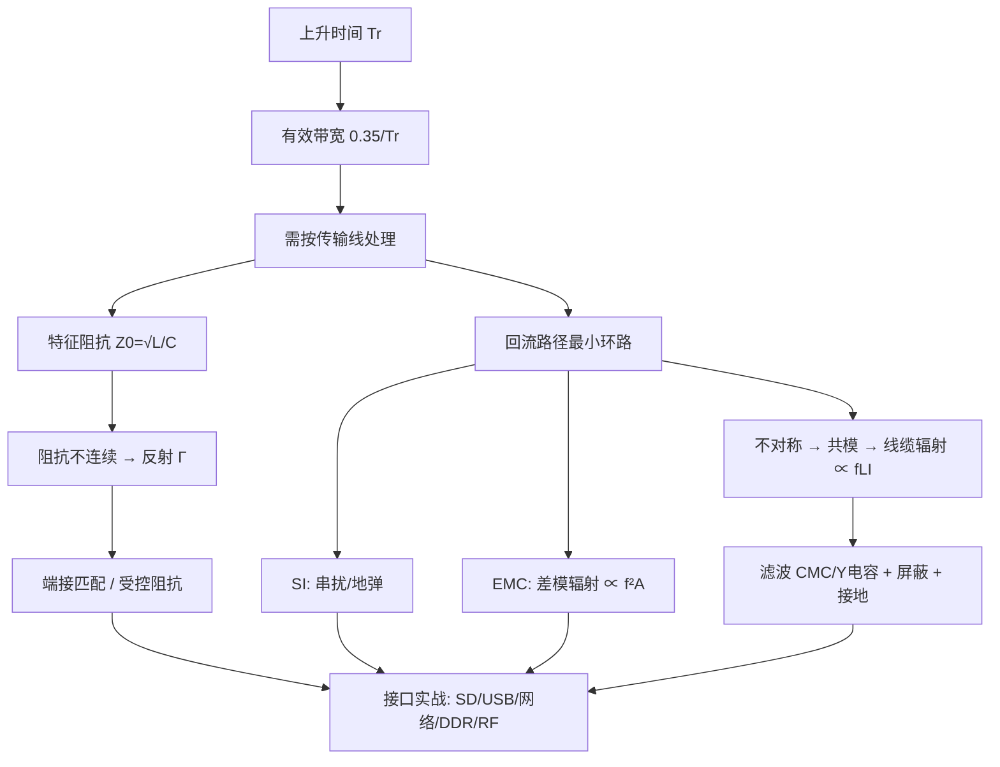

# PI（电源完整性）

## PDN 模型
- 电源分配网络由稳压器、走线/平面、过孔、封装、去耦电容和芯片内部电容组成；任一段高阻抗都可能成为噪声源。
- 目标阻抗 `Ztarget = ΔVallow / ΔIstep`，要求 PDN 在负载瞬态涉及的频段内低于目标阻抗。
- 低频主要由稳压器控制，中频由大容量电容和局部平面承担，高频由小封装低 ESL 去耦和芯片内部电容承担。

## 电容与谐振
- 电容阻抗可近似 `ZC = ESR + j(ωESL - 1/(ωC))`；在自谐振频率以下呈容性，以上由 ESL 主导而呈感性。
- 多个不同容量电容并联并不一定单调降低阻抗，ESR、ESL 和平面电感可能产生反谐振峰。
- 选型应按有效容量、直流偏压降额、温度、封装和目标频段比较，而不是只看标称微法数。

## 平面与回路
- 高频电流优先沿负载电源脚、去耦电容、地过孔和参考平面形成最小电感闭环。
- 电源/地过孔阵列、平面颈缩、换层和连接器引脚都会增加寄生电感；宽度不能替代回路连续性。
- 分割电源域时要同时检查信号回流，不能为了“模拟/数字隔离”切断高速信号下方参考平面。

## 噪声来源与抑制
- 负载 di/dt、稳压器开关节点、公共阻抗耦合、地弹和外部接口都可能把噪声注入电源。
- PSRR 只能削弱通过器件传递的输入噪声，不能替代本地去耦、低阻抗回路和合理布局。
- 磁珠、滤波器和分区必须按频段、直流电流、偏置和谐振风险验证；盲目串磁珠可能恶化瞬态或形成新谐振。

## 验证方法
- 用负载阶跃测量电压跌落、过冲、恢复时间和纹波；最坏组合包括最大 di/dt、最小电压和最高温度。
- 用阻抗分析、网络分析或仿真识别反谐振峰，并与目标阻抗曲线比较。
- 将实测波形与 PDN 模型中的 ESR、ESL、平面和过孔参数回填，形成模型闭环。

## 频段分工与布局细节
- 本地去耦的有效频段由封装、焊盘、过孔和芯片电源脚共同决定；将电容放得很近通常比单纯减小容量更重要。
- 多个相同容值小封装电容并联可降低等效 ESL，但必须关注电源脚可达性与地过孔共享造成的瓶颈。
- 电源岛过小会增大平面电感和压降；过大而无分区会增加噪声耦合，取舍要由电流频谱和负载敏感度决定。
- 通过电源与地平面形成的平面电容只在相邻平面距离较小、回路连续时有效，不能作为取消局部去耦的理由。

## 负载瞬态判读
- 电压第一次下跌主要由局部寄生电感和电容供电能力决定；后续恢复由稳压器带宽、输出电容和环路动态决定。
- 测量纹波必须使用短地弹簧或同轴连接；长探头地线会把磁场耦合误判为电源噪声。
- 目标阻抗是预算工具，不是单一通过判据；还需结合绝对电压范围、抖动敏感度和功能错误率。

## 常见误区
- 只增加一个大电容不能解决高速负载瞬态。
- 只按不同容值堆叠不分析反谐振，可能在关键频点放大噪声。
- 用磁珠隔离所有电源域会增加 DC 压降并可能形成阻抗峰。

+### PI知识条目 1
初学者最容易忽略的一句话：**电流永远走回路，没有回路就没有电流**。你在 PCB 上画的那根信号线只是"去路"，还有一条看不见的"回路"，它走在参考平面上。

低频时，回流走**电阻最小**的路径——也就是在平面上大面积铺开、直奔电源地。但高频时，回流走**电感最小（阻抗最小）**的路径——它会紧紧贴着信号线的正下方回来，形成尽可能小的环路面积。

这个"高频回流紧贴信号线"的规律，是理解**串扰、EMI 辐射、地弹、参考面分割危害**的总钥匙。

🔬 **深入原理**

回流路径宽度近似满足：距信号线中心 $x$ 处的回流电流密度

$$i(x)=\frac{I_0}{\pi H}\cdot\frac{1}{1+(x/H)^2}$$

其中 $H$ 是信号线到参考面的高度。积分可知，**约 80% 回流集中在 $\pm 3H$ 范围内，97% 在 $\pm 20H$ 内**。$H=4\text{mil}$ 时，回流基本挤在信号线两侧 12mil 内——这就是"参考面只要在信号线正下方完整就行"的物理依据，也是**为什么跨分割如此致命**。

环路面积决定辐射。差模辐射远场公式（自由空间）：

$$E=1.32\times10^{-14}\cdot\frac{f^2\,A\,I}{r}\quad (\text{V/m})$$

其中 $f$ 单位 Hz，$A$ 为环路面积（m²），$I$ 为电流（A），$r$ 为距离（m）。**辐射正比于 $f^2$ 和环路面积 $A$**——把 $A$ 从 100mm² 降到 10mm²，辐射直接降 20dB。这是 EMC 设计里最便宜的 20dB。

换层带来的回流断点：信号从 L1（参考 L2-GND）换到 L4（参考 L3-GND），回流必须从 L2 跳到 L3。若附近没有 GND 过孔，回流被迫绕远路，环路面积暴增，等效串入电感：

$$L_{via}\approx 5.08h\left[\ln\frac{4h}{d}+1\right]\ \text{(nH, h/d 单位 inch)}$$

典型 1.6mm 板厚过孔约 1～1.5nH。

🛠 **设计实例/操作**

*例1：换层必伴地孔。* 高速信号每一个换层过孔，**在 100～200mil 内放 1～2 个 GND 过孔**（差分对可共用，放在对的两侧）。若两个参考面电压不同（GND↔PWR），则需在换层处放 0.01～0.1μF 去耦电容作为高频回流桥——但电容+过孔约 1～2nH，效果远不如 GND 过孔，能不跨就不跨。

*例2：绝不跨分割。* 下图左是灾难，右是正确做法：

```
 ✗ 错误：信号跨越平面缝隙            ✓ 正确：绕行或改参考面
  ┌──────────┬──────────┐            ┌──────────┬──────────┐
  │  GND     │  VCC     │            │  GND     │  VCC     │
  │   ───────┼──────▶   │            │  ──┐     │          │
  │          │          │            │    └───▶ │          │
  └──────────┴──────────┘            └──────────┴──────────┘
   回流被迫绕缝隙一圈                 回流始终在同一平面下方
   环路面积↑↑ → 辐射↑↑、串扰↑↑
```

*例3：接口区域。* USB/网口/HDMI 的走线下方参考面必须完整无缝，且不要有其它电源平面的"孤岛"横穿。

⚠️ **常见误区**

1. 以为"地就是地，到处都一样"。平面上不同点在高频下电位差可达几百 mV（地弹）。
2. 在平面上"挖槽"分割数字地/模拟地却让信号横穿槽——这是 90% EMC 超标案例的根因。
3. 认为电源平面不能当参考面。可以，只要电源平面完整且有足够去耦电容与地平面高频短接。
4. 只在信号过孔"附近某处"放地孔。要放在**紧邻（<100mil）**，距离越远等效电感越大。
5. 忽视连接器/排针区。排针一排全信号没有地针，回流无路可走，是辐射天线的经典成因——**每 2～4 根信号配 1 根地**。

📌 **要点速记**

- 高频回流紧贴信号线正下方，80% 集中在 ±3H 内。
- 辐射 $\propto f^2 \times$ 环路面积，最小化环路是最廉价的 EMC 手段。
- 换层必伴地孔（<100～200mil）；跨分割是大忌。
- 参考面变换（GND→PWR）需靠去耦电容做高频桥，效果不如同层 GND。
- 连接器/排针必须按比例配地针。


---
### PI知识条目 2
EMC（电磁兼容）= **EMI（发射，不害人）+ EMS（抗扰，不怕人）**。产品要过认证，两边都得达标。

标准体系速览：

```
EMC
├── EMI 电磁干扰（发射）
│   ├── CE  传导发射 (Conducted Emission)   150kHz~30MHz  测电源线
│   ├── RE  辐射发射 (Radiated Emission)    30MHz~1/6GHz  测空间场
│   ├── Harmonics 谐波电流   IEC 61000-3-2
│   └── Flicker 闪烁         IEC 61000-3-3
└── EMS 电磁抗扰（抗扰度）
    ├── ESD  静电放电       IEC 61000-4-2   ±4/8kV 接触/空气
    ├── RS   辐射抗扰       IEC 61000-4-3   3/10 V/m
    ├── EFT  电快速瞬变脉冲群 IEC 61000-4-4  ±1/2kV
    ├── Surge 浪涌          IEC 61000-4-5   ±1/2/4kV
    ├── CS   传导抗扰       IEC 61000-4-6   3/10 Vrms
    ├── PFMF 工频磁场       IEC 61000-4-8
    └── DIP  电压跌落中断    IEC 61000-4-11
```

常用产品标准：信息技术类 CISPR 32/35（原 CISPR 22/24）、家电 CISPR 14、工业 IEC 61000-6-2/-6-4、车载 CISPR 25 / ISO 11452。

🔬 **深入原理**

**干扰三要素模型**：干扰源 → 耦合路径 → 敏感设备。整改也只有三条路：

1. **抑制源**：降低 $dv/dt$、$di/dt$，展频（SSC），选边沿更缓的驱动，减小环路。
2. **切断耦合**：滤波、屏蔽、隔离、增大距离、改变布局。
3. **加固受体**：提高抗扰门限、加钳位、软件容错（看门狗、CRC 重传）。

**耦合四类**：传导耦合、公共阻抗耦合、容性（电场）耦合、感性（磁场）耦合、辐射耦合。近场（$r<\lambda/2\pi$）以电场或磁场单独为主，远场（$r>\lambda/2\pi$）以平面波为主，波阻抗趋于 377Ω。分界距离：

$$r_{boundary}=\frac{\lambda}{2\pi}=\frac{c}{2\pi f}$$

100MHz 时约 0.48m——所以 3m 法测试是远场，板级探头是近场。

**限值举例**（CISPR 32 Class B，3m 法辐射，准峰值 QP）：

| 频段 | 限值 |
|---|---|
| 30～230 MHz | 30 dBμV/m |
| 230～1000 MHz | 37 dBμV/m |

Class A（工业）比 Class B（家用）宽松约 10dB。设计时应留 **6dB 以上余量**。

🛠 **设计实例/操作**

*例1：估算你产品的关键频点。* 时钟 25MHz、上升沿 2ns，则拐点频率 $f_{knee}=0.35/2\text{ns}=175\text{MHz}$。意味着 25MHz 的谐波在 175MHz 之前衰减很慢（20dB/dec），之后加速（40dB/dec）。测试超标常出现在 3、5、7 次谐波（75/125/175MHz），整改优先看这些点。

*例2：三层防线设计法。* 芯片级（去耦、边沿控制）→ 板级（分区、地设计、回流）→ 系统级（屏蔽壳、滤波器、线缆处理）。**越早处理成本越低**：原理图阶段改一颗电容 = 0 元；量产后加屏蔽罩 = 每台几元 + 认证重测。

⚠️ **常见误区**

1. 认为"EMC 是最后测试的事"。80% 的 EMC 结果在布局布线阶段就已注定。
2. 把 EMI 和 EMS 混为一谈，甚至用相反的手段（比如为了过 ESD 加大电容，却恶化了信号完整性）。
3. 迷信"加屏蔽罩万能"。屏蔽罩如果接地不良、有大缝隙，反而成为谐振腔。缝隙长度接近 $\lambda/2$ 时几乎不屏蔽。
4. 只关注辐射不关注传导。CE 超标往往是开关电源共模问题，与 RE 同源。

📌 **要点速记**

- EMC = EMI（发射）+ EMS（抗扰），两者都要过。
- 整改三条路：抑源、断耦合、加固受体。
- 远近场分界 $\lambda/2\pi$；CISPR 32 Class B 30～230MHz 限值 30 dBμV/m。
- $f_{knee}=0.35/T_r$ 决定你的噪声频谱能延伸多高。
- EMC 成本随设计阶段推后呈指数上升。


---
### PI知识条目 3
CS（Conducted Susceptibility，传导抗扰度，IEC 61000-4-6）模拟的场景是：**在 150kHz～80MHz 频段，外界电磁场在线缆上感应出共模电压，顺着线缆灌进设备**。

为什么是这个频段？因为 80MHz 以下，波长（>3.75m）远大于普通设备尺寸，机壳不能有效接收电磁波，但**线缆长度接近 $\lambda/4$，成了高效接收天线**。80MHz 以上则改用辐射抗扰（RS，IEC 61000-4-3）直接照射。

测试等级：Level 1 = 1V、Level 2 = 3V、Level 3 = 10V（rms，未调制载波），实测时用 **1kHz 正弦、80% AM 调幅**，扫频步进 1%，每点驻留 ≥0.5s。

🔬 **深入原理**

注入方式三种：

| 方式 | 器件 | 特点 |
|---|---|---|
| CDN（耦合去耦网络） | CDN-M2/M3、AF、T2 等 | 首选，阻抗标准 150Ω |
| EM-Clamp（电磁钳） | 钳夹线缆 | 无法用 CDN 时（如屏蔽线） |
| 直接注入（BCI/直接耦合） | 100Ω 电阻注入 | 同轴/单线场合 |

**150Ω 共模阻抗**是这个标准的核心参数——它代表人体/线缆对地的典型共模阻抗。CDN 保证注入点看到 150Ω。

设备内部为什么会误动作？共模电压 $V_{CM}$ 通过**不平衡**转成差模干扰：

$$V_{DM}=V_{CM}\cdot\frac{\Delta Z}{Z}$$

$\Delta Z/Z$ 就是电路的不平衡度。差分接收电路（RS-485、以太网）平衡好，抗扰强；单端信号（UART、GPIO、模拟采样）平衡差，容易被击穿。

此外 80MHz 以下的干扰还会被半导体结**检波（rectification）**——PN 结的非线性把射频包络解调出来，变成 1kHz 的低频干扰，直接叠加到运放/ADC 输入，表现为读数跳动。这就是为什么调制是 80% AM 1kHz：**它专门检验解调敏感度**。

🛠 **设计实例/操作**

*例1：模拟采样口被干扰。* 4-20mA 输入在 20MHz 附近读数跳 ±5%。整改：
- 输入端加 **RC 低通**（如 100Ω + 1nF，$f_c=1.6\text{MHz}$）；
- 运放输入引脚就近加 10～100pF 到地（射频旁路）；
- 差分走线，增加共模抑制；
- 线缆入口加 CMC 或磁环。

*例2：I/O 口复位。* 长线 GPIO 在 5MHz 处触发复位。整改：GPIO 加 TVS + 串 100Ω + 1nF 对地；软件加去抖与看门狗；PCB 上把该信号的地回流路径缩短。



⚠️ **常见误区**

1. 只在软件上打补丁（滤波算法）。射频检波产生的是真实模拟量，软件无法完全消除。
2. 在信号线上加大电容却忽略上升沿要求，导致通信速率不达标。要按 $f_c$ 与信号带宽折中。
3. 认为屏蔽线一定好。屏蔽层若**只单端接地或接地阻抗高**，反而成为共模注入通道。高频应 360° 环接。
4. 忘记电源端口也要做 CS。DC 电源输入端同样需要 CMC + Y 电容。
5. 把 CS 与 EFT/Surge 混淆。CS 是持续射频，EFT 是脉冲群，Surge 是大能量单脉冲，防护器件完全不同。

📌 **要点速记**

- CS = IEC 61000-4-6，150kHz～80MHz，共模注入，150Ω 标准阻抗。
- 用 1kHz/80% AM 调制，专门考核半导体结的检波敏感度。
- 不平衡度决定共模→差模转换，平衡设计是根本。
- 端口整改套路：CMC/磁环 + RC 低通 + 就近射频旁路电容 + TVS。
- 屏蔽层需 360° 低阻接地才有效。


---
### PI知识条目 4
静电放电（ESD）是人体或物体积累的电荷在接触瞬间释放。它的特点是：**电压极高（kV 级）、电流很大（几十 A）、但持续时间极短（ns 级）、总能量很小（mJ 级）**。

IEC 61000-4-2 人体模型（HBM）等效电路：**150pF 电容 + 330Ω 电阻**。

放电波形（8kV 接触放电）：
- 上升时间 **0.6～1 ns**（！比大多数数字信号还快）
- 首峰电流约 **30 A**
- 30ns 时约 16A，60ns 时约 8A

上升时间 1ns 意味着频谱延伸到 **1GHz 以上**——这就是 ESD 难防的根本原因：它不是"电压问题"，而是"高频问题"。任何几 nH 的引线电感在 30A/1ns 的 $di/dt$ 下都会产生巨大压降：

$$V=L\frac{di}{dt}=1\text{nH}\times\frac{30\text{A}}{1\text{ns}}=30\text{V}$$

**1nH 就是 30V！** 这句话是 ESD 防护布局的全部精髓。

🔬 **深入原理**

测试等级（接触放电/空气放电）：

| 等级 | 接触放电 | 空气放电 |
|---|---|---|
| 1 | ±2 kV | ±2 kV |
| 2 | ±4 kV | ±4 kV |
| 3 | ±6 kV | ±8 kV |
| 4 | ±8 kV | ±15 kV |

评判等级：A（正常）、B（可自恢复的性能降低）、C（需人工干预恢复）、D（永久损坏）。消费电子一般要求 A 或 B。

放电方式：直接接触放电（金属外壳、连接器外壳）、空气放电（缝隙、按键）、**间接放电（HCP 水平耦合板、VCP 垂直耦合板）**——间接放电是靠场耦合，很多产品栽在这里。

防护器件关键参数：

| 参数 | 含义 | 高速接口要求 |
|---|---|---|
| $C_j$ 结电容 | 对信号的容性负载 | USB2 <3pF；USB3/HDMI <0.5pF |
| $V_{RWM}$ | 工作电压 | > 信号电平 |
| $V_{clamp}$ | 钳位电压 | < 芯片耐压 |
| $R_{dyn}$ 动态电阻 | 决定大电流下钳位 | 越小越好 |

钳位电压实际值：$V_{clamp}=V_{BR}+I_{PP}\cdot R_{dyn}$，再加上 PCB 引线电感压降。

🛠 **设计实例/操作**

*例1：ESD 器件布局黄金法则。*

```
 ✓ 正确                              ✗ 错误
 连接器 ─┬─ 走线 ─── 芯片            连接器 ─── 走线 ─┬─ 芯片
         │                                            │
       [TVS]                                        [TVS]
         │ 极短极粗                                    │ 长走线
        GND 过孔×2（就近）                            GND
 TVS 紧靠连接器，泄放路径不经过芯片    ESD 电流已经流过芯片才被钳位
```

三条铁律：
1. **TVS 必须在连接器与芯片之间，且紧靠连接器**（<5mm）；
2. **接地引线极短极宽**，最好双过孔直下 GND 平面；
3. **ESD 泄放路径不能与敏感信号并行**，泄放走线下方要有完整地。

*例2：结构层面。* 缝隙处加导电泡棉/弹片；塑胶壳内侧喷导电漆并接机壳地；金属按键下方放泄放环（ring）并接机壳；螺丝柱做接地柱。

*例3：机壳地与信号地。* 常用做法是**通过 1000pF/2kV 电容 + 1MΩ 电阻并联**连接，或在多点用 0Ω 电阻预留（调试时可换）。高频给电容路径，直流靠电阻泄放，避免地环路。

⚠️ **常见误区**

1. 以为"电压高就要选大功率器件"。ESD 能量很小，关键是**速度与低阻抗路径**，不是功率。
2. TVS 放在芯片旁边。等于让 ESD 电流先穿过芯片。
3. 高速口用大电容 TVS。USB3 上放 3pF 器件，眼图直接崩，必须用 <0.5pF 的专用 ESD 阵列。
4. 只做接触放电试验就放心。空气放电和间接放电（HCP/VCP）经常更容易失败。
5. 用普通稳压二极管替代 TVS。响应速度慢几个数量级，来不及钳位。
6. 忽视软件恢复。B 级判据允许自恢复，看门狗 + 寄存器周期重载 + 通信重传，是低成本达标手段。

📌 **要点速记**

- ESD 上升沿 <1ns、峰值 30A，本质是高频问题；1nH 引线 = 30V。
- HBM 模型：150pF + 330Ω。
- TVS 紧靠连接器、接地路径最短最宽，是防护第一原则。
- 高速接口必须选低结电容（<0.5pF）ESD 器件。
- 机壳地与信号地用 1nF/2kV 电容 + 1MΩ 并联连接。


---
### PI知识条目 5
电源既是"受害者"也是"加害者"：芯片开关时从电源抽取瞬态电流，如果电源网络（PDN）阻抗高，就会产生电压波动（纹波、地弹、SSN 同步开关噪声），这些波动既让芯片工作不稳，也通过平面/线缆辐射出去。

核心目标：**在关注频段内把 PDN 阻抗压到目标值以下**。

$$Z_{target}=\frac{V_{dd}\times \text{Ripple}\%}{I_{max\_transient}}$$

例：1.2V 内核、允许 3% 纹波、瞬态电流 5A：

$$Z_{target}=\frac{1.2\times0.03}{5}=7.2\ \text{m}\Omega$$

🔬 **深入原理**

**电容不是理想电容**。实际模型是 RLC 串联：

$$Z=R_{ESR}+j\left(\omega L_{ESL}-\frac{1}{\omega C}\right)$$

自谐振频率：

$$f_{SRF}=\frac{1}{2\pi\sqrt{L_{ESL}C}}$$

低于 SRF 呈容性（阻抗随频率下降），高于 SRF 呈**感性**（阻抗随频率上升，电容失效！）。在 SRF 处阻抗最低 = ESR。

典型 0402 MLCC 的 $L_{ESL}\approx0.5\text{nH}$（含焊盘、过孔可到 1～2nH）：

| 容值 | 理论 SRF（ESL=1nH） |
|---|---|
| 10 μF | 1.6 MHz |
| 1 μF | 5 MHz |
| 100 nF | 16 MHz |
| 10 nF | 50 MHz |
| 1 nF | 159 MHz |

**关键结论**：100MHz 以上，任何分立电容都已呈感性——高频只能靠**平面电容**和**片内电容**。

平面电容：

$$C_{plane}=\varepsilon_0\varepsilon_r\frac{A}{d}$$

面积 100cm²、介质 0.1mm、$\varepsilon_r=4.2$：$C\approx372\text{pF}$——值不大，但 ESL 极低（pH 级），高频表现优异。所以**电源/地平面紧邻（薄介质）是高频去耦的王道**。

**反谐振**：不同容值电容并联时，大电容的感性区与小电容的容性区之间会形成并联谐振峰，阻抗反而升高。所以**不要把容值拉得太开（相邻容值差 10 倍以内），并且多用同容值并联（并 10 个 100nF 比 1 个 1μF+1 个 10nF 更平坦）**。现代做法：**同一容值多颗并联 + 依靠平面电容补高频**。

**地弹（SSN）**：$N$ 个 IO 同时翻转：

$$V_{gnd\_bounce}=N\cdot L_{gnd}\frac{di}{dt}$$

🛠 **设计实例/操作**

*例1：去耦电容放置。* 优先级：**过孔距离 > 容值**。0.1μF 放在离芯片 5mm 处、走 3mm 细线，其引线电感 3nH 已经让它在 30MHz 以上完全失效。正确做法：
- 电容焊盘**紧贴芯片电源引脚**（<2mm）；
- 每个焊盘配**独立过孔**，过孔尽量短（薄板/背钻/盲孔）；
- 双过孔并联可把电感减半；
- 电容与过孔用**短而宽的铜皮**连接，不要用细线。

```
 ✓ 最佳             ✓ 良好            ✗ 差
  ▣●  ●▣            ▣ ● ● ▣          ▣──●   ●──▣
 （过孔在焊盘两侧    （过孔紧邻）       （细长引线, ESL大）
   互为反向, 互感抵消）
```

*例2：DC-DC 布局四要点。*
1. **输入回路面积最小**：$C_{in}$ 紧贴 VIN 与 GND 引脚——这是整个开关电源里 $di/dt$ 最大的环路，也是辐射主源。
2. **SW 节点铜皮尽量小**：它是 $dv/dt$ 最大的节点，铜皮大 = 电场天线。
3. **反馈线远离 SW 和电感**，从输出电容处取样，走内层并有地包围。
4. **散热铜皮与地平面多过孔连接**，兼顾散热与低阻。

*例3：磁珠使用。* 磁珠给模拟电源做隔离时要小心：磁珠（感性）+ 电容 = LC 谐振，可能在几百 kHz 放大噪声 10dB。必须**加阻尼**（并联小电阻，或选 ESR 较大的钽电容/加 1Ω 串阻）。

⚠️ **常见误区**

1. 认为"电容越大越好"。大容值 SRF 低，高频完全无效。
2. 盲目堆多种容值（10μF+1μF+100nF+10nF+1nF），制造多个反谐振峰。
3. 去耦电容离芯片远、共用过孔。等于没放。
4. 电源平面与地平面之间隔了很厚介质。应把 PWR/GND 相邻且介质尽量薄（<0.1mm）。
5. 在敏感模拟电源上滥用磁珠不加阻尼，引入谐振放大。

📌 **要点速记**

- $Z_{target}=V\cdot\text{Ripple}\%/I_{max}$，PDN 设计的第一步。
- 电容有 SRF，超过后变电感；100MHz 以上靠平面电容与片内电容。
- 去耦"位置比容值重要"，过孔电感是主要瓶颈。
- 避免反谐振：同容值多并联优于多容值混搭。
- DC-DC 布局：输入环路最小、SW 铜皮最小、反馈线最远。


---
### PI知识条目 6
🔬 **深入原理：一张总表**

| 实验 | 频段/波形 | 主因 | 首选整改 | 备选 |
|---|---|---|---|---|
| CE 传导 | 150k～30MHz | 低频段差模、高频段共模 | X/Y 电容、CMC、减小 $dv/dt$ | 变压器屏蔽层、磁环、RC 缓冲 |
| RE 辐射 | 30M～1/6GHz | 线缆共模、缝隙泄漏、平面边缘 | 缩小环路、串阻、CMC/磁环 | 屏蔽罩、SSC、改叠层 |
| ESD | <1ns, 30A | 高频路径电感、接地不良 | TVS 靠连接器、地路径最短 | 结构泄放、导电泡棉、软件容错 |
| EFT | 5/50ns 突发 | 共模、地环路 | Y 电容、CMC、机壳多点搭接 | TVS、缩短复位/晶振路径 |
| Surge | 8/20μs, 数百A | 能量泄放不足 | GDT+MOV+TVS 三级 | 退耦电感/PTC、隔离变压器 |
| CS | 150k～80MHz | 电路不平衡、结检波 | 平衡设计、RC 低通、射频旁路 | CMC、屏蔽层 360° 接地 |
| RS | 80M～6GHz | 同 CS + 直接场耦合 | 屏蔽、滤波、缩小敏感环路 | 器件重选、软件滤波 |
| DIP | 电压跌落 | 储能不足 | 加大输入电容、掉电检测 | 宽输入范围电源 |

**通用排查流程：**



🛠 **设计实例/操作**

*例1：把 EMC 前移到设计阶段的 Checklist（板级）。*

1. 叠层：至少一个完整 GND 平面，高速层紧邻 GND，PWR/GND 相邻薄介质。
2. 分区：接口区 / 数字区 / 模拟区 / 电源区物理分开，接口区靠板边集中。
3. 回流：不跨分割，换层伴地孔，排针按 1:3 配地。
4. 时钟：最短、包地、串阻、远离板边与接口 ≥ 300mil。
5. 接口：TVS 靠连接器、CMC 在其后、走线不回穿数字区。
6. 电源：去耦贴引脚、DC-DC 输入环路最小、SW 铜皮最小。
7. 板边：缝合地过孔间距 ≤200mil，20H 规则。
8. 结构：屏蔽罩多点接地、缝隙 <λ/20、螺柱接地。

*例2：整改的"经济学"。* 同样 10dB 的改善：
- 改布线：0 元/台，但需要重新打样（一次性成本）
- 串阻 + 磁环：约 0.2 元/台 × 10 万台 = 2 万元
- 屏蔽罩：约 3 元/台 × 10 万台 = 30 万元

所以**设计阶段多花两天做 EMC 评审，可能省下几十万**。

⚠️ **常见误区**

1. "试错法"整改：随机加电容磁环，改好了也不知道为什么，量产一致性差。
2. 不做近场定位就动手。定位是整改效率的关键。
3. 只解决超标频点，不看整体余量趋势。
4. 整改方案不固化。同一个坑在下一个项目再踩一遍。
5. 忽视测试布置差异。同一台机器在不同实验室差 3～5dB 很正常。

📌 **要点速记**

- 每个实验都有典型主因与首选手段，先按表定位再动手。
- 排查顺序：记录频点 → 判断特征 → 近场定位 → 整改 → 复测。
- 板级 8 条 Checklist 能挡掉大部分问题。
- 整改成本随阶段推后指数上升，前移设计最划算。
- 留 6dB 余量，把有效方案固化为公司设计规范。


---
### PI知识条目 7
SD/TF 卡看起来简单，却是很多产品的"翻车重灾区"——插拔可靠性、ESD、时序、EMC 全都涉及。

接口模式与速率：

| 模式 | 时钟 | 位宽 | 带宽 | 电平 |
|---|---|---|---|---|
| Default Speed | 25 MHz | 4-bit | 12.5 MB/s | 3.3V |
| High Speed | 50 MHz | 4-bit | 25 MB/s | 3.3V |
| SDR50 / SDR104 | 100/208 MHz | 4-bit | 50/104 MB/s | **1.8V** |
| DDR50 | 50 MHz 双沿 | 4-bit | 50 MB/s | 3.3V/1.8V |

信号：CLK、CMD、DAT0～DAT3、VDD、VSS、CD（插入检测）、WP。SPI 模式下只用 CLK/CMD(MOSI)/DAT0(MISO)/DAT3(CS)。

🔬 **深入原理**

SD 是**源同步单端总线**，时序模型为：

$$t_{setup}=t_{CLK\_period}-t_{CLK\_delay}-t_{OD}-t_{DAT\_delay}$$

在 50MHz（20ns 周期）下，允许的 skew 很宽松（几 ns），所以**等长要求不严**（一般 CLK 与 DAT/CMD 长度差 <100～200mil 即可）。但到了 SDR104（208MHz，4.8ns 周期），等长要求收紧到 ±50mil 以内，且必须做阻抗控制（50Ω±10%）。

真正的难点其实在三处：
1. **CLK 的信号完整性**：CLK 边沿快、扇出到卡座（容性负载 ~10pF），容易过冲振铃。
2. **ESD**：卡槽是人手直接接触的开口，是 ESD 的首要入口。
3. **电源瞬态**：卡插入瞬间的浪涌电流会拉低 VDD。

🛠 **设计实例/操作**

*例1：标准的 SD 卡外围电路。*

```
 MCU ──[33Ω]──────────────── CLK ─┐
 MCU ──[33Ω]──┬── 10k↑VDD ── CMD ─┤
 MCU ──[33Ω]──┬── 10k↑VDD ── DAT0─┤  SD 卡座
 MCU ──[33Ω]──┬── 10k↑VDD ── DAT1─┤
 MCU ──[33Ω]──┬── 10k↑VDD ── DAT2─┤
 MCU ──[33Ω]──┬── 10k↑VDD ── DAT3─┘
              └── ESD 阵列（<5pF）就近卡座
 VDD ──[10μF ∥ 100nF ∥ 1nF]── 卡座 VDD（尽量靠近）
```

要点：
- **串阻 22～33Ω 靠 MCU 侧**（驱动端），抑制过冲；
- **上拉 10～100kΩ 在 CMD/DAT0～3**（DAT3 上拉在 SPI 模式下作 CS，需注意卡内部上拉冲突）；
- **ESD 阵列紧靠卡座**，选低电容型（SDR104 需 <3pF）；
- **VDD 去耦 10μF + 100nF 紧贴卡座**，应对插入浪涌；
- CD 引脚加去抖（RC + 软件双重）。

*例2：布线要点。*
- CLK 优先短、直、**两侧包地并打地孔**；
- CLK 与 DAT/CMD 间距 ≥ 3W（3 倍线宽），减小串扰；
- 卡座下方地平面**完整无缝**，不要走其它信号；
- 卡座金属外壳接**机壳地**（若有）或通过 1nF+1MΩ 接信号地；
- 高速模式（SDR104）需 50Ω 单端阻抗控制，CLK 与数据等长 ±50mil。

*例3：热插拔与可靠性。* 卡座固定脚要焊接牢固（机械应力）；VDD 供电路径线宽足够（>0.5mm，峰值电流可达 200mA+）；若支持热插拔，考虑加 load switch 做上电时序控制。

⚠️ **常见误区**

1. 串阻加在卡座侧。应加在 MCU（驱动）侧。
2. ESD 器件放在 MCU 附近。必须在卡座旁。
3. 用普通 TVS（几十 pF）保护 SDR104，眼图直接崩。
4. 忘记上拉电阻，导致 CMD/DAT 悬空，初始化失败或误识别。
5. CLK 走线绕大弯或跨分割，造成读写偶发错误（这类错误极难定位，常被误判为"卡不兼容"）。
6. 认为 SD 卡不用管阻抗。25/50MHz 可以宽松，但边沿仍是 1～2ns，走线超过 2～3cm 就该串阻。

📌 **要点速记**

- SD 是源同步单端总线；50MHz 以下等长宽松，SDR104 需严格控阻抗与等长。
- 串阻 22～33Ω 放驱动端；CMD/DAT 上拉 10～100k。
- ESD 阵列必须紧靠卡座，高速模式选 <3pF。
- 卡座 VDD 就近去耦 10μF+100nF 应对插入浪涌。
- CLK 包地、远离数据线 ≥3W、下方参考面完整。

+### PI进阶知识条目 1
以太网接口的第一部分：**架构与信号链路**。

一个典型的百兆/千兆以太网口链路：

```
 MAC(SoC/MCU) ──MII/RMII/RGMII/SGMII── PHY ──MDI(差分)── 变压器 ── RJ45 ── 网线
                （数字并行/串行接口）        （模拟差分）  （隔离）
```

两大部分要分开理解：
- **MAC↔PHY 侧**：数字接口，单端或差分，关注时序与等长。
- **PHY↔RJ45 侧（MDI）**：模拟差分，100Ω，关注阻抗、对称、隔离与 EMC。

MAC-PHY 接口对比：

| 接口 | 引脚数 | 时钟 | 速率 | 等长要求 |
|---|---|---|---|---|
| MII | 16 | 25MHz | 100M | 宽松 |
| RMII | 8 | 50MHz | 100M | ±0.5 inch |
| RGMII | 12 | 125MHz DDR | 1000M | **±10～25mil，需 skew 处理** |
| SGMII | 4（2 对差分） | 625MHz | 1000M | 100Ω 差分，严格 |
| RGMII-ID | 12 | 内部延时 | 1000M | 由 PHY 内部补偿 2ns |

🔬 **深入原理**

**RGMII 的 2ns 延时问题**是千兆以太网最经典的坑。RGMII 规范要求时钟相对数据有 **1.5～2.0ns 的延时**（数据在时钟边沿附近变化时无法采样）。实现方式三选一：

1. **PCB 延时**：把 TXC/RXC 走线加长约 **2ns × 6mil/ps = 12000mil ≈ 305mm**——显然不现实；
2. **PHY 内部延时（RGMII-ID）**：通过寄存器或引脚配置，PHY 内部加 2ns，**推荐做法**；
3. **MAC 内部延时**：SoC 侧配置。

**注意：MAC 和 PHY 两边不能都开延时，也不能都不开。**这是千兆网口"能通但丢包/只能跑百兆"的头号原因。

**MDI 差分**：1000Base-T 使用 4 对线全双工，每对 250Mbps，采用 PAM-5 编码，实际符号率 125MBaud。差分阻抗 **100Ω ±10%**。

**变压器的作用**：
1. **电气隔离**（1500Vrms 耐压，安规要求）；
2. **阻抗匹配与共模抑制**；
3. **隔断直流与地环路**。

**Bob Smith 电路**（共模端接）：

$$Z_{CM}=\frac{Z_{diff}}{4}\Rightarrow \text{每线 } 75Ω \text{ 汇合后经 1000pF/2kV 接机壳地}$$

原因：4 根线并联的共模阻抗应为 $300/4=75Ω$，实际用 4 个 75Ω 汇到一点，再经高压电容到机壳，把线缆上的共模噪声导走。

🛠 **设计实例/操作**

*例1：RGMII 布线。*
- TXD[3:0]+TX_CTL+TXC 一组，RXD[3:0]+RX_CTL+RXC 一组，**组内等长 ±25mil（严格些 ±10mil）**；
- 两组之间不必等长；
- 时钟线 TXC/RXC 单独包地，串阻 22Ω；
- 每根信号串 22～33Ω（靠驱动端），抑制过冲和 EMI；
- 走线尽量短（<15cm），50Ω 单端阻抗控制。

*例2：MDI 与变压器布局。*

```
  PHY ──差分100Ω，短且对称── 变压器 ──短── RJ45
        │                       ║隔离沟║
      数字地                    ║(挖空)║   机壳地/隔离地
        │                       ║      ║       │
   [中心抽头 → 电源+电容到地]    ║      ║  [Bob Smith 75Ω×4 + 1nF/2kV]
```

要点：
- PHY 到变压器走线 **<25mm，越短越好**；
- 变压器到 RJ45 **<25mm**；
- **变压器下方及 RJ45 侧的地平面必须挖空（隔离沟，宽度 ≥2mm）**，把"网口侧"与"数字侧"隔开，这是极少数**应该分割地**的场景；
- 隔离沟上**绝不允许任何走线跨越**；
- PHY 侧中心抽头接 PHY 电源（按数据手册）并加去耦电容；
- RJ45 屏蔽壳接机壳地（或经 1nF/2kV + 1MΩ）。

⚠️ **常见误区**

1. RGMII 延时两边都开或都不开 → 千兆不稳定。
2. 变压器下方地平面不挖空，隔离失效，共模噪声直接进数字地，RE 超标。
3. 隔离沟被走线跨越（尤其是 LED 指示灯的线），前功尽弃。
4. MDI 走线过长或绕弯，损耗与不对称增加。
5. 把 Bob Smith 的公共点接到数字地，而不是机壳地。
6. 变压器摆放方向错误，导致差分线交叉绕行。

📌 **要点速记**

- 链路分两段：MAC-PHY（数字）与 MDI（模拟差分 100Ω）。
- RGMII 需 2ns 延时，优先用 PHY 内部 ID 模式，两边只能开一次。
- RGMII 组内等长 ±25mil，时钟包地串阻。
- 变压器下方必须挖空隔离，且不得有任何走线跨越。
- Bob Smith 75Ω×4 + 1nF/2kV 接机壳地，用于共模端接。


---
### PI进阶知识条目 2
DDR 第二集：**拓扑与端接**。

三种经典拓扑：

| 拓扑 | 结构 | 适用 | 特点 |
|---|---|---|---|
| **点对点（P2P）** | 控制器 ↔ 1 颗粒 | 单颗 DDR3/4 | 最简单，SI 最好 |
| **T 型（Tree）** | 中心分叉到 2 颗粒 | 2 颗 DDR2/DDR3 数据组 | 分支必须严格对称 |
| **Fly-by（菊花链）** | 依次串过各颗粒 | DDR3/4 地址命令线 | 需 write leveling 补偿 |

**核心分工**：
- **数据组（DQ/DQS）**：点对点（每组 DQ 只接一颗粒的一个字节），或 2 颗时用 T 型；
- **地址/命令/时钟**：**Fly-by** 依次经过所有颗粒，末端接 VTT 端接电阻。

🔬 **深入原理**

**为什么地址线要用 Fly-by？** DDR3 起，地址线数量多、负载多（多颗粒同时接收），若用 T 型会形成多个分支 stub，反射严重。Fly-by 把颗粒串成一条线，每个颗粒只是一个小的容性负载，主干阻抗基本连续，末端用 VTT 端接吸收。

代价是：**每个颗粒收到 CK 的时间不同**（有 skew）。DDR3 用 **Write Leveling** 解决——控制器逐颗粒调整 DQS 相位以对齐 CK。

**T 型拓扑的对称要求**：

```
                    ┌──── L2 ────[ 颗粒 A ]
 控制器 ───L1───────┤
                    └──── L3 ────[ 颗粒 B ]
  要求：L2 = L3（严格，±5mil）
  分叉点尽量靠近颗粒（L1 长，L2/L3 短）
  分支阻抗：主干 Z0，分支后并联使阻抗降低 → 分支线可适当细一点
```

分叉点处阻抗突变：主干看到两条 $Z_0$ 并联 = $Z_0/2$，反射系数 $\Gamma=(Z_0/2-Z_0)/(Z_0/2+Z_0)=-1/3$，即 **−33% 的反射**。所以 T 型分支必须**短**（$T_{d,branch}\ll T_r$），让它表现为集总电容而非传输线。

**VTT 端接**：地址/命令线 Fly-by 末端接 $R_{tt}$（典型 39～56Ω）到 **VTT = VDDQ/2**。

$$V_{TT}=\frac{V_{DDQ}}{2},\quad I_{VTT}\text{ 需双向（source/sink）}$$

VTT 电源必须用**专用 VTT LDO/跟踪型稳压器**（如 TPS51200），能吸能灌，且**必须紧跟 VREF 跟踪 VDDQ/2**。VTT 附近要放足量陶瓷电容（每 2～3 个端接电阻配 1 个 100nF，总体 10～22μF）。

**ODT（On-Die Termination）**：DDR3/4 颗粒内部集成端接，可通过 MR 寄存器配置（40/60/120Ω 等）。数据线因此**不需要外部端接**——这是 DDR3 相比 DDR2 布线大幅简化的原因。

🛠 **设计实例/操作**

*例1：单颗 DDR3 x16 布局。*
```
   ┌──────────┐              ┌──────────┐
   │  SoC     │  DQ0-7 ────▶ │ DDR3 x16 │
   │          │  DQ8-15 ───▶ │          │
   │          │  ADDR/CMD ─▶ │          │──▶ VTT 端接排
   │          │  CK± ──────▶ │          │
   └──────────┘              └──────────┘
   距离控制在 25~50mm；VTT 端接排放在颗粒之后（远端）
```
关键：**VTT 端接必须在链路"最远端"**，不能放在颗粒之前，否则颗粒看到的是 stub。

*例2：两颗 DDR3 x8 组成 16bit。*
- DQ 组：颗粒 A 接 DQ0-7/DQS0，颗粒 B 接 DQ8-15/DQS1 —— **各自点对点，最优**；
- 地址/命令/CK：Fly-by 依次经过 A、B，末端 VTT；
- 两颗粒尽量并排、间距近，缩短 Fly-by 长度。

*例3：绕线（蛇形）规范。*
- 蛇形**幅度 ≥ 3 倍线宽**（避免自耦合降低有效延时）；
- 蛇形间距 ≥ 3W，段长尽量短；
- 优先用 **锯齿/圆弧形** 而非直角方波形；
- **就近补偿**——在失配产生的地方附近绕，而不是全堆在末端。

⚠️ **常见误区**

1. VTT 端接放在颗粒前面，形成 stub。
2. T 型分支不对称或分支过长。
3. VTT 电源用普通 LDO（不能 sink 电流），导致电平漂移。
4. 忘了 VREF：VREF = VDDQ/2，需**单独分压 + 就近 100nF 去耦**，走线细但要远离噪声源，且**不能与 VTT 共用一路走线**。
5. 蛇形绕得太密，自耦合使实际延时小于计算值。
6. 认为有 ODT 就不用管数据线 SI。ODT 只解决端接，不解决串扰与参考面。

📌 **要点速记**

- 数据线点对点/T 型 + 片内 ODT；地址命令用 Fly-by + 末端 VTT。
- T 型分支必须严格对称且尽量短（$T_d \ll T_r$）。
- VTT = VDDQ/2，需可 source/sink 的专用电源，端接必须在最远端。
- VREF 单独分压、就近去耦、远离噪声。
- 蛇形绕线幅度 ≥3W、就近补偿。


---
### PI进阶知识条目 3
DDR 第三集：**等长实现与串扰控制**——真正动手画线的部分。

等长预算表（DDR3-1600 参考值，实际以芯片手册为准）：

| 项目 | 建议值 |
|---|---|
| DQ 相对 DQS 组内 | ±25 mil（严格 ±10 mil） |
| DQS± 对内 | ±5 mil |
| CK± 对内 | ±5 mil |
| 地址/命令相对 CK | ±50 mil（严格 ±25 mil） |
| CK 与 DQS 组间 | ±500 mil（宽松，有 leveling） |
| 同组内间距 | ≥ 3W |
| 不同组之间间距 | ≥ 4W |
| DQ 与地址组之间 | ≥ 4～5W 或隔地 |
| CK/DQS 与其它信号 | ≥ 5W，最好包地 |

🔬 **深入原理**

**串扰（Crosstalk）**。两条平行线之间通过互容 $C_m$ 与互感 $L_m$ 耦合，分为：

- **近端串扰 NEXT（后向）**：
$$K_b=\frac{1}{4}\left(\frac{C_m}{C_{11}}+\frac{L_m}{L_{11}}\right)$$
特点：与耦合长度无关（饱和后），持续时间 $2T_d$。

- **远端串扰 FEXT（前向）**：
$$V_{FEXT}=-\frac{1}{2}\left(\frac{C_m}{C_{11}}-\frac{L_m}{L_{11}}\right)\cdot T_d\cdot\frac{dV}{dt}$$
特点：**正比于耦合长度**，脉冲宽度等于 $T_r$。

**关键结论**：
- 在**带状线**（均匀介质）中，$C_m/C_{11}=L_m/L_{11}$，**FEXT ≈ 0**！这是内层走线的巨大优势。
- 在**微带线**（介质不均匀）中 FEXT 不为零，长距离并行时问题明显。
- 所以 **DDR 高速数据优先走内层带状线**。

**3W 规则**的来源：串扰随间距 $S$ 与高度 $H$ 的比值快速衰减，近似 $\propto \dfrac{1}{1+(S/H)^2}$。当 $S=3W$（且 $W\approx 2H$ 时 $S\approx 6H$），串扰可降到 <1%。**注意 3W 中的 W 是线宽，真正起作用的是 $S/H$ 比值**——薄介质（H 小）时，同样间距串扰更小。

**ISI（码间干扰）**：由损耗和反射造成，前一个码元的残留影响下一个。DDR3 距离短、速率相对低，ISI 主要来自阻抗不连续（过孔、颈缩）。

🛠 **设计实例/操作**

*例1：BGA 扇出（Fanout）策略。*

```
  BGA 焊盘阵列（0.8mm pitch）
   ● ● ● ● ●     扇出方式：
   ● ○ ○ ○ ●     - 外两圈：表层直接引出
   ● ○ ◎ ○ ●     - 内圈：Dog-bone 过孔换层
   ● ○ ○ ○ ●     - 过孔尽量对齐成"通道"，给回流留空间
   ● ● ● ● ●     - 每 2~3 个信号过孔配 1 个 GND 过孔
                  - 电源引脚用多过孔并联
```
0.8mm pitch 下，过孔盘 0.45mm、钻孔 0.2mm，两过孔之间可过 1 根 4mil 线（需 6/6 工艺）。这是决定层数的关键——过不去就得加层。

*例2：等长实操顺序。*
1. 先完成所有信号的**拓扑连接**（不管长度）；
2. 测量每组的最长线，定为目标值；
3. **从最短的开始补**，优先在**靠近失配处**的空白区绕；
4. DQS/CK 差分对**先对内等长再对外等长**；
5. 用"时延（delay）"模式而非"长度（length）"模式，让 EDA 自动考虑层速度差；
6. 最后加上封装 skew 补偿（若芯片厂提供 package delay 表）。

*例3：串扰控制实战。*
- CK± 与 DQS± 两侧各留 ≥5W 或加地线（地线两端必须打过孔，间距 <λ/20，否则地线本身变天线）；
- 相邻层信号**正交走线**（L1 横 / L3 竖），避免层间串扰；
- 若两层信号必须同向且相邻，中间必须夹一个完整平面。

⚠️ **常见误区**

1. 只看"总长度相等"，忽略走线层不同导致的速度差。
2. 蛇形绕线自身间距太小（<3W），自耦合让实际延时缩水 5～10%。
3. 用直角蛇形。虽然直角本身在 DDR 频段影响有限，但圆弧/45° 更稳妥，也便于 EDA 计算。
4. 包地线只包不打过孔。**没有过孔的地线是天线，比不包更糟**。
5. 忽略 BGA 区域内的短距离并行——BGA 扇出区往往是串扰最严重的地方，因为线间距被迫极小。
6. 在 DQ 组里插入其它信号（如 I2C、GPIO），造成异步串扰。

📌 **要点速记**

- DQ 对 DQS ±25mil，差分对内 ±5mil，地址对 CK ±50mil。
- 带状线 FEXT ≈ 0，DDR 数据优先走内层。
- 3W 规则本质是 $S/H$ 比值，薄介质更抗串扰。
- 用时延等长而非长度等长；就近补偿。
- 包地线必须两端 + 中间打过孔，否则适得其反。


---
### PI进阶知识条目 4
DDR 第四集：**电源完整性（PDN）、VREF/VTT 与验证方法**。很多"布线看起来完美但跑不稳"的板子，问题都在电源上。

DDR3 典型电源：

| 电源 | 电压 | 用途 | 要求 |
|---|---|---|---|
| VDD/VDDQ | 1.5V (DDR3) / 1.35V (DDR3L) / 1.2V (DDR4) | 核心与 IO | 纹波 <±3%，大电流 |
| VTT | VDDQ/2 = 0.75V | 地址线端接 | 可 source/sink，±3% |
| VREF (VREFDQ/VREFCA) | VDDQ/2 | 接收比较基准 | **纹波 <±1%**，极静 |
| VPP (DDR4) | 2.5V | 字线升压 | 小电流 |

🔬 **深入原理**

**为什么 VREF 要求这么严？** VREF 是接收器判决门限。DDR3 的输入摆幅可能只有 ±100mV，若 VREF 漂移 25mV，就吃掉了 25% 的电压裕量。所以：

$$\text{Noise Margin} = \frac{V_{swing}}{2} - V_{REF\_noise} - V_{ISI} - V_{xtalk} - V_{SSN}$$

VREF 设计要点：
- 用 **1% 精度电阻分压**（如 2×1kΩ），或用 VTT 芯片提供的 VREF 输出（更好，能跟踪 VDDQ）；
- **就近去耦**：分压点 100nF + 每个 VREF 引脚 100nF；
- 走线宽度 ≥ 15～20mil（降低阻抗）但不必很宽（电流极小，μA 级）；
- **VREF 走线必须远离 DQ/CK，且下方参考面完整**；
- 多颗粒时 VREF 用**星型分配**，每颗粒单独一段并各自去耦。

**SSN（同步开关噪声）**：16 位数据同时翻转时，瞬态电流巨大。

$$\Delta V=L_{eff}\cdot N\cdot\frac{di}{dt}$$

对策：VDDQ 去耦电容数量要足（经验：**每个 VDDQ 引脚配 1 个 100nF**，另加 2～4 个 10μF），且 VDDQ 与 GND 平面相邻、介质薄。

**PDN 目标阻抗**：DDR3 1.5V、允许 5% 纹波、瞬态电流 2A：

$$Z_{target}=\frac{1.5\times0.05}{2}=37.5\ \text{m}\Omega$$

需要在 DC～数百 MHz 内维持这个阻抗，靠"稳压器（<100kHz）+ 大电容（100k～1MHz）+ 陶瓷电容（1M～100MHz）+ 平面电容（>100MHz）"四级接力。

🛠 **设计实例/操作**

*例1：去耦布局。*
```
 SoC 侧            DDR 颗粒侧
 [10μF]×2         [10μF]×1
 [100nF]×N        [100nF]×N  （N = VDDQ 引脚数）
  ↑贴引脚，双过孔   ↑贴引脚，最好放在颗粒背面正下方
 VDDQ 平面：整块铺，避免细长条；与 GND 平面相邻，介质 ≤0.1mm
```

*例2：验证方法（层层递进）。*

1. **DRC/规则检查**：等长、间距、阻抗、过孔数。
2. **SI 仿真**：HyperLynx / SIwave / ADS，看眼图、过冲、串扰。DDR3-1600 眼高应 >150mV、眼宽 >0.4UI。
3. **硬件调试**：
   - 先降频跑（DDR3-800）确认基本功能；
   - 用 **memtester / stressapptest / Linux memtest** 长时间压测（≥8 小时）；
   - 高低温循环测试（−20℃～70℃），温度会改变时序；
   - 读取控制器的 **训练结果寄存器**（write leveling delay、read gate delay、DQ deskew 值），看各 bit 的窗口是否居中、是否有异常离群值——**离群的那一位往往就是布线有问题的那根线**。
4. **示波器实测**：用高带宽差分探头量 DQS/CK 眼图（注意探头本身会引入负载）。

*例3：常见故障对照。*

| 现象 | 可能原因 |
|---|---|
| 完全跑不起来 | 电源时序、复位、ZQ 电阻（240Ω 1%）、初始化配置 |
| 降频可以，高频不行 | 等长/串扰/阻抗/VREF 噪声 |
| 个别 bit 错误 | 该 bit 走线异常（跨分割、串扰、虚焊） |
| 高温不稳 | 时序裕量不足，温度使延时变化 |
| 偶发死机 | SSN、去耦不足、地弹 |

⚠️ **常见误区**

1. VREF 用普通 5% 电阻分压且不去耦。
2. VREF 与 VTT 共用走线或共用分压点（VTT 有大电流，会污染 VREF）。
3. 忘记 **ZQ 校准电阻 240Ω 1%**，或走线太长（应 <10mm，且接 GND）。
4. VDDQ 平面被走线切成细长条，等效电感大。
5. 去耦电容数量够但过孔共用/距离远。
6. 只做功能测试不做压力与高低温测试，量产后批量返修。

📌 **要点速记**

- VREF 纹波 <±1%，1% 电阻分压或用 VTT 芯片输出，星型分配 + 就近去耦。
- VTT 需可 source/sink，端接在链路最远端。
- 每个 VDDQ 引脚配 100nF，VDDQ 与 GND 平面相邻薄介质。
- ZQ 电阻 240Ω 1%，靠近颗粒接 GND。
- 验证：仿真 → 降频 → 压测 → 高低温 → 读训练寄存器定位坏 bit。


DDR 四集结束。接下来两集转向射频类接口：GNSS 与蓝牙/WiFi/4G，它们的核心矛盾从"时序"变成了"灵敏度与共存"。

---
### PI进阶知识条目 5
1. **信号怎么走**（阻抗、反射、匹配）——传输线理论；
2. **电流怎么回**（回流路径、地设计、共模/差模）——回路思维；
3. **能量怎么跑掉/进来**（EMC 发射与抗扰）——耦合与屏蔽。

而这三件事本质上都指向同一句话：**高速设计的核心不是"画线"，而是"管理电磁场与电流回路"**。

🔬 **深入原理：知识地图**



**贯穿全课的 5 个数字**：

| 数字 | 含义 |
|---|---|
| **6 mil/ps** | FR-4 内层传播速度（微带约 7） |
| **0.35 / Tr** | 有效带宽（拐点频率） |
| **±3H** | 80% 回流集中范围 |
| **1 nH/mm** | 普通走线/引线电感估算 |
| **λ/20** | 缝隙、缝合孔、地线过孔的间距上限 |

🛠 **设计实例/操作：完整设计流程与自检清单**

**阶段一：原理图/选型**
- [ ] 确认各接口速率、上升时间、阻抗规范（USB 90Ω、以太网/LVDS 100Ω、单端 50Ω、DDR 40/50Ω）
- [ ] 时钟源选型（是否需要 SSC）、串阻位置预留
- [ ] ESD/TVS 选型（结电容匹配速率）、CMC、滤波元件预留
- [ ] 电源架构：噪声敏感模块（GNSS/RF/ADC/PHY-AVDD）用 LDO 或加滤波
- [ ] 预留 π 型匹配、测试点（低速）、调试接口

**阶段二：叠层与阻抗**
- [ ] 每个信号层紧邻完整参考平面
- [ ] PWR 与 GND 平面相邻，介质尽量薄
- [ ] 找板厂确认叠层与 Dk/Df，算准线宽线距
- [ ] 高速差分优先内层带状线（FEXT≈0）

**阶段三：布局**
- [ ] 分区：接口区/数字区/模拟区/电源区/RF 区
- [ ] 接口靠板边集中，走线不回穿数字区
- [ ] 高速链路"一"字排开，不折返
- [ ] 去耦电容贴引脚，DC-DC 输入环路最小
- [ ] 晶振靠芯片、下方铺地
- [ ] 天线净空区、变压器隔离沟先划出

**阶段四：布线**
- [ ] 不跨分割；换层伴地孔（<100～200mil）
- [ ] 3W/4W/5W 间距规则按等级执行
- [ ] 差分：等长、等距、对称，就近补偿
- [ ] DDR：按组等长（时延模式），VTT 在最远端
- [ ] RF：短直无过孔、两侧缝合地孔
- [ ] 时钟包地且地线两端+中间打孔

**阶段五：EMC 加固**
- [ ] 板边缝合地过孔 ≤200mil，20H 规则
- [ ] 排针/连接器按 1:3 配地
- [ ] 屏蔽罩多点接地，缝隙 <λ/20
- [ ] 机壳地与信号地 1nF/2kV + 1MΩ 连接
- [ ] 长线 I/O 预留磁环/CMC 位置

**阶段六：验证**
- [ ] SI 仿真（眼图、串扰、过冲）
- [ ] PDN 阻抗仿真（$Z<Z_{target}$）
- [ ] 功能 + 压力 + 高低温测试
- [ ] EMC 预测试（近场探头 + 简易暗室）
- [ ] 留 6dB 余量再送正式认证

⚠️ **常见误区（全课总结）**

1. **用频率而非上升时间判断高速**——第一原则性错误。
2. **只画线不想回流**——所有 SI/EMC 问题的共同根源。
3. **等长绝对化**——该松的地方过度绕线，反而增加串扰。
4. **EMC 后置**——测试超标才整改，成本高十倍。
5. **迷信单一手段**——屏蔽罩/磁环/展频都不是万能药。
6. **不留余量**——刚好合格 = 量产必炸。
7. **不做定位就整改**——盲目试错，改好了也复现不了。

📌 **要点速记**

- 高速设计三主线：信号路径、回流路径、耦合路径。
- 五个关键数字：6mil/ps、0.35/Tr、±3H、1nH/mm、λ/20。
- 流程六阶段：选型 → 叠层 → 布局 → 布线 → EMC 加固 → 验证。
- 80% 的结果在布局阶段就已决定。
- 一切规则的目的都是：**让电流走最小的环路**。


---
### PI进阶知识条目 6
- **建立"传输线思维"**：判断是否高速看上升时间 $T_r$ 而非时钟频率，掌握 $L_{crit}\approx T_r v/6$ 与 $f_{knee}=0.35/T_r$。
- **吃透阻抗与反射**：$Z_0=\sqrt{L_0/C_0}$、$\Gamma=(Z_2-Z_1)/(Z_2+Z_1)$、弹跳图与振铃频率 $1/4T_d$，能定量估算过冲与定位问题线长。
- **掌握端接选型**：源端串阻（零功耗、点对点首选）、并联/戴维南、AC 端接、片内 ODT 的适用边界与参数计算。
- **确立"回流路径"世界观**：高频回流紧贴信号线（±3H 内 80%），不跨分割、换层伴地孔，这是 SI 与 EMC 的共同命门。
- **区分共模与差模**：理解共模辐射效率远高于差模，掌握不对称→模式转换的机理与 skew 控制要求。
- **建立完整 EMC 框架**：EMI（CE/RE）+ EMS（ESD/EFT/Surge/CS/RS/DIP）的标准、限值、测试布置与整改优先级。
- **熟练使用 dB 语言**：功率 10log / 场量 20log、dBμV=dBm+107、余量与整改目标（超标量 +6dB）的换算。
- **形成滤波与防护方法论**：阻抗失配原则、X/Y 电容与 CMC 分工、TVS 三级配合与能量退耦、ESD "1nH=30V" 的布局铁律。
- **掌握电源完整性基础**：$Z_{target}$ 计算、电容 SRF 与反谐振、去耦"位置优先于容值"、DC-DC 与 PDN 布局要点。
- **打通主流接口 Layout 实战**：SD 卡串阻与 ESD、USB 90Ω 与 AC 耦合、以太网 RGMII 延时与变压器隔离沟、DDR 分组等长与 VREF/VTT、GNSS 噪声隔离、无线天线净空与共存。
- **具备系统化排查能力**：从"记录频点 → 特征判断 → 近场定位 → 整改 → 复测 → 固化规范"的闭环流程。
- **形成可复用的自检清单**：从选型、叠层、布局、布线、EMC 加固到验证的六阶段 checklist，把经验沉淀为标准动作。

## 来源定位
- `原始备份/08_【Altium Academy】电源完整性...md`：PDN、去耦、自谐振、反谐振、平面和电源噪声。
- `原始备份/07_【EEVblog】电源设计...md`：稳压器输出、负载瞬态和电源测试。
- `原始备份/09_【Altium Academy】PCB 设计中的数学.md`：阻抗、寄生参数和计算基础。
