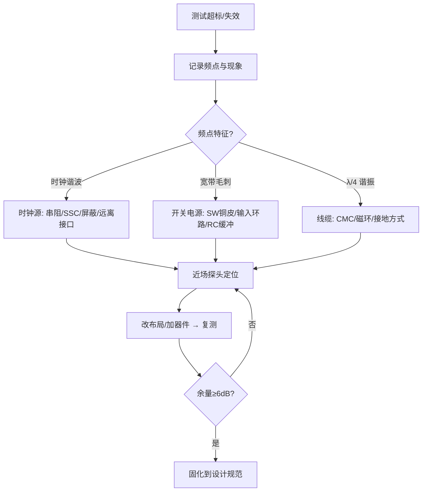
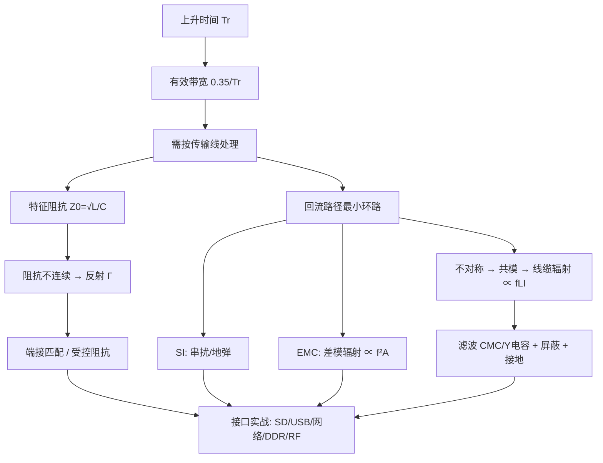

# 叠层与阻抗

## 叠层设计原则
- 先定义高速信号层和连续参考平面，再安排电源层、普通信号层、机械、铜厚和成本约束。
- 关键高速层应靠近参考平面；层间距越小，场约束通常越强，阻抗和串扰更容易控制。
- 六层板不存在脱离板厂材料、板厚、接口和布线密度的唯一最佳叠层；叠层是电气与制造的共同约束。
- 相邻高速层应避免长距离平行，电源/地层要保证过流、回流和去耦连接。

## 阻抗变量
- 单端和差分阻抗受线宽、线距、铜厚、介质厚度、介电常数、铜粗糙度、阻焊和参考平面距离影响。
- 微带线场的一部分在空气中，带状线场主要在介质中；模型和有效介电常数不同，不能混用公式。
- 差分阻抗取决于两线耦合，线距变化会同时改变单线阻抗和耦合强度。
- 过孔 barrel、反焊盘、焊盘、stub 和背钻都会改变局部阻抗，并可能在高速频段形成谐振。

## 计算与公差
- EDA 阻抗计算必须输入板厂成品介质厚度、铜厚、介电常数和阻焊条件；默认材料只适合早期估算。
- 目标阻抗应给出标称值、允许公差、测试位置、参考平面和线宽线距规则。
- 线宽、蚀刻、压合和材料公差会叠加；阻抗规则应留出板厂可制造窗口，而不是只满足理论中心值。

## 制造闭环
`叠层表 -> 阻抗表 -> 线宽/线距和差分规则 -> 板厂确认 -> 首板阻抗测试 -> 规则回写`。

- 设计冻结前取得板厂正式 stackup；板厂更换材料或压合结构时必须重新计算。
- 首板测试 coupon、TDR 结果和批次信息应与设计版本绑定，异常时回溯材料和工艺而非盲改线宽。

## 工程检查
- [ ] 所有高速网络有明确参考平面和阻抗规则。
- [ ] 过孔换层、stub、连接器和封装不连续点进入链路预算。
- [ ] 叠层、阻抗、铜厚和板厚已由板厂确认。
- [ ] 阻抗测试点、coupon 和报告要求已写入生产资料。

## 走线与参考面组合
- 微带线适合外层易接触和调试的走线，但更易受阻焊、邻近铜皮和外部环境影响；带状线场约束更强，但过孔换层和损耗需要更多关注。
- 共面波导通过同层地铜调节阻抗，地铜间距、过孔栅栏和开窗都会改变结果；不能只沿用微带线宽。
- 差分对在不同层切换时要重新确认单端与差分阻抗，避免因为层间距变化导致对内不连续。

## 过孔工程
- 过孔电流能力由孔径、镀铜、数量和温升决定；高速过孔还要考虑反焊盘、参考过孔和 stub。
- 过孔旁的回流地过孔缩短高频回流路径，但会占用布线空间并影响阻抗，需按关键网络布置。
- 背钻深度、残桩长度和制造公差应在生产资料中明确，不能只在口头要求。

## 损耗与材料
- 高频损耗包含导体皮肤效应、铜粗糙度和介质损耗；长链路的材料选择不能只看介电常数。
- 介电常数随频率、树脂含量和批次变化，精密相位或高速差分项目应使用板厂给出的频率相关参数。
- 成品阻抗测试与设计仿真不一致时，先核对实际叠层和 coupon 结构，再调整规则。

+### 叠层与阻抗知识条目 1
低频时代我们说"阻抗"，脑子里想的是 $Z=U/I$，一个电阻、一个电容的容抗，都是"元件的属性"。但到了高速领域，信号在一根 PCB 走线上跑，这根线本身还没有接到负载，它也会呈现出一个阻抗——这就是**特征阻抗**（Characteristic Impedance，$Z_0$）。

打个比方：你在一条很长的水管里推一股水流，水流"感受"到的阻力，取决于管径、管壁材质，而不取决于管子尽头接了什么。信号在 PCB 上传播时也是一样：信号是电磁波，它沿着导体和参考平面之间的介质向前"爬"，每往前走一小段，都要给这一小段线充上电容、给这一小段回路建立磁场。信号"往前走一步要付出的代价"，就是特征阻抗。

关键认知：**特征阻抗是传输线的固有属性，与线长无关，与末端负载无关**。50Ω 的线不管切 1cm 还是 10cm，信号刚出发时看到的都是 50Ω。

🔬 **深入原理**

把传输线切成无数微元，每段有分布电感 $L_0$（单位长度电感）和分布电容 $C_0$（单位长度电容），无损条件下：

$$Z_0=\sqrt{\frac{L_0}{C_0}}$$

有损情况下完整式为：

$$Z_0=\sqrt{\frac{R_0+j\omega L_0}{G_0+j\omega C_0}}$$

高频时 $\omega L_0 \gg R_0$、$\omega C_0 \gg G_0$，退化回 $\sqrt{L_0/C_0}$，这就是为什么高速下 $Z_0$ 近似为纯实数、与频率无关。

信号传播速度：

$$v=\frac{1}{\sqrt{L_0C_0}}=\frac{c}{\sqrt{\varepsilon_r}}$$

FR-4 的 $\varepsilon_r\approx 4.2$，则 $v\approx 1.46\times10^8\ \text{m/s}$，约 **6 mil/ps**（记住这个数：166 ps/inch，或约 6.7 ps/mm）。这是后面等长计算的命根子。

微带线（表层走线，单参考面）常用近似式：

$$Z_0\approx\frac{87}{\sqrt{\varepsilon_r+1.41}}\ln\!\left(\frac{5.98H}{0.8W+T}\right)$$

带状线（内层，双参考面）：

$$Z_0\approx\frac{60}{\sqrt{\varepsilon_r}}\ln\!\left(\frac{4H}{0.67\pi(0.8W+T)}\right)$$

物理含义一句话：$H$（线到参考面距离）↑ → $Z_0$↑；$W$（线宽）↑ → $Z_0$↓；$\varepsilon_r$↑ → $Z_0$↓；$T$（铜厚）↑ → $Z_0$略↓。

🛠 **设计实例/操作**

*例1：四层板做 50Ω 单端。* 板厚 1.6mm，叠层 TOP/GND/PWR/BOTTOM，TOP 到 GND 的介质厚 0.1mm（约 3.94mil），1oz 铜（1.4mil）。用嘉立创/Polar SI9000 算，线宽约 6.5～7mil 得到 50Ω。若把介质改成 0.2mm，同样 50Ω 需要线宽约 13～14mil——所以**薄介质是高密度布线的前提**。

*例2：100Ω 差分。* 内层差分带状线，线宽 5mil、线距 5mil、上下各 4mil 介质，差分阻抗约 100Ω。注意差分阻抗 $Z_{diff}\approx 2Z_{odd}$，不是 $2Z_0$，因为耦合使奇模阻抗低于单端阻抗。

```
   微带线截面                     带状线截面
  ┌────W────┐                      ┌───GND───┐
  ▓▓▓▓▓▓▓▓▓▓  ← 信号线              ▒▒▒▒ H1
  ▒▒▒▒▒▒▒▒▒▒  H (介质 εr)          ┌──W──┐
  ████████████ ← GND 参考平面        ▓▓▓▓▓▓  ← 信号线
                                    ▒▒▒▒ H2
                                   └───GND───┘
```

⚠️ **常见误区**

1. 以为"阻抗是用万用表能量出来的"。万用表量的是直流电阻，$Z_0$ 要用 TDR（时域反射计）或按叠层计算，两者毫无关系。
3. 把 $\varepsilon_r$ 当常数 4.2 用到 GHz。FR-4 的 $\varepsilon_r$ 随频率下降（10GHz 时约 3.9～4.0），高频设计要用板厂给的 Dk/Df 表。
4. 只控制线宽却忘了参考平面完整。参考面一破，$H$ 等效变大、$Z_0$ 突变，算得再准也白搭。


📌 **要点速记**

- $Z_0=\sqrt{L_0/C_0}$，是传输线固有属性，与线长、负载无关。
- FR-4 上信号速度约 **6 mil/ps（166 ps/inch）**，是等长换算的基准。
- $H$↑ 阻抗↑，$W$↑ 阻抗↓，$\varepsilon_r$↑ 阻抗↓。
- 差分阻抗 ≈ 2×奇模阻抗，耦合越紧差分阻抗越低。
- 阻抗控制的前提是**连续的参考平面**。


---
### 叠层与阻抗知识条目 2
辐射发射（RE）测的是设备向空间辐射的电磁场强度，频段 30MHz～1GHz（有高频时钟的要测到 6GHz）。3m 法或 10m 法半电波暗室，天线在 1～4m 高度扫描，EUT 转台 360° 旋转，水平/垂直双极化，取最大值。

**最关键的认知**：在 30MHz～1GHz 频段，PCB 本身尺寸（10cm 量级）对应 $\lambda/4$ 约在 750MHz 才谐振，所以**1GHz 以下的辐射，主要天线是线缆和机壳缝隙，而不是 PCB 走线本身**。PCB 的作用是"驱动源"——它把共模电压加到了线缆上。

$$\text{PCB 共模噪声} \xrightarrow{\text{驱动}} \text{线缆(天线)} \xrightarrow{} \text{辐射超标}$$

🔬 **深入原理**

**两种辐射模型**：

差模（环路天线）：
$$E_{DM}=1.32\times10^{-14}\frac{f^2 A I_{DM}}{r}\ \text{V/m}$$

共模（单极子天线）：
$$E_{CM}=1.26\times10^{-6}\frac{f L I_{CM}}{r}\ \text{V/m}$$

**谐振长度**：线缆长度 $L=\lambda/4$ 时辐射效率最高。

$$f_{res}=\frac{c}{4L}\Rightarrow L=1\text{m}\to 75\text{MHz};\ L=0.5\text{m}\to150\text{MHz}$$

看到 75MHz、150MHz、300MHz 附近的宽峰，先怀疑线缆。

**缝隙泄漏**：屏蔽罩缝隙长度 $\ell$ 的屏蔽效能

$$SE(\text{dB})\approx 20\log_{10}\frac{\lambda}{2\ell}$$

$\ell=\lambda/2$ 时 SE=0，完全不屏蔽。所以设计规则：**最长缝隙 < $\lambda_{min}/20$**。1GHz（λ=300mm）→ 缝隙 <15mm；缝合过孔间距同理。

**PCB 边缘辐射（Fringing）**：电源/地平面边缘的边缘场会辐射，解决办法是 **20H 规则**（电源平面比地平面内缩 20 倍介质厚度）与**板边缝合地过孔**（间距 ≤ $\lambda_{min}/20$，工程常取 100～200mil）。

🛠 **设计实例/操作**

*例1：定位超标源。* 用近场探头（H 场环 + E 场棒）在板上扫，配合频谱仪：
- 时钟晶振周围强 → 晶振布局/屏蔽/串阻；
- DC-DC 开关节点强 → 缩小 SW 铜皮、加输入环路电容、加 RC 缓冲；
- 连接器处强 → 共模问题，加 CMC/磁环；
- 用手捏/拔线缆后读数大变 → 确认线缆是天线。

*例2：整改优先级（成本从低到高）。*
1. 改布局布线（缩小环路、完整参考面、换层伴地孔）——免费
2. 时钟串阻 22～33Ω、展频 SSC（±1% 可降 6～10dB）——几分钱
3. 接口加共模磁环/CMC——几毛钱
4. 加屏蔽罩/导电泡棉/铜箔——几元
5. 改叠层/改板——重新打样

*例3：SSC 展频。* 把 100MHz 时钟以 30kHz 三角波调制 ±0.5%，能量被摊到更宽频带，QP 读数可降 6～12dB。注意：**USB/以太网/DDR 有各自对 SSC 的容忍规范，不能乱开**（如 USB3 支持 −0.5% 下展）。

⚠️ **常见误区**

1. 只盯着 PCB 走线，忘了线缆才是主天线。
2. 屏蔽罩接地只焊四个角。应沿边多点焊接，间距 < $\lambda/20$。
3. 开孔散热用大方孔。应改成**多个小圆孔阵列**（同样开孔率，屏蔽效能高很多）。
4. 用展频掩盖问题。SSC 降的是"测量读数"，实际峰值能量还在，对邻近敏感电路照样干扰。
5. 忽略 1GHz 以上。有 DDR4/USB3/HDMI 的产品必须测到 3～6GHz，此时 PCB 走线本身就能辐射。

📌 **要点速记**

- 1GHz 以下辐射的主天线是线缆与缝隙，PCB 提供共模驱动源。
- 共模辐射 $\propto f L I_{CM}$，差模辐射 $\propto f^2 A I_{DM}$。
- $\lambda/4$ 谐振：1m 线 → 75MHz，重点排查。
- 缝隙/缝合孔间距 < $\lambda_{min}/20$；散热孔用小圆孔阵列。
- 整改按"布局→串阻/展频→磁环→屏蔽"的成本顺序推进。


---
### 叠层与阻抗知识条目 3
🔬 **深入原理：一张总表**

| 实验 | 频段/波形 | 主因 | 首选整改 | 备选 |
|---|---|---|---|---|
| CE 传导 | 150k～30MHz | 低频段差模、高频段共模 | X/Y 电容、CMC、减小 $dv/dt$ | 变压器屏蔽层、磁环、RC 缓冲 |
| RE 辐射 | 30M～1/6GHz | 线缆共模、缝隙泄漏、平面边缘 | 缩小环路、串阻、CMC/磁环 | 屏蔽罩、SSC、改叠层 |
| ESD | <1ns, 30A | 高频路径电感、接地不良 | TVS 靠连接器、地路径最短 | 结构泄放、导电泡棉、软件容错 |
| EFT | 5/50ns 突发 | 共模、地环路 | Y 电容、CMC、机壳多点搭接 | TVS、缩短复位/晶振路径 |
| Surge | 8/20μs, 数百A | 能量泄放不足 | GDT+MOV+TVS 三级 | 退耦电感/PTC、隔离变压器 |
| CS | 150k～80MHz | 电路不平衡、结检波 | 平衡设计、RC 低通、射频旁路 | CMC、屏蔽层 360° 接地 |
| RS | 80M～6GHz | 同 CS + 直接场耦合 | 屏蔽、滤波、缩小敏感环路 | 器件重选、软件滤波 |
| DIP | 电压跌落 | 储能不足 | 加大输入电容、掉电检测 | 宽输入范围电源 |

**通用排查流程：**



🛠 **设计实例/操作**

*例1：把 EMC 前移到设计阶段的 Checklist（板级）。*

1. 叠层：至少一个完整 GND 平面，高速层紧邻 GND，PWR/GND 相邻薄介质。
2. 分区：接口区 / 数字区 / 模拟区 / 电源区物理分开，接口区靠板边集中。
3. 回流：不跨分割，换层伴地孔，排针按 1:3 配地。
4. 时钟：最短、包地、串阻、远离板边与接口 ≥ 300mil。
5. 接口：TVS 靠连接器、CMC 在其后、走线不回穿数字区。
6. 电源：去耦贴引脚、DC-DC 输入环路最小、SW 铜皮最小。
7. 板边：缝合地过孔间距 ≤200mil，20H 规则。
8. 结构：屏蔽罩多点接地、缝隙 <λ/20、螺柱接地。

*例2：整改的"经济学"。* 同样 10dB 的改善：
- 改布线：0 元/台，但需要重新打样（一次性成本）
- 串阻 + 磁环：约 0.2 元/台 × 10 万台 = 2 万元
- 屏蔽罩：约 3 元/台 × 10 万台 = 30 万元

所以**设计阶段多花两天做 EMC 评审，可能省下几十万**。

⚠️ **常见误区**

1. "试错法"整改：随机加电容磁环，改好了也不知道为什么，量产一致性差。
2. 不做近场定位就动手。定位是整改效率的关键。
3. 只解决超标频点，不看整体余量趋势。
4. 整改方案不固化。同一个坑在下一个项目再踩一遍。
5. 忽视测试布置差异。同一台机器在不同实验室差 3～5dB 很正常。

📌 **要点速记**

- 每个实验都有典型主因与首选手段，先按表定位再动手。
- 排查顺序：记录频点 → 判断特征 → 近场定位 → 整改 → 复测。
- 板级 8 条 Checklist 能挡掉大部分问题。
- 整改成本随阶段推后指数上升，前移设计最划算。
- 留 6dB 余量，把有效方案固化为公司设计规范。


---
### 叠层与阻抗知识条目 4
USB 是最常见的差分高速接口，也是差分设计的最佳教材。

版本与要求：

| 版本              | 速率          | 差分阻抗         | 编码        | 关键要求                      |
| --------------- | ----------- | ------------ | --------- | ------------------------- |
| USB1.1 LS/FS    | 1.5/12 Mbps | 90Ω          | NRZI      | 宽松                        |
| USB2.0 HS       | 480 Mbps    | **90Ω ±15%** | NRZI+位填充  | 对内 skew <150ps，长度差 <50mil |
| USB3.0/3.1 Gen1 | 5 Gbps      | **90Ω ±10%** | 8b/10b    | 需 AC 耦合、背钻、损耗预算           |
| USB3.1 Gen2     | 10 Gbps     | 90Ω ±10%     | 128b/132b | 需完整 S 参数/眼图仿真             |

🔬 **深入原理**

**为什么是 90Ω？** USB 规范定义的差分阻抗，来自电缆特性与收发器设计的折中。注意：$Z_{diff}=90Ω$ 对应单端约 45～50Ω（耦合越紧，单端越接近 45Ω）。

**眼图与抖动预算**。USB2.0 HS 一个 UI（单位间隔）= 1/480MHz = 2.083ns。总抖动预算：

$$TJ = DJ + n\cdot RJ_{rms}$$

其中 $n$ 在 BER=10⁻¹² 时取 14.069。板级设计要把 **ISI（码间干扰）** 和串扰控制住，给收发器留裕量。

**损耗预算（USB3.0）**：5Gbps 的 Nyquist 频率 2.5GHz。FR-4 在 2.5GHz 的损耗约 **0.4～0.6 dB/inch**（含导体损耗与介质损耗）。规范允许通道总损耗约 −7～−8dB，扣除连接器和线缆，**PCB 走线通常限制在 6～8 inch 以内**，超过要用低损耗板材（如 Megtron6、S1000-2M）或加 Redriver。

损耗模型：

$$\alpha_{total}=\alpha_{conductor}(\propto\sqrt{f})+\alpha_{dielectric}(\propto f\cdot D_f)$$

高频段介质损耗主导，所以 $D_f$（损耗角正切）是选板材的关键指标。

🛠 **设计实例/操作**

*例1：USB2.0 布线清单。*
1. 差分阻抗 90Ω，走内层带状线更佳（若走表层需注意阻焊影响）。
2. 对内长度差 **<50mil（约 8ps）**，就近补偿。
3. 对间距全程恒定；与其它信号间距 ≥ **4W**（时钟/开关电源 ≥ 5W 或隔地）。
4. 换层过孔**成对对称**，紧邻放 GND 过孔。
5. **不跨分割**，下方参考面完整。
6. ESD 器件紧靠连接器，电容 <3pF（HS 建议 <1.5pF）；CMC 放 ESD 之后。
7. 连接器外壳接机壳地，通过 1nF/2kV + 1MΩ 接信号地。
8. VBUS 加 500mA～1A 自恢复保险丝 + 大电容 + TVS。

*例2：USB3.0 额外要求。*
- TX 对必须串 **0.1μF AC 耦合电容（0201/0402）**，放在发送端一侧，两颗对称摆放；
- 电容焊盘下方做 **antipad 挖空**，减小容性突变；
- 过孔 **stub 必须处理**（背钻或用薄板/盲埋孔）；
- 走线尽量少换层，一次换层不超过 2 个过孔；
- SSTX/SSRX 与 D+/D− 保持 ≥30mil 距离；
- 屏蔽壳多点接地，Type-C 的 CC/SBU 线远离高速对。

```
 USB Type-C 高速部分布局示意
  连接器 ─┬─ TX1± ── [0.1μF×2] ── 过孔对 ── 内层 ── SoC
          ├─ RX1± ─────────────── 过孔对 ── 内层 ── SoC
          ├─ D±  ── [ESD<1.5pF] ── [CMC 90Ω] ── SoC
          └─ CC1/CC2 ── PD 芯片（远离高速对）
   ESD/CMC 紧靠连接器；地过孔环绕；壳体接机壳地
```

⚠️ **常见误区**

1. 用 100Ω 差分规则去做 USB（应是 90Ω）。多数 EDA 默认 100Ω，务必改。
2. 对内绕线在离失配点很远处补偿，中间形成共模。
3. AC 耦合电容用 0603 且焊盘不挖空，造成明显阻抗凹坑。
4. ESD 器件选电容大的通用型，HS 眼图不合格。
5. CMC 放在 ESD 之前，ESD 电流会先冲击 CMC。
6. USB3 走线穿越连接器区/电源区，或从板边贴边走（板边辐射）。
7. 忘记 VBUS 的浪涌与反灌保护（尤其是 OTG/双角色口）。

📌 **要点速记**

- USB 差分阻抗 **90Ω**，不是 100Ω。
- USB2.0 HS 对内长度差 <50mil；USB3 需背钻/低损耗板材，PCB 走线一般 <6～8 inch。
- ESD（<1.5～3pF）靠连接器，CMC 在其后。
- USB3 TX 侧 0.1μF AC 耦合，焊盘 antipad 挖空。
- 全程恒定间距、不跨分割、换层成对伴地孔。


---
### 叠层与阻抗知识条目 5
DDR 设计的第一集：**信号分类与总体架构**。想做好 DDR，第一步不是画线，而是把上百根信号分成几类，因为**不同类的规则完全不同**。

DDR 信号三大类：

| 类别 | 信号 | 特点 | 参考时钟 |
|---|---|---|---|
| **数据组（Byte Lane）** | DQ[7:0]、DQS±、DQM/DM | 双向，**源同步**，按字节分组 | DQS（该组自己的选通） |
| **地址/命令/控制** | A[]、BA[]、RAS#、CAS#、WE#、CS#、CKE、ODT | 单向（控制器→颗粒） | CK± |
| **时钟** | CK±、CK#（差分） | 差分，最关键 | — |

**核心规则**：**等长是"组内相对"的，不是"全部一样长"。**

- DQ0～DQ7、DM0 相对 **DQS0±** 等长（组内 ±10～25mil）
- DQ8～DQ15、DM1 相对 **DQS1±** 等长
- 所有地址/命令/控制相对 **CK±** 等长（±25～50mil）
- **DQS 组之间不需要互相等长**（DDR3 支持 write leveling / read leveling 自动校准）
- CK 通常做成"最长"，地址组略短于 CK（Flight time 匹配）

🔬 **深入原理**

**为什么源同步能跑这么快？** 传统共同时钟（Common Clock）架构下，时序裕量要扣掉时钟树偏斜、板级延时等一大堆；源同步把**选通信号 DQS 与数据一起发送**，接收端用 DQS 采数据，两者共同经历同样的板级延时，**延时被抵消**，只剩下 skew。

写时序（Write）中 DQS 与 DQ 是**边沿对齐（DDR3 为中心对齐由控制器移相 90°）**；读时序（Read）中颗粒输出 DQS 与 DQ 边沿对齐，控制器内部延时 90° 再采样。

时序裕量：

$$t_{margin}=\frac{UI}{2}-t_{setup}-t_{hold}-t_{skew}-t_{jitter}-t_{ISI}-t_{xtalk}$$

DDR3-1600：数据率 1600MT/s，$UI=625\text{ps}$，半个 UI 只有 312ps。扣掉颗粒 setup/hold（各约 50～100ps）、时钟抖动、串扰，留给 PCB skew 的往往只有 **50～100ps**。按 6mil/ps 算，就是 **300～600mil** 的总预算——听起来宽，但要扣掉封装内部走线（package skew）与过孔差异，实际给布线的通常按 ±25mil 控制。

**关键概念：Flight Time 与过孔延时。** 现代做法不是"物理等长"而是"**时延等长（tuned by delay）**"：
- 表层微带线速度 ≈ 7 mil/ps（$\varepsilon_{eff}$ 较小）
- 内层带状线速度 ≈ 6 mil/ps
- **两者速度不同！** 同样 1000mil，微带比带状快约 20ps。所以**同一组信号应尽量走同一层**，或用 EDA 的"时延等长"模式而非"长度等长"。
- 过孔也有延时，1.6mm 板厚过孔约 10～15ps，等长时应计入。

🛠 **设计实例/操作**

*例1：分组示例（DDR3 x16 单颗粒）。*

```
 组1: DQ0-7   + DM0 + DQS0± → 相对 DQS0 等长 ±25mil
 组2: DQ8-15  + DM1 + DQS1± → 相对 DQS1 等长 ±25mil
 组3: A0-14, BA0-2, RAS,CAS,WE,CS,CKE,ODT → 相对 CK± 等长 ±50mil
 组4: CK± 差分, 对内 ±5mil, 100Ω 差分
 组间: 组1 与 组2 无需等长；地址组通常比 CK 短 0~200mil
```

*例2：叠层与阻抗。* DDR 推荐 **6 层以上**：
```
 L1 SIG (DQ组1)      ← 参考 L2
 L2 GND ★完整
 L3 SIG (地址/命令)   ← 参考 L2/L4
 L4 PWR (VDD/VDDQ)
 L5 GND ★
 L6 SIG (DQ组2)      ← 参考 L5
```
单端 40～50Ω（DDR3 常用 40Ω 或 50Ω，按控制器要求），差分 80～100Ω。

⚠️ **常见误区**

1. **把所有 DDR 信号等长到同一个值**。这不但没必要，还会让绕线爆炸、串扰增加。
2. 用"长度等长"跨层混走。微带与带状速度不同，必须用时延等长或统一走线层。
3. 忘记算过孔延时和封装内 skew（高端 SoC 的 package skew 表必须查）。
4. DQ 与地址线混在一起走，互相串扰。
5. 认为 DDR3 有校准就可以随便画。校准能补偿的是**固定偏移**，补不了串扰、反射和抖动。

📌 **要点速记**

- DDR 信号分三类：数据组（参考 DQS）、地址命令（参考 CK）、时钟（差分）。
- 等长是"组内相对参考信号"，组间不必等长。
- 源同步架构靠 DQS 抵消板级延时。
- 微带 7mil/ps、带状 6mil/ps，速度不同 → 用时延等长。
- 过孔延时与封装 skew 必须计入预算。


---
### 叠层与阻抗知识条目 6
DDR 第三集：**等长实现与串扰控制**——真正动手画线的部分。

等长预算表（DDR3-1600 参考值，实际以芯片手册为准）：

| 项目 | 建议值 |
|---|---|
| DQ 相对 DQS 组内 | ±25 mil（严格 ±10 mil） |
| DQS± 对内 | ±5 mil |
| CK± 对内 | ±5 mil |
| 地址/命令相对 CK | ±50 mil（严格 ±25 mil） |
| CK 与 DQS 组间 | ±500 mil（宽松，有 leveling） |
| 同组内间距 | ≥ 3W |
| 不同组之间间距 | ≥ 4W |
| DQ 与地址组之间 | ≥ 4～5W 或隔地 |
| CK/DQS 与其它信号 | ≥ 5W，最好包地 |

🔬 **深入原理**

**串扰（Crosstalk）**。两条平行线之间通过互容 $C_m$ 与互感 $L_m$ 耦合，分为：

- **近端串扰 NEXT（后向）**：
$$K_b=\frac{1}{4}\left(\frac{C_m}{C_{11}}+\frac{L_m}{L_{11}}\right)$$
特点：与耦合长度无关（饱和后），持续时间 $2T_d$。

- **远端串扰 FEXT（前向）**：
$$V_{FEXT}=-\frac{1}{2}\left(\frac{C_m}{C_{11}}-\frac{L_m}{L_{11}}\right)\cdot T_d\cdot\frac{dV}{dt}$$
特点：**正比于耦合长度**，脉冲宽度等于 $T_r$。

**关键结论**：
- 在**带状线**（均匀介质）中，$C_m/C_{11}=L_m/L_{11}$，**FEXT ≈ 0**！这是内层走线的巨大优势。
- 在**微带线**（介质不均匀）中 FEXT 不为零，长距离并行时问题明显。
- 所以 **DDR 高速数据优先走内层带状线**。

**3W 规则**的来源：串扰随间距 $S$ 与高度 $H$ 的比值快速衰减，近似 $\propto \dfrac{1}{1+(S/H)^2}$。当 $S=3W$（且 $W\approx 2H$ 时 $S\approx 6H$），串扰可降到 <1%。**注意 3W 中的 W 是线宽，真正起作用的是 $S/H$ 比值**——薄介质（H 小）时，同样间距串扰更小。

**ISI（码间干扰）**：由损耗和反射造成，前一个码元的残留影响下一个。DDR3 距离短、速率相对低，ISI 主要来自阻抗不连续（过孔、颈缩）。

🛠 **设计实例/操作**

*例1：BGA 扇出（Fanout）策略。*

```
  BGA 焊盘阵列（0.8mm pitch）
   ● ● ● ● ●     扇出方式：
   ● ○ ○ ○ ●     - 外两圈：表层直接引出
   ● ○ ◎ ○ ●     - 内圈：Dog-bone 过孔换层
   ● ○ ○ ○ ●     - 过孔尽量对齐成"通道"，给回流留空间
   ● ● ● ● ●     - 每 2~3 个信号过孔配 1 个 GND 过孔
                  - 电源引脚用多过孔并联
```
0.8mm pitch 下，过孔盘 0.45mm、钻孔 0.2mm，两过孔之间可过 1 根 4mil 线（需 6/6 工艺）。这是决定层数的关键——过不去就得加层。

*例2：等长实操顺序。*
1. 先完成所有信号的**拓扑连接**（不管长度）；
2. 测量每组的最长线，定为目标值；
3. **从最短的开始补**，优先在**靠近失配处**的空白区绕；
4. DQS/CK 差分对**先对内等长再对外等长**；
5. 用"时延（delay）"模式而非"长度（length）"模式，让 EDA 自动考虑层速度差；
6. 最后加上封装 skew 补偿（若芯片厂提供 package delay 表）。

*例3：串扰控制实战。*
- CK± 与 DQS± 两侧各留 ≥5W 或加地线（地线两端必须打过孔，间距 <λ/20，否则地线本身变天线）；
- 相邻层信号**正交走线**（L1 横 / L3 竖），避免层间串扰；
- 若两层信号必须同向且相邻，中间必须夹一个完整平面。

⚠️ **常见误区**

1. 只看"总长度相等"，忽略走线层不同导致的速度差。
2. 蛇形绕线自身间距太小（<3W），自耦合让实际延时缩水 5～10%。
3. 用直角蛇形。虽然直角本身在 DDR 频段影响有限，但圆弧/45° 更稳妥，也便于 EDA 计算。
4. 包地线只包不打过孔。**没有过孔的地线是天线，比不包更糟**。
5. 忽略 BGA 区域内的短距离并行——BGA 扇出区往往是串扰最严重的地方，因为线间距被迫极小。
6. 在 DQ 组里插入其它信号（如 I2C、GPIO），造成异步串扰。

📌 **要点速记**

- DQ 对 DQS ±25mil，差分对内 ±5mil，地址对 CK ±50mil。
- 带状线 FEXT ≈ 0，DDR 数据优先走内层。
- 3W 规则本质是 $S/H$ 比值，薄介质更抗串扰。
- 用时延等长而非长度等长；就近补偿。
- 包地线必须两端 + 中间打过孔，否则适得其反。

+### 叠层阻抗进阶知识条目 1
GNSS（GPS/北斗/GLONASS/Galileo）设计的核心矛盾只有一个：**卫星信号极其微弱**。

到达地面的 GPS L1 信号功率约 **−130 dBm**（有些资料给 −128～−133 dBm），而典型接收机灵敏度要求 −160 dBm（跟踪）。这个量级比热噪声底还低——GPS 靠扩频增益（CDMA 相关处理，约 43dB）才能解调出来。

对比一下：手机 4G 发射功率 +23 dBm。**同一块板上，干扰源比有用信号强 150dB 以上（10¹⁵ 倍）**。所以 GNSS 设计 = 噪声抑制的极限工程。

频段：
| 系统 | 频段 |
|---|---|
| GPS L1 | 1575.42 MHz |
| 北斗 B1I / B1C | 1561.098 / 1575.42 MHz |
| GLONASS L1 | 1598～1606 MHz |
| GPS L5 / 北斗 B2a | 1176.45 MHz |

🔬 **深入原理**

**级联噪声系数（Friis 公式）**决定了 LNA 的位置：

$$NF_{total}=NF_1+\frac{NF_2-1}{G_1}+\frac{NF_3-1}{G_1G_2}+\cdots$$

（线性量）关键结论：**第一级的噪声系数与增益决定全局**。所以：
- **LNA 必须放在最靠近天线的位置**，前面的损耗（走线、连接器、滤波器）会 1:1 地加到 NF 上；
- 从天线到 LNA 之间每 1dB 损耗 = 灵敏度直接损失 1dB。

灵敏度公式：

$$P_{min}=-174\ \text{dBm/Hz}+10\log_{10}(B)+NF+SNR_{min}$$

**为什么要用有源天线？** 有源天线把 LNA 集成在天线里，避免馈线损耗。代价是需要通过同轴馈线供电（Bias-Tee）：

```
 天线(含LNA) ──同轴── [隔直电容 100pF] ── GNSS 模块 RF_IN
                  │
              [电感 27~47nH（射频扼流）] ── 3.3V ── [100nF] ── GND
   电感在 1.575GHz 呈高阻，隔断射频；电容隔直流
```

**接收带内干扰**：任何落在 1559～1610MHz 的谐波都是致命的。常见凶手：
- **DC-DC 开关频率的高次谐波**（1MHz 开关 → 第 1575 次谐波理论存在，但更常见的是宽带噪声）；
- **DDR 时钟谐波**（800MHz × 2 = 1600MHz！正好落在 GLONASS 带内）；
- **USB3.0 的宽带噪声**（5Gbps 的谐波与展频噪声覆盖 1.5～2.5GHz，是著名的 GPS 杀手，Intel 有专门白皮书）；
- **摄像头 MIPI、LCD 时钟**。

🛠 **设计实例/操作**

*例1：RF 走线设计。*
- 用 **50Ω 共面波导接地（GCPW）** 或微带线；
- 走线**短、直、无过孔**（必须换层时，过孔周围环绕 ≥4 个 GND 过孔）；
- 走线两侧**缝合地过孔，间距 ≤ λ/20**。1.575GHz 在 FR-4 中 $\lambda_g\approx 95\text{mm}$，λ/20 ≈ 4.75mm，工程取 **2～3mm**；
- RF 走线下方**参考面绝对完整**，不允许任何走线穿过；
- 阻抗 50Ω，需与板厂确认叠层。

*例2：布局隔离。*
```
  ┌────────────────────────────────────┐
  │ [GNSS天线]                          │
  │    │ 短RF线                          │
  │ [Bias-T][SAW][GNSS模块]  ← 独立区域  │
  │ ─────── 屏蔽罩 + 缝合地孔 ───────    │
  │                                     │
  │  [DDR]   [USB3]   [DC-DC]  ← 干扰源 │
  │   保持 ≥20mm 距离，最好不同侧        │
  └────────────────────────────────────┘
```
- GNSS 模块加**金属屏蔽罩**，多点接地；
- 与 USB3/DDR/DC-DC 距离 **≥15～20mm**，且不在其上下层正对位置；
- 电源用 **LDO 单独供电**（DC-DC 的噪声很难滤干净），或 DC-DC + LDO 两级；
- 模块的 UART/I2C 信号线加 RC 滤波或磁珠，防止把噪声"带进"屏蔽区。

*例3：天线选型与摆放。*
- 陶瓷贴片天线需要**足够的地平面**（典型 ≥50×50mm），地小则增益和方向图变差；
- 天线上方 **不能有金属遮挡**，正上方需净空；
- 若用外置有源天线，注意馈线损耗（RG-174 在 1.5GHz 约 1dB/m）。

⚠️ **常见误区**

1. RF 走线上加过孔换层而不做地过孔包围，损耗与失配剧增。
2. 把 GNSS 模块放在 DC-DC 或 USB3 连接器旁边。
3. 用 DC-DC 直接给 GNSS 供电，噪底抬高十几 dB。
4. 陶瓷天线下方铺地不足或被挖空。
5. 忽略 USB3.0——插上 U 盘就搜不到星是典型症状，需在 USB3 连接器加屏蔽、缩短走线、必要时加接地隔离。
6. 认为"能定位就行"。要看 **C/N₀（载噪比）**，好的设计冷启动时可见星 C/N₀ 应 >40 dB-Hz，<35 就说明噪底偏高。

📌 **要点速记**

- GNSS 信号 ≈ −130dBm，噪声抑制是唯一主题。
- Friis 公式：第一级 NF 决定全局 → LNA/有源天线尽量靠前。
- RF 走线 50Ω、短直无过孔、两侧缝合地孔间距 2～3mm。
- 与 DDR/USB3/DC-DC 隔离 ≥15～20mm，独立 LDO 供电 + 屏蔽罩。
- 用 C/N₀ 评估设计好坏，>40 dB-Hz 为佳。


---
### 叠层阻抗进阶知识条目 2
1. **信号怎么走**（阻抗、反射、匹配）——传输线理论；
2. **电流怎么回**（回流路径、地设计、共模/差模）——回路思维；
3. **能量怎么跑掉/进来**（EMC 发射与抗扰）——耦合与屏蔽。

而这三件事本质上都指向同一句话：**高速设计的核心不是"画线"，而是"管理电磁场与电流回路"**。

🔬 **深入原理：知识地图**



**贯穿全课的 5 个数字**：

| 数字 | 含义 |
|---|---|
| **6 mil/ps** | FR-4 内层传播速度（微带约 7） |
| **0.35 / Tr** | 有效带宽（拐点频率） |
| **±3H** | 80% 回流集中范围 |
| **1 nH/mm** | 普通走线/引线电感估算 |
| **λ/20** | 缝隙、缝合孔、地线过孔的间距上限 |

🛠 **设计实例/操作：完整设计流程与自检清单**

**阶段一：原理图/选型**
- [ ] 确认各接口速率、上升时间、阻抗规范（USB 90Ω、以太网/LVDS 100Ω、单端 50Ω、DDR 40/50Ω）
- [ ] 时钟源选型（是否需要 SSC）、串阻位置预留
- [ ] ESD/TVS 选型（结电容匹配速率）、CMC、滤波元件预留
- [ ] 电源架构：噪声敏感模块（GNSS/RF/ADC/PHY-AVDD）用 LDO 或加滤波
- [ ] 预留 π 型匹配、测试点（低速）、调试接口

**阶段二：叠层与阻抗**
- [ ] 每个信号层紧邻完整参考平面
- [ ] PWR 与 GND 平面相邻，介质尽量薄
- [ ] 找板厂确认叠层与 Dk/Df，算准线宽线距
- [ ] 高速差分优先内层带状线（FEXT≈0）

**阶段三：布局**
- [ ] 分区：接口区/数字区/模拟区/电源区/RF 区
- [ ] 接口靠板边集中，走线不回穿数字区
- [ ] 高速链路"一"字排开，不折返
- [ ] 去耦电容贴引脚，DC-DC 输入环路最小
- [ ] 晶振靠芯片、下方铺地
- [ ] 天线净空区、变压器隔离沟先划出

**阶段四：布线**
- [ ] 不跨分割；换层伴地孔（<100～200mil）
- [ ] 3W/4W/5W 间距规则按等级执行
- [ ] 差分：等长、等距、对称，就近补偿
- [ ] DDR：按组等长（时延模式），VTT 在最远端
- [ ] RF：短直无过孔、两侧缝合地孔
- [ ] 时钟包地且地线两端+中间打孔

**阶段五：EMC 加固**
- [ ] 板边缝合地过孔 ≤200mil，20H 规则
- [ ] 排针/连接器按 1:3 配地
- [ ] 屏蔽罩多点接地，缝隙 <λ/20
- [ ] 机壳地与信号地 1nF/2kV + 1MΩ 连接
- [ ] 长线 I/O 预留磁环/CMC 位置

**阶段六：验证**
- [ ] SI 仿真（眼图、串扰、过冲）
- [ ] PDN 阻抗仿真（$Z<Z_{target}$）
- [ ] 功能 + 压力 + 高低温测试
- [ ] EMC 预测试（近场探头 + 简易暗室）
- [ ] 留 6dB 余量再送正式认证

⚠️ **常见误区（全课总结）**

1. **用频率而非上升时间判断高速**——第一原则性错误。
2. **只画线不想回流**——所有 SI/EMC 问题的共同根源。
3. **等长绝对化**——该松的地方过度绕线，反而增加串扰。
4. **EMC 后置**——测试超标才整改，成本高十倍。
5. **迷信单一手段**——屏蔽罩/磁环/展频都不是万能药。
6. **不留余量**——刚好合格 = 量产必炸。
7. **不做定位就整改**——盲目试错，改好了也复现不了。

📌 **要点速记**

- 高速设计三主线：信号路径、回流路径、耦合路径。
- 五个关键数字：6mil/ps、0.35/Tr、±3H、1nH/mm、λ/20。
- 流程六阶段：选型 → 叠层 → 布局 → 布线 → EMC 加固 → 验证。
- 80% 的结果在布局阶段就已决定。
- 一切规则的目的都是：**让电流走最小的环路**。


---
### 叠层阻抗进阶知识条目 3
- **建立"传输线思维"**：判断是否高速看上升时间 $T_r$ 而非时钟频率，掌握 $L_{crit}\approx T_r v/6$ 与 $f_{knee}=0.35/T_r$。
- **吃透阻抗与反射**：$Z_0=\sqrt{L_0/C_0}$、$\Gamma=(Z_2-Z_1)/(Z_2+Z_1)$、弹跳图与振铃频率 $1/4T_d$，能定量估算过冲与定位问题线长。
- **掌握端接选型**：源端串阻（零功耗、点对点首选）、并联/戴维南、AC 端接、片内 ODT 的适用边界与参数计算。
- **确立"回流路径"世界观**：高频回流紧贴信号线（±3H 内 80%），不跨分割、换层伴地孔，这是 SI 与 EMC 的共同命门。
- **区分共模与差模**：理解共模辐射效率远高于差模，掌握不对称→模式转换的机理与 skew 控制要求。
- **建立完整 EMC 框架**：EMI（CE/RE）+ EMS（ESD/EFT/Surge/CS/RS/DIP）的标准、限值、测试布置与整改优先级。
- **熟练使用 dB 语言**：功率 10log / 场量 20log、dBμV=dBm+107、余量与整改目标（超标量 +6dB）的换算。
- **形成滤波与防护方法论**：阻抗失配原则、X/Y 电容与 CMC 分工、TVS 三级配合与能量退耦、ESD "1nH=30V" 的布局铁律。
- **掌握电源完整性基础**：$Z_{target}$ 计算、电容 SRF 与反谐振、去耦"位置优先于容值"、DC-DC 与 PDN 布局要点。
- **打通主流接口 Layout 实战**：SD 卡串阻与 ESD、USB 90Ω 与 AC 耦合、以太网 RGMII 延时与变压器隔离沟、DDR 分组等长与 VREF/VTT、GNSS 噪声隔离、无线天线净空与共存。
- **具备系统化排查能力**：从"记录频点 → 特征判断 → 近场定位 → 整改 → 复测 → 固化规范"的闭环流程。
- **形成可复用的自检清单**：从选型、叠层、布局、布线、EMC 加固到验证的六阶段 checklist，把经验沉淀为标准动作。
### 叠层阻抗进阶知识条目 4
任何一条 PCB 走线,在高频下都同时具有电阻 $R$、电感 $L$、电容 $C$、电导 $G$。沿传输线往前看,每前进一段微元,就看到一个由这些参数构成的"串联+并联"网络。当信号以行波形式传播时,线上某点电压与电流的比值趋于一个恒定值,这就是**特性阻抗 $Z_0$**:

$$
Z_0 = \sqrt{\frac{R + j\omega L}{G + j\omega C}}
$$

在常见的"无损近似"($R,G$ 可忽略)下简化为:

$$
Z_0 = \sqrt{\frac{L}{C}}
$$

也就是说,特性阻抗由"单位长度电感"和"单位长度电容"的比值决定。它**只和走线的几何结构以及板材介电常数有关,和走线长度无关**。最常用的两类结构公式(经验公式,工程够用):

- 微带线(表层走线,下方有参考平面):

$$
Z_0 \approx \frac{87}{\sqrt{\varepsilon_r + 1.41}} \ln\!\left(\frac{5.98\,h}{0.8\,w + t}\right)
$$

- 带状线(内层走线,夹在两个参考平面之间):

$$
Z_0 \approx \frac{60}{\sqrt{\varepsilon_r}} \ln\!\left(\frac{4\,h}{0.67\pi\,(w + 0.8\,t)}\right)
$$

其中 $w$ 是线宽、$t$ 是铜厚、$h$ 是到参考平面的介质厚度。可见:**线越宽、离参考面越近,$Z_0$ 越低**;介电常数越高,$Z_0$ 越低。

**为什么重要**:如果驱动端、走线、接收端阻抗不一致,信号到达终点会"撞墙反弹"(反射),叠加出振铃、过冲、台阶,导致采样错误。所以高速设计第一件事就是**定阻抗目标**(常见 50Ω 单端、90Ω/100Ω 差分),再由厂家叠层反推线宽。
### 叠层阻抗进阶知识条目 5
**① 建库(封装 / 原理图符号)**
- 打开嘉立创 EDA → 新建「元件库」→ 根据器件数据手册绘制封装(焊盘尺寸、间距、丝印)。
- 常见坑:按"推荐 land pattern"而非"芯片尺寸"画焊盘;QFP/BGA 注意 1pin 标记;连接器留足禁布区。

**② 原理图与导入**
- 放置元件、连线、标网络名;用"网络标号"区分电源/地/高速网。
- 设计 → 更新/转换到 PCB,把网表一次性导入。

**③ 叠层与阻抗(关键)**
- 在「层管理」里设定板层(如 4 层:Top-GND-PWR-Bottom 或 6 层)。
- 用「阻抗计算工具」输入板材 $\varepsilon_r$、铜厚、介质厚,反推目标线宽。例如要 50Ω 微带线,工具会告诉你线宽约多少 mil。

**④ 布局(Layout)**
- 先摆放接口、接插件、大器件;再按"模块化"就近摆放(电源模块、MCU、DDR、射频)。
- 原则:高频/高速器件靠近其对应接口;去耦电容紧贴电源引脚;晶振远离干扰源并包地。

**⑤ 布线(Routing)—— 实例:一个 USB 差分对怎么走**
USB 2.0 是 90Ω 差分对,USB 3.0 还含更高速差分对。具体步骤:
1. 在「设计规则」里建差分对(快捷键可框选两根网设为差分),目标阻抗 90Ω,线宽/线距由阻抗工具给出(常见 7/8 mil 线宽、间距约 6~8 mil,随叠层变)。
2. 两根线**等长、等距、同层**走,避免中途换层;若必须换层,在旁边打"地过孔"陪同步进。
3. 走线尽量短、少打过孔、少拐 90°(用 45° 或圆弧),长度差控制在几十 mil 内。
4. 两侧加地保护、远离时钟和电源噪声源,遵守 3W 间距。
5. 终端 90Ω 匹配由芯片内部或端接电阻完成,板上主要保证走线阻抗连续。

```
   GND ─┐   ┌─ USB_D−  ═════╗ (90Ω 差分, 紧耦合等距)
        │   │
   GND ─┤   ├─ USB_D+  ═════╝
        │   │
   GND ─┘   └─ 地过孔(回流/屏蔽)
```

**⑥ 等长与检查**
- 对 DDR 等总线用「等长调节(蛇形线)」把组内长度差压进容差。
- 运行 DRC(设计规则检查),清掉短路、间距不足、未连接。

**⑦ 生产资料输出**
- 「制造」→ 一键生成 Gerber、钻孔、坐标文件、BOM、贴片坐标;
- 直接对接嘉立创下单,填层数、板材、阻焊颜色、是否阻抗控制(务必勾选"阻抗",并附上你的阻抗要求表)。
### 叠层阻抗进阶知识条目 6
- 建立"高速 = 边沿速率 + 走线长度"的正确直觉,而非只盯时钟频率。
- 理解特性阻抗 $Z_0$ 的物理来源 ($Z_0=\sqrt{L/C}$) 及其与线宽/介质厚/介电常数的关系。
- 能用微带线/带状线经验公式估算或借助工具反推目标线宽。
- 懂得反射与阻抗匹配:反射系数 $\Gamma=(Z_L-Z_0)/(Z_L+Z_0)$,末端匹配消除振铃。
- 掌握等长与时序:传播延迟约 55~65 ps/cm(FR-4),DDR 组内长度差需压到容差内。
- 理解串扰的电容/电感耦合机理,会用 3W 原则和包地降低干扰。
- 深刻认识回流路径:高频回流紧贴参考平面,换层必须打伴随地过孔。
- 熟悉嘉立创 EDA 全流程:建库 → 原理图 → 叠层阻抗 → 布局 → 布线 → 等长 → DRC → 生产资料。
- 能独立走出一条符合 90Ω 的 USB 差分对(等距等长、少过孔、加地保护)。
- 避开新手七大误区(频率误区、线宽误区、连通误区、地误区等)。
- 知道差分/单端常见阻抗目标(50Ω、90Ω、100Ω)及其典型应用场景。
- 明确本概览课与 6 层板实战教程的分工:先懂"为什么",再练"怎么做"。
### 叠层阻抗进阶知识条目 7
本项目的目标板是"逻辑派 FPGA-G1 开发板"——一块以 FPGA 为核心、外挂 DDR3 内存、带 HDMI 输出、带 MCU 协处理、带 TF 卡与各类排针外设、由多路 DC-DC/LDO 供电的开发板。这种板子有三个典型特征：**BGA 封装（引脚在芯片底下，出不来线）**、**DDR3 高速并行总线（几百 Mbps~1.6Gbps 每根线，要等长）**、**HDMI 高速差分（Gbps 级，要阻抗控制）**。这三条任意一条，都足以让双面板"做不出来"。

所谓"全链路"，指的是下面这条不可跳步的流水线：

```
原理图分析 → 电源树梳理 → 网表/器件导入 → 板框结构导入 → 环境与快捷键
   → 模块抓取/接口定位 → 模块化预布局 → 3D 结构校验
   → 层数分析与叠层设置 → 阻抗理解与计算 → 规则（线宽/间距/过孔/网络类/差分）
   → BGA 扇孔 → 分模块布线 → 电源连通性 → 布线优化 → 时序等长
   → 缝合地过孔 → DRC → 丝印/LOGO → 生产资料输出 → 下单
```
### 叠层阻抗进阶知识条目 8
为什么"层数"不是随便定的？核心不是"线走不走得开"，而是**回流路径（Return Path）**。任何高速信号电流都必须形成回路，高频时回流电流会自动选择**阻抗最低**的路径，也就是紧贴信号线正下方的参考平面。判断一条线要不要按"传输线"对待，用临界长度：

$$L_{crit}=\frac{t_r}{2\,t_{pd}}$$

其中 $t_r$ 是信号上升沿时间，$t_{pd}$ 是单位长度传播延时（FR4 表层微带约 $5.6\ \mathrm{ps/mm}$，内层带状线约 $7.0\ \mathrm{ps/mm}$）。以 DDR3-800 为例，上升沿约 $t_r\approx 300\ \mathrm{ps}$，内层走线的临界长度约

$$L_{crit}=\frac{300}{2\times 7.0}\approx 21\ \mathrm{mm}$$

也就是说，**只要走线超过约 2 厘米，它就是一根传输线**，必须有连续的参考平面、必须控阻抗。一块 FPGA 开发板上几乎没有短于 2cm 的关键线，所以 6 层（至少 2 个完整地平面）是刚需，不是"炫技"。
### 叠层阻抗进阶知识条目 9
**BANK 朝向决定一切。** 假设 FPGA 的 BANK 分布如下（示意）：

```
            BANK 0 (顶边)
      ┌──────────────────────┐
BANK7 │                      │ BANK 1
(左)  │      FPGA  BGA       │  (右)
BANK6 │                      │ BANK 2
      └──────────────────────┘
            BANK 3/4 (底边)
```

如果 DDR3 分配在 BANK 1/2（右侧），HDMI 在 BANK 0（顶边），那么 DDR3 就该放在芯片右侧、HDMI 放在顶部。若结构上 HDMI 必须在右边，就把 FPGA **旋转 90°**，而不是让走线绕半圈。**旋转芯片是零成本的，绕线是有代价的。**

**FPGA 去耦网络的分层思想（PDN 三段式）：**

| 频段 | 电容 | 位置 |
|---|---|---|
| DC~100kHz | 稳压器本身 | DC-DC 输出 |
| 100kHz~1MHz | 100µF/47µF 钽电容/固态电容 | 电源入口附近 |
| 1MHz~50MHz | 10µF/4.7µF 0603/0805 MLCC | BGA 外围一圈 |
| 50MHz~500MHz | 100nF 0402 MLCC | **BGA 背面正对电源球** |
| >500MHz | 平面电容（L4-L5 间距薄） | 靠叠层保证 |

目标是让 PDN 阻抗在关注频段内低于目标阻抗：

$$Z_{target}=\frac{V_{dd}\times \text{ripple}\%}{I_{max}}$$

例：$V_{dd}=1.0\mathrm{V}$，允许纹波 5%，$I_{max}=2\mathrm{A}$，则 $Z_{target}=\dfrac{1.0\times0.05}{2}=25\ \mathrm{m}\Omega$。
### 叠层阻抗进阶知识条目 10
**6 层板的典型叠层方案对比：**

| 方案 | L1 | L2 | L3 | L4 | L5 | L6 | 评价 |
|---|---|---|---|---|---|---|---|
| **A（推荐）** | S | GND | S | PWR | GND | S | 3 信号层，L3 有 GND 参考，L6 有 GND 参考；**平衡最好** |
| B | S | GND | S | S | GND | S | 4 信号层，无完整电源平面，电源靠铺铜；走线多时用 |
| C | S | GND | PWR | GND | GND | S | 只有 2 信号层，SI 最好但走线能力弱 |
| D（不推荐） | S | S | GND | PWR | S | S | L1/L2 相邻信号层串扰大，参考不完整 |

**本项目推荐方案 A：**

```
 ┌──────────────────────────────────────────────┐
 │ L1  TOP     信号 (1oz)   ← 表层器件/短线/HDMI  │
 │        ── PP ~0.1mm ──                        │
 │ L2  GND     完整地平面 (0.5oz)  ★关键参考面    │
 │        ── Core 0.2mm ──                       │
 │ L3  IN3     信号 (0.5oz)  ← DDR3 主力布线层    │
 │        ── PP  ~0.7mm ──   (厚介质, 隔离)       │
 │ L4  PWR     电源平面 (0.5oz)                   │
 │        ── Core 0.2mm ──                       │
 │ L5  GND     完整地平面 (0.5oz)  ★关键参考面    │
 │        ── PP ~0.1mm ──                        │
 │ L6  BOTTOM  信号 (1oz)   ← 背面器件/去耦/短线  │
 └──────────────────────────────────────────────┘
                 总厚 1.6mm
```
> 注：具体介质厚度以板厂（如嘉立创）公布的**标准叠层表**为准，阻抗计算必须用实际叠层数据。

**为什么这样排？**
1. **L1/L6 紧邻 GND（L2/L5）**：表层信号有最近的完整参考面，回流路径最短；
2. **L3 夹在 GND(L2) 和 PWR(L4) 之间**：形成带状线，屏蔽好、辐射低，适合走 DDR3；
3. **L4/L5 相邻且介质薄（0.2mm core）**：形成**平面电容**，改善超高频 PDN；
4. **对称性**：铜分布上下对称，防止压合后板子翘曲（warpage）。

平面电容值：

$$C = \varepsilon_0\varepsilon_r\frac{A}{d}$$

若 $A=50\times50\ \mathrm{mm^2}=2.5\times10^{-3}\ \mathrm{m^2}$，$d=0.2\ \mathrm{mm}$，$\varepsilon_r=4.3$：

$$C=8.854\times10^{-12}\times4.3\times\frac{2.5\times10^{-3}}{2\times10^{-4}}\approx 476\ \mathrm{pF}$$

数百 pF 看似不大，但它**几乎没有 ESL**，在 GHz 频段是唯一有效的去耦。这就是"薄介质电源-地对"的价值。
### 叠层阻抗进阶知识条目 11
**例1：在 EDA 中设置叠层。** 打开"层管理器/叠层管理器"，设置为 6 层，逐层指定类型（Signal / Plane）、铜厚（外层 1oz、内层 0.5oz）、介质厚度与 $\varepsilon_r$（FR4 约 4.2~4.4，高频段会略降）。设置完成后保存，阻抗计算器才能读到正确参数。

**例2：L4 电源层的分割规划。** L4 不是"一整片 3.3V"，而是要按需分割：

```
 L4 电源层分割示意:
 ┌───────────────────────────────────────┐
 │  3V3 区 (最大)                         │
 │            ┌──────────────┐            │
 │            │ 1V5 (DDR3区) │            │
 │            └──────────────┘            │
 │  ┌────────┐        ┌──────────────┐    │
 │  │ 1V0核心 │        │ 2V5/1V8 辅助 │    │
 │  └────────┘        └──────────────┘    │
 └───────────────────────────────────────┘
 规则: 分割缝隙 ≥20mil; 任何高速信号不得跨越缝隙上方
```

## 2026-09 新增：叠层与接地/分割的协同（JHP 叠层 8 讲 + AN-1142）

**来源**：`接地、分割与叠层——模数混合PCB设计五套视频整合详解总结 2026-09-09.md` 第六章（JHP《PCB 板的叠层结构与阻抗》全 8 讲）与第十六章（制板交付实务），配合 ADI AN-1142 的层电容与分离接地结论。

### 一、JHP 叠层 8 讲要点提炼

| 讲次 | 主题 | 关键结论 |
|---|---|---|
| 1 | PCB 层的构成 | 铜箔、介质（半固化片/芯板）、阻焊、丝印、表面处理；介质厚度与 Dk 决定阻抗 |
| 2 | 合理的 PCB 层数 | 层数由**参考面需求 + 信号层隔离 + 电源种类**决定，不是"越多越好"；4 层是最低能拿到完整平面的配置 |
| 3 | 叠层设置原则 | 每个信号层都要有**相邻完整参考面**；电源层与地层成对紧邻；高速层不夹在两个电源层之间 |
| 4 | 常用层叠结构 | 给出 4/6/8 层标准模板（含层序、介质厚度与对称性要求） |
| 5 | 层叠的设置 | EDA 中叠层参数须与**板厂生产能力对齐**，最终以板厂回传的叠层图为准 |
| 6 | 电路板的特性阻抗 | 阻抗由线宽、介质厚度、Dk、铜厚共同决定，工具计算只是估算 |
| 7–8 | 嘉立创阻抗计算 | 用板厂计算工具做**下单前闭环**：输入叠层与目标阻抗 → 输出线宽/间距 → 写进工程确认单 |

### 二、叠层与接地的耦合关系

- 叠层决定了**回流路径的存在性**：只有信号层紧邻完整平面，高频回流才能贴着走线正下方返回。
- **层电容来自相邻电源层/地层的紧贴**：间距 2~4 mil 可显著提升高频去耦能力，加一层地可使层电容加倍（AN-1142 数值示例见 [[wiki/PCB/模拟与采集模块|模拟与采集模块]]）。
- 分割地/电源层时，必须同步检查**跨分割信号**：跨分割会让回流被迫绕行，形成环路天线（EMI）与阻抗突变（SI）。
- 模数混合板的推荐做法：优先靠**分区布局 + 完整平面**管理回流；确需分割时，汇接点位置要落在器件的 AGND/DGND 引脚附近，而不是板子中缝。

### 三、制板交付与阻抗闭环

- **阻抗需求表**必须写清：目标阻抗、允许公差（常见 ±10%）、对应网络、参考层与层号。
- **工程确认单**要包含：叠层结构图、各层介质厚度与铜厚、阻抗控制线宽/间距、表面处理、板厚与公差、阻抗测试方式。
- **回板验收**：核对板厂阻抗报告（TDR 测点、实测值与偏差）、切片确认介质厚度、必要时用 TDR 复测关键网络。
- **常见翻车**（叠层/制板专项）：叠层上下不对称导致翘曲；参考面被分割却未告知板厂；阻抗线在连接器/焊盘处没有挖空补偿；写了阻抗要求但未指定测点与层号；把 EDA 默认 100 Ω 差分规则直接用于 90 Ω 接口。

## 来源定位
- `原始备份/03_无痛入门！6层高速PCB设计...md`：六层板层叠、布线、阻抗和制造流程。
- `原始备份/04_90分钟，入门6层板设计...md`：六层结构、介质厚度与阻抗关系。
- `原始备份/09_【Altium Academy】PCB 设计中的数学...md`：阻抗模型和几何变量。
- `原始备份/10_高速PCB设计多层板叠层与阻抗设计视频教程全集.md`：多层板叠层和板厂协同。
- `原始备份/接地、分割与叠层——模数混合PCB设计五套视频整合详解总结 2026-09-09.md`：JHP 叠层 8 讲（层数、叠层模板、特性阻抗、板厂计算）、层电容与接地的关系、制板交付与阻抗闭环（2026-09-10 接入）。
