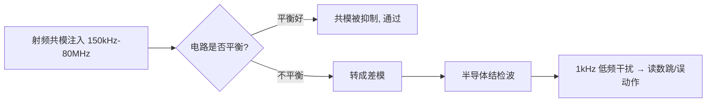

# 模电

## 半导体与二极管
- 本征半导体通过掺杂形成 N 型和 P 型；PN 结的耗尽层和内建电势决定单向导电特性。
- 二极管正向区可用指数模型或分段线性模型近似；小信号分析使用动态电阻 `rd ≈ nVT/ID`，不能把静态压降当作所有电流下的常数。
- 整流、限幅和钳位要同时检查反向耐压、峰值电流、平均电流、漏电和功耗。
- 稳压二极管必须工作在规定反向电流范围内；串联电阻要校核输入最大/最小、负载最大/最小和二极管功耗。

## BJT
- 截止、放大和饱和由两个 PN 结的偏置状态决定；`β` 随电流、温度和器件离散性变化，不能作为精确设计常数。
- 共射级提供电压增益并产生相位反转；共集级主要用于缓冲，输入电阻高、输出电阻低。
- 偏置设计先确定静态工作点，再用直流通路求 Q 点、用交流通路求增益和摆幅。
- 发射极电阻提供直流负反馈和热稳定性；旁路电容提高交流增益，但会改变低频截止点。

## MOSFET
- 截止、线性区和饱和区由 `VGS`、`VDS` 与阈值共同决定；逻辑电平 MOSFET 的阈值电压不是“完全导通”电压。
- 导通损耗近似 `Pcond = I²RDS(on)`；开关损耗受栅极电荷、米勒平台、驱动电阻、频率和寄生电感影响。
- 栅极是电容性节点，必须考虑上拉/下拉、驱动电流、dv/dt 误导通和体二极管反向恢复。
- 功率开关的栅极回路和功率回路应分开观察，避免驱动回路共用大电流回流路径。

## 放大、差分与电流源
- 放大器设计先定义信号范围、带宽、噪声、失真和负载，再选择拓扑和静态工作点。
- 直流通路用于求偏置，交流通路中电源通常视为交流地；两种模型不能混用。
- 差分对抑制共模信号，尾电流源和器件匹配决定增益、线性和共模范围。
- 输入电阻、输出电阻、增益和频率响应共同决定级间耦合；不能只看中频电压增益。

## 运放与反馈
- 理想运放的“虚短、虚断”只适用于负反馈、线性区和有限带宽条件；实际必须检查输入共模范围、输出摆幅、GBW、压摆率、失调和输出驱动。
- 负反馈降低增益误差和失真、扩大带宽，但环路相位裕度不足会振荡；补偿应结合闭环增益和负载分析。
- 反相、同相、差分和跨阻结构的增益由反馈网络决定；电阻匹配误差会直接转化为增益或共模误差。
- 比较器不应套用运放线性规则；开漏/开集电极输出必须配置合适上拉，并处理输入滞回和输出抖动。

## 频率响应与稳定性
- 耦合电容、旁路电容和器件结电容共同形成低频与高频截止点；计算时使用实际源阻抗和负载阻抗，而不是只用电容标称值。
- 单极点近似下，截止频率 `fc = 1/(2πRC)`；多级级联时各极点会叠加，不能把每级单独的 `fc` 直接当作系统带宽。
- BJT 的结电容、MOSFET 的 `Cgs/Cgd` 和米勒效应会降低高频增益；驱动电阻、源阻抗和布线寄生都进入时间常数。
- 反馈环路用环路增益 `T=Aβ` 判断稳定性。交越频率附近的相位裕度不足通常表现为振铃、周期振荡或负载变化后恢复慢。
- 容性负载会给运放输出增加相位滞后；需要使用隔离电阻、专用稳定性补偿或满足手册规定的电容范围。

## 常用模拟接口
- 分压采样要校核输入范围、分压电阻功耗、阻值误差、温漂、ADC 采样电容充电时间和输入漏电。
- 跨阻放大器将电流转换为电压，反馈电阻决定直流增益，反馈电容用于限制噪声带宽并改善稳定性。
- 高侧电流采样需满足共模范围；低侧采样实现简单但会抬高负载地，是否允许取决于系统回流和精度要求。
- 仪表放大器和差分放大器的共模抑制依赖电阻比匹配；离散电阻误差可能使大共模电压转化为显著输出误差。

## 失效现象与定位
- 输出饱和但输入正常：检查供电、输入共模、输出摆幅、反馈方向和负载电流。
- 低频漂移或零点异常：检查偏置电流、漏电、热电势、基准和高阻节点污染。
- 高频振铃或自激：先缩短反馈/去耦回路，再测量相位裕度相关节点，避免先盲目增大电容。
- MOSFET 过热：分别测量导通压降、开关波形和栅极波形，区分导通损耗、切换损耗和寄生振荡。

## 工程检查
- [ ] 所有器件额定值、工作点、温度和功耗均有裕量。
- [ ] 小信号模型适用的频率和偏置范围已写明。
- [ ] 反馈环路有稳定性、启动和异常输入验证。
- [ ] 模拟输入保护的漏电和电容没有破坏精度与带宽。

+### 模电知识条目 1
反射的本质一句话：**信号在传播路径上遇到阻抗突变，就会有一部分能量原路返回**。

用最直观的比喻：一条粗绳接一条细绳，你在粗绳这头抖一下，波传到接头处，一部分继续往细绳走，一部分弹回来。PCB 上完全同理——走线 50Ω，突然接到一个 1kΩ 的输入引脚，信号"撞墙"就反弹。

那为什么低频不用管？因为**是否需要按传输线处理，取决于上升时间 $T_r$ 与传播延时 $T_d$ 的比值**，而不是时钟频率。一个 1kHz 的方波，如果上升沿只有 200ps，它照样会产生严重反射；一个 100MHz 的正弦波如果沿很缓，反而问题不大。

判据（工程常用）：当

$$T_d > \frac{T_r}{6} \quad\text{（保守取 } \frac{T_r}{10}\text{）}$$

时必须做传输线分析。等价说法：**关键长度**

$$L_{crit}=\frac{T_r \cdot v}{6}$$

🔬 **深入原理**

反射系数（在阻抗从 $Z_1$ 进入 $Z_2$ 的界面上）：

$$\Gamma=\frac{Z_2-Z_1}{Z_2+Z_1}$$

透射系数 $\tau = 1+\Gamma = \dfrac{2Z_2}{Z_1+Z_2}$。

三种极端情况必须刻进脑子：

| 末端条件 | $Z_L$ | $\Gamma$ | 现象 |
|---|---|---|---|
| 开路 | ∞ | +1 | 全反射，同相，末端电压翻倍（过冲） |
| 短路 | 0 | −1 | 全反射，反相，末端电压为 0（下冲） |
| 匹配 | $Z_0$ | 0 | 无反射，能量全部被吸收 |

再看信号刚发出时的**分压关系**。驱动器输出阻抗 $R_s$，走线 $Z_0$，信号刚出发时看不到负载，只看到 $Z_0$：

$$V_{launch}=V_{s}\cdot\frac{Z_0}{R_s+Z_0}$$

例如 3.3V 驱动、$R_s=20Ω$、$Z_0=50Ω$，则出发电压只有 $3.3\times50/70=2.36V$——这叫**初始台阶**。它不是"信号变弱了"，而是波还在路上，等末端反射回来才会叠加到全幅。

🛠 **设计实例/操作**

*例1：算关键长度。* 某 MCU IO 上升沿 $T_r=1\text{ns}$，FR-4 上 $v\approx6\text{ mil/ps}$。
$$L_{crit}=\frac{1000\text{ps}\times6\text{mil/ps}}{6}=1000\text{ mil}=25.4\text{ mm}$$
即超过约 2.5cm 就要考虑端接。若换成 FPGA 的 200ps 沿，$L_{crit}$ 只剩 5mm——这就是为什么高速器件旁边"随手一根线"都可能出问题。

*例2：估算过冲幅度。* 50Ω 线末端接 CMOS 输入（近似开路，$\Gamma_L=+1$），源端 $R_s=10Ω$（$\Gamma_S=(10-50)/60=-0.67$）。初始台阶 $3.3\times50/60=2.75V$，第一次末端反射后为 $2.75\times2=5.5V$——远超 3.3V+0.5V 的绝对最大额定值，长期会打坏输入 ESD 二极管。

⚠️ **常见误区**

1. **用时钟频率判断要不要控阻抗**。错。要看上升沿。经验换算：信号有效带宽 $f_{knee}\approx 0.35/T_r$。
2. 认为"反射只发生在末端"。任何阻抗突变点都反射：过孔、接插件、线宽突变、参考平面换层、桩线（stub）。
3. 认为过冲只是"波形难看"。它会造成 EMI 加剧、器件闩锁、长期可靠性下降。
4. 把 $\Gamma$ 的正负号搞反。记忆法：**遇大变正（过冲）、遇小变负（下冲）**。

📌 **要点速记**

- $\Gamma=(Z_2-Z_1)/(Z_2+Z_1)$；开路 +1、短路 −1、匹配 0。
- 判据是 $T_r$ 不是频率；$L_{crit}\approx T_r v/6$。
- 初始台阶由 $R_s$ 与 $Z_0$ 分压决定，不是故障。
- 有效带宽 $f_{knee}\approx0.35/T_r$，决定要关注多高频率的完整性。


---
### 模电知识条目 2
四种经典端接方式，可以按"电阻放在哪儿"来记：

| 方式 | 位置 | 典型值 | 直流功耗 | 适用场景 |
|---|---|---|---|---|
| 源端串联端接 | 驱动器旁 | $R=Z_0-R_{out}$，常 22～33Ω | 无 | 点对点、CMOS、时钟、SPI、SD |
| 并联端接（到GND/VCC） | 接收端 | $R=Z_0$ | 大 | 少用，功耗高 |
| 戴维南端接 | 接收端 | $R_1\parallel R_2=Z_0$ | 大 | TTL 电平、少量总线 |
| AC 端接（RC） | 接收端 | $R=Z_0$，$C$ 100pF～1nF | 极小 | 时钟等周期信号 |
| 二极管端接 | 接收端 | 肖特基钳位 | 小 | 保护为主，非匹配 |

🔬 **深入原理**

**源端串联端接**为什么最常用？它令 $\Gamma_S\approx0$：波第一次到末端全反射（$\Gamma_L=+1$）后回到源端被吸收，**一次往返即稳定**，且直流路径上无电流，几乎零功耗。代价是"半波"传输：线中间点电压只有一半，因此**中间不能挂负载**（点对点专用）。

$$R_{series}=Z_0-R_{out(driver)}$$

驱动器输出阻抗典型 10～25Ω，所以常见 22Ω、27Ω、33Ω。

**AC 端接**的时间常数要求：

$$\tau=RC \gg T_r,\quad \text{同时}\ \tau \ll \frac{T_{bit}}{2}$$

工程取 $C$ 使 $RC \approx 3\sim5\,T_r$。例如 $Z_0=50Ω$、$T_r=1\text{ns}$，取 $C=100\text{pF}$，$\tau=5\text{ns}$，合适。

**戴维南端接**：要求 $R_1\parallel R_2=Z_0$，且分压中点等于信号中心电平。例如 3.3V 系统、50Ω：$R_1=R_2=100Ω$，中点 1.65V，等效 50Ω，但静态电流 3.3V/200Ω=16.5mA，功耗 54mW/线——DDR2 之前的 SSTL 就是这么干的，很费电。

**差分对端接**：接收端跨接 100Ω（LVDS/以太网/USB），有时用 2×50Ω 到中点电容接地，同时吸收差模和共模。

🛠 **设计实例/操作**

*例1：SPI Flash 时钟串阻。* CLK 50MHz，但驱动沿 1.5ns，走线 40mm > $L_{crit}$。在**紧靠 MCU 引脚**（<200mil）串 22Ω，实测过冲从 1.2V 降到 0.2V 以内。注意：**串阻必须靠近驱动端，不是中间也不是接收端**。

*例2：以太网 RGMII。* 4 对数据 + 时钟，走线 60mm，各串 22Ω 于 MAC 侧；TX_CLK/RX_CLK 单独串阻并等长。若 PHY 侧驱动 RX 数据，需要在 PHY 侧串阻——**串阻跟着驱动方向走**，双向总线（如 DDR DQ）反而不适合单侧串阻，要用 ODT。


⚠️ **常见误区**

1. **串阻放到接收端**。放错位置等于没放，源端反射依然存在。
2. 在多点总线上用源端串接。中间节点会看到半幅台阶，逻辑误判。
3. 端接电阻用 1206 大封装。寄生电感大，高频失效，应选 0402/0201 薄膜电阻，且精度 1%。
4. 忘了驱动器本身有输出阻抗，直接串 50Ω 造成过阻尼、边沿变缓、时序不足。
5. 认为"加了端接就不用控阻抗"。端接只解决两端，中间的过孔/换层不连续照样反射。

📌 **要点速记**

- 源端串联端接性价比最高：零功耗、一次往返收敛，但仅限点对点。
- $R_{series}=Z_0-R_{out}$，必须紧贴驱动引脚。
- 并联/戴维南匹配效果好但耗电；AC 端接省电但只适合周期信号。
- 差分线用 100Ω 跨接；现代 DDR/SerDes 用片内 ODT 替代外部电阻。
- 端接治两端，受控阻抗治全程，两者缺一不可。


---
### 模电知识条目 3
传导发射（Conducted Emission, CE）测的是：**你的设备通过电源线往电网里"倒灌"了多少噪声**。频段通常 150kHz～30MHz（CISPR 32/14/11 等）。

测试怎么做？被测设备（EUT）的电源线接到 **LISN（线路阻抗稳定网络，又叫人工电源网络 AMN）**，LISN 的作用有三：

1. 给 EUT 提供干净的市电（滤掉电网自身噪声）；
2. 在 150kHz～30MHz 内提供**标准化的 50Ω 阻抗**，保证不同实验室结果可比；
3. 把 EUT 产生的噪声耦合到 EMI 接收机（通过 0.1μF + 1kΩ 的取样支路）。

🔬 **深入原理**

CE 噪声同样分共模与差模：

- **差模噪声（DM）**：在 L 与 N 之间流动，主要来自开关电源输入电容的高频纹波电流（$di/dt$ 在输入回路）。频段偏低（150kHz～数 MHz）。
- **共模噪声（CM）**：L 和 N 同向流出，经由 **Y 电容/寄生电容 → 大地（PE）** 回来。主因是开关管漏极（高 $dv/dt$ 节点）对散热片/机壳的寄生电容 $C_p$。频段偏高（几 MHz～30MHz）。

共模位移电流：

$$i_{CM}=C_p\cdot\frac{dv}{dt}$$

举例：MOSFET 漏极到散热片 $C_p=30\text{pF}$，$dv/dt=10\text{kV}/\mu s=10^{10}\text{V/s}$，则 $i_{CM}=0.3\text{A}$ 峰值脉冲——这就是超标的元凶。

LISN 上两路（L、N）分别测得 $V_L$、$V_N$，可分离：

$$V_{CM}=\frac{V_L+V_N}{2},\qquad V_{DM}=\frac{V_L-V_N}{2}$$

有专门的 **CM/DM 分离器**可以直接测，整改效率高很多。

限值举例（CISPR 32 Class B，AC 电源端口）：

| 频段 | QP | AVG |
|---|---|---|
| 0.15～0.5 MHz | 66→56 dBμV（随 log 频率线性下降） | 56→46 dBμV |
| 0.5～5 MHz | 56 dBμV | 46 dBμV |
| 5～30 MHz | 60 dBμV | 50 dBμV |

🛠 **设计实例/操作**

*例1：判断是 CM 还是 DM。* 一个实用土办法：在 EUT 与 LISN 之间的电源线上**套一个大磁环（绕几圈）**。如果超标点明显下降 → 共模为主；几乎不变 → 差模为主。这一步能省掉一半的盲目整改。

*例2：测试布置的坑。* 桌面设备置于 0.8m 高木桌，距参考接地板 0.4m（垂直）/0.8m（水平）；多余电源线**折成 30～40cm 的 8 字捆扎**，不能盘成大圈（会变天线）。布置不规范导致的复测在实验室极常见。

```
传导测试拓扑
  电网 ──[LISN L]──┬── L ──▶ EUT
        [LISN N]──┼── N ──▶ EUT
                  │  PE ──▶ EUT外壳
                  └──▶ 50Ω ──▶ EMI 接收机
  参考接地板（金属地板）与 LISN 外壳、EUT PE 良好搭接
```

⚠️ **常见误区**

1. 认为 CE 是"电源工程师的事"。数字板的时钟噪声一样会通过 DC-DC、地耦合到输入端。
2. 一超标就狂加 X/Y 电容。Y 电容受**漏电流安规限制**（一般 ≤3.5mA，对应 220V/50Hz 时 Y 电容总量约 ≤4.7nF），加过头无法过安规。
3. 忽略 PE 线。二类设备（无 PE）的共模回路只能靠寄生电容，整改思路完全不同。
4. 用普通示波器在电源线上量"噪声"就下结论。示波器噪底、带宽、检波方式与 EMI 接收机完全不同。

📌 **要点速记**

- CE 频段 150kHz～30MHz，用 LISN 提供 50Ω 标准阻抗并取样。
- 低频段多为差模（输入回路 $di/dt$），高频段多为共模（$C_p \cdot dv/dt$）。
- $i_{CM}=C_p\,dv/dt$，减小 $dv/dt$ 或 $C_p$ 是治本。
- 磁环试探法可快速判别 CM/DM。
- Y 电容受安规漏电流限制，不能无限加。


---
### 模电知识条目 4
传导超标的整改，本质是给噪声修一条"回家的近路"，同时在通往电网的路上设卡。核心工具是 **EMI 输入滤波器**。

一个典型 AC 输入 EMI 滤波器：

```
 L ──┬──[ X1 ]──┬──▮▮▮ CMC ▮▮▮──┬──[ X2 ]──┬──▶ 整流桥
     │          │   （共模扼流圈） │          │
    保险丝     压敏                          ├─[Y1]─┐
     │          │                            │      ├── PE
 N ──┴──────────┴──▮▮▮────────────┴─[Y2]─────┘
```

各元件分工：

| 元件             | 抑制对象 | 原理                 |
| -------------- | ---- | ------------------ |
| X 电容（L-N 之间）   | 差模   | 给差模电流就近短路          |
| Y 电容（L/N 对 PE） | 共模   | 把共模电流引回 PE，缩小环路    |
| CMC 共模扼流圈      | 共模   | 对共模呈高阻（mH 级），对差模低阻 |
| 差模电感 / CMC 漏感  | 差模   | 串联高阻               |
| 磁珠 / 铁氧体       | 高频   | 等效为高频电阻，耗散能量       |

🔬 **深入原理**

滤波器是"阻抗失配"器件，插入损耗依赖源阻抗与负载阻抗：

$$IL(\text{dB})=20\log_{10}\left|\frac{V_{without}}{V_{with}}\right|$$

**阻抗失配原则**：噪声源阻抗低 → 用串联电感阻挡；噪声源阻抗高 → 用并联电容旁路。所以：
- 差模噪声源（输入电容回路）阻抗低 → 优先加差模电感/CMC 漏感。
- 共模噪声源阻抗高（寄生电容耦合） → Y 电容效果显著。

CMC 的共模阻抗：$Z_{CM}=j\omega L_{CM}$，典型 $L_{CM}$ 为 1～10mH，在 1MHz 时 $Z$ 达数 kΩ。但 CMC 有**自谐振频率 SRF**，超过 SRF 后寄生电容主导，阻抗反而下降——所以高频段常需再加一级小磁环或磁珠。

滤波器截止频率（LC 二阶）：

$$f_c=\frac{1}{2\pi\sqrt{LC}}$$

理论 −40dB/dec。设计时让 $f_c$ 比最低超标频点低 5～10 倍。

**衰减目标计算**：超标 12dB → 目标 18dB → 若单级 −40dB/dec，需要 $f_c$ 满足 $18=40\log(f/f_c)$，即 $f/f_c=10^{0.45}=2.8$，取 $f_c \le f_{超标}/3$。

🛠 **设计实例/操作**

*例1：0.5MHz 超标 10dB（差模为主）。* 输入端 X 电容从 0.22μF 增至 0.47μF，并串入 1mH 差模电感（或选漏感更大的 CMC）。$f_c=1/(2\pi\sqrt{1\text{mH}\times0.47\mu F})=7.3\text{kHz}$，在 0.5MHz 处理论衰减很大，实测可降 12～15dB。

*例2：15MHz 超标（共模为主）。* 15MHz 已超过多数 CMC 的 SRF，加大 CMC 电感值往往无效甚至更差。正确做法：
- 在输出线上套**镍锌材质小磁环**（高频阻抗好）；
- 减小开关节点铜皮面积，降低 $C_p$；
- 变压器加**屏蔽层（法拉第屏蔽）**并接原边地；
- MOSFET 栅极电阻适当加大，减缓 $dv/dt$（代价是效率）。

*例3：布局是滤波器的一半。* 滤波器输入端与输出端走线**绝不能平行靠近**，否则高频直接空间耦合"跨过"滤波器，实测衰减腰斩。滤波器区域下方**不要铺连续地平面连到数字地**，应独立并单点搭接机壳。

⚠️ **常见误区**

1. **只换元件不改布局**。滤波器失效 80% 是布局问题：输入输出耦合、Y 电容回流路径长、地环路大。
2. Y 电容走线绕远。Y 电容到 PE 的路径必须**极短、宽**，否则等效电感抵消其作用。
3. 一味加大 CMC 电感。超过 SRF 后无效；应改用多级、不同材质（锰锌低频/镍锌高频）组合。
4. 忽略安规。X 电容需 X1/X2 等级 + 泄放电阻（断电后 1s 内降到 37%）；Y 电容需 Y1/Y2 等级。
5. 用陶瓷电容当 X 电容。X 电容必须是安规认证的薄膜电容。

📌 **要点速记**

- X 电容治差模，Y 电容+CMC 治共模。
- 阻抗失配原则：低阻源用串感，高阻源用并容。
- CMC 有 SRF，高频段需换材质或加磁环。
- 滤波器输入/输出走线必须隔离，Y 电容回 PE 路径要极短。
- 安规限制 Y 电容容量与漏电流，不能无限堆料。


---
### 模电知识条目 5
CS（Conducted Susceptibility，传导抗扰度，IEC 61000-4-6）模拟的场景是：**在 150kHz～80MHz 频段，外界电磁场在线缆上感应出共模电压，顺着线缆灌进设备**。

为什么是这个频段？因为 80MHz 以下，波长（>3.75m）远大于普通设备尺寸，机壳不能有效接收电磁波，但**线缆长度接近 $\lambda/4$，成了高效接收天线**。80MHz 以上则改用辐射抗扰（RS，IEC 61000-4-3）直接照射。

测试等级：Level 1 = 1V、Level 2 = 3V、Level 3 = 10V（rms，未调制载波），实测时用 **1kHz 正弦、80% AM 调幅**，扫频步进 1%，每点驻留 ≥0.5s。

🔬 **深入原理**

注入方式三种：

| 方式 | 器件 | 特点 |
|---|---|---|
| CDN（耦合去耦网络） | CDN-M2/M3、AF、T2 等 | 首选，阻抗标准 150Ω |
| EM-Clamp（电磁钳） | 钳夹线缆 | 无法用 CDN 时（如屏蔽线） |
| 直接注入（BCI/直接耦合） | 100Ω 电阻注入 | 同轴/单线场合 |

**150Ω 共模阻抗**是这个标准的核心参数——它代表人体/线缆对地的典型共模阻抗。CDN 保证注入点看到 150Ω。

设备内部为什么会误动作？共模电压 $V_{CM}$ 通过**不平衡**转成差模干扰：

$$V_{DM}=V_{CM}\cdot\frac{\Delta Z}{Z}$$

$\Delta Z/Z$ 就是电路的不平衡度。差分接收电路（RS-485、以太网）平衡好，抗扰强；单端信号（UART、GPIO、模拟采样）平衡差，容易被击穿。

此外 80MHz 以下的干扰还会被半导体结**检波（rectification）**——PN 结的非线性把射频包络解调出来，变成 1kHz 的低频干扰，直接叠加到运放/ADC 输入，表现为读数跳动。这就是为什么调制是 80% AM 1kHz：**它专门检验解调敏感度**。

🛠 **设计实例/操作**

*例1：模拟采样口被干扰。* 4-20mA 输入在 20MHz 附近读数跳 ±5%。整改：
- 输入端加 **RC 低通**（如 100Ω + 1nF，$f_c=1.6\text{MHz}$）；
- 运放输入引脚就近加 10～100pF 到地（射频旁路）；
- 差分走线，增加共模抑制；
- 线缆入口加 CMC 或磁环。

*例2：I/O 口复位。* 长线 GPIO 在 5MHz 处触发复位。整改：GPIO 加 TVS + 串 100Ω + 1nF 对地；软件加去抖与看门狗；PCB 上把该信号的地回流路径缩短。



⚠️ **常见误区**

1. 只在软件上打补丁（滤波算法）。射频检波产生的是真实模拟量，软件无法完全消除。
2. 在信号线上加大电容却忽略上升沿要求，导致通信速率不达标。要按 $f_c$ 与信号带宽折中。
3. 认为屏蔽线一定好。屏蔽层若**只单端接地或接地阻抗高**，反而成为共模注入通道。高频应 360° 环接。
4. 忘记电源端口也要做 CS。DC 电源输入端同样需要 CMC + Y 电容。
5. 把 CS 与 EFT/Surge 混淆。CS 是持续射频，EFT 是脉冲群，Surge 是大能量单脉冲，防护器件完全不同。

📌 **要点速记**

- CS = IEC 61000-4-6，150kHz～80MHz，共模注入，150Ω 标准阻抗。
- 用 1kHz/80% AM 调制，专门考核半导体结的检波敏感度。
- 不平衡度决定共模→差模转换，平衡设计是根本。
- 端口整改套路：CMC/磁环 + RC 低通 + 就近射频旁路电容 + TVS。
- 屏蔽层需 360° 低阻接地才有效。


---
### 模电知识条目 6
静电放电（ESD）是人体或物体积累的电荷在接触瞬间释放。它的特点是：**电压极高（kV 级）、电流很大（几十 A）、但持续时间极短（ns 级）、总能量很小（mJ 级）**。

IEC 61000-4-2 人体模型（HBM）等效电路：**150pF 电容 + 330Ω 电阻**。

放电波形（8kV 接触放电）：
- 上升时间 **0.6～1 ns**（！比大多数数字信号还快）
- 首峰电流约 **30 A**
- 30ns 时约 16A，60ns 时约 8A

上升时间 1ns 意味着频谱延伸到 **1GHz 以上**——这就是 ESD 难防的根本原因：它不是"电压问题"，而是"高频问题"。任何几 nH 的引线电感在 30A/1ns 的 $di/dt$ 下都会产生巨大压降：

$$V=L\frac{di}{dt}=1\text{nH}\times\frac{30\text{A}}{1\text{ns}}=30\text{V}$$

**1nH 就是 30V！** 这句话是 ESD 防护布局的全部精髓。

🔬 **深入原理**

测试等级（接触放电/空气放电）：

| 等级 | 接触放电 | 空气放电 |
|---|---|---|
| 1 | ±2 kV | ±2 kV |
| 2 | ±4 kV | ±4 kV |
| 3 | ±6 kV | ±8 kV |
| 4 | ±8 kV | ±15 kV |

评判等级：A（正常）、B（可自恢复的性能降低）、C（需人工干预恢复）、D（永久损坏）。消费电子一般要求 A 或 B。

放电方式：直接接触放电（金属外壳、连接器外壳）、空气放电（缝隙、按键）、**间接放电（HCP 水平耦合板、VCP 垂直耦合板）**——间接放电是靠场耦合，很多产品栽在这里。

防护器件关键参数：

| 参数 | 含义 | 高速接口要求 |
|---|---|---|
| $C_j$ 结电容 | 对信号的容性负载 | USB2 <3pF；USB3/HDMI <0.5pF |
| $V_{RWM}$ | 工作电压 | > 信号电平 |
| $V_{clamp}$ | 钳位电压 | < 芯片耐压 |
| $R_{dyn}$ 动态电阻 | 决定大电流下钳位 | 越小越好 |

钳位电压实际值：$V_{clamp}=V_{BR}+I_{PP}\cdot R_{dyn}$，再加上 PCB 引线电感压降。

🛠 **设计实例/操作**

*例1：ESD 器件布局黄金法则。*

```
 ✓ 正确                              ✗ 错误
 连接器 ─┬─ 走线 ─── 芯片            连接器 ─── 走线 ─┬─ 芯片
         │                                            │
       [TVS]                                        [TVS]
         │ 极短极粗                                    │ 长走线
        GND 过孔×2（就近）                            GND
 TVS 紧靠连接器，泄放路径不经过芯片    ESD 电流已经流过芯片才被钳位
```

三条铁律：
1. **TVS 必须在连接器与芯片之间，且紧靠连接器**（<5mm）；
2. **接地引线极短极宽**，最好双过孔直下 GND 平面；
3. **ESD 泄放路径不能与敏感信号并行**，泄放走线下方要有完整地。

*例2：结构层面。* 缝隙处加导电泡棉/弹片；塑胶壳内侧喷导电漆并接机壳地；金属按键下方放泄放环（ring）并接机壳；螺丝柱做接地柱。

*例3：机壳地与信号地。* 常用做法是**通过 1000pF/2kV 电容 + 1MΩ 电阻并联**连接，或在多点用 0Ω 电阻预留（调试时可换）。高频给电容路径，直流靠电阻泄放，避免地环路。

⚠️ **常见误区**

1. 以为"电压高就要选大功率器件"。ESD 能量很小，关键是**速度与低阻抗路径**，不是功率。
2. TVS 放在芯片旁边。等于让 ESD 电流先穿过芯片。
3. 高速口用大电容 TVS。USB3 上放 3pF 器件，眼图直接崩，必须用 <0.5pF 的专用 ESD 阵列。
4. 只做接触放电试验就放心。空气放电和间接放电（HCP/VCP）经常更容易失败。
5. 用普通稳压二极管替代 TVS。响应速度慢几个数量级，来不及钳位。
6. 忽视软件恢复。B 级判据允许自恢复，看门狗 + 寄存器周期重载 + 通信重传，是低成本达标手段。

📌 **要点速记**

- ESD 上升沿 <1ns、峰值 30A，本质是高频问题；1nH 引线 = 30V。
- HBM 模型：150pF + 330Ω。
- TVS 紧靠连接器、接地路径最短最宽，是防护第一原则。
- 高速接口必须选低结电容（<0.5pF）ESD 器件。
- 机壳地与信号地用 1nF/2kV 电容 + 1MΩ 并联连接。


---
### 模电知识条目 7
电源既是"受害者"也是"加害者"：芯片开关时从电源抽取瞬态电流，如果电源网络（PDN）阻抗高，就会产生电压波动（纹波、地弹、SSN 同步开关噪声），这些波动既让芯片工作不稳，也通过平面/线缆辐射出去。

核心目标：**在关注频段内把 PDN 阻抗压到目标值以下**。

$$Z_{target}=\frac{V_{dd}\times \text{Ripple}\%}{I_{max\_transient}}$$

例：1.2V 内核、允许 3% 纹波、瞬态电流 5A：

$$Z_{target}=\frac{1.2\times0.03}{5}=7.2\ \text{m}\Omega$$

🔬 **深入原理**

**电容不是理想电容**。实际模型是 RLC 串联：

$$Z=R_{ESR}+j\left(\omega L_{ESL}-\frac{1}{\omega C}\right)$$

自谐振频率：

$$f_{SRF}=\frac{1}{2\pi\sqrt{L_{ESL}C}}$$

低于 SRF 呈容性（阻抗随频率下降），高于 SRF 呈**感性**（阻抗随频率上升，电容失效！）。在 SRF 处阻抗最低 = ESR。

典型 0402 MLCC 的 $L_{ESL}\approx0.5\text{nH}$（含焊盘、过孔可到 1～2nH）：

| 容值 | 理论 SRF（ESL=1nH） |
|---|---|
| 10 μF | 1.6 MHz |
| 1 μF | 5 MHz |
| 100 nF | 16 MHz |
| 10 nF | 50 MHz |
| 1 nF | 159 MHz |

**关键结论**：100MHz 以上，任何分立电容都已呈感性——高频只能靠**平面电容**和**片内电容**。

平面电容：

$$C_{plane}=\varepsilon_0\varepsilon_r\frac{A}{d}$$

面积 100cm²、介质 0.1mm、$\varepsilon_r=4.2$：$C\approx372\text{pF}$——值不大，但 ESL 极低（pH 级），高频表现优异。所以**电源/地平面紧邻（薄介质）是高频去耦的王道**。

**反谐振**：不同容值电容并联时，大电容的感性区与小电容的容性区之间会形成并联谐振峰，阻抗反而升高。所以**不要把容值拉得太开（相邻容值差 10 倍以内），并且多用同容值并联（并 10 个 100nF 比 1 个 1μF+1 个 10nF 更平坦）**。现代做法：**同一容值多颗并联 + 依靠平面电容补高频**。

**地弹（SSN）**：$N$ 个 IO 同时翻转：

$$V_{gnd\_bounce}=N\cdot L_{gnd}\frac{di}{dt}$$

🛠 **设计实例/操作**

*例1：去耦电容放置。* 优先级：**过孔距离 > 容值**。0.1μF 放在离芯片 5mm 处、走 3mm 细线，其引线电感 3nH 已经让它在 30MHz 以上完全失效。正确做法：
- 电容焊盘**紧贴芯片电源引脚**（<2mm）；
- 每个焊盘配**独立过孔**，过孔尽量短（薄板/背钻/盲孔）；
- 双过孔并联可把电感减半；
- 电容与过孔用**短而宽的铜皮**连接，不要用细线。

```
 ✓ 最佳             ✓ 良好            ✗ 差
  ▣●  ●▣            ▣ ● ● ▣          ▣──●   ●──▣
 （过孔在焊盘两侧    （过孔紧邻）       （细长引线, ESL大）
   互为反向, 互感抵消）
```

*例2：DC-DC 布局四要点。*
1. **输入回路面积最小**：$C_{in}$ 紧贴 VIN 与 GND 引脚——这是整个开关电源里 $di/dt$ 最大的环路，也是辐射主源。
2. **SW 节点铜皮尽量小**：它是 $dv/dt$ 最大的节点，铜皮大 = 电场天线。
3. **反馈线远离 SW 和电感**，从输出电容处取样，走内层并有地包围。
4. **散热铜皮与地平面多过孔连接**，兼顾散热与低阻。

*例3：磁珠使用。* 磁珠给模拟电源做隔离时要小心：磁珠（感性）+ 电容 = LC 谐振，可能在几百 kHz 放大噪声 10dB。必须**加阻尼**（并联小电阻，或选 ESR 较大的钽电容/加 1Ω 串阻）。

⚠️ **常见误区**

1. 认为"电容越大越好"。大容值 SRF 低，高频完全无效。
2. 盲目堆多种容值（10μF+1μF+100nF+10nF+1nF），制造多个反谐振峰。
3. 去耦电容离芯片远、共用过孔。等于没放。
4. 电源平面与地平面之间隔了很厚介质。应把 PWR/GND 相邻且介质尽量薄（<0.1mm）。
5. 在敏感模拟电源上滥用磁珠不加阻尼，引入谐振放大。

📌 **要点速记**

- $Z_{target}=V\cdot\text{Ripple}\%/I_{max}$，PDN 设计的第一步。
- 电容有 SRF，超过后变电感；100MHz 以上靠平面电容与片内电容。
- 去耦"位置比容值重要"，过孔电感是主要瓶颈。
- 避免反谐振：同容值多并联优于多容值混搭。
- DC-DC 布局：输入环路最小、SW 铜皮最小、反馈线最远。


---
### 模电知识条目 8
"地"不是电位为零的理想节点，而是**回流电流的公共通道**。所有 SI 与 EMC 问题追到底，都能追到地上。

三个必须建立的观念：
1. 地平面上任意两点都有阻抗，高频下电感占主导 → 存在电位差。
2. 电流走的是**回路阻抗最小**的路径，你无法"命令"电流去哪，只能设计路径。
3. "分割地"是为了控制回流路径，**不是为了让噪声消失**；分割用错比不分割更糟。

🔬 **深入原理**

**地阻抗**：一段铜皮的电感约

$$L\approx 0.2\ell\left[\ln\frac{2\ell}{w+t}+0.5+0.2235\frac{w+t}{\ell}\right]\ (\text{nH},\ \text{mm})$$

粗略记忆：**一段普通走线约 1nH/mm**，宽平面可低到 0.1nH/mm 以下。所以平面永远优于走线。

**单点接地 vs 多点接地**：

| 方式 | 适用频率 | 原理 | 场景 |
|---|---|---|---|
| 单点接地 | < 1 MHz | 消除地环路，避免公共阻抗耦合 | 低频模拟、音频、精密测量 |
| 多点接地 | > 10 MHz | 缩短回流路径，降低电感 | 数字、高速、RF |
| 混合接地 | 宽频 | 电容实现"直流单点、高频多点" | 混合信号板、机壳地 |

判据：接地线长度 $< \lambda/20$ 时可视为单点，否则必须多点。

**分割（Split）的正确用法**：只有当**跨区信号极少且能被严格控制**时才分割。典型是 ADC/DAC：
- 模拟地与数字地在**ADC 芯片正下方单点连接**（现在更主流的做法是**不分割，用布局分区代替分割**）；
- 若分割，则跨越缝隙的信号必须为零，或在跨越处提供桥接。

现代主流观点（Henry Ott / Howard Johnson）：**优先"不分割 + 布局分区"**。理由：完整平面提供最低阻抗与最短回流；分割带来的缝隙一旦被信号跨越，代价远大于收益。

🛠 **设计实例/操作**

*例1：混合信号板布局分区（不分割地）。*

```
  ┌─────────────────────────────────────┐
  │  数字区        │  ADC  │   模拟区    │
  │  MCU/DDR/时钟  │ 芯片  │  运放/基准  │
  │                │       │             │
  │   ← 数字回流 →  │       │ ← 模拟回流 →│
  └─────────────────────────────────────┘
         整块完整 GND 平面（不分割）
   要点：数字信号绝不走到模拟区上方；
         ADC 数字侧串阻 + 数字电源单独 LC 滤波
```

*例2：机壳地 / 保护地 / 信号地。* 三者关系用"电容+电阻+磁珠"选择性连接：
- 高频短接（1nF/2kV 电容）→ 给 ESD/EFT 共模电流回路；
- 直流隔离或高阻（1MΩ）→ 避免地环路电流与安全问题；
- 接口连接器金属壳建议直接接机壳地，而非信号地。

*例3：过孔缝合（Stitching）。*
- 板边：间距 ≤ $\lambda_{min}/20$，工程取 100～200mil；
- 高速信号换层：紧邻（<100mil）伴 1～2 个 GND 过孔；
- 大面积铜皮：均匀铺缝合孔，防止形成谐振腔（腔模谐振频率 $f_{mn}=\frac{c}{2\sqrt{\varepsilon_r}}\sqrt{(m/a)^2+(n/b)^2}$）。

⚠️ **常见误区**

1. **为了"隔离"随手挖槽**，然后让信号横穿。这是 EMC 头号杀手。
2. 用"星形地"处理高速数字。高频下星形地的长引线电感巨大，完全失效。
3. 认为"地平面越多越好"。层数增加成本，关键是**每个信号层都紧邻一个完整参考面**。
4. 大面积铜皮不打缝合孔，形成腔体谐振，某些频点辐射突增。
5. 把 ADC 的 AGND/DGND 引脚理解为"必须接到两个不同的地"。数据手册里它们通常是芯片内部已分开、外部应接同一块地。

📌 **要点速记**

- 地是回流通道，平面阻抗远低于走线（约 1nH/mm vs <0.1nH/mm）。
- 单点接地 <1MHz，多点接地 >10MHz，混合用电容实现。
- 现代主流：**布局分区优于平面分割**；一定要分割就绝不让信号跨越。
- 换层伴地孔、板边缝合孔间距 ≤λ/20。
- 机壳地与信号地用 1nF+1MΩ 并联做混合连接。

+### 模电进阶知识条目 1
"地"不是电位为零的理想节点，而是**回流电流的公共通道**。所有 SI 与 EMC 问题追到底，都能追到地上。

三个必须建立的观念：
1. 地平面上任意两点都有阻抗，高频下电感占主导 → 存在电位差。
2. 电流走的是**回路阻抗最小**的路径，你无法"命令"电流去哪，只能设计路径。
3. "分割地"是为了控制回流路径，**不是为了让噪声消失**；分割用错比不分割更糟。

🔬 **深入原理**

**地阻抗**：一段铜皮的电感约

$$L\approx 0.2\ell\left[\ln\frac{2\ell}{w+t}+0.5+0.2235\frac{w+t}{\ell}\right]\ (\text{nH},\ \text{mm})$$

粗略记忆：**一段普通走线约 1nH/mm**，宽平面可低到 0.1nH/mm 以下。所以平面永远优于走线。

**单点接地 vs 多点接地**：

| 方式 | 适用频率 | 原理 | 场景 |
|---|---|---|---|
| 单点接地 | < 1 MHz | 消除地环路，避免公共阻抗耦合 | 低频模拟、音频、精密测量 |
| 多点接地 | > 10 MHz | 缩短回流路径，降低电感 | 数字、高速、RF |
| 混合接地 | 宽频 | 电容实现"直流单点、高频多点" | 混合信号板、机壳地 |

判据：接地线长度 $< \lambda/20$ 时可视为单点，否则必须多点。

**分割（Split）的正确用法**：只有当**跨区信号极少且能被严格控制**时才分割。典型是 ADC/DAC：
- 模拟地与数字地在**ADC 芯片正下方单点连接**（现在更主流的做法是**不分割，用布局分区代替分割**）；
- 若分割，则跨越缝隙的信号必须为零，或在跨越处提供桥接。

现代主流观点（Henry Ott / Howard Johnson）：**优先"不分割 + 布局分区"**。理由：完整平面提供最低阻抗与最短回流；分割带来的缝隙一旦被信号跨越，代价远大于收益。

🛠 **设计实例/操作**

*例1：混合信号板布局分区（不分割地）。*

```
  ┌─────────────────────────────────────┐
  │  数字区        │  ADC  │   模拟区    │
  │  MCU/DDR/时钟  │ 芯片  │  运放/基准  │
  │                │       │             │
  │   ← 数字回流 →  │       │ ← 模拟回流 →│
  └─────────────────────────────────────┘
         整块完整 GND 平面（不分割）
   要点：数字信号绝不走到模拟区上方；
         ADC 数字侧串阻 + 数字电源单独 LC 滤波
```

*例2：机壳地 / 保护地 / 信号地。* 三者关系用"电容+电阻+磁珠"选择性连接：
- 高频短接（1nF/2kV 电容）→ 给 ESD/EFT 共模电流回路；
- 直流隔离或高阻（1MΩ）→ 避免地环路电流与安全问题；
- 接口连接器金属壳建议直接接机壳地，而非信号地。

*例3：过孔缝合（Stitching）。*
- 板边：间距 ≤ $\lambda_{min}/20$，工程取 100～200mil；
- 高速信号换层：紧邻（<100mil）伴 1～2 个 GND 过孔；
- 大面积铜皮：均匀铺缝合孔，防止形成谐振腔（腔模谐振频率 $f_{mn}=\frac{c}{2\sqrt{\varepsilon_r}}\sqrt{(m/a)^2+(n/b)^2}$）。

⚠️ **常见误区**

1. **为了"隔离"随手挖槽**，然后让信号横穿。这是 EMC 头号杀手。
2. 用"星形地"处理高速数字。高频下星形地的长引线电感巨大，完全失效。
3. 认为"地平面越多越好"。层数增加成本，关键是**每个信号层都紧邻一个完整参考面**。
4. 大面积铜皮不打缝合孔，形成腔体谐振，某些频点辐射突增。
5. 把 ADC 的 AGND/DGND 引脚理解为"必须接到两个不同的地"。数据手册里它们通常是芯片内部已分开、外部应接同一块地。

📌 **要点速记**

- 地是回流通道，平面阻抗远低于走线（约 1nH/mm vs <0.1nH/mm）。
- 单点接地 <1MHz，多点接地 >10MHz，混合用电容实现。
- 现代主流：**布局分区优于平面分割**；一定要分割就绝不让信号跨越。
- 换层伴地孔、板边缝合孔间距 ≤λ/20。
- 机壳地与信号地用 1nF+1MΩ 并联做混合连接。


---
### 模电进阶知识条目 2
**实例一：BGA 区域与密集模块的丝印策略**

FPGA/DDR3 的 BGA 下方和周边极其拥挤，丝印根本放不下。工程做法是：

1. **BGA 本体只保留一个 1 脚标识**（一个实心三角或圆点，放在 BGA 丝印框外的 A1 角），本体位号 `U2` 放在器件旁边空白处，字高 1.2 mm，加粗。
2. **BGA 周边的去耦电容位号全部隐藏**。这些电容型号一致、方向无关，SMT 靠坐标文件贴片，不靠丝印。隐藏后视觉立刻清爽。
3. 隐藏的位号信息通过 **Assembly 层（装配图层）** 输出。装配图不印在板上，但会随生产资料交给工厂，SMT 核对时使用。这是"板面干净 + 信息完整"的标准解法。

**实例二：极性器件的丝印规范**

| 器件类型 | 必须的丝印标识 |
|---|---|
| 电解电容/钽电容 | 正极加 `+`，或负极侧加填充半圆 |
| 二极管/LED | 阴极加竖线（丝印框一侧封口） |
| IC/连接器 | 1 脚圆点或斜切角 + 丝印框缺口 |
| 排针/排母 | 1 脚方形焊盘 + 丝印 `1` 字符 |
| 晶振 | 1 脚点（四脚晶振必须标） |

关键点：**极性标记必须画在器件本体轮廓之外**，因为器件贴上去后会盖住轮廓内部。一个常见的惨案是把 `+` 号画在电解电容的圆形轮廓里，装完机根本看不见，返修时只能查图纸。

**实例三：接口丝印的可用性设计**

排针、拨码开关、跳线帽这类需要用户操作的接口，丝印要写"人话"：

- 排针旁标注每个脚的功能缩写：`3V3 / TX / RX / GND`，而不是 `P1.1 / P1.2`。
- 拨码开关标注 `ON` 方向和每位含义。
- 电源输入口标注电压范围和极性：`DC 5V 2A`。
- 板边留一块空白区做"版本 + 二维码"，二维码可放产品文档链接。

丝印字符方向也有讲究：整板字符应统一为**从左到右读（0°）或从下往上读（90°）**两种方向，避免出现 180°/270° 的倒字。这样测试人员转动板子一次就能读完所有字符。
### 模电进阶知识条目 3
**实例一：6 层板下单核对表**

| 序号 | 选项 | 本板取值 | 错选后果 |
|---|---|---|---|
| 1 | 板子层数 | **6 层** | 选 4 层内层直接丢失 |
| 2 | 板子尺寸 | 按板框实测填写 | 影响报价与拼板 |
| 3 | 板厚 | 1.6 mm | 影响过孔深径比与阻抗 |
| 4 | 叠层结构 | 与设计一致的指定叠层 | 阻抗全部跑偏 |
| 5 | 阻抗控制 | **勾选**，填 50 Ω 单端 / 100 Ω 差分 | 不勾选＝按普通板做 |
| 6 | 外层铜厚 | 1 oz | 载流与线宽匹配 |
| 7 | 内层铜厚 | 0.5 oz（或 1 oz） | 影响内层阻抗与载流 |
| 8 | 最小线宽/间距 | 按实际（如 4/4 mil） | 低于工艺能力会被退单 |
| 9 | 最小孔径 | 0.2 mm / 0.3 mm | 深径比超限做不出 |
| 10 | 过孔工艺 | 盖油（BGA 焊盘内过孔需塞孔树脂填平） | 漏锡、空焊 |
| 11 | 表面处理 | **沉金 ENIG** | 喷锡不平，BGA 焊接不良 |
| 12 | 阻焊/丝印颜色 | 绿油白字（最成熟、最便宜） | 特殊色加价加工期 |
| 13 | 出货方式 | 单片 / 拼板（含工艺边） | 影响 SMT |
| 14 | 测试方式 | 飞针测试（务必选） | 不测＝开短路风险自担 |
| 15 | 阻抗报告 | 索取 | 无验收依据 |

**实例二：深径比与最小孔径的校核**

板厚 1.6 mm，若选最小孔径 0.2 mm，深径比为：

$$\text{AR}_{drill} = \frac{H}{d} = \frac{1.6}{0.2} = 8:1$$

常规工艺能力约 **8:1～10:1**，8:1 刚好在边缘，价格会上浮且良率略降。若把最小孔径放宽到 0.3 mm，深径比降到 5.3:1，属于舒适区，成本更低。所以**在扇孔阶段（第15～20讲）就应该有意识地把过孔统一为 0.3/0.5 mm（孔径/焊盘）**，除非 BGA 间距实在放不下。

**实例三：打样后的验收动作**

板子到手后，别急着焊：

1. 目视外观：铜面无划伤、阻焊无脱落、丝印清晰、板边无毛刺。
2. 核对层序：对着光看，或用万用表量几个已知的内层网络。
3. 看阻抗报告：单端是否落在 45～55 Ω、差分是否落在 90～110 Ω。
4. 量关键网络通断：电源与地之间**不能短路**（用万用表二极管档量 VCC-GND，应显示电容充电特征而非 0 Ω）。
5. 先只焊电源部分，上电测各路电压正常后，再焊 FPGA/DDR3 等贵重器件。这个"分步上电"习惯能救回很多板子。
### 模电进阶知识条目 4
从考研角度看,模电是电子类、通信类、电气类专业课的"重头戏",初试常考分析与计算,复试常考概念与电路辨识。本段(1-55集)是在打地基:半导体物理→二极管→三极管/场效应管→基本放大电路建立。地基不稳,后面的频率响应、负反馈、运算电路都会"晃"。

🔬 深入原理

模电与数电的根本区别:
- **数字电路**处理的是 0/1 离散电平,关心逻辑关系;
- **模拟电路**处理的是连续时间和连续幅值的信号,关心"不失真地放大/变换"。

一条贯穿全书的能量链:
```
微弱信号(μV~mV) → 放大器件(受控源) → 大幅信号(V~几十V)
                     ↑ 能量来自直流电源 VCC/VDD
```
放大不是"无中生有",而是**用输入信号控制电源能量往负载上搬运**。因此任何放大电路都必须有直流电源 + 合适的静态偏置,否则信号负半周会被削掉(截止失真)。

🛠 设计实例/计算

思考:用一节 1.5V 电池给麦克风供电,麦克风输出信号幅度约 5mV。若想驱动耳机(需要约 0.5V 幅度),理论最小电压放大倍数 $A_v = 0.5/0.005 = 100$ 倍。这就是放大电路要完成的任务,而能量来自电池,不是来自麦克风本身。

⚠️ 常见误区

误区一:把放大理解成"能量凭空变大"。错,放大是能量控制的体现,电源才是能量来源。
误区二:以为模电全是死记公式。恰恰相反,公式背后都是物理图像(载流子、电场、偏置),理解了图像,公式自然记得住。

📌 要点速记

1. 模电处理连续信号,核心是"小信号控制大能量"。
2. 放大离不开直流电源和静态偏置。
3. 本段(1-55集)主线:半导体→二极管→三极管/FET→放大电路建立。
4. 学习策略:先物理图像,后公式。
5. 考研中模电占比高,基础概念与电路分析并重。


---
### 模电进阶知识条目 5
所有半导体器件都建立在"半导体"材料之上,最常用的是硅(Si),锗(Ge)早期也用。所谓本征半导体,就是**纯净、晶格完整**的半导体。硅原子最外层有 4 个价电子,在晶体中每个原子与相邻的 4 个原子共用电子,形成"共价键"。在绝对零度时,价电子被束缚住,半导体不导电;但常温下,热运动会把少量价电子"撞"出共价键,成为**自由电子**,同时在原来位置留下一个带正电的空位,叫**空穴**。电子和空穴总是成对产生,统称为**载流子**。

杂质半导体是在纯净硅中掺入极少量其他元素(掺杂),从而人为控制导电能力。掺五价元素(磷 P、砷 As、锑 Sb)时,多出一个自由电子,得到**N 型半导体**(多数载流子是电子);掺三价元素(硼 B、铟 In)时,少一个电子、多一个空穴,得到**P 型半导体**(多数载流子是空穴)。注意:无论 N 型还是 P 型,整体仍然电中性。

🔬 深入原理

本征载流子浓度 $n_i$ 与温度强相关(硅室温约 $1.5\times10^{10}\ \text{cm}^{-3}$)。掺入杂质后:
- N 型:$n \approx N_D$(施主浓度,远大于 $n_i$),$p = n_i^2/n$
- P 型:$p \approx N_A$(受主浓度),$n = n_i^2/p$

**质量作用定律**(核心公式):

$$n \cdot p = n_i^2$$

这个公式极重要:只要知道多数载流子浓度,少数载流子浓度立刻由上式确定。例如 N 型中 $n$ 很大,则 $p$ 极小——少数载流子(空穴)虽然少,但在 PN 结反向电流、温度特性中举足轻重。

少数载流子由本征激发产生,随温度指数上升;多数载流子由掺杂决定,近似不随温度变。因此**温度升高时,少数载流子激增**,这正是后面三极管反向饱和电流 $I_{CBO}$ 随温度漂移的根源。

🛠 设计实例/计算

例:设某硅片室温 $n_i=1.5\times10^{10}\ \text{cm}^{-3}$,掺磷使 $N_D=10^{16}\ \text{cm}^{-3}$。
则 $n \approx 10^{16}$,由 $np=n_i^2$ 得
$$p = \frac{(1.5\times10^{10})^2}{10^{16}} = 2.25\times10^4\ \text{cm}^{-3}$$
可见空穴浓度比电子小了 12 个数量级,可忽略——但温度一高它就"抬头",成为器件温漂的隐患。

⚠️ 常见误区

误区:认为 N 型半导体带负电、P 型带正电。错!整体都是电中性的,只是多数载流子种类不同。
误区:以为掺杂越多导电越好,可以无限掺。实际上重掺杂会引发禁带变窄、雪崩击穿等副作用。

📌 要点速记

1. 本征半导体靠热激发产生电子-空穴对。
2. N 型多子是电子,P 型多子是空穴;整体皆电中性。
3. 质量作用定律 $np=n_i^2$ 是贯穿全书的"守恒定律"。
4. 少数载流子随温度指数上升,是温漂根源。
5. 掺杂决定多数载流子,温度决定少数载流子。


---
### 模电进阶知识条目 6
把 P 型和 N 型半导体紧密结合,交界面就形成 **PN 结**。它的神奇之处在于"单向导电":正向偏置时像通路,反向偏置时几乎断路。为什么?关键在交界面发生的一场"扩散与漂移的拉锯战"。

P 区空穴多、N 区电子多,浓度差让载流子互相**扩散**——P 区空穴跑进 N 区,留下带负电的受主离子;N 区电子跑进 P 区,留下带正电的施主离子。于是在交界面两侧形成一层**空间电荷区(耗尽层)**,内部建立一个由 N 指向 P 的**内建电场**。这个电场会驱动少数载流子做**漂移**运动(与扩散反向)。扩散越强,电荷区越宽,内建电场越强,漂移也越强,最终扩散=漂移,达到**动态平衡**,此时空间电荷区宽度固定,这就是平衡 PN 结。

🔬 深入原理

- **正向偏置**(P 接正、N 接负):外电场削弱内建电场,耗尽层变窄,扩散占上风,形成较大正向电流 $I \approx I_S(e^{V/V_T}-1)$。
- **反向偏置**(P 接负、N 接正):外电场增强内建电场,耗尽层变宽,只有少数载流子漂移形成极小反向饱和电流 $I_S$(μA 级,随温度升)。

其中 $V_T = kT/q \approx 26\ \text{mV}$(室温),这就是著名的**热电压**。

二极管的伏安特性:
$$I = I_S\left(e^{\frac{V}{V_T}}-1\right)$$
- 正向时 $V \gg V_T$,$I \approx I_S e^{V/V_T}$,指数增长;硅管开启电压约 0.7V,锗约 0.3V。
- 反向时 $I \approx -I_S$;当反压超过**反向击穿电压** $V_{BR}$ 时电流骤增(雪崩或齐纳击穿)。

🔬 物理含义小结:单向导电 = 耗尽层宽度随偏置改变,从而控制扩散/漂移谁占优。

🛠 设计实例/计算

判断二极管状态是基本功。电路:两个硅二极管 D1、D2 负极共接 +5V,正极分别接 0V 和 +2V。哪个导通?
- 假设都截止,则 D1 两端压降 +5V(反偏),D2 两端 +3V(反偏),都可截止——但需看谁"更容易"导通。实际二极管导通条件是阳极比阴极高约 0.7V。D1 阳极 0V < 阴极 5V,截止;D2 阳极 2V < 5V,也截止。若改为 D2 阳极接 +6V,则 6-5=1V>0.7V,D2 导通并把阴极"钳位"在 5.3V,此时 D1 阳极 0V 更不可能导通。这就是"二极管钳位"思想。

⚠️ 常见误区

误区一:反向偏置时二极管完全无电流。错,有微小 $I_S$,且温度敏感。
误区二:把开启电压当成固定 0.7V 在所有电流下成立。实际 $V_D$ 随电流对数变化,小电流时明显低于 0.7V。
误区三:击穿=损坏。齐纳/雪崩击穿若限制电流,是可逆的(稳压管就是利用它)。

📌 要点速记

1. PN 结 = P/N 交界面扩散与漂移达到平衡。
2. 耗尽层内建电场是单向导电的物理根源。
3. 伏安方程 $I=I_S(e^{V/V_T}-1)$,$V_T\approx26\text{mV}$。
4. 正向导通约 0.7V(硅),反向仅有微小 $I_S$。
5. 击穿分齐纳(低压)与雪崩(高压),限流即可利用。


---
### 模电进阶知识条目 7
核心思想:给二极管加一个直流偏置 $V_D$(让它工作在特性曲线某点 Q),再叠加一个微小交流 $v_d$。由于 $v_d$ 很小,二极管电压电流的变化量 $(\Delta V_D, \Delta I_D)$ 近似满足线性关系,等效为一个**动态电阻** $r_d$。

🔬 深入原理

对伏安方程 $I = I_S(e^{V/V_T}-1)$ 在 Q 点附近求导:
$$\frac{1}{r_d} = \left.\frac{dI}{dV}\right|_Q = \frac{I_S}{V_T}e^{V_D/V_T} \approx \frac{I_D}{V_T}$$
所以
$$r_d = \frac{V_T}{I_D} = \frac{26\ \text{mV}}{I_D}\quad(I_D\text{取静态值,mA 单位时 }r_d=\frac{26}{I_D}\ \Omega)$$

这就是二极管**动态电阻**公式。$I_D$ 越大,$r_d$ 越小——导通越深,等效电阻越低。

微变等效电路:在交流通路中,二极管 Q 点处等效为电阻 $r_d$(注意:这只对变化量 $v_d$ 成立,直流偏置仍由外电路决定)。

🛠 设计实例/计算

例:二极管静态电流 $I_D=2\ \text{mA}$,求 $r_d$。
$$r_d = \frac{26\ \text{mV}}{2\ \text{mA}} = 13\ \Omega$$
若再叠加交流 $v_d=1\ \text{mV}$,则交流电流变化 $\Delta i_d = v_d/r_d \approx 0.077\ \text{mA}$。可见小信号下近似线性成立。

若 $I_D=0.1\ \text{mA}$,则 $r_d=260\ \Omega$——电流小十倍,动态电阻大二十倍,体现强烈的非线性依赖。

⚠️ 常见误区

误区一:微变等效能用于任意大信号。错!只适用于"小变化量"且 Q 点固定。
误区二:把 $r_d$ 当二极管两端的总电阻。错,$r_d$ 只描述**变化量**关系,不含直流压降 0.7V。
误区三:忽略 $V_T$ 与温度关系(26mV 是 300K 值),高温下应取 $V_T=kT/q$。

📌 要点速记

1. 微变等效 = Q 点附近把指数曲线线性化。
2. 动态电阻 $r_d = V_T/I_D = 26\text{mV}/I_D$。
3. $I_D$ 越大,等效电阻越小。
4. 仅对交流小信号(变化量)有效,不代替直流分析。
5. 该思想直接迁移到三极管 $h_{ie}$、场效应管 $g_m$。


---
### 模电进阶知识条目 8
普通二极管要避免反向击穿,而**稳压二极管(齐纳管)**恰恰"故意"工作在反向击穿区来稳压。当反向电压达到击穿值 $V_Z$ 后,电流在很大范围内变化,管子两端电压却几乎不变——这就是"稳压"。

击穿分两类:
- **齐纳击穿**(低压,约 <5V):强电场直接拉开共价键电子,发生在重掺杂结,负温度系数。
- **雪崩击穿**(高压,>7V):载流子被电场加速后碰撞电离、连锁倍增,正温度系数。
- 二者交界(约 5~7V)温度系数接近零,常用来做精密基准。

🔬 深入原理

稳压管反向特性近似为:击穿后电压锁定 $V_Z$,但仍有微小斜率,等效为**动态电阻 $r_z$**:
$$r_z = \frac{\Delta V_Z}{\Delta I_Z}$$
$r_z$ 越小,稳压性能越好(电压随电流变化小)。

典型稳压电路:限流电阻 $R$ 串联稳压管,负载 $R_L$ 与稳压管并联。
- 输入电流 $I_R = (V_I - V_Z)/R$
- 满足 $I_Z = I_R - I_L$,必须保证 $I_{Z\min} < I_Z < I_{Z\max}$,否则要么不稳压、要么烧毁。

🛠 设计实例/计算

设计:输入 $V_I = 12\text{V}\pm10\%$,要求输出稳定在 $V_Z=6\text{V}$,负载电流 $I_L$ 在 0~10mA 变化,取 $I_{Z\min}=5\text{mA}$。

(1) 最大输入 $V_{I\max}=13.2\text{V}$、$I_L=0$ 时电流全进稳压管:
$$I_{Z\max} = \frac{13.2-6}{R} \le 规定上限$$
(2) 最小输入 $V_{I\min}=10.8\text{V}$、$I_L=10\text{mA}$ 时仍需 $I_Z\ge5\text{mA}$:
$$I_R = \frac{10.8-6}{R} \ge I_L+I_{Z\min}=15\text{mA}$$
得 $R \le 4.8/15\text{mA} = 320\ \Omega$;同时防 $I_{Z\max}$ 超限取 $R \ge (13.2-6)/(I_{Z\max})$。综合选 $R=300\ \Omega$ 量级,并校验两者。

⚠️ 常见误区

误区一:稳压管可正向当普通二极管用。可,但正向压降约 0.7V,稳压意义不大。
误区二:不加限流电阻直接并联负载。会过流烧毁。
误区三:忽略温度系数,以为所有稳压管都一样稳定。精密场景应选 5~6V 零温漂管。

📌 要点速记

1. 稳压管工作于反向击穿区,电压近似恒定。
2. 低压齐纳(负温漂)、高压雪崩(正温漂),5~7V 温漂最小。
3. 关键参数 $V_Z$、$r_z$、$I_{Z\min}$、$I_{Z\max}$。
4. 必须串联限流电阻且保证 $I_Z$ 在安全工作区。
5. 稳压性能由 $r_z$ 决定,越小越好。


稳压管是二极管应用的代表。接下来第 6、7 集通过具体例题(例 1.2.3、1.2.4)把二极管/稳压管电路分析落到实处。

---
### 模电进阶知识条目 9
常见题型:多个二极管争夺导通权,或含电阻网络让二极管状态相互影响。解题口诀——"假设→验证→修正"。

🔬 深入原理

判断依据(硅管):
- 若阳极电位比阴极高 **≥0.7V** → 导通(等效为 0.7V 压降)
- 否则 → 截止(开路)

更复杂的"理想二极管"模型(忽略压降)则只看阳极是否高于阴极。两种模型要分清题目约定。

🛠 设计实例/计算

**题设(代表性)**:电路含两个理想二极管 D1、D2 和电阻。$V_1=0\text{V}$、$V_2=+5\text{V}$ 分别经电阻接到两管阳极,两管阴极共接于节点 A,A 经 $R=1\text{k}\Omega$ 接地。

分析:
1. 假设 D1、D2 都导通,则 A 被钳位在 max(阳极)-0 = 但理想管阳→阴无压降,A≈阳极。两阳极不同电位会"打架"。实际谁阳极高谁先导通并把 A 拉到自身电位,使另一管反偏截止。
2. D2 阳极 +5V 更高,故 D2 导通,A≈5V;此时 D1 阳极 0V < A=5V,反偏截止。
3. 电流 $I = (5-0)/1\text{k}\Omega = 5\text{mA}$ 全走 D2。

结论:D2 导通、D1 截止,A 点电压 5V。这就是"电位竞争,高者导通"的典型。

⚠️ 常见误区

误区一:想当然认为所有二极管都导通。必须先判状态,否则电路不成立。
误区二:混用理想模型与 0.7V 模型,导致结果偏差。
误区三:忽略导通管对节点电位的"钳位"作用,从而误判其他管。

📌 要点速记

1. 二极管分析第一步:判状态(导通/截止)。
2. 导通≈0.7V 压降导线(理想模型≈短路),截止≈开路。
3. 多管竞争:高电位阳极者优先导通并钳位节点。
4. 解题顺序:假设→验证→修正。
5. 状态判对,后续全是线性电路计算。


状态判断法还要配合限流与稳压计算。例 1.2.4 将进一步综合二极管与稳压管电路。

---
### 模电进阶知识条目 10
🔬 深入原理

复习两条铁律:
- 二极管正向导通做**整流**(把交流变脉动直流);
- 稳压管反向击穿做**稳压**(削平波动)。

分析步骤:
1. 先由二极管确定整流后直流电平;
2. 再由稳压管+限流电阻确定输出与电流分配;
3. 校验在最坏情况(输入最高/最低、负载最重/最轻)下稳压管电流是否在 $[I_{Z\min}, I_{Z\max}]$。

🛠 设计实例/计算

**代表题**:桥式整流后得 $V_{in}=15\text{V}$(含纹波 ±2V),经 $R=200\ \Omega$ 接稳压管 $V_Z=9\text{V}(r_z\text{忽略})$ 给 $R_L$ 供电,负载电流 0~20mA。求能否稳压。

- 最高输入 $17\text{V}$:若 $I_L=0$,$I_Z=(17-9)/200=40\text{mA}$,需小于 $I_{Z\max}$(假设 50mA,OK)。
- 最低输入 $13\text{V}$:若 $I_L=20\text{mA}$,$I_Z=(13-9)/200-20=20-20=0\text{mA}$,刚好临界,不稳压风险!应减小 $R$ 或降低 $I_L$。

解得 $R=200\ \Omega$ 偏高,改取 $R=150\ \Omega$ 可留余量:最低输入时 $I_R=(13-9)/150=26.7\text{mA}$,$I_Z=26.7-20=6.7\text{mA}>I_{Z\min}$,安全。

⚠️ 常见误区

误区一:只校一种输入情况就下结论。必须校"最高输入+最轻载"与"最低输入+最重载"两种极端。
误区二:忘了负载电流变化会抢走稳压管电流。
误区三:用平均输入算 $I_Z$,忽略纹波峰值。

📌 要点速记

1. 整流+稳压是电源链路标准组合。
2. 必须校两种极端工况。
3. $R$ 太小→管过流;$R$ 太大→轻载时仍 OK 但重载时 $I_Z$ 不足。
4. 安全判据:$I_{Z\min}\le I_Z \le I_{Z\max}$ 恒成立。
5. 纹波要按峰值参与计算。


---
### 模电进阶知识条目 11
三极管(双极型晶体管 BJT)是模电放大功能的核心。它有两个 PN 结:发射结(发射极 E—基极 B)和集电结(集电极 C—基极 B)。分 **NPN** 和 **PNP** 两种。以 NPN 为例,中间是很薄的 P 型基区,两边是 N 型发射区和集电区。关键工艺特点:**发射区重掺杂、基区极薄且轻掺杂、集电区面积大**。这决定了"发射极发射载流子、基极薄层控制、集电极收集"的工作机理。

🔬 深入原理

电流关系(发射极电流 = 基极 + 集电极):
$$I_E = I_B + I_C$$
电流放大靠"基区很薄":发射区注入基区的电子,绝大部分(因基区薄、复合少)被集电结电场扫到集电极,只有极少数在基区复合形成 $I_B$。于是
$$\beta = \frac{I_C}{I_B}\quad(\text{共射电流放大系数,几十到几百})$$
$$\alpha = \frac{I_C}{I_E}\quad(\text{共基电流放大系数,}<1,\text{约 }0.98\sim0.999)$$
二者关系:
$$\beta = \frac{\alpha}{1-\alpha},\qquad \alpha = \frac{\beta}{1+\beta}$$
故 $I_C = \beta I_B$,$I_E = (1+\beta)I_B$。

🛠 设计实例/计算

例:测得某 NPN 管 $I_B=20\ \mu\text{A}$,$\beta=100$,求 $I_C$、$I_E$。
$$I_C = \beta I_B = 100\times20\mu\text{A}=2\text{mA}$$
$$I_E = (1+\beta)I_B = 101\times20\mu\text{A}=2.02\text{mA}$$
可见 $I_C$ 与 $I_E$ 几乎相等,$I_B$ 极小——小基极电流"控制"了大集电极电流,这就是放大的本质。

⚠️ 常见误区

误区一:以为三极管像"电子阀门"凭空放大电流。错,放大的能量来自 $V_{CC}$,$\beta$ 只是控制比。
误区二:混淆 NPN/PNP 电流方向。NPN 电流从 C 流入、E 流出;PNP 相反。
误区三:认为 $\beta$ 恒定。实际 $\beta$ 随温度、集电极电流、批次变化。

📌 要点速记

1. BJT 有两结(发射结、集电结)、三区(发/基/集)。
2. 发射区重掺杂、基区薄且轻掺杂、集电区大。
3. $I_E=I_B+I_C$,$I_C=\beta I_B$。
4. $\beta=\alpha/(1-\alpha)$,$\alpha\approx0.98\sim0.999$。
5. 放大本质:小 $I_B$ 控制大 $I_C$,能量来自电源。

## 来源定位
- `原始备份/05_模拟电子技术基础...md`：半导体、二极管、BJT、MOSFET、放大、差分、运放和反馈。
- `原始备份/硬件工程师入门教程...md`：比较器、恒流、采样、滤波和模拟 PCB 实现。
