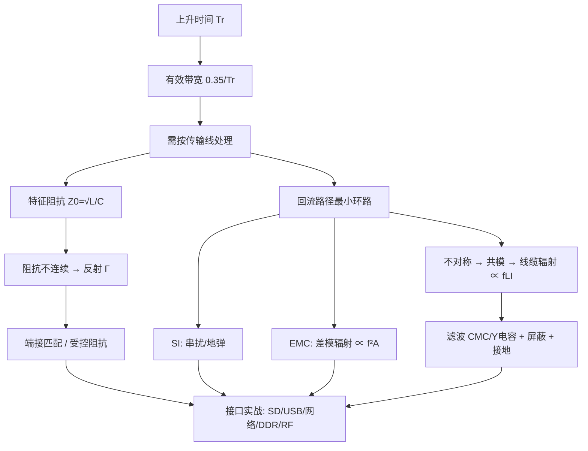

# 电源设计

## 需求与电源树
- 从输入范围、输出电压、电流、纹波、瞬态、时序、效率、环境温度和故障模式倒推拓扑。
- 电源树应标出每路负载、最大/典型电流、上电依赖、掉电路径、测量点和允许噪声。
- 绝对最大额定值只用于故障边界；推荐工作条件和降额值才用于正常设计。

## 线性稳压与 LDO
- LDO 外围简单、噪声低，但功耗近似 `P = (VIN - VOUT) × IOUT`，输入输出压差越大热越严重。
- 必须满足 `VIN(min) > VOUT + Vdropout`，并按有效输出电容和 ESR 范围选择输入/输出电容。
- 反馈、使能、输出放电、反向电流和短路保护取决于具体器件，不能套用通用经验。

## 开关电源拓扑
- Buck 通过开关和电感实现降压，理想连续电流模式下 `VOUT ≈ D × VIN`；Boost 理想关系为 `VOUT ≈ VIN/(1-D)`。
- 反激、Buck-Boost 和电荷泵用于隔离、升降压或负压场景；拓扑选择要结合功率、效率、噪声、器件应力和成本。
- 电感需校核平均电流、峰值电流、饱和电流、铜损和磁芯损耗；电容需校核纹波电流、ESR/ESL 和寿命。

## 反馈与补偿
- 反馈分压设置输出，补偿网络决定交越频率、相位裕度、负载瞬态和稳定范围。
- 评估环路时要包含功率级、输出电容、负载、采样延迟和寄生参数；只看空载波形不能证明稳定。
- 负载瞬态、启动、关断、输入突变和限流恢复都可能触发环路边界，需在最坏条件下验证。

## 损耗与热
- 总损耗包括开关管导通/切换、二极管压降或反向恢复、电感、铜箔、驱动和控制器静态功耗。
- 结温估算 `TJ = TA + PLOSS × θJA`；铜皮、热过孔、封装方向和邻近热源都会改变实际热阻。
- 热设计应与效率、降额、短路和长期老化一起检查，不能只看室温满载一次测量。

## 磁性与开关波形
- 电感纹波电流由输入输出压差、开关周期和电感量决定；电感饱和电流必须高于最坏峰值电流，而不仅是平均负载电流。
- 连续/断续导通模式改变功率级传递函数和峰值电流，补偿与器件应力分析必须使用实际工作模式。
- 开关节点出现过冲时，先量测探头方式和回路，再分析封装、布局、二极管恢复和寄生 LC；错误探头接地会制造不存在的振铃。
- RC/RCD 吸收、栅极电阻和软开关可降低尖峰或 EMI，但会引入损耗或改变环路，修改后必须复测热和稳定性。

## 输入输出滤波
- 输入滤波器的阻抗与稳压器负输入阻抗可能耦合，引起低频振荡；在输入滤波和控制环路之间要保留阻尼或按手册设计。
- 输出电容的 ESR 零点可能参与补偿，替换为低 ESR 陶瓷电容前必须确认控制器稳定性要求。
- 远端负载压降由走线/连接器电阻和瞬态电流共同决定；远端采样应避免采样线拾取开关噪声。

## 保护策略
- 过流保护要区分逐周期限流、打嗝、恒流和短路关断，检查故障恢复是否对系统安全。
- 反接、反灌、热关断、欠压锁定和软启动的阈值、迟滞与时序必须覆盖系统边界条件。
- 多路电源的时序与互锁应从负载数据手册得出，禁止只按“先低压后高压”的经验设定。

## 验证清单
- [ ] 输入范围、输出精度、负载调整率、线性调整率和启动时序。
- [ ] 纹波、负载瞬态、环路稳定、短路/过流和反灌。
- [ ] 关键节点波形、器件温升、效率和 EMI。
- [ ] 最坏输入、最坏负载、最高环境温度下的降额。

+### 电源设计知识条目 1
以太网第二部分，聚焦**电源/时钟/EMC/调试**这些"配套但决定成败"的内容。

🔬 **深入原理**

**1）PHY 的电源与时钟**

PHY 通常有多组电源：AVDD（模拟，供 MDI 驱动器）、DVDD（数字核）、VDDIO（接口）。噪声敏感度：AVDD ≫ DVDD。

- AVDD 用 **LDO 单独供电**优于直接从 DC-DC 取；若必须用 DC-DC，则加 **π 型 LC 滤波（磁珠 + 10μF + 100nF）**，并注意磁珠谐振要加阻尼。
- 每个电源引脚就近 100nF，整体加 10μF。
- **参考电阻（RBIAS/RSET，如 12.4kΩ 1%）** 必须紧靠 PHY，走线短，下方地完整——它决定 MDI 输出电流幅度，走线长会导致幅度漂移、链路距离缩短。

**2）时钟（25MHz 晶振）**

- 晶振紧靠 PHY（<10mm），负载电容按 $C_L=\frac{C_1C_2}{C_1+C_2}+C_{stray}$ 计算，$C_{stray}$ 取 3～5pF；
- 晶振下方**铺地并打过孔**，禁止走任何信号；
- 25MHz 的谐波（75/125/175/225MHz）正好落在 RE 敏感频段，晶振是辐射主源之一；
- 若用外部时钟输入，串 22～33Ω。

**3）指示灯（LED）**

LED 走线从 PHY 一路走到面板，**长度往往是全板最长的线**，且直连外部——它是典型的"辐射天线 + ESD 入口"：
- 每根 LED 线串 **100Ω～1kΩ 电阻 + 对地 10～100pF 电容**（RC 滤波）；
- LED 线不得跨越隔离沟（若 LED 在 RJ45 内置，需按变压器隔离侧处理）；
- 走线远离 MDI 与晶振。

**4）PoE（若支持）**

- 中间抽头取电，需 GDT/TVS 做浪涌防护（PoE 端口浪涌等级更高）；
- 隔离电源（Flyback）的 Y 电容与变压器屏蔽层要处理好，否则 CE/RE 双超标。

**5）EMC 常见超标点与对策**

| 现象 | 可能原因 | 对策 |
|---|---|---|
| 100/125MHz 峰 | 晶振谐波、RGMII 时钟 | 串阻、包地、屏蔽、缩短走线 |
| 网线插上就超标 | 共模经网线辐射 | Bob Smith、变压器共模抑制、加 CMC |
| ESD 打网口死机 | 隔离不足、地跳变 | 增大爬电距离、TVS、软件复位恢复 |
| 浪涌击穿 PHY | 无防护或防护不足 | GDT + TVS，加大隔离间距 |

🛠 **设计实例/操作**

*例1：隔离沟设计。* 隔离沟宽度按安规爬电距离取，一般 **≥2mm（PoE 建议 ≥3.2mm）**，且**所有层都要挖空**（包括电源层、内层），不能只挖表层。变压器本体尽量骑在隔离沟上。

*例2：链路调试三板斧。*
1. **读 PHY 寄存器**：BMSR（链路状态、自协商）、PHY ID、错误计数器（CRC error、symbol error）。
2. **回环测试**：PHY 近端/远端回环，区分是 MAC-PHY 问题还是 MDI 问题。
3. **换短网线 / 换千兆为百兆**：若百兆稳定千兆不稳，90% 是 RGMII 延时或等长问题。

*例3：布局顺序。* RJ45 靠板边 → 变压器紧邻 → PHY 紧邻变压器 → 晶振紧邻 PHY → 电源滤波在 PHY 另一侧。整条链路成"一"字形，不要 U 形折返（折返会让输入输出靠近，造成耦合）。

⚠️ **常见误区**

1. RBIAS 电阻放远或走线细长，导致链路距离缩短、误码率高。
2. LED 线不加滤波，成为辐射天线。
3. 隔离沟只挖表层，内层电源/地依然连通。
4. AVDD 与数字电源共用且无滤波，MDI 眼图恶化。
5. 变压器选型忽略共模抑制比（CMRR）与隔离耐压等级。
6. 认为"通了就没问题"。必须看错误计数器与长距离（100m）实测。

📌 **要点速记**

- AVDD 单独 LDO 或 π 型滤波；RBIAS 精密电阻必须紧靠 PHY。
- 25MHz 晶振靠 PHY、下方铺地、禁止走线，是 RE 主源。
- LED 线必须 RC 滤波，否则变天线兼 ESD 入口。
- 隔离沟 ≥2mm 且全层挖空，PoE 需更宽。
- 调试三板斧：读寄存器、回环、降速对比。


---
### 电源设计知识条目 2
DDR 第二集：**拓扑与端接**。

三种经典拓扑：

| 拓扑 | 结构 | 适用 | 特点 |
|---|---|---|---|
| **点对点（P2P）** | 控制器 ↔ 1 颗粒 | 单颗 DDR3/4 | 最简单，SI 最好 |
| **T 型（Tree）** | 中心分叉到 2 颗粒 | 2 颗 DDR2/DDR3 数据组 | 分支必须严格对称 |
| **Fly-by（菊花链）** | 依次串过各颗粒 | DDR3/4 地址命令线 | 需 write leveling 补偿 |

**核心分工**：
- **数据组（DQ/DQS）**：点对点（每组 DQ 只接一颗粒的一个字节），或 2 颗时用 T 型；
- **地址/命令/时钟**：**Fly-by** 依次经过所有颗粒，末端接 VTT 端接电阻。

🔬 **深入原理**

**为什么地址线要用 Fly-by？** DDR3 起，地址线数量多、负载多（多颗粒同时接收），若用 T 型会形成多个分支 stub，反射严重。Fly-by 把颗粒串成一条线，每个颗粒只是一个小的容性负载，主干阻抗基本连续，末端用 VTT 端接吸收。

代价是：**每个颗粒收到 CK 的时间不同**（有 skew）。DDR3 用 **Write Leveling** 解决——控制器逐颗粒调整 DQS 相位以对齐 CK。

**T 型拓扑的对称要求**：

```
                    ┌──── L2 ────[ 颗粒 A ]
 控制器 ───L1───────┤
                    └──── L3 ────[ 颗粒 B ]
  要求：L2 = L3（严格，±5mil）
  分叉点尽量靠近颗粒（L1 长，L2/L3 短）
  分支阻抗：主干 Z0，分支后并联使阻抗降低 → 分支线可适当细一点
```

分叉点处阻抗突变：主干看到两条 $Z_0$ 并联 = $Z_0/2$，反射系数 $\Gamma=(Z_0/2-Z_0)/(Z_0/2+Z_0)=-1/3$，即 **−33% 的反射**。所以 T 型分支必须**短**（$T_{d,branch}\ll T_r$），让它表现为集总电容而非传输线。

**VTT 端接**：地址/命令线 Fly-by 末端接 $R_{tt}$（典型 39～56Ω）到 **VTT = VDDQ/2**。

$$V_{TT}=\frac{V_{DDQ}}{2},\quad I_{VTT}\text{ 需双向（source/sink）}$$

VTT 电源必须用**专用 VTT LDO/跟踪型稳压器**（如 TPS51200），能吸能灌，且**必须紧跟 VREF 跟踪 VDDQ/2**。VTT 附近要放足量陶瓷电容（每 2～3 个端接电阻配 1 个 100nF，总体 10～22μF）。

**ODT（On-Die Termination）**：DDR3/4 颗粒内部集成端接，可通过 MR 寄存器配置（40/60/120Ω 等）。数据线因此**不需要外部端接**——这是 DDR3 相比 DDR2 布线大幅简化的原因。

🛠 **设计实例/操作**

*例1：单颗 DDR3 x16 布局。*
```
   ┌──────────┐              ┌──────────┐
   │  SoC     │  DQ0-7 ────▶ │ DDR3 x16 │
   │          │  DQ8-15 ───▶ │          │
   │          │  ADDR/CMD ─▶ │          │──▶ VTT 端接排
   │          │  CK± ──────▶ │          │
   └──────────┘              └──────────┘
   距离控制在 25~50mm；VTT 端接排放在颗粒之后（远端）
```
关键：**VTT 端接必须在链路"最远端"**，不能放在颗粒之前，否则颗粒看到的是 stub。

*例2：两颗 DDR3 x8 组成 16bit。*
- DQ 组：颗粒 A 接 DQ0-7/DQS0，颗粒 B 接 DQ8-15/DQS1 —— **各自点对点，最优**；
- 地址/命令/CK：Fly-by 依次经过 A、B，末端 VTT；
- 两颗粒尽量并排、间距近，缩短 Fly-by 长度。

*例3：绕线（蛇形）规范。*
- 蛇形**幅度 ≥ 3 倍线宽**（避免自耦合降低有效延时）；
- 蛇形间距 ≥ 3W，段长尽量短；
- 优先用 **锯齿/圆弧形** 而非直角方波形；
- **就近补偿**——在失配产生的地方附近绕，而不是全堆在末端。

⚠️ **常见误区**

1. VTT 端接放在颗粒前面，形成 stub。
2. T 型分支不对称或分支过长。
3. VTT 电源用普通 LDO（不能 sink 电流），导致电平漂移。
4. 忘了 VREF：VREF = VDDQ/2，需**单独分压 + 就近 100nF 去耦**，走线细但要远离噪声源，且**不能与 VTT 共用一路走线**。
5. 蛇形绕得太密，自耦合使实际延时小于计算值。
6. 认为有 ODT 就不用管数据线 SI。ODT 只解决端接，不解决串扰与参考面。

📌 **要点速记**

- 数据线点对点/T 型 + 片内 ODT；地址命令用 Fly-by + 末端 VTT。
- T 型分支必须严格对称且尽量短（$T_d \ll T_r$）。
- VTT = VDDQ/2，需可 source/sink 的专用电源，端接必须在最远端。
- VREF 单独分压、就近去耦、远离噪声。
- 蛇形绕线幅度 ≥3W、就近补偿。


---
### 电源设计知识条目 3
DDR 第四集：**电源完整性（PDN）、VREF/VTT 与验证方法**。很多"布线看起来完美但跑不稳"的板子，问题都在电源上。

DDR3 典型电源：

| 电源 | 电压 | 用途 | 要求 |
|---|---|---|---|
| VDD/VDDQ | 1.5V (DDR3) / 1.35V (DDR3L) / 1.2V (DDR4) | 核心与 IO | 纹波 <±3%，大电流 |
| VTT | VDDQ/2 = 0.75V | 地址线端接 | 可 source/sink，±3% |
| VREF (VREFDQ/VREFCA) | VDDQ/2 | 接收比较基准 | **纹波 <±1%**，极静 |
| VPP (DDR4) | 2.5V | 字线升压 | 小电流 |

🔬 **深入原理**

**为什么 VREF 要求这么严？** VREF 是接收器判决门限。DDR3 的输入摆幅可能只有 ±100mV，若 VREF 漂移 25mV，就吃掉了 25% 的电压裕量。所以：

$$\text{Noise Margin} = \frac{V_{swing}}{2} - V_{REF\_noise} - V_{ISI} - V_{xtalk} - V_{SSN}$$

VREF 设计要点：
- 用 **1% 精度电阻分压**（如 2×1kΩ），或用 VTT 芯片提供的 VREF 输出（更好，能跟踪 VDDQ）；
- **就近去耦**：分压点 100nF + 每个 VREF 引脚 100nF；
- 走线宽度 ≥ 15～20mil（降低阻抗）但不必很宽（电流极小，μA 级）；
- **VREF 走线必须远离 DQ/CK，且下方参考面完整**；
- 多颗粒时 VREF 用**星型分配**，每颗粒单独一段并各自去耦。

**SSN（同步开关噪声）**：16 位数据同时翻转时，瞬态电流巨大。

$$\Delta V=L_{eff}\cdot N\cdot\frac{di}{dt}$$

对策：VDDQ 去耦电容数量要足（经验：**每个 VDDQ 引脚配 1 个 100nF**，另加 2～4 个 10μF），且 VDDQ 与 GND 平面相邻、介质薄。

**PDN 目标阻抗**：DDR3 1.5V、允许 5% 纹波、瞬态电流 2A：

$$Z_{target}=\frac{1.5\times0.05}{2}=37.5\ \text{m}\Omega$$

需要在 DC～数百 MHz 内维持这个阻抗，靠"稳压器（<100kHz）+ 大电容（100k～1MHz）+ 陶瓷电容（1M～100MHz）+ 平面电容（>100MHz）"四级接力。

🛠 **设计实例/操作**

*例1：去耦布局。*
```
 SoC 侧            DDR 颗粒侧
 [10μF]×2         [10μF]×1
 [100nF]×N        [100nF]×N  （N = VDDQ 引脚数）
  ↑贴引脚，双过孔   ↑贴引脚，最好放在颗粒背面正下方
 VDDQ 平面：整块铺，避免细长条；与 GND 平面相邻，介质 ≤0.1mm
```

*例2：验证方法（层层递进）。*

1. **DRC/规则检查**：等长、间距、阻抗、过孔数。
2. **SI 仿真**：HyperLynx / SIwave / ADS，看眼图、过冲、串扰。DDR3-1600 眼高应 >150mV、眼宽 >0.4UI。
3. **硬件调试**：
   - 先降频跑（DDR3-800）确认基本功能；
   - 用 **memtester / stressapptest / Linux memtest** 长时间压测（≥8 小时）；
   - 高低温循环测试（−20℃～70℃），温度会改变时序；
   - 读取控制器的 **训练结果寄存器**（write leveling delay、read gate delay、DQ deskew 值），看各 bit 的窗口是否居中、是否有异常离群值——**离群的那一位往往就是布线有问题的那根线**。
4. **示波器实测**：用高带宽差分探头量 DQS/CK 眼图（注意探头本身会引入负载）。

*例3：常见故障对照。*

| 现象 | 可能原因 |
|---|---|
| 完全跑不起来 | 电源时序、复位、ZQ 电阻（240Ω 1%）、初始化配置 |
| 降频可以，高频不行 | 等长/串扰/阻抗/VREF 噪声 |
| 个别 bit 错误 | 该 bit 走线异常（跨分割、串扰、虚焊） |
| 高温不稳 | 时序裕量不足，温度使延时变化 |
| 偶发死机 | SSN、去耦不足、地弹 |

⚠️ **常见误区**

1. VREF 用普通 5% 电阻分压且不去耦。
2. VREF 与 VTT 共用走线或共用分压点（VTT 有大电流，会污染 VREF）。
3. 忘记 **ZQ 校准电阻 240Ω 1%**，或走线太长（应 <10mm，且接 GND）。
4. VDDQ 平面被走线切成细长条，等效电感大。
5. 去耦电容数量够但过孔共用/距离远。
6. 只做功能测试不做压力与高低温测试，量产后批量返修。

📌 **要点速记**

- VREF 纹波 <±1%，1% 电阻分压或用 VTT 芯片输出，星型分配 + 就近去耦。
- VTT 需可 source/sink，端接在链路最远端。
- 每个 VDDQ 引脚配 100nF，VDDQ 与 GND 平面相邻薄介质。
- ZQ 电阻 240Ω 1%，靠近颗粒接 GND。
- 验证：仿真 → 降频 → 压测 → 高低温 → 读训练寄存器定位坏 bit。


DDR 四集结束。接下来两集转向射频类接口：GNSS 与蓝牙/WiFi/4G，它们的核心矛盾从"时序"变成了"灵敏度与共存"。

---
### 电源设计知识条目 4
GNSS（GPS/北斗/GLONASS/Galileo）设计的核心矛盾只有一个：**卫星信号极其微弱**。

到达地面的 GPS L1 信号功率约 **−130 dBm**（有些资料给 −128～−133 dBm），而典型接收机灵敏度要求 −160 dBm（跟踪）。这个量级比热噪声底还低——GPS 靠扩频增益（CDMA 相关处理，约 43dB）才能解调出来。

对比一下：手机 4G 发射功率 +23 dBm。**同一块板上，干扰源比有用信号强 150dB 以上（10¹⁵ 倍）**。所以 GNSS 设计 = 噪声抑制的极限工程。

频段：
| 系统 | 频段 |
|---|---|
| GPS L1 | 1575.42 MHz |
| 北斗 B1I / B1C | 1561.098 / 1575.42 MHz |
| GLONASS L1 | 1598～1606 MHz |
| GPS L5 / 北斗 B2a | 1176.45 MHz |

🔬 **深入原理**

**级联噪声系数（Friis 公式）**决定了 LNA 的位置：

$$NF_{total}=NF_1+\frac{NF_2-1}{G_1}+\frac{NF_3-1}{G_1G_2}+\cdots$$

（线性量）关键结论：**第一级的噪声系数与增益决定全局**。所以：
- **LNA 必须放在最靠近天线的位置**，前面的损耗（走线、连接器、滤波器）会 1:1 地加到 NF 上；
- 从天线到 LNA 之间每 1dB 损耗 = 灵敏度直接损失 1dB。

灵敏度公式：

$$P_{min}=-174\ \text{dBm/Hz}+10\log_{10}(B)+NF+SNR_{min}$$

**为什么要用有源天线？** 有源天线把 LNA 集成在天线里，避免馈线损耗。代价是需要通过同轴馈线供电（Bias-Tee）：

```
 天线(含LNA) ──同轴── [隔直电容 100pF] ── GNSS 模块 RF_IN
                  │
              [电感 27~47nH（射频扼流）] ── 3.3V ── [100nF] ── GND
   电感在 1.575GHz 呈高阻，隔断射频；电容隔直流
```

**接收带内干扰**：任何落在 1559～1610MHz 的谐波都是致命的。常见凶手：
- **DC-DC 开关频率的高次谐波**（1MHz 开关 → 第 1575 次谐波理论存在，但更常见的是宽带噪声）；
- **DDR 时钟谐波**（800MHz × 2 = 1600MHz！正好落在 GLONASS 带内）；
- **USB3.0 的宽带噪声**（5Gbps 的谐波与展频噪声覆盖 1.5～2.5GHz，是著名的 GPS 杀手，Intel 有专门白皮书）；
- **摄像头 MIPI、LCD 时钟**。

🛠 **设计实例/操作**

*例1：RF 走线设计。*
- 用 **50Ω 共面波导接地（GCPW）** 或微带线；
- 走线**短、直、无过孔**（必须换层时，过孔周围环绕 ≥4 个 GND 过孔）；
- 走线两侧**缝合地过孔，间距 ≤ λ/20**。1.575GHz 在 FR-4 中 $\lambda_g\approx 95\text{mm}$，λ/20 ≈ 4.75mm，工程取 **2～3mm**；
- RF 走线下方**参考面绝对完整**，不允许任何走线穿过；
- 阻抗 50Ω，需与板厂确认叠层。

*例2：布局隔离。*
```
  ┌────────────────────────────────────┐
  │ [GNSS天线]                          │
  │    │ 短RF线                          │
  │ [Bias-T][SAW][GNSS模块]  ← 独立区域  │
  │ ─────── 屏蔽罩 + 缝合地孔 ───────    │
  │                                     │
  │  [DDR]   [USB3]   [DC-DC]  ← 干扰源 │
  │   保持 ≥20mm 距离，最好不同侧        │
  └────────────────────────────────────┘
```
- GNSS 模块加**金属屏蔽罩**，多点接地；
- 与 USB3/DDR/DC-DC 距离 **≥15～20mm**，且不在其上下层正对位置；
- 电源用 **LDO 单独供电**（DC-DC 的噪声很难滤干净），或 DC-DC + LDO 两级；
- 模块的 UART/I2C 信号线加 RC 滤波或磁珠，防止把噪声"带进"屏蔽区。

*例3：天线选型与摆放。*
- 陶瓷贴片天线需要**足够的地平面**（典型 ≥50×50mm），地小则增益和方向图变差；
- 天线上方 **不能有金属遮挡**，正上方需净空；
- 若用外置有源天线，注意馈线损耗（RG-174 在 1.5GHz 约 1dB/m）。

⚠️ **常见误区**

1. RF 走线上加过孔换层而不做地过孔包围，损耗与失配剧增。
2. 把 GNSS 模块放在 DC-DC 或 USB3 连接器旁边。
3. 用 DC-DC 直接给 GNSS 供电，噪底抬高十几 dB。
4. 陶瓷天线下方铺地不足或被挖空。
5. 忽略 USB3.0——插上 U 盘就搜不到星是典型症状，需在 USB3 连接器加屏蔽、缩短走线、必要时加接地隔离。
6. 认为"能定位就行"。要看 **C/N₀（载噪比）**，好的设计冷启动时可见星 C/N₀ 应 >40 dB-Hz，<35 就说明噪底偏高。

📌 **要点速记**

- GNSS 信号 ≈ −130dBm，噪声抑制是唯一主题。
- Friis 公式：第一级 NF 决定全局 → LNA/有源天线尽量靠前。
- RF 走线 50Ω、短直无过孔、两侧缝合地孔间距 2～3mm。
- 与 DDR/USB3/DC-DC 隔离 ≥15～20mm，独立 LDO 供电 + 屏蔽罩。
- 用 C/N₀ 评估设计好坏，>40 dB-Hz 为佳。


---
### 电源设计知识条目 5
无线模块设计的三大议题：**射频链路、共存干扰、天线与认证**。

主要频段：

| 制式 | 频段 | 发射功率 |
|---|---|---|
| BLE / BT | 2.400～2.4835 GHz | 0～+10 dBm |
| WiFi 2.4G | 2.400～2.4835 GHz | +15～+20 dBm |
| WiFi 5G | 5.15～5.85 GHz | +15～+20 dBm |
| 4G LTE B1 | 1920～1980（上行）/2110～2170（下行） | +23 dBm |
| 4G LTE B3 | 1710～1785 / 1805～1880 | +23 dBm |
| 4G LTE B39/B41 | 1880～1920 / 2496～2690 | +23 dBm |

🔬 **深入原理**

**1）共存干扰（Coexistence）**

最经典的冲突：**LTE B40/B41（2300～2400 / 2496～2690MHz）与 WiFi/BT 2.4G 频谱相邻**。LTE 发射 +23dBm，WiFi 接收灵敏度 −90dBm，隔离度需求：

$$\text{隔离需求}=P_{TX}-P_{RX,max\_tolerable}=23-(-40)=63\ \text{dB(阻塞)}$$

实际靠三招：
- **空间隔离**：天线间距 ≥ λ/4（2.4GHz → 31mm），越远越好；
- **频域隔离**：加带通滤波器 / 双工器；
- **时域隔离**：BT/WiFi/LTE 共存协调信号（**2-wire/3-wire coex 接口**），由芯片协商错开收发时隙。

**2）阻抗匹配与 π 型网络**

天线馈点几乎不可能天生 50Ω，需要匹配网络：

```
 模块RF ──┬── [L/C 串] ──┬── 天线馈点
          │              │
        [C/L]          [C/L]
          │              │
         GND            GND
   预留 π 型（3 元件）位置，调试时用 VNA 实测 S11 后再填元件
```

匹配目标：**$S_{11} < -10\text{dB}$（VSWR < 2）**，优秀设计可做到 −15dB 以下。

回波损耗与反射功率关系：$S_{11}=-10\text{dB}$ 表示 10% 功率被反射。

**3）天线净空区（Keep-out）**

天线区域下方及周围**不能有任何铜（含地平面）**：
- PIFA/FPC 天线：净空 ≥ **5mm**，最好 8～10mm；
- 陶瓷天线：按数据手册，通常需要特定尺寸的净空与地；
- 净空区内不能放器件、螺丝、金属结构件；
- 天线远离电池、屏、金属外壳（金属壳需开缝或做天线一体化）。

🛠 **设计实例/操作**

*例1：模块化设计的布局流程。*
1. 先定天线位置（板边、角落，远离用户手持部位与金属）；
2. 天线净空区拉出，标注禁布；
3. 模块紧邻天线，RF 走线 <20mm；
4. π 型匹配网络放在模块与天线之间，靠近天线；
5. 模块周围打一圈地过孔，间距 <2mm；
6. 电源用 LDO 或加 π 滤波，注意 **4G 模块的 2A 峰值脉冲电流**（每 4.6ms 一次突发），必须配 **≥470μF 低 ESR 电容 + 10μF 陶瓷**，否则电压跌落导致重启。

*例2：多天线协同。*
```
   ┌──────────────────────────────┐
   │ [4G主天线]              [WiFi/BT]│  ← 对角布置
   │      ↑净空                 ↑净空 │
   │                                 │
   │        主板器件区                │
   │                                 │
   │ [GNSS]                [4G分集]  │  ← 距离最大化
   └──────────────────────────────┘
   原则：同频段天线尽量正交极化 + 最大间距
```

*例3：SAR / 认证注意点。*
- 需过 **SRRC（国内）/ FCC / CE-RED** 认证，杂散发射（Spurious）限值严格；
- 谐波是常见超标点：2.4GHz 的二次谐波 4.8GHz、三次 7.2GHz，需在匹配网络中加低通（π 型可兼做低通）；
- 若用已认证模组（含天线），可走简化认证流程，但**改天线就要重测**。

⚠️ **常见误区**

1. 天线净空区被"铺地"覆盖（很多人习惯性全板铺铜，忘了挖空）。
2. RF 走线用普通 EDA 默认线宽，不做 50Ω 阻抗控制。
3. 不预留匹配网络位置。天线在真实结构中的阻抗与仿真差别很大，**必须留 π 型位置**。
4. 4G 电源电容不足，发射瞬间电压跌落 → 模块复位/掉网。这是最常见的量产问题之一。
5. 多个天线挤在一起，隔离度不足，互相拉低灵敏度。
6. 忽略结构件影响。同一块板装进金属壳后天线性能可能下降 10dB 以上，**必须整机 OTA 测试**。
7. 用示波器/频谱仪直接量 RF 走线（探头会破坏阻抗），应通过定向耦合器或用 VNA 测 S11。

📌 **要点速记**

- 三种隔离手段：空间（≥λ/4）、频域（滤波器）、时域（coex 协调）。
- 必须预留 π 型匹配网络，实测 $S_{11}<-10\text{dB}$。
- 天线净空区严格禁铜禁器件，PIFA/FPC ≥5mm。
- 4G 模块需大容量低 ESR 电容应对 2A 突发电流。
- 认证要看杂散与谐波，改天线需重测；整机 OTA 才是真实性能。


至此所有接口讲完。最后一集做总体总结，把高速 SI 与 EMC 的方法论、设计流程与自检清单整合起来。

---
### 电源设计知识条目 6
1. **信号怎么走**（阻抗、反射、匹配）——传输线理论；
2. **电流怎么回**（回流路径、地设计、共模/差模）——回路思维；
3. **能量怎么跑掉/进来**（EMC 发射与抗扰）——耦合与屏蔽。

而这三件事本质上都指向同一句话：**高速设计的核心不是"画线"，而是"管理电磁场与电流回路"**。

🔬 **深入原理：知识地图**



**贯穿全课的 5 个数字**：

| 数字 | 含义 |
|---|---|
| **6 mil/ps** | FR-4 内层传播速度（微带约 7） |
| **0.35 / Tr** | 有效带宽（拐点频率） |
| **±3H** | 80% 回流集中范围 |
| **1 nH/mm** | 普通走线/引线电感估算 |
| **λ/20** | 缝隙、缝合孔、地线过孔的间距上限 |

🛠 **设计实例/操作：完整设计流程与自检清单**

**阶段一：原理图/选型**
- [ ] 确认各接口速率、上升时间、阻抗规范（USB 90Ω、以太网/LVDS 100Ω、单端 50Ω、DDR 40/50Ω）
- [ ] 时钟源选型（是否需要 SSC）、串阻位置预留
- [ ] ESD/TVS 选型（结电容匹配速率）、CMC、滤波元件预留
- [ ] 电源架构：噪声敏感模块（GNSS/RF/ADC/PHY-AVDD）用 LDO 或加滤波
- [ ] 预留 π 型匹配、测试点（低速）、调试接口

**阶段二：叠层与阻抗**
- [ ] 每个信号层紧邻完整参考平面
- [ ] PWR 与 GND 平面相邻，介质尽量薄
- [ ] 找板厂确认叠层与 Dk/Df，算准线宽线距
- [ ] 高速差分优先内层带状线（FEXT≈0）

**阶段三：布局**
- [ ] 分区：接口区/数字区/模拟区/电源区/RF 区
- [ ] 接口靠板边集中，走线不回穿数字区
- [ ] 高速链路"一"字排开，不折返
- [ ] 去耦电容贴引脚，DC-DC 输入环路最小
- [ ] 晶振靠芯片、下方铺地
- [ ] 天线净空区、变压器隔离沟先划出

**阶段四：布线**
- [ ] 不跨分割；换层伴地孔（<100～200mil）
- [ ] 3W/4W/5W 间距规则按等级执行
- [ ] 差分：等长、等距、对称，就近补偿
- [ ] DDR：按组等长（时延模式），VTT 在最远端
- [ ] RF：短直无过孔、两侧缝合地孔
- [ ] 时钟包地且地线两端+中间打孔

**阶段五：EMC 加固**
- [ ] 板边缝合地过孔 ≤200mil，20H 规则
- [ ] 排针/连接器按 1:3 配地
- [ ] 屏蔽罩多点接地，缝隙 <λ/20
- [ ] 机壳地与信号地 1nF/2kV + 1MΩ 连接
- [ ] 长线 I/O 预留磁环/CMC 位置

**阶段六：验证**
- [ ] SI 仿真（眼图、串扰、过冲）
- [ ] PDN 阻抗仿真（$Z<Z_{target}$）
- [ ] 功能 + 压力 + 高低温测试
- [ ] EMC 预测试（近场探头 + 简易暗室）
- [ ] 留 6dB 余量再送正式认证

⚠️ **常见误区（全课总结）**

1. **用频率而非上升时间判断高速**——第一原则性错误。
2. **只画线不想回流**——所有 SI/EMC 问题的共同根源。
3. **等长绝对化**——该松的地方过度绕线，反而增加串扰。
4. **EMC 后置**——测试超标才整改，成本高十倍。
5. **迷信单一手段**——屏蔽罩/磁环/展频都不是万能药。
6. **不留余量**——刚好合格 = 量产必炸。
7. **不做定位就整改**——盲目试错，改好了也复现不了。

📌 **要点速记**

- 高速设计三主线：信号路径、回流路径、耦合路径。
- 五个关键数字：6mil/ps、0.35/Tr、±3H、1nH/mm、λ/20。
- 流程六阶段：选型 → 叠层 → 布局 → 布线 → EMC 加固 → 验证。
- 80% 的结果在布局阶段就已决定。
- 一切规则的目的都是：**让电流走最小的环路**。

+### 电源设计进阶知识条目 1
本项目的目标板是"逻辑派 FPGA-G1 开发板"——一块以 FPGA 为核心、外挂 DDR3 内存、带 HDMI 输出、带 MCU 协处理、带 TF 卡与各类排针外设、由多路 DC-DC/LDO 供电的开发板。这种板子有三个典型特征：**BGA 封装（引脚在芯片底下，出不来线）**、**DDR3 高速并行总线（几百 Mbps~1.6Gbps 每根线，要等长）**、**HDMI 高速差分（Gbps 级，要阻抗控制）**。这三条任意一条，都足以让双面板"做不出来"。

所谓"全链路"，指的是下面这条不可跳步的流水线：

```
原理图分析 → 电源树梳理 → 网表/器件导入 → 板框结构导入 → 环境与快捷键
   → 模块抓取/接口定位 → 模块化预布局 → 3D 结构校验
   → 层数分析与叠层设置 → 阻抗理解与计算 → 规则（线宽/间距/过孔/网络类/差分）
   → BGA 扇孔 → 分模块布线 → 电源连通性 → 布线优化 → 时序等长
   → 缝合地过孔 → DRC → 丝印/LOGO → 生产资料输出 → 下单
```
### 电源设计进阶知识条目 2
这一讲教你**怎么"读"一张开发板原理图**。很多人打开原理图只会看"这里连那里"，正确做法是先做**功能分块**，再做**信号流梳理**，最后落到**物理约束**。

逻辑派 FPGA-G1 的原理图通常按页组织，典型分页如下：

| 页面 | 模块 | 关键关注点 |
|---|---|---|
| P1 | 封面/框图 | 系统总览、模块间接口 |
| P2 | FPGA 核心（BANK0~BANK7） | 每个 BANK 的电平标准与 VCCIO |
| P3 | 配置电路（FLASH/JTAG） | 配置模式引脚、上下拉 |
| P4 | DDR3 | 数据/地址/控制分组、VREF、端接 |
| P5 | HDMI | TMDS 差分对、ESD、DDC |
| P6 | MCU | 晶振、下载口、与 FPGA 的通信 |
| P7 | 外设（TF、LED、按键、排针） | IO 归属哪个 BANK |
| P8 | 电源 | DC-DC / LDO / 上电时序 |

读图的正确顺序是：**先看电源 → 再看时钟 → 再看总线 → 最后看杂散 IO**。因为电源决定布局重心，时钟决定关键路径，总线决定等长分组。
### 电源设计进阶知识条目 3
这一讲做一件极其重要但常被跳过的事：**画出这块板的电源树（Power Tree）**。电源树就是"电从哪来 → 经过谁 → 到谁去 → 要多大电流"的一张图。它同时决定了三件事：DC-DC 模块放哪、电源平面怎么分割、铜皮/过孔要多粗。

一块 FPGA 开发板的典型电源树（数值为示例量级，实际以原理图与器件手册为准）：

```
DC 5V 输入 (Type-C / DC 座)
   |
   +-- DCDC1 --> 1.0V / 1.2V  VCCINT   (FPGA 内核, 电流最大, 1~3A)
   |
   +-- DCDC2 --> 1.5V         VCCIO_DDR + DDR3 VDD/VDDQ (0.5~1.5A)
   |                  |
   |                  +-- 分压/专用芯片 --> 0.75V VREF (小电流, mA 级)
   |
   +-- DCDC3 --> 3.3V         VCCIO(3.3V BANK) / MCU / HDMI 5V逻辑周边 (1~2A)
   |                  |
   |                  +-- LDO --> 2.5V / 1.8V  VCCAUX 等 (低噪声小电流)
   |
   +-- 直通 --> HDMI +5V (给 HDMI 连接器 5V 供电, 需限流/ESD)
```
### 电源设计进阶知识条目 4
**BANK 朝向决定一切。** 假设 FPGA 的 BANK 分布如下（示意）：

```
            BANK 0 (顶边)
      ┌──────────────────────┐
BANK7 │                      │ BANK 1
(左)  │      FPGA  BGA       │  (右)
BANK6 │                      │ BANK 2
      └──────────────────────┘
            BANK 3/4 (底边)
```

如果 DDR3 分配在 BANK 1/2（右侧），HDMI 在 BANK 0（顶边），那么 DDR3 就该放在芯片右侧、HDMI 放在顶部。若结构上 HDMI 必须在右边，就把 FPGA **旋转 90°**，而不是让走线绕半圈。**旋转芯片是零成本的，绕线是有代价的。**

**FPGA 去耦网络的分层思想（PDN 三段式）：**

| 频段 | 电容 | 位置 |
|---|---|---|
| DC~100kHz | 稳压器本身 | DC-DC 输出 |
| 100kHz~1MHz | 100µF/47µF 钽电容/固态电容 | 电源入口附近 |
| 1MHz~50MHz | 10µF/4.7µF 0603/0805 MLCC | BGA 外围一圈 |
| 50MHz~500MHz | 100nF 0402 MLCC | **BGA 背面正对电源球** |
| >500MHz | 平面电容（L4-L5 间距薄） | 靠叠层保证 |

目标是让 PDN 阻抗在关注频段内低于目标阻抗：

$$Z_{target}=\frac{V_{dd}\times \text{ripple}\%}{I_{max}}$$

例：$V_{dd}=1.0\mathrm{V}$，允许纹波 5%，$I_{max}=2\mathrm{A}$，则 $Z_{target}=\dfrac{1.0\times0.05}{2}=25\ \mathrm{m}\Omega$。
### 电源设计进阶知识条目 5
**核心概念：热回路（Hot Loop）。** Buck 中电流路径分两个相位：

```
上管导通 (相位1):  Vin → Cin → 上管 → L → Cout → GND → Cin
下管导通 (相位2):  L → Cout → GND → 下管 → L

两相位电流之"差"= 高频交流环流, 只流经:
      Cin → 上管 → 下管 → GND → Cin      <== 这就是热回路
```

**只有热回路是高 di/dt 的**，它的面积决定了辐射和 SW 振铃。所以第一优先级永远是：**Cin 紧贴芯片 VIN 和 GND 引脚，环路面积最小（目标 <5mm²）。**

环路电感产生的尖峰电压：

$$V_{spike}=L_{loop}\cdot\frac{di}{dt}$$

若 $L_{loop}=5\ \mathrm{nH}$，$di/dt=2\ \mathrm{A/ns}$，则 $V_{spike}=10\ \mathrm{V}$——足以让 5V 输入的芯片看到 15V 尖峰而损坏。

**SW 节点：铜皮面积要"够用即可，越小越好"。** SW 是 dv/dt 最高的节点（几 V/ns），面积大就是天线。但又要能过电流，所以取折中：宽度按电流够用（如 2A 取 40~60mil 或一小块铜），长度尽量短，**不要为了散热把 SW 铺一大片**。

**反馈（FB）走线**：FB 是高阻抗节点，最怕干扰。规则：
- FB 走细线（6~10mil），从 **Cout 正极就近取样**（真正的负载点），不要从电感出口取；
- FB 走线远离 SW 和电感，必要时在下方铺地隔离；
- 分压电阻靠近芯片 FB 引脚。
### 电源设计进阶知识条目 6
**例1：Buck 标准布局（ASCII）**

```
        VIN 进来
          │
      ┌───┴───┐ Cin(0402/0603 x2, 紧贴!)
      │  ▓▓▓  │
   ┌──┴───────┴──┐
   │   DCDC IC   │── SW ──[ 电感 L ]──┬── VOUT
   │  VIN    SW  │   短且窄            │
   │  GND    FB  │◄──细线取样───────┤
   └──┬──────────┘                    │
      │                          ┌────┴────┐
     GND 大面积铺铜 + 多过孔      │  Cout   │
                                 └────┬────┘
                                     GND
```

顺序口诀：**Cin 最先摆 → 芯片 → 电感 → Cout → FB 分压 → 其他。**

**例2：热设计与隔离。**
- 芯片散热焊盘下方打 **4~9 个过孔（0.3mm）**，把热导到内层地平面；
- 三路 DC-DC 之间保持 5mm 以上间距，电感之间尽量**错开轴向**，减少磁耦合；
- 电源区与 HDMI/DDR3 区之间，用**一整片地铜 + 缝合过孔**隔开；
- 输入端加 π 型滤波（磁珠 + 电容）抑制传导 EMI。
### 电源设计进阶知识条目 7
🔬 深入原理
- 载流能力：外层 1oz 铜、1mm 线宽约可载 1A；内层因散热差需更宽。`电流→铜宽`经验：温升 10℃ 时 $W(mil)\approx I(A)\times 20$（粗略）。
- 压降：$V_{drop}=I\times R_{trace}$，$R=\rho L/(W\times T)$。长距离细电源走线会掉压，必须用铺铜（polygon）或加宽。
- 为什么重要：FPGA 核心 1.0V 瞬时电流大，若通道电阻大，核压跌落触发欠压保护。

🛠 设计实例/操作
1. 例：DCDC 输出 3.3V，先铺一块 3.3V 铜皮覆盖 FPGA/MCU 的 3.3V BANK，再用过孔"树状"分到各引脚；用 `Highlight` 验证每个 3.3V 引脚都被铜皮覆盖。
2. 例：1.0V 核心电源用 L3/L4 两层同时铺铜并打多过孔并联，降低平面电阻与电感。

⚠️ 常见误区
- 以为"一个过孔就够了"——单过孔载流有限（约 1A@10mil 孔），大电流需多个并联。
- 电源铺铜被信号过孔"打穿"成孤岛，实际没连通。

📌 要点速记
- 先画电源树：源→负载一目了然。
- 大电流用铺铜+多过孔，勿用细线。
- 核压（1.0V）走线最短最宽。
- 铺铜后务必高亮验证全连通。
- 电源过孔要足够多，降低 R/L。


---
### 电源设计进阶知识条目 8
以"**MCU + DDR3 + 一路 USB 的小主控板,从 4 层升级到 6 层**"为例,走完整流程。

**步骤 1 · 建库(原理图符号 + 封装)**
先准备好器件的原理图 Symbol 和 PCB Footprint(封装)。DDR 用 BGA、USB 用连接器、MCU 用 QFP/LQFP。封装的焊盘尺寸、间距必须与器件 datasheet 一致,这是后面能扇出(fan-out)的前提。

**步骤 2 · 布局(Placement)**
- 先放接口(USB、电源座)在板边;
- MCU 居中,DDR 紧挨 MCU(缩短地址/数据线);
- 电源模块(DC-DC/LDO)靠边,远离敏感模拟区;
- 去耦电容紧贴每个芯片的电源引脚。

**步骤 3 · 叠层设置(Layer Stack Manager)**
在 EDA 工具里配置 6 层:Top / GND / Sig / PWR / GND / Bottom,并填入各层介质厚度与 $\varepsilon_r$,让工具能按公式算阻抗。

**步骤 4 · 布线(Routing)**
- 高速差分(USB D+/D−)走表层微带线,90Ω 差分阻抗,紧邻 GND 平面;
- DDR 数据线走内层带状线,50Ω 单端;
- 电源通过过孔连到 PWR 平面,再扇出给芯片。

**步骤 5 · 等长(Length / Timing Matching)**
DDR 的"同一组数据线(DQ0~DQ7 + DQS)"长度要一致,保证同时到达。工具可做蛇形绕线(Trombone/Serpentine)把短的补长。

**步骤 6 · DRC(设计规则检查)**
检查线宽、间距、短路、开路、阻抗规则、差分对、丝印重叠等是否违规。

**步骤 7 · 生产资料输出**
导出 Gerber(各层光绘)、NC Drill(钻孔)、IPC-356 网表、钢网层、BOM、装配图,连同叠层说明一起发给工厂。

**第二个小例子(一句话带过):** 一块"HDMI + 千兆 PHY"板,重点在于 HDMI 的四对差分(100Ω)与 PHY 的 MDI 差分都要有专属、不被打断的参考平面,否则眼图会闭合——这正是 6 层板多出来的地平面派上用场的地方。
### 电源设计进阶知识条目 9
🔬 深入原理：多集电极管每个集电极电流 $I_{Ck}\propto A_k$（集电区面积），且 $\sum I_{Ck}=I_E-\ldots$。若集电极面积比 $A_2:A_1=n:1$，则 $I_{C2}=n I_{C1}$，比例由光刻决定，精度高且温度共漂。MOS 电流镜：两管 $W/L$ 相同、栅极共接并二极管连接参考管，则饱和区 $I_D=\frac{1}{2}\mu C_{ox}\frac{W}{L}(V_{GS}-V_{TH})^2$，得 $I_{OUT}/I_{REF}=(W/L)_{OUT}/(W/L)_{REF}$，比例靠宽长比设定，比 BJT 更灵活、无基极电流误差。JFET 则靠固定 $V_{GS}=0$ 或加源极电阻得到 $I_D=I_{DSS}$ 或更小恒流。

🛠 设计实例/计算：MOS 镜像参考 $I_{REF}=100\,\mu\text{A}$，参考管 $(W/L)_1=10$，希望 $I_{OUT}=300\,\mu\text{A}$，则需 $(W/L)_2=(W/L)_1\times 3=30$。若用 BJT 多集电极，面积比 3:1 即得 3 倍电流。JFET 取 $V_{GS}=0$，$I_D=I_{DSS}=2\,\text{mA}$ 即可作 2 mA 恒流源。

⚠️ 常见误区：①以为多集电极比例可任意调节——只能取版图设计的离散比例。②MOS 镜像忽略沟道长度调制（$\lambda$ 不为 0）会高估恒流性，长沟道/加 cascode 可改善。③把 JFET 当 MOS 用，忘 JFET 是耗尽型、栅源常可负偏。

📌 要点速记：
- 多集电极 BJT：电流比 = 集电区面积比，温度一致；
- MOS 电流镜比例 = $(W/L)$ 比，无基极电流误差；
- JFET 可凭 $I_{DSS}$ 直接作恒流源；
- CMOS 工艺中 FET 电流源是主流。
### 电源设计进阶知识条目 10
🔬 深入原理：左半平面零点 $1+j f/f_z$：幅值 +20 dB/dec，相位 +90°（从 0 升到 +90°）。右半平面零点 $1-j f/f_z$（即 $1-s/\omega_z$）：幅值同样是 +20 dB/dec，但相位是 -90°（因为 $e^{-j\phi}$）。所以看波特图只看幅值会漏判——必须同时看相位。零极点对消：若 $(1+j f/f_z)$ 与 $(1+j f/f_p)$ 中 $f_z=f_p$，乘除相消，该频段平直；但温度/容差使 $f_z\neq f_p$ 时残留一阶动态，可能引起振铃。

🛠 设计实例/计算：某放大器 $\dot{A}_v=\frac{100(1+j f/10^3)}{(1+j f/10^4)(1+j f/10^5)}$。低频 40 dB；$f=10^3$ 零点使斜率 +20→暂平；过 $10^4$ 极点 -20→净 -20；过 $10^5$ 极点 -20→净 -40。若零点移到右半平面，幅值曲线不变但相位在 $10^3$ 后反而 -90°，总相位裕度大减，易自激。

⚠️ 常见误区：①凭幅值曲线判断稳定——必须结合相位。②迷信零极点对消，忽略实际对消不精确。③右半平面零点相位方向记成 +90°。

📌 要点速记：
- 零点一般 +20 dB/dec、相位 +90°；
- 右半平面零点幅值+但相位 -90°，危害稳定；
- 零极点对消可化简但难精确实现；
- 看波特图务必幅值与相位同看。
### 电源设计进阶知识条目 11
🔬 深入原理：闭环增益 $A_f=A/(1+AF)$。分母 $1+AF=0$ 即 $AF=-1$ 时，$A_f\to\infty$，对应自激。巴克豪森（Barkhausen）判据：
$$|AF|=1,\quad \angle AF=\pm180^\circ \ (\text{即 } -1)$$


⚠️ 常见误区：①以为负反馈越多越稳——深度负反馈若相位裕度不足反而自激。②单级电路担心自激（单极点不会）。③把有用振荡器当自激故障。④忽略电源/布线引入的额外相移。

📌 要点速记：
- 自激条件（巴克豪森）：$AF=-1$，即 $|AF|=1,\angle AF=180^\circ$；
- 源于多级相移累积使负反馈变正反馈；
- 单极点不会自激，多级（≥3）无补偿必振；
- 表现：无输入也输出，电路失效。
### 电源设计进阶知识条目 12
🔬 深入原理：定义环路增益 $T(jf)=A(jf)F$。①相位裕度 $\phi_m$：在 $|T(jf)|=1$（增益交界频率 $f_c$）处，相位离 -180° 的余量：$\phi_m=180^\circ+|\angle T(f_c)|$。一般要求 $\phi_m\ge45^\circ$（最好 60°）才稳定。②增益裕度 $G_m$：在 $\angle T=-180^\circ$（相位交界频率）处，$|T|$ 低于 1 的余量（dB）：$G_m=20\log_{10}(1/|T|)$，要求 $G_m\ge10\,\text{dB}$。判据：若 $f_c$ 处相位已 -180°（$\phi_m\le0$）或 180° 处 $|T|\ge1$，则自激。波特图判稳：看幅频曲线过 0 dB 时，相频是否还远未到 -180°；或相频到 -180° 时幅频是否已低于 0 dB。工程中为留裕度，常故意让主极点主导（补偿），使相移到 -180° 前幅值已滚到很低。

🛠 设计实例/计算：某运放开环幅频：0 dB 处 $f_c=1\,\text{MHz}$，此时相位 -120°，则 $\phi_m=180-120=60^\circ$，稳定且裕度好。另一电路 0 dB 处相位 -170°，$\phi_m=10^\circ$，临界不稳，轻微温漂/负载即振。若 -180° 处幅值 +6 dB（$G_m=-6\,\text{dB}$），自激。

⚠️ 常见误区：①只看增益不看相位就判稳。②把 $\phi_m=0$ 当"刚好振荡"——实际因分布参数常已振。③裕度越大越好但牺牲带宽（trade-off）。④忽略容性负载使 $\phi_m$ 骤降。

📌 要点速记：
- 相位裕度 $\phi_m=180^\circ+|\angle T(f_c)|$，需 ≥45°；
- 增益裕度 $G_m$ 在 -180° 处，需 ≥10 dB；
- 判稳：0 dB 时相位未到 -180°，且 -180° 时幅值 <0 dB；
- 裕度与带宽 trade-off。
### 电源设计进阶知识条目 13
🛠 设计实例/计算：741 运放内部 $C_c\approx30\,\text{pF}$ 米勒补偿，主极点约 10 Hz，单位增益带宽约 1 MHz，相位裕度约 60°，可在全反馈（电压跟随）下稳定。若想单位增益带宽 10 MHz，需减小 $C_c$ 但可能裕度不足，需配合次级点推高（工艺）。

⚠️ 常见误区：①补偿电容越大越稳但带宽越小——要平衡。②忽视容性负载需额外补偿。③用右半平面零点"补偿"反而恶化。④以为补偿只对运放内部，外部反馈网络 RC 也影响。

📌 要点速记：
- 主极点补偿：加米勒电容造单主导极点，保裕度；
- 代价：单位增益带宽下降；
- 滞后/超前补偿按需选用，避开 RHP 零点；
- 目标 $\phi_m\ge45^\circ\sim60^\circ$，容性负载要额外处理。
### 电源设计进阶知识条目 14
🔬 深入原理：设 $n$ 个输入 $v_1\ldots v_n$ 经 $R_1\ldots R_n$ 接反相端，反馈 $R_f$。反相端虚地 $v_-\approx0$，虚断使各输入电流全入 $R_f$：
$$\frac{v_1}{R_1}+\frac{v_2}{R_2}+\cdots+\frac{v_n}{R_n}=-\frac{v_o}{R_f}$$
故
$$v_o=-R_f\left(\frac{v_1}{R_1}+\frac{v_2}{R_2}+\cdots+\frac{v_n}{R_n}\right)$$
若取 $R_1=R_2=\cdots=R_n=R$，则 $v_o=-(R_f/R)(v_1+v_2+\cdots+v_n)$ 纯反相加法。权系数 $w_k=R_f/R_k$，调 $R_k$ 即调权重且各路独立（因虚地各源看进去电阻即 $R_k$，互不影响）。同相求和需在同相端做电阻加权再配合反馈，且要满足电阻匹配以保共模，工程上较少用；混音器等常用反相求和。失调补偿仍取 $R_p=R_1\parallel R_2\parallel\cdots\parallel R_n\parallel R_f$。

🛠 设计实例/计算：两路混音：$R_1=10\,\text{k}\Omega$（通道1），$R_2=20\,\text{k}\Omega$（通道2），$R_f=20\,\text{k}\Omega$。则 $v_o=-20\,\text{k}(v_1/10\,\text{k}+v_2/20\,\text{k})=-2v_1-v_2$。通道1 权重 2、通道2 权重 1。若 $v_1=1\,\text{V},v_2=0.5\,\text{V}$，$v_o=-2.5\,\text{V}$。$R_p=10\parallel20\parallel20=5\,\text{k}\Omega$。注意输出限幅：若和超电源则削波。

⚠️ 常见误区：①认为改一路权重会影响他路（虚地使独立，但 $R_p$ 匹配需重算）。②把同相求和与反相求和混用公式。③漏 $R_p$ 失调。④输出超出电源忘记限幅削波。

📌 要点速记：
- 反相求和：$v_o=-R_f\sum(v_k/R_k)$；
- 各路因虚地独立，调权互不影响；
- 等阻时纯反相加法；
- 取 $R_p$ 为全部电阻并联做失调补偿。
### 电源设计进阶知识条目 15
**一、权电流型 DAC**

倒 T 型仍受开关导通电阻影响（开关压降会引入误差）。权电流型用**恒流源**代替电阻支路：

$$
I_i=\frac{I_{REF}}{2^{n-i}}
$$

每一位对应一个精密恒流源，由 $d_i$ 控制是否汇入求和节点。因为是恒流源，开关电阻的影响被大幅削弱，**精度更高**，代价是电路复杂、功耗大。高精度仪器级 DAC 多用此结构。

**二、DAC0832 简介**

经典 8 位电流输出型 DAC，内含**双缓冲**结构：

```
数字输入 → [输入寄存器] → [DAC 寄存器] → [8位 D/A 转换] → I_OUT1/I_OUT2
              ↑ILE/CS/WR1      ↑XFER/WR2
```

- **双缓冲**的意义：可以先把数据分别送入多路 DAC 的输入寄存器，再用一个 $\overline{XFER}$ 信号让所有 DAC **同时**更新输出 → 多通道同步，画 X-Y 图形时必需。
- 输出是**电流**，需外接运放转换成电压（$I$-$V$ 变换）。

**三、双极性输出**

单极性 DAC 输出 $0\sim-V_{FS}$。要得到 $\pm V$ 双极性输出，用**偏移二进制码**：在求和节点注入一个等于半量程的偏置电流：

$$
v_O=-\frac{V_{REF}}{2^n}\left(N_D-2^{n-1}\right)\cdot\frac{2R_F}{R}
$$

此时输入 $10000000$ 对应 0 V，$00000000$ 对应负满量程，$11111111$ 对应正满量程。

**四、D/A 的典型应用**

| 应用 | 原理 |
|---|---|
| **波形发生器** | 计数器输出送 DAC → 锯齿波；ROM 存正弦表 + 计数器 → 正弦波（DDS 雏形） |
| **数字调节电源** | DAC 输出作为稳压器的基准 |
| **数字增益控制** | DAC 作为**乘法器**：$v_O\propto V_{REF}\cdot N_D$，$V_{REF}$ 接输入信号即可 |
| **A/D 的组成部分** | 逐次逼近型 ADC 内部必含一个 DAC |

**乘法型 DAC** 值得强调：由 $v_O=-\frac{R_F V_{REF}}{2^nR}N_D$ 可见，输出同时正比于 $V_{REF}$ 和 $N_D$。若把 $V_{REF}$ 端接入模拟信号，DAC 就成了一个"数控衰减器/乘法器"。
### 电源设计进阶知识条目 16
LDO 的核心指标之一是 **PSRR**（电源抑制比），它随频率下降：

$$\mathrm{PSRR}(f)=20\log_{10}\frac{\Delta V_{in}}{\Delta V_{out}}\ [\mathrm{dB}]$$

典型 LDO 在 100 Hz 有 70 dB，到 1 MHz 可能只剩 20 dB 甚至更低。这解释了一个经典陷阱：**用 LDO 去滤 500 kHz 的 Buck 纹波，效果远不如你想象**。

线性稳压器的压差定义：

```
Dropout: Vin(min) = Vout + Vdo
  7805      : Vdo ≈ 2.0 V @ 1 A      (NPN 达林顿)
  LM1117    : Vdo ≈ 1.2 V @ 800 mA   (PNP)
  PMOS LDO  : Vdo = Iout × Rds(on)   ← 可以做到 50 mV
```

PMOS LDO 的压差本质是 $I_{out}\times R_{ds(on)}$，是电阻性的，随电流线性增加，这一点和 PNP 型的"饱和压降"特性完全不同。

| 维度 | 标准线性 | LDO | 开关（Buck） |
|---|---|---|---|
| 效率 | $V_{out}/V_{in}$ | $V_{out}/V_{in}$ | 85%–96% |
| 压差需求 | 2–3 V | 0.05–0.5 V | 可升可降 |
| 输出噪声 | 极低（μV 级） | 极低 | mV 级 + 开关尖峰 |
| EMI | 几乎无 | 几乎无 | 需要认真设计 |
| 外围元件 | 2 电容 | 2 电容（注意 ESR） | 电感+电容+反馈网络 |
| 瞬态响应 | 好 | 中（取决于环路） | 取决于带宽 |
| 成本/面积 | 低 | 低 | 中高 |
### 电源设计进阶知识条目 17
**例 1（选型）**：12 V 输入、3.3 V/1 A 输出。线性方案损耗 $8.7\ \mathrm{W}$——不可接受，必须 Buck。若改成 5 V 输入、3.3 V/300 mA，损耗 $0.51\ \mathrm{W}$，SOT-223 LDO 配合合适铜箔散热即可。

**例 2（混合架构）**：射频接收机的 ADC 供电。用 Buck 从 12 V 降到 4.2 V（效率 92%），再用高 PSRR LDO 降到 3.3 V。Buck 承担大部分压差保证效率，LDO 用 0.9 V 压差换取低噪声，整体效率仍有 $0.92\times(3.3/4.2)\approx72\%$，但噪声比纯 Buck 好一到两个数量级。

## 来源定位
- `原始备份/07_【EEVblog】电源设计...md`：稳压拓扑、反馈、器件损耗、热和测量。
- `原始备份/08_【Altium Academy】电源完整性...md`：电源噪声、去耦、PDN 和稳压器布局约束。
- `原始备份/硬件工程师入门教程...md`：Buck、Boost、电荷泵、恒流和综合电源模块。
